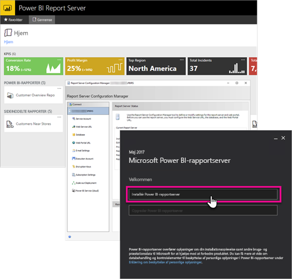

# Oversigt over administratorhåndbog, Power BI-rapportserver
Velkommen til administratorhåndbogen til Power BI-rapportserver, der er en placering i det lokale miljø til lagring og administration af dine Power BI- og mobilrapporter samt dine sideinddelte rapporter.

Denne håndbog hjælper dig med at forstå begreber tilknyttet planlægning, implementering og administration af din Power BI-rapportserver.

## Installation og overførsel
Du skal installere Power BI-rapportserver for at begynde at bruge den. Vi har oplysninger, som gør det muligt for dig at håndtere denne opgave.

Før du begynder at installere, opgradere eller overføre til Power BI-rapportserver, skal du tage et kig på [systemkravene](system-requirements.md) for rapportserveren.

### Installation
Hvis du anvender en ny Power BI-rapportserver, kan følgende dokumenter hjælpe dig. Der findes en hurtig introduktion, så du kan komme hurtigt fra start. Eller du kan læse installationsdokumentet for at få alle oplysningerne.

* [Hurtig introduktion: Installer Power BI-rapportserver](quickstart-install-report-server.md)
* [Installer Power BI-rapportserver](install-report-server.md)

### Overførsel
Der findes ingen opgradering til SQL Server Reporting Services. Hvis du har en eksisterende SQL Server Reporting Services-udgave, som du vil gøre til Power BI-rapportserver, skal du overføre den. Der er også andre årsager til, at det måske vil være en god idé at foretage en overførsel. Gennemse overførselsdokumentet for at få flere oplysninger.

[Overfør en rapportserverinstallation](migrate-report-server.md)

## Konfiguration af rapportserveren
Du har mange muligheder under konfigurationen af rapportserveren. Vil du bruge SSL? Vil du konfigurere en mailserver? Vil du integrere med Power BI-tjenesten for at kunne fastgøre visualiseringer?

Størstedelen af konfigurationen sker i Report Server Configuration Manager. Tjek [konfigurationsstyrings](https://docs.microsoft.com/sql/reporting-services/install-windows/reporting-services-configuration-manager-native-mode)dokumentationen for at få flere oplysninger.

## Sikkerhed
Sikkerhed og beskyttelse er vigtigt for alle organisationer. Du kan få mere at vide om godkendelse, roller og rettigheder i [sikkerheds](https://docs.microsoft.com/sql/reporting-services/security/reporting-services-security-and-protection)dokumentationen.

## Næste trin
[Hurtig introduktion: Installer Power BI-rapportserver](quickstart-install-report-server.md)  
[Sådan finder du produktnøglen til din rapportserver](find-product-key.md)  
[Installer Power BI Desktop optimeret til Power BI-rapportserver](install-powerbi-desktop.md)  
[Installer Report Builder](https://docs.microsoft.com/sql/reporting-services/install-windows/install-report-builder)  
[Download SQL Server Data Tools (SSDT)](http://go.microsoft.com/fwlink/?LinkID=616714)

Har du flere spørgsmål? [Prøv at spørge Power BI-community'et](https://community.powerbi.com/)

