# <a name="configure-power-bi-report-server-with-azure-application-proxy"></a>Konfigurer en Power BI-rapportserver med Azure-proxyprogram

I denne artikel gennemgår vi, hvordan du bruger proxyprogram til Azure Active Directory til at oprette forbindelse til Power BI-rapportserver og SSRS 2016 (SQL Server Reporting Services) og nyere. Brugere, der ikke er i nærheden af virksomhedens netværk, kan ved hjælp af denne integration få adgang til deres Power BI-rapportserver og Reporting Services-rapporter fra deres klientbrowsere og være beskyttet af AD (Azure Active Directory). Du kan finde flere oplysninger om fjernadgang til programmer i det lokale miljø under [Proxyprogram til Azure Active Directory](https://docs.microsoft.com/azure/active-directory/manage-apps/application-proxy).

## <a name="environment-details"></a>Oplysninger om miljø

Vi har brugt disse værdier i det eksempel, vi har oprettet. 

- Domæne: umacontoso.com
- Power BI-rapportserver: PBIRSAZUREAPP.umacontoso.com
- SQL Server-datakilde: SQLSERVERAZURE.umacontoso.com

## <a name="configure-power-bi-report-server"></a>Konfigurer Power BI-rapportserver

Når du har installeret Power BI-rapportserver (på en virtuel Azure-maskine), skal du konfigurere URL-adresserne til Power BI-rapportservers webtjeneste og webportal ved hjælp af følgende trin:

1. Opret indgående og udgående regler på VM-firewallen for port 80 (port 443, hvis du har konfigureret HTTPS-URL-adresser). Du kan også oprette indgående og udgående regler for Azure VM fra Azure Portal for TCP-protokol – port 80.
2. Det DNS-navn, der er konfigureret til VM i vores miljø, er `pbirsazureapp.eastus.cloudapp.azure.com`.
3. Konfigurer URL-adressen til Power BI-rapportservers eksterne webtjeneste og webportal ved at vælge fanen **Avanceret** > knappen **Tilføj** > **vælg Værtsheadernavn**, og tilføj værtsnavnet (DNS-navn) som vist her.

    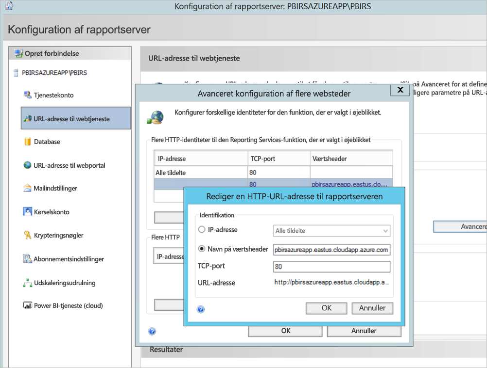

1. Vi har udført det foregående trin for både webtjenesten og webportalen-sektionen og fik de URL-adresser, der er registreret i Report Server-konfigurationsstyring:

    - `https://pbirsazureapp.eastus.cloudapp.azure.com/ReportServer`
    - `https://pbirsazureapp.eastus.cloudapp.azure.com/Reports`

2. I Azure Portal kan vi se to IP-adresser for den virtuelle maskine i netværksafsnittet 

    - **Offentlig IP**. 
    - **Privat IP**. 
    
    Den offentlige IP-adresse bruges til at få adgang uden for den virtuelle maskine.

3. Vi føjede derfor værtsfilposten til den virtuelle maskine (Power BI-rapportserver) for at inkludere den offentlige IP-adresse og værtsnavnet `pbirsazureapp.eastus.cloudapp.azure.com`.
4. Vær opmærksom på, at når den virtuelle maskine genstartes, kan den dynamiske IP-adresse blive ændret, og du skal muligvis tilføje den rette IP-adresse igen i værtsfilen. Du kan undgå dette ved at angive den offentlige IP-adresse til statisk i Azure Portal.
5. URL-adresserne til webtjenesten og webportalen bør være tilgængelige, når de ovenfor nævnte ændringer er foretaget.
6. Når du har adgang til URL-adressen `https://pbirsazureapp.eastus.cloudapp.azure.com/ReportServer` på serveren, bliver du bedt om legitimationsoplysningerne tre gange, og du kan se en tom skærm.
7. Tilføj følgende post i registreringsdatabasen:

    Registreringsnøglen `HKEY\_LOCAL\_MACHINE \SYSTEM\CurrentControlset\Control \Lsa\ MSV1\_0`

1. Tilføj en ny værdi `BackConnectionHostNames`, en værdi med flere strenge, og angiv værtsnavnet `pbirsazureapp.eastus.cloudapp.azure.com`.

Derefter kan vi også få adgang til URL-adresserne på serveren.

## <a name="configure-power-bi-report-server-to-work-with-kerberos"></a>Konfigurer Power BI-rapportserver, så den fungerer sammen med Kerberos

### <a name="1-configure-the-authentication-type"></a>1. Konfigurer godkendelsestypen

Vi er nødt til at konfigurere godkendelsestypen for rapportserveren til at tillade begrænset delegering for Kerberos. Denne konfiguration foretages i filen **rsreportserver.config**.

I filen rsreportserver.config skal du finde sektionen **Godkendelse/Godkendelsestyper**.

Vi vil gerne sikre os, at RSWindowsNegotiate er angivet, og at det er det første på listen over godkendelsestyper. Det skal se nogenlunde ud som følgende.

```
<AuthenticationTypes>

    <RSWindowsNegotiate/>

</AuthenticationTypes>
```

Hvis du har brug for at ændre konfigurationsfilen, skal du **stoppe og genstarte rapportserveren** fra Report Server-konfigurationsstyring for at sikre, at ændringerne træder i kraft.

### <a name="2-register-service-principal-names-spns"></a>2. Registrer SPN'er (Service Principal Names)

Åbn kommandoprompten som administrator, og udfør følgende trin.

Registrer følgende SPN'er under kontoen **Tjenestekonto for Power BI-rapportserver** ved hjælp af følgende kommandoer

```
setspn -s http/ Netbios name\_of\_Power BI Report Server\_server<space> Power BI Report Server\_ServiceAccount

setspn -s http/ FQDN\_of Power BI Report Server\_server<space> Power BI Report Server\_ServiceAccount
```

Registrer følgende SPN'er under SQL Server-tjenestekontoen ved hjælp af følgende kommandoer (for en standardforekomst af SQL Server):

```
setspn -s MSSQLSVC/FQDN\_of\_SQL\_Server: 1433 (PortNumber) <SQL service service account>

setspn -s MSSQLSVC/FQDN\_of\_SQL\_Server<SQL service service account>
```

### <a name="3-configure-delegation-settings"></a>3. Konfigurer delegeringsindstillinger

Vi skal konfigurere delegeringsindstillingerne på kontoen til rapportservertjenesten.

1. Åbn Active Directory-brugere og -computere.
2. Åbn egenskaberne for kontoen til rapporttjenesten i Active Directory-brugere og -computere.
3. Vi vil konfigurere begrænset delegering med protokoltransitering. Med begrænset delegering skal du være eksplicit med, hvilke tjenester der skal uddelegeres til.
4. Højreklik på **kontoen til rapportservertjenesten**, og vælg **Egenskaber**.
5. Vælg fanen **Delegering**.
6. Vælg **Hav kun tillid til denne computer i forbindelse med uddelegering til de angivne tjenester**.
7. Vælg **Brug enhver godkendelsesprotokol**.
8. Under **Tjenester, som denne konto kan give uddelegerede legitimationsoplysninger** skal du vælge **Tilføj**.
9. I den nye dialogboks skal du vælge **Brugere eller computere**.
10. Angiv **tjenestekontoen for Analysis Services-tjenesten**, og vælg **OK**.

    Den starter med MSSQLSVC.

1. Tilføj SPN'erne.
2. Vælg **OK**. Du bør nu kunne se SPN'et på listen.

I disse trin kan du få hjælp til at konfigurere Power BI-rapportserver til at fungere sammen med Kerberos-godkendelsesmetoden og få testforbindelsen til datakilden til at fungere på din lokale computer.

## <a name="configure-azure-application-proxy-connector"></a>Konfigurer proxyprogramforbindelse til Azure

Se artiklen for at få oplysninger om[konfigurationer, der er relateret til proxyprogramforbindelsen](https://docs.microsoft.com/azure/active-directory/manage-apps/application-proxy-add-on-premises-application#add-an-on-premises-app-to-azure-ad)

Vi har installeret proxyprogramforbindelsen på Power BI-rapportserver, men du kan konfigurere den på en separat server og sørge for, at delegering er konfigureret korrekt.

### <a name="ensure-the-connector-is-trusted-for-delegation"></a>Sørg for, at der er tillid til forbindelsen i forbindelse med delegering

Sørg for, at der er tillid til forbindelsen i forbindelse med delegering til det SPN, der er føjet til rapportserverens programgruppekonto.

Konfigurer KCD (Kerberos-begrænset delegering), så Azure AD-proxyprogramserveren kan delegere brugeridentiteter til rapportserverens programgruppekonto. Konfigurer KCD ved at aktivere proxyprogramforbindelsen til at hente Kerberos-billetter til de af dine brugere, der er blevet godkendt i Azure AD. Derefter sender serveren konteksten til destinationsprogrammet eller i dette tilfælde Power BI-rapportserver.

Hvis du vil konfigurere KCD, skal du gentage følgende trin for hver forbindelsesprogram.

1. Log på en domænecontroller som domæneadministrator, og åbn derefter **Active Directory-brugere og-computere**.
2. Find den computer, som forbindelsen kører på.
3. Dobbeltklik på computeren, og vælg derefter fanen **Delegering**.
4. Angiv delegeringsindstillingerne til **Hav kun tillid til denne computer i forbindelse med uddelegering til de angivne tjenester**. Vælg derefter **Brug enhver godkendelsesprotokol**.
5. Vælg **Tilføj**, og vælg derefter **Brugere eller computere**.
6. Angiv den tjenestekonto, du bruger til Power BI-rapportserveren. Denne konto er den konto, du føjede SPN'et til under konfigurationen af rapportserveren.
7. Klik på **OK**. 
8. Hvis du vil gemme ændringerne, skal du klikke på **OK** igen.

## <a name="publish-through-azure-ad-application-proxy"></a>Publicer via proxyprogram til Azure AD

Nu er du parat til at konfigurere proxyprogrammet til Azure AD.

Publicer Power BI-rapportserver via proxyprogrammet med følgende indstillinger. Du kan finde en trinvis vejledning til, hvordan du publicerer et program via proxyprogrammet, under [Udgivelse af programmer ved hjælp af proxyprogram til Azure Active Directory](https://docs.microsoft.com/azure/active-directory/manage-apps/application-proxy-add-on-premises-application#add-an-on-premises-app-to-azure-ad).

- **Intern URL-adresse**: Angiv URL-adressen til den rapportserver, som forbindelsen kan få adgang til i virksomhedens netværk. Sørg for, at der kan oprettes forbindelse til denne URL-adresse fra den server, som forbindelsen er installeret på. Den bedste fremgangsmåde er at bruge et domæne på øverste niveau, såsom `https://servername/`, for at undgå problemer med understier, der er udgivet via proxyprogrammet. Brug f.eks. `https://servername/` og ikke `https://servername/reports/` eller `https://servername/reportserver/`. Vi har konfigureret vores miljø med `https://pbirsazureapp.eastus.cloudapp.azure.com/`.

    > [!NOTE]
    > Vi anbefaler, at du bruger en sikker HTTPS-forbindelse til rapportserveren. Se [Konfigurer SSL-forbindelser på en rapportserver i oprindelig tilstand](https://docs.microsoft.com/sql/reporting-services/security/configure-ssl-connections-on-a-native-mode-report-server?view=sql-server-2017) for at få oplysninger om, hvordan du gør.

- **Ekstern URL-adresse**: Angiv den offentlige URL-adresse, som Power BI-mobilappen opretter forbindelse til. Den kan f.eks. se ud som `https://reports.contoso.com`, hvis der benyttes et brugerdefineret domæne. Hvis du vil bruge et brugerdefineret domæne, skal du overføre et certifikat til domænet og pege en DNS-post til msappproxy.net-standarddomænet for dit program. Du kan finde en detaljeret vejledning under [Arbejde med brugerdefinerede domæner i proxyprogram til Azure Active Directory](https://docs.microsoft.com/azure/active-directory/manage-apps/application-proxy-configure-custom-domain).

Vi har konfigureret den eksterne URL-adresse til `https://pbirsazureapp-umacontoso2410.msappproxy.net/` for vores miljø.

- **Forhåndsgodkendelsesmetode**: Azure Active Directory.
- **Forbindelsesgruppe:** Standard.

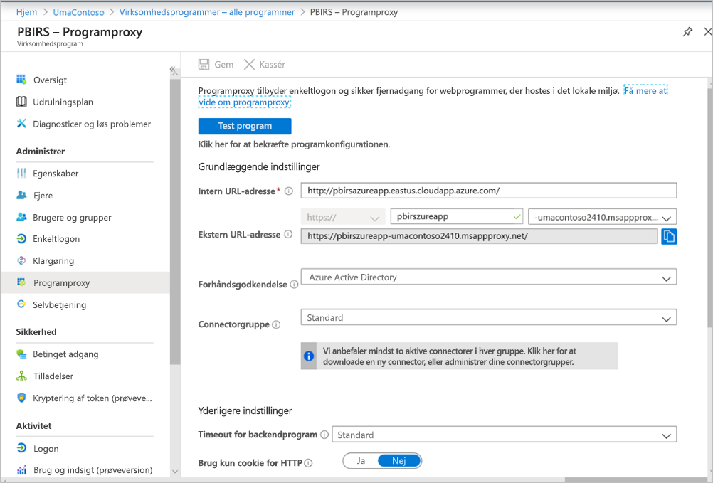

Vi har ikke foretaget nogen ændringer i afsnittet **Yderligere indstillinger**. Det er konfigureret til at fungere sammen med standardindstillingerne:


### <a name="configure-single-sign-on"></a>Konfigurer enkeltlogon

Når din app er publiceret, skal du konfigurere indstillingerne for enkeltlogon med følgende trin:

1. Vælg **Enkeltlogon** på programsiden i portalen.
2. Vælg **Integreret Windows-godkendelse** for **Enkeltlogontilstand**.
3. Angiv **Internt SPN for program** til den værdi, du har angivet tidligere. Du kan identificere denne værdi ved hjælp af følgende trin:

    - Prøv at køre en rapport eller udføre en testforbindelse til datakilden, så der oprettes en Kerberos-billet.
    - Når du har gennemført kørslen af rapporten/testforbindelsen, skal du åbne kommandoprompten og køre kommandoen: `klist`. I afsnittet med resultater kan du se en billet med SPN'et `http/`. Hvis det er det samme som det SPN, du har konfigureret med Power BI-rapportserver, skal du bruge dette SPN i dette afsnit.

1. Vælg **ID for delegeret logon** for den forbindelse, der skal bruges på brugernes vegne. Du kan finde flere oplysninger under [Arbejde med forskellige identiteter i det lokale miljø og i cloudmiljøet](https://docs.microsoft.com/azure/active-directory/manage-apps/application-proxy-configure-single-sign-on-with-kcd#working-with-different-on-premises-and-cloud-identities).

    Vi anbefaler, at du bruger brugerens hovednavn. I vores eksempel har vi konfigureret det til at fungere sammen med indstillingen **Brugerens hovednavn**:

    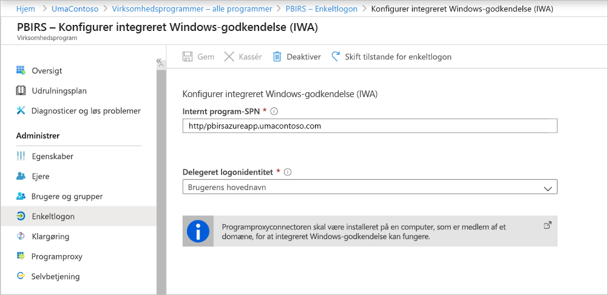

1. Klik på **Gem** for at gemme dine ændringer.

### <a name="finish-setting-up-your-application"></a>Afslut konfiguration af din konto

Hvis du vil afslutte konfigurationen af dit program, skal du gå til afsnittet **Brugere og grupper** og tildele brugere til at få adgang til dette program.

1. Konfigurer afsnittet **Godkendelse** i appregistreringen for Power BI-rapportserverprogrammet som følger for **Webadresser til omdirigering** og **Avancerede indstillinger**:

    - Opret en ny webadresse til omdirigering, og konfigurer den med **Type** = **Web** og **Omdirigerings-URI** = `https://pbirsazureapp-umacontoso2410.msappproxy.net/`
    - I afsnittet **Avancerede indstillinger** skal du konfigurere **URL-adresse til logout** til `https://pbirsazureapp-umacontoso2410.msappproxy.net/?Appproxy=logout`

    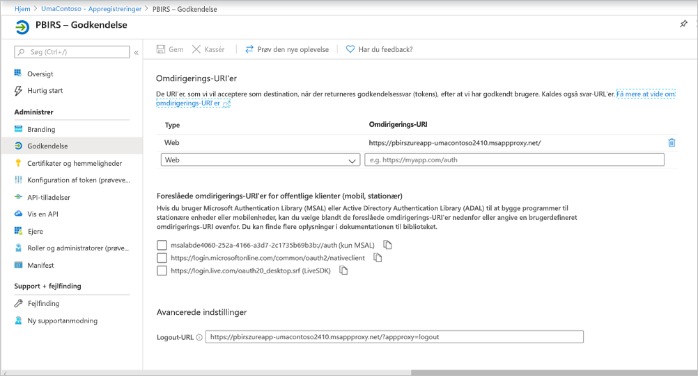

1. Fortsæt med at konfigurere **godkendelsesafsnittet** i Appregistrering for Power BI-rapportserverprogrammet på følgende måde for **Implicit bonus**, **Standardklienttype** og **Understøttede kontotyper**:

    - Angiv **Implicit bonus** til **ID-tokens**.
    - Angiv **Standardklienttype** til **Nej**.
    - Angiv **Understøttede kontotyper** til **Kun konti i denne organisations mappe (kun UmaContoso – enkelt lejer)** .

    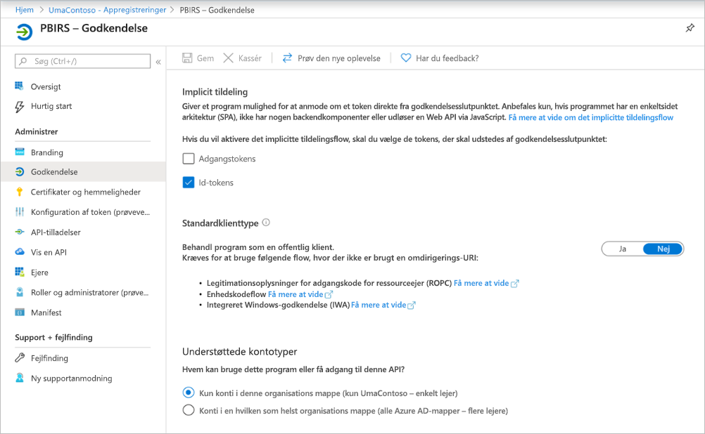

1. Når enkeltlogon er konfigureret, og URL-adressen `https://pbirsazureapp-umacontoso2410.msappproxy.net` fungerer, skal vi sikre, at den konto, som vi logger på med, er synkroniseret med den konto, som rettighederne er angivet til i Power BI-rapportserver.

1. Vi skal først konfigurere det brugerdefinerede domæne, som vi planlægger at bruge til logon, så sørg for, at det er bekræftet.
2. I dette tilfælde har vi købt et domæne, der hedder umacontoso.com, og har konfigureret DNS-zonen med posterne. Du kan også prøve at benytte domænet `onmicrosoft.com` og synkronisere det med AD i det lokale miljø.

    Se artiklen [Selvstudium: Knyt et eksisterende brugerdefineret DNS-navn til Azure App Service](https://docs.microsoft.com/Azure/app-service/app-service-web-tutorial-custom-domain) som reference.

1. Når du har bekræftet DNS-posten for det brugerdefinerede domæne, bør du kunne se statussen **Bekræftet**, hvilket svarer til domænet fra portalen.

    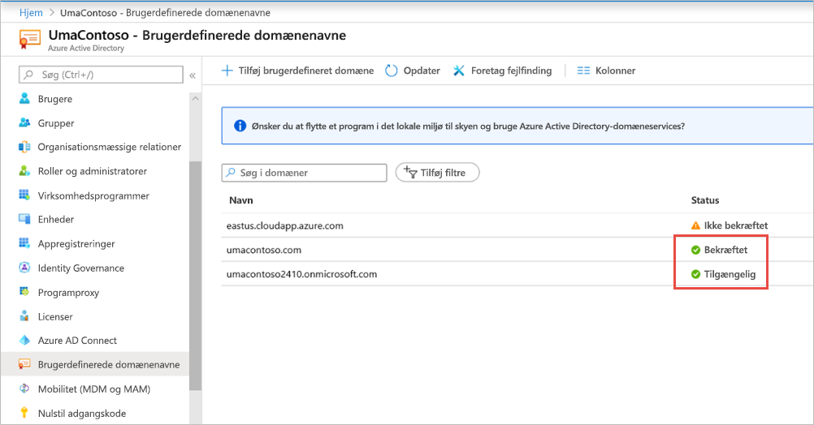

1. Installér Microsoft Azure AD-forbindelsen på domænecontrollerserveren, og konfigurer den til at synkronisere med Azure AD.

    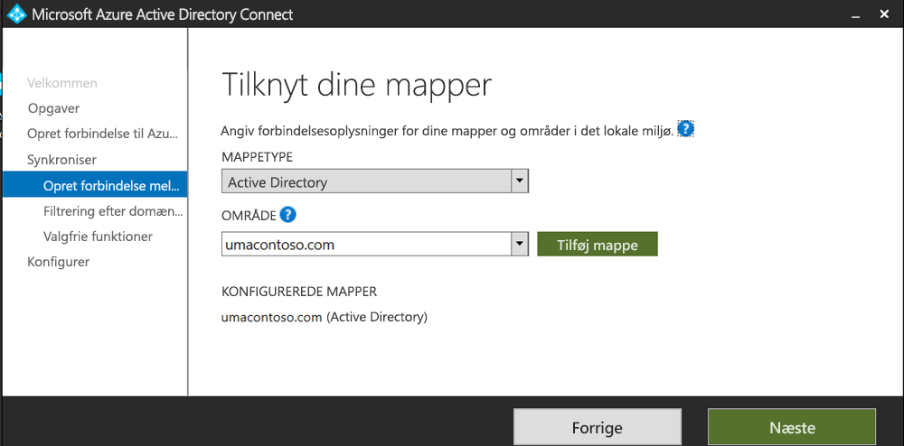

1. Når Azure AD er synkroniseret med Active Directory i det lokale miljø, kan vi se følgende status fra Azure Portal:

    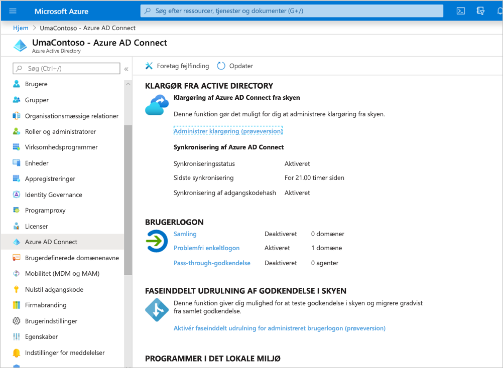

1. Når synkroniseringen er fuldført, skal du også åbne Active Directory-domæner og -tillidsforhold på domænecontrolleren. Højreklik på Active Directory-domæner og -tillidsforhold > Egenskaber, og tilføj UPN'et. I vores miljø er `umacontoso.com` det brugerdefinerede domæne, vi har købt.

1. Når du har tilføjet UPN'et, bør du kunne konfigurere brugerkontiene med UPN'et, så Azure AD-kontoen og AD-kontoen i det lokale miljø er forbundne, og tokenet genkendes under godkendelsen.

    AD-domænenavnet vises på rullelisten for **Logonnavn for bruger**, når du har fuldført det forrige trin. Konfigurer brugernavnet, og vælg domænet på rullelisten i afsnittet **Logonnavn for bruger** for AD-brugeregenskaber.

    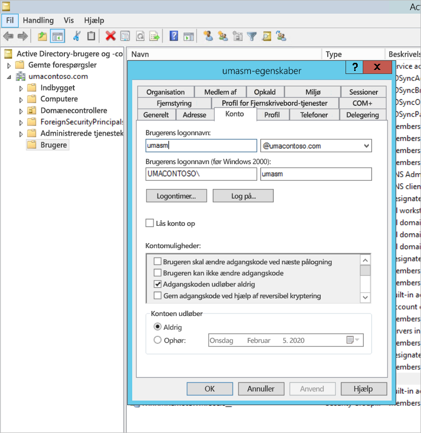

1. Når AD-synkroniseringen er fuldført, får du vist AD-kontoen i det lokale miljø i Azure Portal i afsnittet **Brugere og grupper** i programmet. Kilden til kontoen er **Windows Server AD.**
2. Hvis du logger på med `umasm@umacontoso.com`, svarer det til at bruge Windows-legitimationsoplysningerne `Umacontoso\umasm`.

    De forrige trin er gældende, hvis du har konfigureret AD i det lokale miljø og planlægger at synkronisere med Azure AD.

    Logon udført efter implementering af ovenstående trin:

    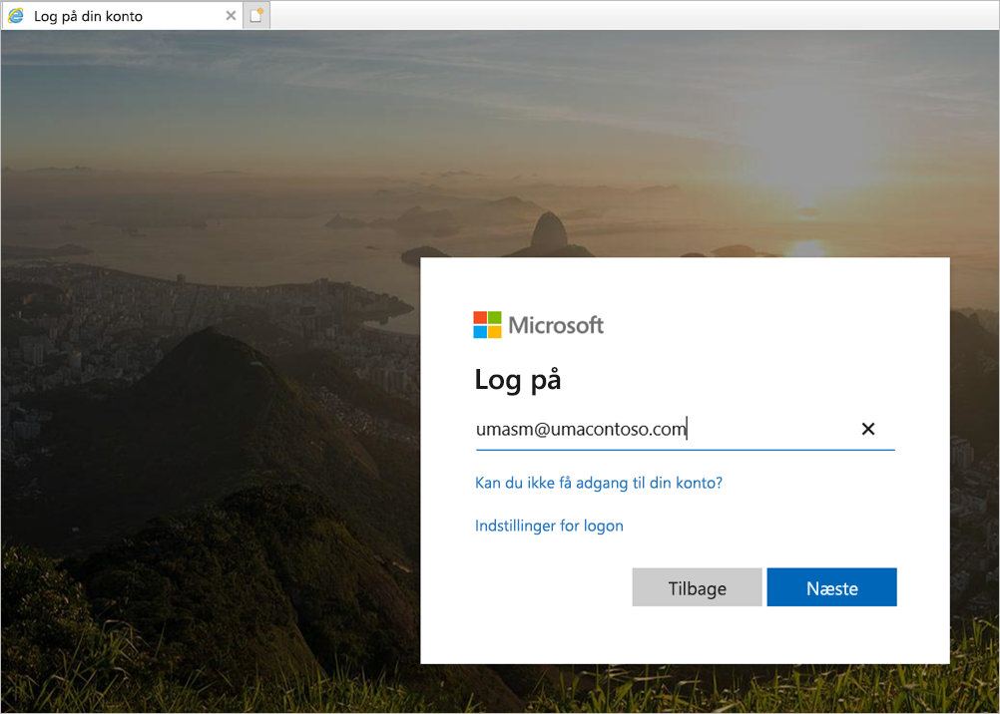

    Efterfulgt af visningen af webportalen:

    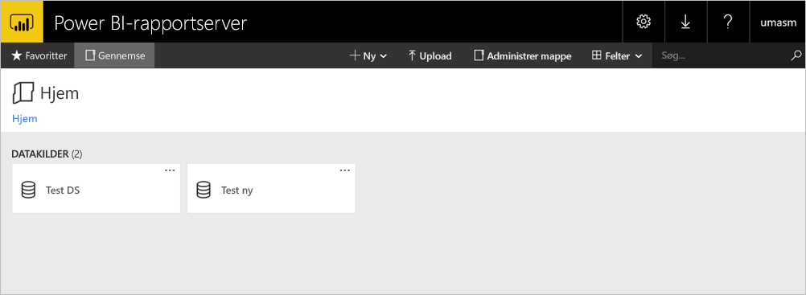

    Med en gennemført testforbindelse til en datakilde ved hjælp af Kerberos som godkendelse:

    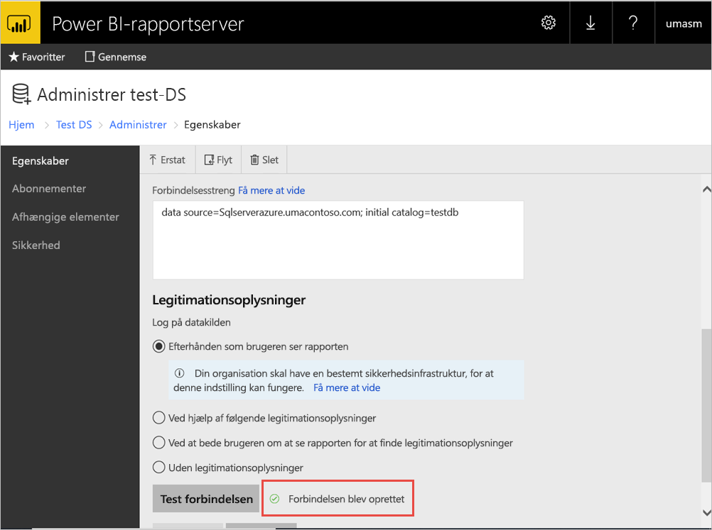

## <a name="access-from-power-bi-mobile-apps"></a>Adgang fra Power BI-mobilapps

### <a name="configure-the-application-registration"></a>Konfigurer programregistreringen

Før Power BI-mobilappen kan oprette forbindelse til og få adgang til Power BI-rapportserver, skal du konfigurere den programregistrering, der automatisk blev oprettet til dig i [Publicer via Azure AD-proxyprogram](#publish-through-azure-ad-application-proxy) tidligere i denne artikel.

1. Vælg **Appregistreringer** på siden **Oversigt** for Azure Active Directory.
2. Søg efter det program, du har oprettet til Power BI-rapportserver, på fanen **Alle programmer**.
3. Vælg programmet, og vælg derefter **Godkendelse**.
4. Tilføj følgende omdirigerings-URI'er, afhængigt af hvilken platform du bruger.

    Når du konfigurerer appen til Power BI – Mobil **iOS**, skal du tilføje følgende omdirigerings-URI'er af typen Public Client (mobil og desktop):

    - `msauth://code/mspbi-adal%3a%2f%2fcom.microsoft.powerbimobile`
    - `msauth://code/mspbi-adalms%3a%2f%2fcom.microsoft.powerbimobilems`
    - `mspbi-adal://com.microsoft.powerbimobile`
    - `mspbi-adalms://com.microsoft.powerbimobilems`

    Når du konfigurerer appen til Power BI – Mobil **Android**, skal du tilføje følgende omdirigerings-URI'er af typen Public Client (mobil og desktop):

    - `urn:ietf:wg:oauth:2.0:oob`
    - `mspbi-adal://com.microsoft.powerbimobile`
    - `msauth://com.microsoft.powerbim/g79ekQEgXBL5foHfTlO2TPawrbI%3D`
    - `msauth://com.microsoft.powerbim/izba1HXNWrSmQ7ZvMXgqeZPtNEU%3D`

    Når du konfigurerer appen til både Power BI – Mobil iOS og Android, skal du føje følgende omdirigerings-URI af typen Public Client (mobil og desktop) til listen over omdirigerings-URI'er, der er konfigureret til iOS:

    - `urn:ietf:wg:oauth:2.0:oob`

    > [!IMPORTANT]
    > Omdirigerings-URI'erne skal tilføjes, for at programmet kan fungere korrekt.

### <a name="connect-from-the-power-bi-mobile-apps"></a>Opret forbindelse fra Power BI-mobilappsene

1. Opret forbindelse til din forekomst af rapportserver i Power BI-mobilappen. Hvis du vil oprette forbindelse, skal du angive den **eksterne URL-adresse** for det program, du har publiceret via proxyprogrammet.
2. Vælg **Opret forbindelse**. Du bliver sendt videre til logonsiden til Azure Active Directory.
3. Angiv gyldige legitimationsoplysninger for din bruger, og vælg **Log på**. Du får vist elementerne fra rapportserveren.

## <a name="next-steps"></a>Næste trin

[Aktivér fjernadgang til Power BI - Mobil med Azure AD-programproxy](https://docs.microsoft.com/azure/active-directory/manage-apps/application-proxy-integrate-with-power-bi)

Har du flere spørgsmål? [Prøv at spørge Power BI-community'et](https://community.powerbi.com/)

                