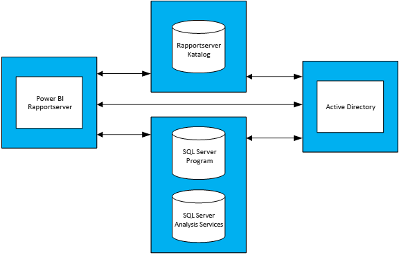

# Vejledning i kapacitetsplanlægning i Power BI-rapportserver
Power BI-rapportserver er en selvbetjenings-BI og virksomhedsrapporteringsløsning, som kunder kan installere i deres lokale miljø, bag deres firewall. Løsningen kombinerer den interaktive rapporteringskapacitet i Power BI Desktop med serverplatformen i SQL Server Reporting Services i det lokale miljø. I takt med virksomheders stigende og omfattende brug af analyser og rapportering, kan det være en udfordring at udarbejde et budget, der tager højde for de skalerbare løsninger til hardwareinfrastrukturen og de softwarelicenser, der kræves til en virksomheds brugergrundlag. Denne rapports primære sigte er at give en vejledning i kapacitetsplanlægning i Power BI-rapportserver ved at dele resultater af adskillelige gennemførsler af belastningstest ved forskellige arbejdsbelastninger i forhold til en rapportserver. Organisationers rapporterings-, forespørgsels- og brugsmønstre varierer betydeligt, men resultaterne forelagt i denne rapport kan, sammen med de anvendte faktiske test og en detaljeret beskrivelse af deres gennemførselsmetode, bruges som referencepunkt for alle, der er i den tidlige planlægningsfase i processen med at installere Power BI-rapportserver.

## Resume af udførelsen
Vi har udført to forskellige typer arbejdsbelastninger i forhold til Power BI-rapportserveren; hver arbejdsbelastning bestod i at gengive forskellige typer rapporter samt i at udføre forskellige webportal-handlinger. 

* I "Power BI tung rapport"-arbejdsbelastningen var den hyppigst udførte handling (dvs. handlingen, der udføres 60 % af gangene) at gengive Power BI-rapporter.
* I "Sideinddelt tung rapport"-arbejdsbelastningen var den hyppigst udførte handling at gengive sideinddelte rapporter.

Under en topologi med fire servere i Power BI-rapportserver og en forventning om at højst 5 % af brugere vil tilgå en rapportserver på ethvert givent tidspunkt, så viser den følgende tabel det maksimale antal brugere, som Power BI-rapportserver kan håndtere med mindst 99 % pålidelighed. 

| Arbejdsbelastning | 8 kerner/32 GB RAM | 16 kerner/64 GB RAM |
| --- | --- | --- |
| **Power BI tung rapport** (>60 %) |1.000 brugere |3.000 brugere |
| **Sideinddelt (RDL) tung rapport** (>60 %) |2.000 brugere |3.200 brugere |

I hvert forløb var den mest overbelastede ressource CPU'en. Konsekvensen af dette ville være en skærpet systemsikkerhed, hvis man øgede antallet af kerner i Power BI-rapportserveren, end hvis man øgede mængden af hukommelse eller plads på harddisken. 

## Testmetode
Den brugte testtopologi var baseret på Microsoft Azure Virtual Machines i stedet for producentspecifik fysisk hardware. Alle computere blev hostet i regioner i USA. Dette afspejler den generelle tendens inden for hardwarevirtualisering både i det lokale miljø og i den offentlige cloud. 

### Power BI-rapportservertopologi
Installationen af Power BI-rapportserveren omfattede de følgende virtuelle maskiner:

* Active Directory-domænecontroller: blev brugt af SQL Server-databaseprogrammet, SQL Server Analysis Services og Power BI-rapportserveren til sikker godkendelse af alle anmodninger.
* SQL Server-databaseprogrammet og SQL Server Analysis Services: blev brugt til at lagre alle databaser til rapporterne til forbrug, når vi gengav dem.
* Power BI Report Server
* Power BI-rapportserverdatabase. Rapportserverdatabasen er hostet på en anden maskine end Power BI-rapportserveren, så den ikke skal konkurrere om ressourcer med SQL Server-databaseprogrammet mht. hukommelse, CPU, netværk og harddisk.

Se tillæg 1.1 Power BI-rapportservertopologi og tillæg 1.2 Konfiguration af Power BI-rapportservers virtuelle maskine for en grundig beskrivelse af konfigurationen af hver virtuelle maskine, der bruges i topologien.

### Test
De brugte test i belastningstestkørslerne er offentligt tilgængelige i et GitHub-projekt kaldet Reporting Services LoadTest (Se https://github.com/Microsoft/Reporting-Services-LoadTest). Dette værktøj tillader brugere at granske egenskaber inden for ydeevne, pålidelighed, skalerbarhed og gendannelse hos SQL Server Reporting Services og Power BI-rapportserveren. Dette projekt består af fire grupper prøvesager:

* Test med simuleret gengivelse af Power BI-rapporter,
* Test med simuleret gengivelse af mobile rapporter,
* Test med simuleret gengivelse af små og store sideinddelte rapporter, og 
* Test med simuleret udførelse af forskellige typer webportalhandlinger. 

Alle test blev udarbejdet for at udføre en komplet handling (såsom at gengive en rapport, oprette en ny datakilde, osv.). De opnår dette ved at udføre en eller flere webanmodninger til rapportserveren (via API'er). I den virkelige verden kan en bruger have brug for at udføre nogle få mellemliggende handlinger for at gennemføre en af disse komplette handlinger. En bruger skal f.eks. gå til webportalen, navigere til mappen med rapporten, og derefter klikke på den pågældende rapport for at gengive den. Selvom alle de nødvendige handlinger for at udføre en komplet opgave ikke udføres i testene, så omfatter de stadig det meste af belastningen, som pålægges Power BI rapportserveren. Du kan få mere at vide om de forskellige typer af rapporter, der bruges, samt de forskellige handlinger, der udføres, ved at granske GitHub-projektet.

### Arbejdsbelastninger
Der bruges to arbejdsbelastningsprofiler i testene: Power BI-tung rapport og sideinddelt tung rapport. I nedenstående tabel beskrives fordelingen af anmodninger, der udføres i forhold til rapportserveren.

| Aktivitet | Power BI tung rapport, hyppighed | Sideinddelt tung rapport, hyppighed |
| --- | --- | --- |
| **Gengivelse af Power BI-rapporter** |60 % |10 % |
| **Gengivelse af sideinddelte (RDL) rapporter** |30 % |60 % |
| **Gengivelsen mobilrapporter** |5 % |20 % |
| **Webportalhandlinger** |5 % |10 % |

### Brugerbelastning
For hver testkørsel blev der udført test baseret på hyppigheden angivet i en af de to arbejdsbelastninger. Testene begyndte med 20 samtidige brugeranmodninger til rapportserveren. Brugerbelastningen blev derefter gradvist forøget, indtil pålideligheden faldt til under 99 % af målet.

## Resultater
### Samtidig brugerkapacitet
Som tidligere nævnt begyndte testene med 20 samtidige brugere, der afgav anmodninger til rapportserveren. Antallet af samtidige brugere blev derefter gradvis forøget, indtil 1 % af alle anmodninger fejlede. Resultaterne i den følgende tabel angiver antallet af samtidige brugeranmodninger, som serveren ville være i stand til at håndtere under spidsbelastning med en fejlrate på mindre end 1 %.

| Arbejdsbelastning | 8 kerner/32 GB | 16 kerner/64 GB |
| --- | --- | --- |
| **Power BI tung rapport** |50 samtidige brugere |150 samtidige brugere |
| **Sideinddelt tung rapport** |100 samtidige brugere |160 samtidige brugere |

### Samlet brugerkapacitet
Hos Microsoft har vi en produktionsinstallation af Power BI-rapportserver, der er blevet brugt af adskillelige teams. Når vi analyserer den reelle brug af dette miljø, så ser vi, at antallet af samtidige brugere på ethvert givent tidspunkt (selv under daglig spidsbelastning) normalt ikke overstiger 5 % af det samlede brugergrundlag. Ved at bruge denne samtidighedsratio på 5 % som sammenligningsgrundlag så ekstrapolerede vi det samlede brugergrundlag, som Power BI-rapportserver kan håndtere, med 99 % sikkerhed.

| Arbejdsbelastning | 8 kerner/32 GB | 16 kerner/64 GB |
| --- | --- | --- |
| **Power BI tung rapport** |1.000 brugere |3.000 brugere |
| **Sideinddelt tung rapport** |2.000 brugere |3.200 brugere |

### Vis resultater
Vælg en rapport for at få vist resultaterne af belastningstesten.

| Arbejdsbelastning | 8 kerner/32 GB | 16 kerner/64 GB |
| --- | --- | --- |
| **Power BI tung rapport** |[Vis – 8 kerner](https://msit.powerbi.com/view?r=eyJrIjoiMDhhNGY4NGQtNGRhYy00Yzk4LTk2MzAtYzFlNWI5NjBkMGFiIiwidCI6IjcyZjk4OGJmLTg2ZjEtNDFhZi05MWFiLTJkN2NkMDExZGI0NyIsImMiOjV9) |[Vis – 16 kerner](https://msit.powerbi.com/view?r=eyJrIjoiNDBiODk1OGUtYTAyOC00MzVhLThmZmYtNzVjNTFjNzMwYzkwIiwidCI6IjcyZjk4OGJmLTg2ZjEtNDFhZi05MWFiLTJkN2NkMDExZGI0NyIsImMiOjV9) |
| **Sideinddelt tung rapport** |[Vis – 8 kerner](https://msit.powerbi.com/view?r=eyJrIjoiNDFiZWYzMTktZGIxNS00MzcwLThjODQtMmJkMGRiZWEzNjhlIiwidCI6IjcyZjk4OGJmLTg2ZjEtNDFhZi05MWFiLTJkN2NkMDExZGI0NyIsImMiOjV9) |[Vis – 16 kerner](https://msit.powerbi.com/view?r=eyJrIjoiOTU0YjJkYTgtNDg4Yy00NzlhLWIwMGYtMzg4YWI2MjNmOTZjIiwidCI6IjcyZjk4OGJmLTg2ZjEtNDFhZi05MWFiLTJkN2NkMDExZGI0NyIsImMiOjV9) |

<iframe width="640" height="360" src="https://msit.powerbi.com/view?r=eyJrIjoiMDhhNGY4NGQtNGRhYy00Yzk4LTk2MzAtYzFlNWI5NjBkMGFiIiwidCI6IjcyZjk4OGJmLTg2ZjEtNDFhZi05MWFiLTJkN2NkMDExZGI0NyIsImMiOjV9" frameborder="0" allowFullScreen="true"></iframe>

<iframe width="640" height="360" src="https://msit.powerbi.com/view?r=eyJrIjoiNDBiODk1OGUtYTAyOC00MzVhLThmZmYtNzVjNTFjNzMwYzkwIiwidCI6IjcyZjk4OGJmLTg2ZjEtNDFhZi05MWFiLTJkN2NkMDExZGI0NyIsImMiOjV9" frameborder="0" allowFullScreen="true"></iframe>

<iframe width="640" height="360" src="https://msit.powerbi.com/view?r=eyJrIjoiNDFiZWYzMTktZGIxNS00MzcwLThjODQtMmJkMGRiZWEzNjhlIiwidCI6IjcyZjk4OGJmLTg2ZjEtNDFhZi05MWFiLTJkN2NkMDExZGI0NyIsImMiOjV9" frameborder="0" allowFullScreen="true"></iframe>

<iframe width="640" height="360" src="https://msit.powerbi.com/view?r=eyJrIjoiOTU0YjJkYTgtNDg4Yy00NzlhLWIwMGYtMzg4YWI2MjNmOTZjIiwidCI6IjcyZjk4OGJmLTg2ZjEtNDFhZi05MWFiLTJkN2NkMDExZGI0NyIsImMiOjV9" frameborder="0" allowFullScreen="true"></iframe>

## Sammenfatning
I hver kørte belastningstest var CPU'en den mest overbelastede ressource under spidsbelastningen af Power BI-rapporteringsserverens computer. På grund af dette bør du den første ressource, du prioriterer, være antallet af antallet af CPU-kerner. Du kan også overveje at skalere ud ved at tilføje flere servere som vært for Power BI-rapportserveren i topologien.

De resultater, der er fremlagt i denne rapport, er opnået ved at udføre en specifik række rapporter, der forbruger en specifik række data, gentaget på en specifik måde. De udgør et nyttigt referencepunkt, men vær opmærksom på, at din brug afhænger af dine rapporter, forespørgsler, brugsmønstre og installation af Power BI-rapportserveren.

## Tillæg
### 1 Topologi
**1.1 Power BI-rapportservertopologi**

For udelukkende at fokusere på Power BI-rapportserverens funktionsmåde under forskellige konfigurationer, så blev der brugt en fast VM-konfiguration for hver type computer (med undtagelse af computeren der var vært for Power BI-rapportserveren). Hver computer blev klargjort i overensstemmelse med anden generation (v2) D Serie-computere med Premium Storage-harddiske. Du kan finde detaljerede oplysninger om størrelsen af hver enkelt VM i afsnittet "Generel" på https://azure.microsoft.com/en-us/pricing/details/virtual-machines/windows/.

| Type af virtuel maskine | Processor | Hukommelse | Azure VM-størrelse |
| --- | --- | --- | --- |
| **Active Directory-domænecontroller** |2 kerner |7 GB |Standard_DS2_v2 |
| **SQL Server-databaseprogram og analysetjenester** |16 kerner |56 GB |Standard_DS5_v2 |
| **Rapportserverdatabase** |16 kerner |56 GB |Standard_DS5_v2 |

**1.2 Konfiguration af Power BI-rapportservers virtuelle maskine** 

Forskellige konfigurationer af processor og hukommelse er blevet brugt til den virtuelle maskine, der hoster Power BI-rapportserveren. Til forskel fra andre VM'er er denne computer blevet klargjort i overensstemmelse med tredje generation (v3) D Serie-computere med Premium Storage-harddiske. Du kan finde detaljerede oplysninger om størrelsen af denne VM i afsnittet "Generel" på https://azure.microsoft.com/en-us/pricing/details/virtual-machines/windows/.

| Virtuel maskine | Processor | Hukommelse | Azure VM-størrelse |
| --- | --- | --- | --- |
| **Power BI-rapportserver (lille)** |8 kerner |32 GB |Standard_D8S_v3 |
| **Power BI-rapportserver (stor)** |16 kerner |64 GB |vStandard_D16S_v3 |

### 2 Kør LoadTest-værktøjet
Hvis du vil køre værktøjet Reporting Services LoadTest på din eller en Microsoft Azure-installation af Power BI-rapportserver, skal du følge disse trin.

1. Klon Reporting Services LoadTest-projektet fra GitHub (https://github.com/Microsoft/Reporting-Services-LoadTest).
2. Du kan finde en løsningsfil med navnet RSLoadTests.sln i projektmappen. Åbn denne fil i Visual Studio 2015 eller nyere.
3. Find ud af, om du vil køre dette værktøj på installationen af Power BI-rapportserveren eller på en installation af Power BI-rapportserveren i Microsoft Azure. Hvis du vil køre den på din egen installation, skal du gå til trin 5.
4. Følg instruktionerne på https://github.com/Microsoft/Reporting-Services-LoadTest#create-a-sql-server-reporting-services-load-environment-in-azure for at oprette et Power BI-rapportservermiljø på Azure.
5. Når du har udrullet miljøet, skal du følge instruktionerne på https://github.com/Microsoft/Reporting-Services-LoadTest#load-test-execution for at køre de relevante tests.

Har du flere spørgsmål? [Prøv at spørge Power BI-community'et](https://community.powerbi.com/)

