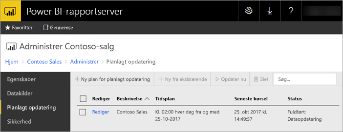
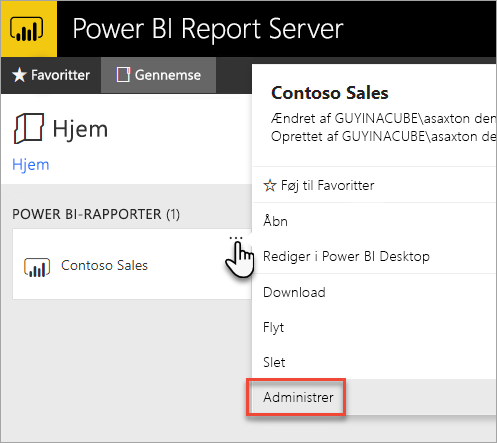
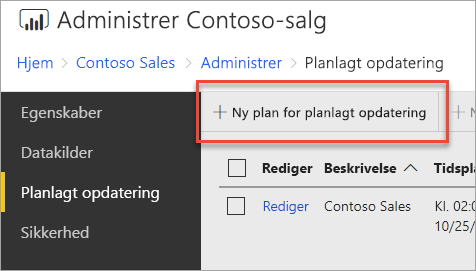
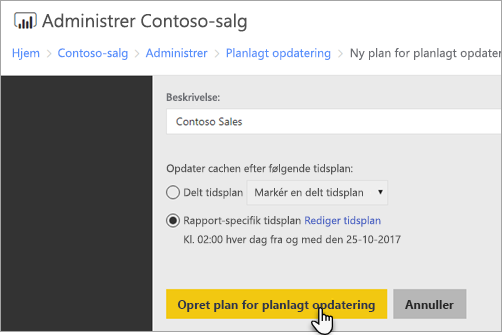
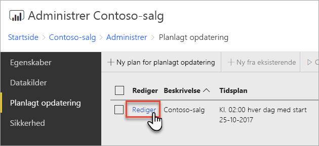
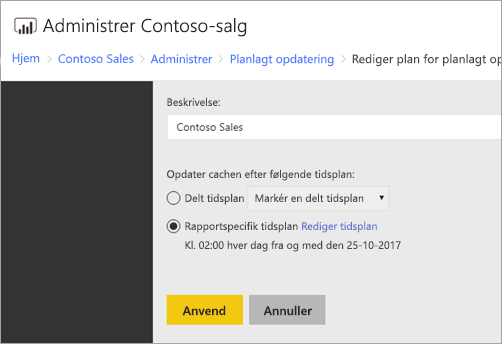

# Sådan konfigurerer du en planlagt opdatering af en Power BI-rapport
Hvis du vil opdatere dataene i din Power BI-rapport, skal du oprette en plan for planlagt opdatering. Det gør du i området *Administrer* i en Power BI-rapport.

## Konfigurer legitimationsoplysningerne for datakilden
Før du kan oprette en plan for planlagt dataopdatering, skal du angive legitimationsoplysningerne for **hver enkelt datakilde**, der bruges i din Power BI-rapport.

1. Højreklik på Power BI-rapporten på webportalen, og vælg **Administrer**.
   
    
2. I menuen til venstre skal du vælge fanen **Datakilder**.
3. Vælg den godkendelsestype, som skal bruges, når der oprettes forbindelse til datakilden for hver enkelt datakilde, der vises. Angiv de relevante legitimationsoplysninger.
   
    

## Oprettelse af en plan for planlagt opdatering
Følg disse trin for at oprette en plan for en planlagt opdatering.

1. Højreklik på Power BI-rapporten på webportalen, og vælg **Administrer**.
   
    
2. I menuen til venstre skal du vælge fanen **Planlagt opdatering**.
3. På siden **Planlagt opdatering** skal du vælge **Ny plan for planlagt opdatering**.
   
    
4. På siden **Ny plan for planlagt opdatering** skal du angive en beskrivelse og en tidsplan for, hvornår din datamodel skal opdateres.
5. Vælg **Opret plan for planlagt opdatering**, når du er færdig.
   
    

## Redigering af en plan for planlagt opdatering
Redigering af en plan for planlagt opdatering minder om oprettelse af en plan.

1. Højreklik på Power BI-rapporten på webportalen, og vælg **Administrer**.
   
    
2. I menuen til venstre skal du vælge fanen **Planlagt opdatering**.
3. På siden **Planlagt opdatering** skal du vælge **Rediger** ud for den opdateringsplan, du vil administrere.
   
    
4. På siden **Rediger plan for planlagt opdatering** skal du angive en beskrivelse og en tidsplan for, hvornår din datamodel skal opdateres.
5. Vælg **Anvend**, når du er færdig.
   
    

## Få vist status for Plan for planlagt opdatering
Få vist status for en plan for planlagt opdatering på webportalen.

1. Højreklik på Power BI-rapporten på webportalen, og vælg **Administrer**.
   
    
2. I menuen til venstre skal du vælge fanen **Planlagt opdatering**.
3. På siden **Planlagt opdatering** vises statussen for en plan i kolonnen længst til højre.
   
   | **Status** | **Beskrivelse** |
   | --- | --- |
   | Ny plan for planlagt opdatering |Planen er blevet oprettet, men ikke kørt. |
   | Opdaterer |Opdateringsprocessen er startet. |
   | Streamingmodel til Analysis Server |Kopiering af modellen fra katalogdatabasen på rapportserveren til den hostede Analysis Services-instans. |
   | Opdatering af data |Opdatering af dataene i modellen. |
   | Fjernelse af legitimationsoplysninger fra modellen |De legitimationsoplysninger, der bruges til at oprette forbindelse til datakilden fra modellen, blev fjernet. |
   | Lagring af modellen i kataloget |Opdateringen af data er fuldført, og den opdaterede model gemmes i katalogdatabasen på rapportserveren igen. |
   | Fuldført: Opdatering af data |Opdateringen er færdig. |
   | Fejl: |Der opstod en fejl under opdateringen, og fejlen vises. |

Websiden skal opdateres, for at du kan se den aktuelle status. Status ændres ikke automatisk.

## Næste trin
Du kan få mere at vide om oprettelse og ændring af tidsplaner under [Opret, rediger og slet tidsplaner](https://docs.microsoft.com/sql/reporting-services/subscriptions/create-modify-and-delete-schedules).

Du kan finde oplysninger om fejlfinding i forbindelse med planlagt opdatering under [Fejlfinding i forbindelse med planlagt opdatering på Power BI-rapportserver](scheduled-refresh-troubleshoot.md).

Har du flere spørgsmål? [Prøv at spørge Power BI-community'et](https://community.powerbi.com/)

