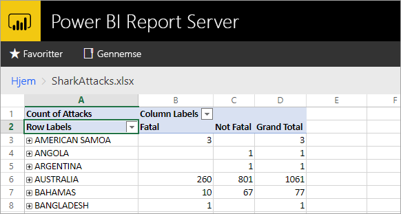
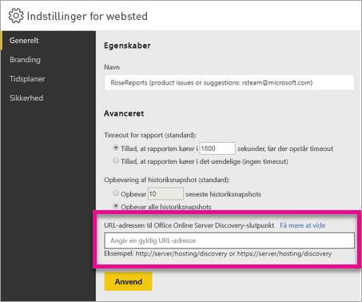

# <a name="configure-your-report-server-to-host-excel-workbooks-using-office-online-server-oos"></a>Konfigurer din rapportserver til at være vært for Excel-projektmapper ved hjælp af Office Online Server (OOS)
Ud over at vise Power BI-rapporter på webportalen kan Power BI Report Server hoste Excel-projektmapper ved hjælp af OOS [(Office Online Server)](https://docs.microsoft.com/officeonlineserver/office-online-server-overview). Rapportserveren bliver en samlet placering, hvor du kan udgive og se Microsoft BI-indhold til selvbetjening.



## <a name="prepare-server-to-run-office-online-server"></a>Klargør server til at køre Office Online Server
Udfør disse procedurer på den server, der kører Office Online Server. Serveren skal være Windows Server 2012 R2 eller Windows Server 2016. Windows Server 2016 kræver Office Online Server April 2017 eller nyere.

### <a name="install-prerequisite-software-for-office-online-server"></a>Installér nødvendig software til Office Online Server
1. Åbn Windows PowerShell-prompten som administrator, og kør denne kommando for at installere de nødvendige roller og tjenester.
   
    **Windows Server 2012 R2:**
   
    ```
    Add-WindowsFeature Web-Server,Web-Mgmt-Tools,Web-Mgmt-Console,Web-WebServer,Web-Common-Http,Web-Default-Doc,Web-Static-Content,Web-Performance,Web-Stat-Compression,Web-Dyn-Compression,Web-Security,Web-Filtering,Web-Windows-Auth,Web-App-Dev,Web-Net-Ext45,Web-Asp-Net45,Web-ISAPI-Ext,Web-ISAPI-Filter,Web-Includes,InkandHandwritingServices,NET-Framework-Features,NET-Framework-Core,NET-HTTP-Activation,NET-Non-HTTP-Activ,NET-WCF-HTTP-Activation45,Windows-Identity-Foundation,Server-Media-Foundation
    ```
   
    **Windows Server 2016:**
   
    ```
    Add-WindowsFeature Web-Server,Web-Mgmt-Tools,Web-Mgmt-Console,Web-WebServer,Web-Common-Http,Web-Default-Doc,Web-Static-Content,Web-Performance,Web-Stat-Compression,Web-Dyn-Compression,Web-Security,Web-Filtering,Web-Windows-Auth,Web-App-Dev,Web-Net-Ext45,Web-Asp-Net45,Web-ISAPI-Ext,Web-ISAPI-Filter,Web-Includes,NET-Framework-Features,NET-Framework-45-Features,NET-Framework-Core,NET-Framework-45-Core,NET-HTTP-Activation,NET-Non-HTTP-Activ,NET-WCF-HTTP-Activation45,Windows-Identity-Foundation,Server-Media-Foundation
    ```
   
    Hvis du bliver spurgt, skal du genstarte serveren.
2. Installér følgende software:
   
   * [.NET Framework 4.5.2](https://go.microsoft.com/fwlink/p/?LinkId=510096)
   * [Visual C++ Redistributable Packages for Visual Studio 2013](https://www.microsoft.com/download/details.aspx?id=40784)
   * [Visual C++ Redistributable for Visual Studio 2015](https://go.microsoft.com/fwlink/p/?LinkId=620071)
   * [Microsoft.IdentityModel.Extention.dll](https://go.microsoft.com/fwlink/p/?LinkId=620072)

### <a name="install-office-online-server"></a>Installér Office Online Server
Hvis du vil bruge Excel Online-funktioner, der bruger eksterne data (for eksempel Power Pivot, skal du være opmærksom på, at Office Online Server skal være placeret i den samme Active Directory-skov som brugerne og som de eksterne datakilder, som du planlægger at skulle have adgang til med Windows-baseret godkendelse.

1. Download Office Online Server fra [Volume Licensing Service Center (VLSC)](http://go.microsoft.com/fwlink/p/?LinkId=256561). Du finder overførslen under disse Office-produkter på VLSC-portalen. Til udviklingsmæssige formål kan du downloade OOS fra MSDN-abonnentoverførsler.
2. Kør Setup.exe.
3. På siden **Læs licensvilkårene for Microsoft-software** skal du vælge **Jeg accepterer vilkårene i denne aftale** og vælge **Fortsæt**.
4. På siden **Vælg en filplacering** skal du vælge den mappe, hvor Office Online Server-filerne skal installeres (for eksempel *C:\Programmer\Microsoft Office Web Apps*) og vælge **Installér nu**. Hvis den angivne mappe ikke findes, bliver den oprettet for dig.
   
    Vi anbefaler, at du installerer Office Online Server på systemdrevet.
5. Når Office Online Server er installeret, skal du vælge **Luk**.

### <a name="install-language-packs-for-office-web-apps-server-optional"></a>Installér sprogpakker til Office Web Apps Server (valgfrit)
Med sprogpakkerne til Office Online Server kan brugerne få vist webbaserede Office-filer på forskellige sprog.

Følg disse trin for at installere sprogpakker.

1. Download sprogpakkerne til Office Online Server fra [Microsoft Download Center](http://go.microsoft.com/fwlink/p/?LinkId=798136).
2. Kør **wacserverlanguagepack.exe**.
3. I guiden for sprogpakken til Office Online Server skal du vælge **Jeg accepterer vilkårene i denne aftale** på siden **Læs licensvilkårene for Microsoft-software** og derefter vælge **Fortsæt**.
4. Når Office Online Server er installeret, skal du vælge **Luk**.

## <a name="deploy-office-online-server"></a>Implementer Office Online Server
### <a name="create-the-office-online-server-farm-https"></a>Opret Office Online Server-farmen (HTTPS)
Brug kommandoen New-OfficeWebAppsFarm til at oprette en ny Office Online Server-farm, der består af en enkelt server, som det kan ses i det følgende eksempel.

```
New-OfficeWebAppsFarm -InternalUrl "https://server.contoso.com" -ExternalUrl "https://wacweb01.contoso.com" -CertificateName "OfficeWebApps Certificate"
```

**Parametre**

* **–InternalURL** er det fuldt kvalificerede domænenavn (FQDN) for den server, der kører Office Online Server, f.eks. http://servername.contoso.com.
* **–ExternalURL** er den FQDN-sti, der kan fås adgang til på internettet.
* **–CertificateName** er certifikatets læsevenlige navn.

### <a name="create-the-office-online-server-farm-http"></a>Opret Office Online Server-farmen (HTTP)
Brug kommandoen New-OfficeWebAppsFarm til at oprette en ny Office Online Server-farm, der består af en enkelt server, som det kan ses i det følgende eksempel.

```
New-OfficeWebAppsFarm -InternalURL "http://servername" -AllowHttp
```

**Parametre**

* **–InternalURL** er navnet på den server, der kører Office Online Server, f.eks. http://servername.
* **–AllowHttp** konfigurerer farmen til at bruge HTTP.

### <a name="verify-that-the-office-online-server-farm-was-created-successfully"></a>Kontrollér, at Office Online Server-farmen blev oprettet
Når farmen er oprettet, vises detaljer om farmen i Windows PowerShell prompten. Hvis du vil bekræfte, at Office Online Server er installeret og konfigureret korrekt, skal du bruge en webbrowser for at få adgang til registreringswebadressen til Office Online Server som vist i det følgende eksempel. Registreringswebadressen er parameteren *InternalUrl*, som du definerede, da du konfigurere din Office Online Server-farm, efterfulgt af */hosting/discovery*. Eksempel:

```
<InternalUrl>/hosting/discovery
```

Hvis Office Online Server virker som forventet, skal du se XML-filen til WOPI-registrering (Web Application Open Platform Interface Protocol) i din webbrowser. De første par linjer af filen skal ligne følgende eksempel:

```
<?xml version="1.0" encoding="utf-8" ?> 
- <wopi-discovery>
- <net-zone name="internal-http">
- <app name="Excel" favIconUrl="<InternalUrl>/x/_layouts/images/FavIcon_Excel.ico" checkLicense="true">
<action name="view" ext="ods" default="true" urlsrc="<InternalUrl>/x/_layouts/xlviewerinternal.aspx?<ui=UI_LLCC&><rs=DC_LLCC&>" /> 
<action name="view" ext="xls" default="true" urlsrc="<InternalUrl>/x/_layouts/xlviewerinternal.aspx?<ui=UI_LLCC&><rs=DC_LLCC&>" /> 
<action name="view" ext="xlsb" default="true" urlsrc="<InternalUrl>/x/_layouts/xlviewerinternal.aspx?<ui=UI_LLCC&><rs=DC_LLCC&>" /> 
<action name="view" ext="xlsm" default="true" urlsrc="<InternalUrl>/x/_layouts/xlviewerinternal.aspx?<ui=UI_LLCC&><rs=DC_LLCC&>" /> 
```

### <a name="configure-excel-workbook-maximum-size"></a>Angiv maksimumstørrelsen for Excel-projektmapper
Den maksimale filstørrelse for alle filer i Power BI-rapportserver er 100 MB. Hvis du vil holde synkroniseringen, skal du manuelt angive dette i OOS.

```
Set-OfficeWebAppsFarm -ExcelWorkbookSizeMax 100
```

## <a name="using-effectiveusername-with-analysis-services"></a>Brug EffectiveUserName med Analysis Services
Dette giver mulighed for at bruge dynamiske forbindelser til Analysis Services for de forbindelser i en Excel-projektmappe, der bruger EffectiveUserName. Hvis OOS skal kunne bruge EffectiveUserName, skal du tilføje computerkontoen for OOS-serveren som administrator for Analysis Services-forekomsten. Dette kræver Management Studio til SQL Server 2016 eller nyere.

I øjeblikket understøttes der kun Analysis Services-forbindelser i en Excel-projektmappe. Brugerens konto skal have tilladelse til at oprette forbindelse til Analysis Services, da brugerproxy ikke understøttes.

Kør følgende PowerShell-kommandoer på OOS-serveren.

```
Set-OfficeWebAppsFarm -ExcelUseEffectiveUserName:$true
Set-OfficeWebAppsFarm -ExcelAllowExternalData:$true
Set-OfficeWebAppsFarm -ExcelWarnOnDataRefresh:$false
```

## <a name="configure-a-power-pivot-instance-for-data-models"></a>Konfigurer en Power Pivot-forekomst for datamodeller
Hvis du installerer en Analysis Services Power Pivot-tilstandsforekomst, kan du arbejde med Excel-projektmapper, der bruger Power Pivot. Navnet på forekomsten skal være *POWERPIVOT*. Tilføj computerkontoen for OOS-serveren som administrator for Analysis Services Power Pivot-tilstandsforekomsten. Dette kræver Management Studio til SQL Server 2016 eller nyere.

Hvis OOS skal kunne bruge Power Pivot-tilstandsforekomsten, skal du køre følgende kommando.

```
New-OfficeWebAppsExcelBIServer -ServerId <server_name>\POWERPIVOT
```

Hvis du ikke allerede tillader eksterne data, skal du køre følgende kommando fra Analysis Services-trinnet herover.

```
Set-OfficeWebAppsFarm -ExcelAllowExternalData:$true
```

### <a name="firewall-considerations"></a>Overvejelser i forbindelse med firewall
Hvis du vil undgå firewallproblemer, skal du åbne portene 2382 og 2383. Du kan også tilføje *msmdsrv.exe* for Power Pivot-forekomsten som en politik for programfirewallen.

## <a name="configure-power-bi-report-server-to-use-the-oos-server"></a>Konfigurer Power BI Report Server til at bruge OOS-serveren
Angiv registreringswebadressen til OOS under **Generelt** på siden **Indstillinger for websted**. Registreringswebadressen til OOS er parameteren *InternalUrl*, som blev brugt ved implementeringen af OOS-serveren efterfulgt af */hosting/discovery*. For eksempel `http://servername/hosting/discovery` for HTTP. Og `https://server.contoso.com/hosting/discovery` for HTTPS.

Du kommer til **Indstillinger for websted** ved at vælge **tandhjulsikonet** i øverste højre hjørne og vælge **Indstillinger for websted**.

Det er kun en bruger med rollen **Systemadministrator**, der kan se indstillingen for registreringswebadressen til Office Online Server.



Når du vælger en Excel-projektmappe på webportalen, efter at du har angivet registreringswebadressen og valgt **Anvend**, vises Excel-projektmappen på webportalen.

## <a name="limitations-and-considerations"></a>Begrænsninger og overvejelser
* Muligheden for at kunne få vist Excel-projektmapper i Power BI-rapportserver er foreløbigt en eksempelfunktion.
* Du har kun læseadgang til projektmapper.

## <a name="next-steps"></a>Næste trin
[Administratorhåndbog](admin-handbook-overview.md)  
[Installer Power BI-rapportserver](install-report-server.md)  
[Installér Report Builder](https://docs.microsoft.com/sql/reporting-services/install-windows/install-report-builder)  
[Download SQL Server Data Tools (SSDT)](http://go.microsoft.com/fwlink/?LinkID=616714)

Har du flere spørgsmål? [Prøv at spørge Power BI-community'et](https://community.powerbi.com/)

