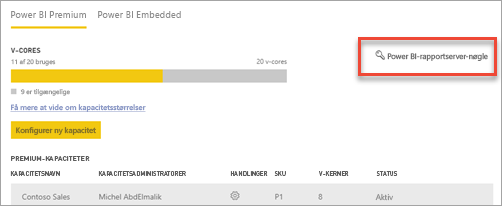
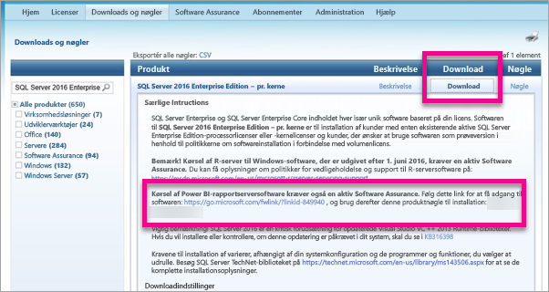

# Sådan finder du produktnøglen til din rapportserver
Se, hvordan du finder produktnøglen til din Power BI-rapportserver, så du kan installere din server i et produktionsmiljø.

<iframe width="640" height="360" src="https://www.youtube.com/embed/6CQnf-NGtpU?rel=0&amp;showinfo=0" frameborder="0" allowfullscreen></iframe>

Du har downloadet Power BI-rapportserver, og du har en SQL Server Enterprise Software Assurance-aftale. Eller du har købt Power BI Premium. Du vil installere serveren i et produktionsmiljø, men du skal bruge en produktnøgle til formålet. Hvor er produktnøglen? 

Produktnøglen kan være placeret to forskellige steder. Det afhænger af, hvad du har købt.

## Har købt Power BI Premium
Hvis du har købt Power BI Premium, finder du produktnøglen til Power BI-rapportserver under fanen **Kapacitetsindstillinger** på Power BI-administrationsportalen. Den kan kun tilgås af globale administratorer eller brugere, som er tildelt rollen som administrator af Power BI-tjenesten.

Når du vælger **Power BI-rapportserver-nøgle**, vises der en dialogboks med din produktnøgle. Du kan kopiere den og bruge den med installationen.

## Har købt en Software Assurance-aftale
Hvis du har en SQL Server Enterprise SA-aftale, kan du få din produktnøgle fra [Volume Licensing Service Center](https://www.microsoft.com/Licensing/servicecenter/). Se efter den seneste version af SQL Server under den seneste servicepakke. Hvis du ikke kan se versionen der, skal du se under RTM-frigivelsen af den seneste SQL Server-version.

> [!NOTE]
> Du skal kigge under downloadsektionen. Ikke i nøglesektionen.
> 
> 

 
## Næste trin
[Installer Power BI-rapportserver](install-report-server.md)  
[Installer Power BI Desktop optimeret til Power BI-rapportserver](install-powerbi-desktop.md)  
[Download Report Builder](https://www.microsoft.com/download/details.aspx?id=53613)  
[Download SQL Server Data Tools (SSDT)](https://go.microsoft.com/fwlink/?LinkID=616714)

Har du flere spørgsmål? [Prøv at spørge Power BI-community'et](https://community.powerbi.com/)

