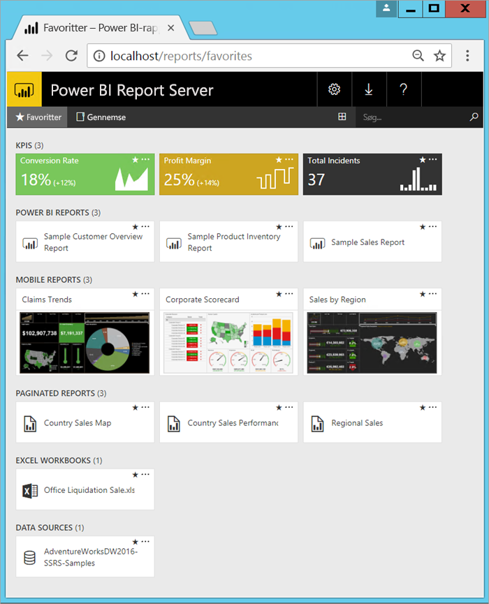

# Hvad er Power BI-rapportserveren?

Power BI-rapportserveren er en rapportserver med en webportal i det lokale miljø, hvor du kan få vist og administrere rapporter og KPI'er. Der medfølger værktøjer til oprettelse af Power BI-rapporter, sideinddelte rapporter, mobilrapporter og KPI'er. Dine brugere kan få adgang til disse rapporter på forskellige måder: Se kan få vist dem i en webbrowser eller på en mobilenhed eller som en mail i deres indbakke.

## Sammenlign Power BI-rapportserveren 
Power BI-rapportserveren ligner både SQL Server Reporting Services og Power BI-onlinetjenesten, men på forskellige måder. På samme måde som med Power BI-tjenesten er Power BI-rapportserveren vært for Power BI-rapporter (.pbix), Excel-filer og sideinddelte rapporter (.rdl). På samme måde som Reporting Services findes Power BI-rapportserveren i det lokale miljø. Power BI-rapportserverens funktioner er overordnede i forhold til Reporting Services: Alt det, du kan bruge Reporting Services til, kan du også bruge Power BI-rapportserveren til, inklusive understøttelse af Power BI-rapporter. Se [Sammenlign Power BI-rapportserveren med Power BI-tjenesten](compare-report-server-service.md) for at få flere oplysninger.

## Licens til Power BI-rapportserveren
Power BI-rapportserver er tilgængelig via to forskellige licenser: [Power BI Premium](../admin/service-premium-what-is.md) og SQL Server Enterprise Edition med Software Assurance. Du kan finde flere oplysninger under [Microsoft Volume Licensing](https://www.microsoftvolumelicensing.com/DocumentSearch.aspx?Mode=3&DocumentTypeId=1&ShowArchived=True). Med en Power BI Premium-licens kan du oprette en hybrid udrulning med en blanding af clouden og det lokale miljø.

Hvis du publicerer Power BI-rapporter til Power BI-rapportserver, har du også brug for en Power BI Pro-licens. Du behøver ikke en Power BI Pro-licens for at få vist og interagere med Power BI-rapporter om Power BI-rapportserver.

> [!NOTE]
> I forbindelse med Power BI Premium er Power BI-rapportserveren kun inkluderet med P-SKU'er. Den er ikke inkluderet i forbindelse med EM-SKU'er.

## Webportal
Indgangspunktet for Power BI-rapportserveren er en sikker webportal, som du kan få vist i alle moderne browsere. Her får du adgang til alle dine rapporter og KPI'er. Indholdet på webportalen er organiseret i et traditionelt mappehierarki. Indhold i dine mapper er grupperet efter type: Power BI-rapporter, mobilrapporter, sideinddelte rapporter, KPI'er og Excel-projektmapper. Delte datasæt og delte datakilder har deres egne mapper, du kan bruge som komponenter til dine rapporter. Du markerer dem som favoritter for at få vist dem i en enkelt mappe. Du kan også oprette KPI'er direkte på webportalen. 

Afhængigt af dine tilladelser kan du administrere indholdet på webportalen. Du kan planlægge behandling af rapporter, få adgang til rapporter efter behov og abonnere på udgivne rapporter. Du kan anvende din egen brugerdefinerede [branding](https://docs.microsoft.com/sql/reporting-services/branding-the-web-portal) på webportalen. 

Mere om [webportalen til Power BI-rapportserveren](https://docs.microsoft.com/sql/reporting-services/web-portal-ssrs-native-mode).

## Power BI-rapporter
Du opretter Power BI-rapporter (.pbix) med den version af Power BI Desktop, der er optimeret til rapportserveren. Derefter publicerer du dem og får dem vist på webportalen i dit eget miljø.

En Power BI-rapport er en visning med flere perspektiver af en datamodel med visualiseringer, som repræsenterer forskellige resultater og indsigter fra denne datamodel.  En rapport kan indeholde en enkelt visualisering eller sider fulde af visualiseringer. Afhængigt af din rolle kan du læse og udforske rapporter, eller du kan oprette dem for andre.

Læs om [installation af Microsoft Power BI Desktop](install-powerbi-desktop.md).

## Sideinddelte rapporter
Sideinddelte rapporter (.rdl) er dokumentlignende rapporter med visualiseringer, hvori tabeller udvides vandret og lodret for at vise alle de inkluderede data, og de fortsætter fra side til side efter behov. De er velegnede, når du vil oprette dokumenter med fast layout og perfekte pixel, der er optimeret til udskrivning, f.eks. PDF- og Word-filer. 

Du kan oprette sideinddelte rapporter, der bruger [Report Builder](https://docs.microsoft.com/sql/reporting-services/report-builder/report-builder-in-sql-server-2016) eller Rapportdesigner i [SQL Server Data Tools (SSDT)](https://docs.microsoft.com/sql/reporting-services/tools/reporting-services-in-sql-server-data-tools-ssdt).

## Reporting Services-mobilrapporter
Mobilrapporter opretter forbindelse til data i det lokale miljø og har et dynamisk layout, der kan tilpasses til forskellige enheder og de forskellige måder, du holder dem på. Du kan oprette dem med SQL Server Mobile Report Publisher.

Mere om [Reporting Services-mobilrapporter](https://docs.microsoft.com/sql/reporting-services/mobile-reports/create-mobile-reports-with-sql-server-mobile-report-publisher). 

## Programmeringsfunktioner til Report Server
Drag fordel af programmeringsfunktionerne til Power BI-rapportserveren, så du kan udvide og tilpasse dine rapporter med API'er til at integrere eller udvide data- og rapportbehandling i brugerdefinerede programmer.

Mere [dokumentation til Report Server-udviklere](https://docs.microsoft.com/sql/reporting-services/reporting-services-developer-documentation).

## Næste trin
[Installer Power BI-rapportserver](install-report-server.md)  
[Download Report Builder](https://www.microsoft.com/download/details.aspx?id=53613)  

Har du flere spørgsmål? [Prøv at spørge Power BI-community'et](https://community.powerbi.com/)
