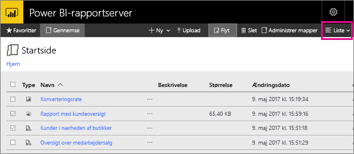

# Navigering i webportalen Power BI-rapportserver
Webportalen Power BI-rapportserver er en placering i det lokale miljø til visning, lagring og administration af dine Power BI-rapporter, dine mobile og sideinddelte rapporter og KPI'er.

Du kan se webportalen i alle moderne browsere. Rapporter og KPI'er er organiseret i mapper i webportalen, og du kan markere dem som favoritter. Du kan også gemme Excel-projektmapper der. Du kan starte de værktøjer, du skal bruge for at oprette rapporter, fra webportalen:

* **Power BI-rapporter** oprettet med Power BI Desktop: Se dem i webportalen og Power BI-mobilappsene.
* **Sideinddelte rapporter** oprettet i Report Builder: moderne udseende, dokumenter med fast layout, der er optimeret til udskrivning.
* **KPI'er** oprettet direkte i webportalen.

Du kan gennemse mapperne på rapportserveren eller søge efter specifikke rapporter i webportalen. Du kan få vist en rapport, dens generelle egenskaber og indsætte kopier af rapporten, der er registreret i rapporthistorikken. Afhængigt af dine rettigheder kan du muligvis også abonnere på rapporter og få dem leveret til din mailindbakke eller en delt mappe i filsystemet.

## Opgaver på webportalen
Du kan bruge webportalen til en række forskellige opgaver, herunder følgende:

* Få vist, søg i, udskriv og abonner på rapporter.
* Opret, sikr og vedligehold mappehierarkiet for at kunne organisere elementer på serveren.
* Konfigurer egenskaberne for rapportereksekvering, rapporthistorik og rapportparametre.
* Opret delte tidsplaner og delte datakilder for at gøre det lettere at håndtere tidsplaner og datakildeforbindelser.
* Opret datadrevne abonnementer for at kunne udrulle rapporter til en lang modtagerliste.
* Opret sammenkædede rapporter for at kunne genbruge og lave en eksisterende rapport om på forskellige måder.
* Download og åbn fælles værktøjer såsom Power BI Desktop (rapportserver), Report Builder og Mobile Report Publisher.
* [Opret KPI'er](https://docs.microsoft.com/sql/reporting-services/working-with-kpis-in-reporting-services).
* Send feedback eller forslag til nye funktioner.
* [Branding på webportalen](https://docs.microsoft.com/sql/reporting-services/branding-the-web-portal)
* [Arbejde med KPI'er](https://docs.microsoft.com/sql/reporting-services/working-with-kpis-in-reporting-services)
* [Arbejde med delte datasæt](https://docs.microsoft.com/sql/reporting-services/work-with-shared-datasets-web-portal)

## Roller og tilladelser til webportalen
Webportalen er et webprogram, der kører i en browser. Når du starter webportalen, afhænger de sider, links og indstillinger, som du kan se, af de tilladelser, du har på rapportserveren. Hvis du har en rolle med fuld tilladelse, har du adgang til samtlige programmenuer og -sider til administrering af en rapportserver. Hvis du har en rolle med tilladelse til at få vist og køre rapporter, kan du kun se de menuer og sider, der skal bruges til disse aktiviteter. Du kan have forskellige rolletildelinger til forskellige rapportservere eller endda til forskellige rapporter og mapper på en enkelt rapportserver.

## Start webportalen
1. Åbn din webbrowser.
   
    Se listen over [understøttede webbrowsere og versioner](browser-support.md).
2. Indtast webportalens URL-adresse i adresselinjen.
   
    URL-adressen er som standard *http://[ComputerName]/reports*.
   
    Rapportserveren er muligvis konfigureret til at bruge en bestemt port. For eksempel *http://[ComputerName]:80/reports* eller *http://[ComputerName]:8080/reports*.
   
    Du kan se, at webportalen deler elementer ind i disse kategorier:
   
   * KPI'er
   * Mobilrapporter
   * Sideinddelte rapporter
   * Power BI Desktop-rapporter
   * Excel-projektmapper
   * Datasæt
   * Datakilder
   * Ressourcer

## Opret og rediger Power BI Desktop-rapporter (.pbix-filer)
Du kan få vist, uploade, oprette, organisere og administrere tilladelser til Power BI Desktop-rapporter på webportalen.

### Opret en Power BI Desktop-rapport
1. Vælg **Ny** > **Power BI-rapport**.
   
    
   
    Power BI Desktop-appen åbnes.
   
    
2. Opret din Power BI-rapport. Se [Hurtigstart: Power BI-rapporter](quickstart-create-powerbi-report.md), hvis du vil have flere oplysninger.
3. Upload din rapport til rapportserveren.

### Rediger en eksisterende Power BI Desktop-rapport
1. Klik på ellipsen (**...**) i øverste højre hjørne af rapportfeltet > **Rediger i Power BI Desktop**.
   
    
   
    Power BI Desktop-appen åbnes.
2. Foretag dine ændringer, og gem... [hvordan?]

## Opret og rediger sideinddelte rapporter (.rdl-filer)
Du kan få vist, uploade, oprette, organisere og administrere tilladelser til sideinddelte rapporter på webportalen.

### Opret en sideinddelt rapport
1. Vælg **Ny** > **sideinddelt rapport**.
   
    Report Builder-appen åbnes.
   
    
2. Opret din sideinddelte rapport. Se [Hurtigstart: Sideinddelte rapporter](quickstart-create-paginated-report.md), hvis du vil have flere oplysninger.
3. Upload din rapport til rapportserveren.

### Rediger en eksisterende sideinddelt rapport
1. Klik på ellipsen (...) i øverste højre hjørne af rapportfeltet > **Rediger i Report Builder**.
   
    
   
    Report Builder-appen åbnes.
2. Foretag dine ændringer, og gem.

## Upload og organisering af Excel-projektmapper
Du kan uploade, organisere og administrere tilladelser til Power BI Desktop-rapporter og Excel-projektmapper. De vil blive samlet i en gruppe i webportalen.

Projektmapperne gemmes på Power BI-rapportserveren, nogenlunde ligesom andre ressourcefiler. Når du vælger en af projektmapperne, bliver den downloadet lokalt på skrivebordet. Du kan gemme de ændringer, du har foretaget, ved at uploade den til rapportserveren igen.

## Administrer elementer i webportalen
Power BI-rapportserver tilbyder detaljeret kontrol over de elementer, som du gemmer på webportalen. For eksempel kan du konfigurere abonnementer, cachelagring, øjebliksbilleder og sikkerhed for hver enkelte sideinddelte rapport.

1. Vælg ellipsen (...) i øverste højre hjørne, og vælg derefter **Administrer**.
   
    
2. Vælg den egenskab eller anden funktion, som du vil konfigurere.
   
    
3. Vælg **Anvend**.

Læs mere om [arbejde med abonnementer i webportalen](https://docs.microsoft.com/sql/reporting-services/working-with-subscriptions-web-portal).

## Mærk dine favoritrapporter og -KPI'er
Du kan mærke rapporter og KPI'er, som skal være favoritter. De er lettere at finde, fordi de alle sammen er samlet i en enkelt Favoritter-mappe, både i webportalen og i Power BI-mobilappsene. 

1. Vælg ellipsen (**...**) i øverste højre hjørne af den KPI eller rapport, der skal være en favorit, og vælg **Føj til Favoritter**.
   
    
2. Vælg **Favoritter** på båndet på webportalen for at se den sammen med andre favoritter på siden Favoritter på webportalen.
   
    
   
    I Power BI-mobilappsene kan du nu få vist disse favoritter sammen med dine foretrukne dashboards fra Power BI-tjenesten.
   
    

## Skjul eller vis elementer på webportalen
Du kan skjule elementer på webportalen, og du kan vælge at få vist skjulte elementer.

### Skjul et element
1. Vælg ellipsen (...) i øverste højre hjørne, og vælg derefter **Administrer**.
   
    
2. Vælg **Skjul dette element**.
   
    
3. Vælg **Anvend**.

### Vis skjulte elementer
1. Vælg **Felter** (eller **Liste**) i øverste højre hjørne > **Vis skjulte elementer**.
   
    Nu vises elementerne. De er gråtonede, men du kan stadig åbne og redigere dem.
   
    

## Søg efter elementer
Du kan indtaste et søgeord, så får du vist alt, hvad du har adgang til. Resultaterne er inddelt i KPI'er, rapporter, datasæt og andre elementer. Du kan derefter interagere med resultaterne og føje dem til dine favoritter.  

## Flyt eller slet elementer i Liste-visningen
Som standard vises indholdet på webportalen i Felt-visning.

Du kan skifte til Liste-visning, hvor det er nemt at flytte eller slette flere elementer ad gangen. 

1. Vælg **Felter** > **Liste**.
   
    
2. Vælg elementerne, og vælg derefter **Flyt** eller **Slet**.

## Næste trin
[Brugerhåndbog](user-handbook-overview.md)  
[Hurtigstart: Sideinddelte rapporter](quickstart-create-paginated-report.md)  
[Hurtigstart: Power BI-rapporter](quickstart-create-powerbi-report.md)

Har du flere spørgsmål? [Prøv at spørge Power BI-community'et](https://community.powerbi.com/)

