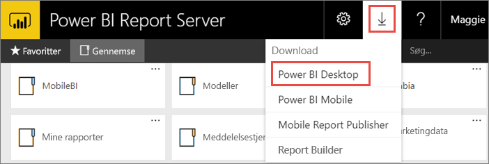

# Installér Power BI Desktop optimeret til Power BI-rapportserver
Se, hvordan du kan installere Power BI Desktop optimeret til Power BI-rapportserver.

For at oprette Power BI-rapporter til Power BI-rapportserver skal du downloade og installere Power BI Desktop optimeret til Power BI-rapportserver. Dette er en anden udgivelse end Power BI Desktop, der bruges med Power BI-tjenesten. Versionen af Power BI Desktop til Power BI-tjenesten indeholder f.eks. prøveversionsfunktioner, som ikke er tilgængelige i versionen Power BI-rapportserver, før de er udgivet. Når du bruger denne udgivelse, sikrer du, at rapportserveren kan interagere med en kendt version af rapporterne og modellen. 

Den gode nyhed er, at du kan installere Power BI Desktop og Power BI Desktop optimeret til Power BI-rapportserver side om side på den samme computer.

## Download og installér Power BI Desktop

Den nemmeste måde til at sikre, at du har den nyeste version af Power BI Desktop optimeret til Power BI-rapportserver, er ved at starte fra webportalen på rapportserveren.

1. På webportalen Rapportserver skal du vælge pilen **Download** > **Power BI Desktop**.

    

    Du kan også gå direkte til [Microsoft Power BI Desktop](https://www.microsoft.com/download/details.aspx?id=56723) (optimeret til Power BI-rapportserver – marts 2018) i Microsoft Download Center.

2. På siden Download Center skal du vælge **Download**.

3. Afhængigt af din computer skal du vælge: 

    - **PBIDesktopRS.msi** (32-bit-version) eller

    - **PBIDesktopRS_x64.msi** (64-bit-version).

1. Når du har downloadet installationsprogrammet, skal du køre installationsguiden til Power BI Desktop (oktober 2017). 
2. Til sidst i installationsprocessen skal du markere **Start Power BI Desktop nu**.
   
    Programmet starter automatisk, og du er klar til at gå i gang.

## Kontrollér, at du har den korrekte version
Du kan kontrollere, om du bruger den rigtige version af Power BI Desktop ved at se startskærmbilledet eller titellinjen i Power BI Desktop. I titellinjen kan du se måneden og årstallet for udgivelsen.

I Power BI Desktop-versionen til Power BI-tjenesten vises måned og årstal ikke i titellinjen.

## Tilknytning af filtypenavne
Hvis du har installeret både Power BI Desktop og Power BI Desktop optimeret til Power BI-rapportserver på den samme computer, vil den seneste installation af Power BI Desktop være tilknyttet filtypenavnet .pbix. Det betyder, at når du dobbeltklikker på en pbix-fil, startes den version af Power BI Desktop, der blev installeret sidst.

Hvis du havde installeret Power BI Desktop og derefter installerede Power BI Desktop optimeret til Power BI-rapportserver, vil alle pbix-filer blive åbnet i Power BI Desktop optimeret til Power BI-rapportserver som standard. Hvis du hellere vil have, at Power BI Desktop åbnes som standard, når du dobbeltklikker på en pbix-fil, kan du geninstallere Power BI Desktop fra Power BI-tjenesten.

Du kan til enhver tid starte med at åbne den version af Power BI Desktop, du vil bruge. Og derefter kan du åbne filen fra Power BI Desktop.

Hvis du redigerer en Power BI-rapport i Power BI-rapportserver eller opretter en ny Power BI-rapport fra webportalen, er det altid den korrekte version Power BI Destop, der åbnes.

## Overvejelser og begrænsninger
Rapporter i Power BI-rapportserver og i Power BI-tjenesten (http://powerbi.com) fungerer stort set ens, men enkelte funktioner er forskellige.

### I en browser
Power BI-rapportserver understøtter alle visualiseringer, herunder:

* Brugerdefinerede visuals

Rapporter i Power BI-rapportserver understøtter ikke:

* R-visuals
* ArcGIS-kort
* Brødkrummer
* Prøveversionsfunktioner i Power Bi Desktop

### I Power BI-mobilappsene
Rapporter i Power BI-rapportserver understøtter al den grundlæggende funktionalitet i [Power BI-mobilappsene](../mobile-apps-for-mobile-devices.md), herunder:

* [Rapport med telefonlayout](../desktop-create-phone-report.md): Du kan optimere en rapport til Power BI-mobilapps. På din mobiltelefon har optimerede rapporter et særligt ikon, , og layout.
  
    

Rapporter i Power BI-rapportserver understøtter ikke disse funktioner i Power BI-mobilappsene:

* R-visuals
* ArcGIS-kort
* Brugerdefinerede visuals
* Brødkrummer
* Geofiltering eller stregkoder

## Power BI Desktop til tidligere versioner af Power BI-rapportserver

Hvis du har en tidligere version af rapportserveren, skal du have den tilsvarende version af Power BI Desktop. Her er de to tidligere versioner.

- Microsoft Power BI Desktop ([optimeret til Power BI-rapportserver – oktober 2017](https://www.microsoft.com/download/details.aspx?id=56136))
- Microsoft Power BI Desktop ([optimeret til Power BI-rapportserver – juni 2017](https://www.microsoft.com/download/details.aspx?id=55330))

## Næste trin
Nu, hvor du har installeret Power BI Desktop, kan du begynde at oprette Power BI-rapporter.

[Opret en Power BI-rapport til Power BI-rapportserveren](quickstart-create-powerbi-report.md)  
[Kom i gang med Power BI Desktop](../desktop-getting-started.md)  
[Oversigt over udviklerhåndbog, Power BI-rapportserver](user-handbook-overview.md)

Har du flere spørgsmål? [Prøv at spørge Power BI-community'et](https://community.powerbi.com/)

