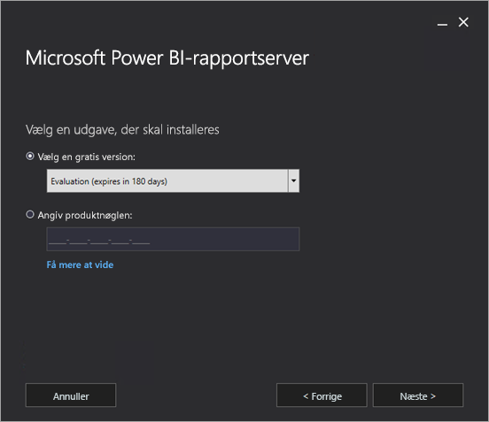
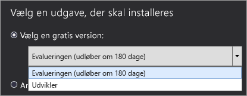
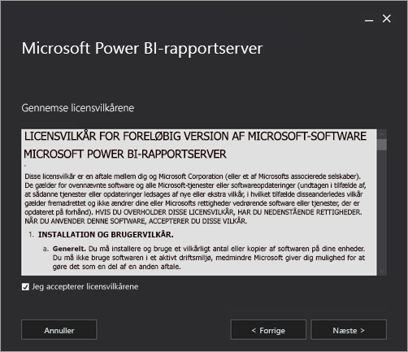
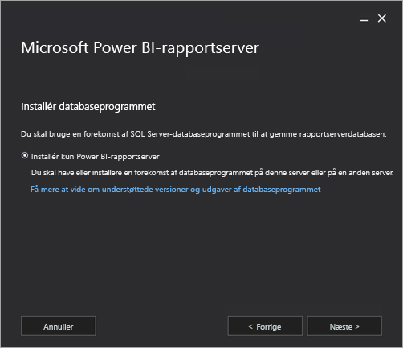
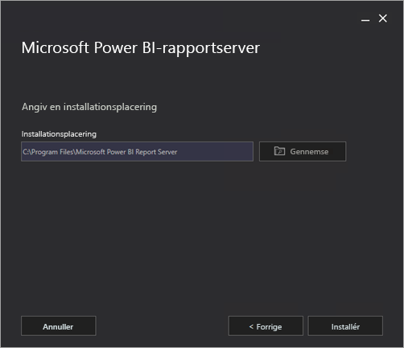
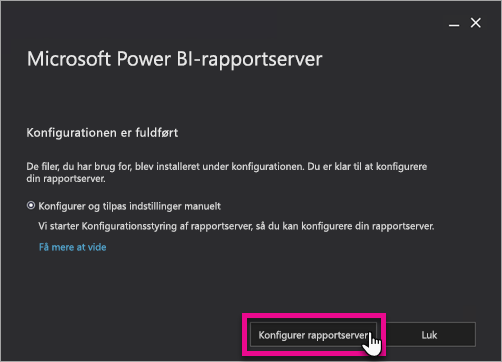
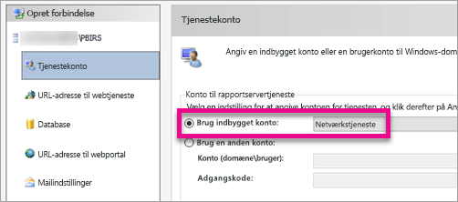
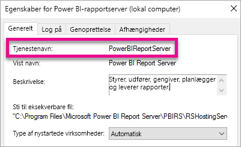

# Installér Power BI-rapportserver

Find ud af, hvordan du installerer Power BI-rapportserver.

 **Download** 

Hvis du vil downloade Power BI-rapportserver, skal du gå til [Rapportering i det lokale miljø med Power BI-rapportserver](https://powerbi.microsoft.com/report-server/) og vælge **Download gratis prøveversion**. 

## Inden du starter

Vi anbefaler, at du læser [Hardware- og softwarekrav til installation af Power BI-rapportserver](system-requirements.md), før du installerer Power BI-rapportserver.

 > [!IMPORTANT]
 > Du kan installere Power BI-rapportserver i et miljø med en skrivebeskyttet domænecontroller (RODC), men Power BI-rapportserver skal have adgang til domænecontroller med læse-/skriveadgang for at fungere korrekt. Hvis Power BI-rapportserver kun har adgang til en skrivebeskyttet domænecontroller, kan der opstå fejl under forsøg på at administrere tjenesten.

### Produktnøgle til Power BI-rapportserver

#### Power BI Premium

Hvis du har købt Power BI Premium, har du på fanen **Premium-indstillinger** i Power BI-administrationsportalen adgang til produktnøglen til Power BI-rapportserver. Den kan kun tilgås af globale administratorer eller brugere, som er tildelt rollen som administrator af Power BI-tjenesten.

Når du vælger **Nøgle til Power BI-rapportserver**, vises en dialogboks med din produktnøgle. Du kan kopiere den og bruge den med installationen.

#### SQL Server Enterprise Software Assurance (SA)

Hvis du har en SQL Server Enterprise SA-aftale, kan du få din produktnøgle fra [Volume Licensing Service Center](https://www.microsoft.com/Licensing/servicecenter/).

## Installér din rapportserver

Det er nemt at installere Power BI-rapportserver. Der er kun et par trin til installation af filerne.

Du behøver ikke adgang til en SQL Server-databaseprogramserver på installationstidspunktet. Du skal bruge en til at konfigurere Reporting Services efter installationen.

1. Find placeringen af PowerBIReportServer.exe, og start installationen.

2. Vælg **Installér Power BI-rapportserver**.

    
3. Vælg en udgave, du vil installere, og vælg derefter **Næste**.

    

    Du kan vælge enten Evaluation- eller Developer-udgaven på rullelisten.

    

    Ellers kan du angive en produktnøgle til den server, du har købt fra Power BI-tjenesten eller fra Volume License Service Center. Hvis du vil have mere at vide om, hvordan du får din produktnøgle, skal du se afsnittet [Inden du starter](#before-you-begin).
4. Læs og acceptér vilkår og betingelser for licensen, og vælg derefter **Næste**.

    
5. Du skal have et tilgængeligt databaseprogram til at gemme rapportserverdatabasen. Vælg **Næste** for kun at installere rapportserveren.

    
6. Angiv placeringen for installation af rapportserveren. Vælg **Installér** for at fortsætte.

    

    Standardstien er C:\Programmer\Microsoft Power BI-rapportserver.

7. Når opgraderingen er udført, skal du vælge **Configure Report Server** for at starte Reporting Services Configuration Manager.

    

## Konfiguration af rapportserveren

Når du har valgt **Configure Report Server** i konfigurationen, vises Reporting Services Configuration Manager. Du kan få mere at vide under [Reporting Services Configuration Manager](https://docs.microsoft.com/sql/reporting-services/install-windows/reporting-services-configuration-manager-native-mode).

Du skal [oprette en rapportserverdatabase](https://docs.microsoft.com/sql/reporting-services/install-windows/ssrs-report-server-create-a-report-server-database) for at fuldføre den indledende konfiguration af Reporting Services. Der kræves en SQL Server Database-server for at fuldføre dette trin.

### Opret en database på en anden server

Hvis du opretter rapportserverdatabasen på en databaseserver på en anden computer, skal du ændre tjenestekontoen for rapportserveren til legitimationsoplysninger, der genkendes på databaseserveren. 

Som standard anvender rapportserveren den virtuelle tjenestekonto. Hvis du forsøger at oprette en database på en anden server, får du muligvis følgende fejl på trinnet til anvendelse af forbindelsesrettigheder.

`System.Data.SqlClient.SqlException (0x80131904): Windows NT user or group '(null)' not found. Check the name again.`

Du kan omgå fejlen ved at ændre tjenestekontoen til enten Netværkstjeneste eller en domænekonto. Hvis du ændrer tjenestekontoen til Netværkstjeneste, anvendes rettighederne i konteksten for computerkontoen for rapportserveren.

Du kan få mere at vide under [Konfigurer kontoen til rapportservertjenesten](https://docs.microsoft.com/sql/reporting-services/install-windows/configure-the-report-server-service-account-ssrs-configuration-manager).

## Windows-tjeneste

Der oprettes en Windows-tjeneste som en del af installationen. Den vises som **Power BI-rapportserver**. Tjenestenavnet er **PowerBIReportServer**.

## Standardreservation for URL-adresser

URL-reservationer består af et præfiks, værtsnavn, en port og en virtuel mappe:

| Del | Beskrivelse |
| --- | --- |
| Præfiks |Standardpræfikset er HTTP. Hvis du tidligere har installeret et SSL-certifikat (Secure Sockets Layer), forsøger installationsprogrammet at oprette reservationer, der anvender HTTPS-præfikset. |
| Værtsnavn |Standardværtsnavnet er et stærkt jokertegn (+). Det angiver, at rapportserveren accepterer eventuelle HTTP-anmodninger på den angivne port for eventuelle værtsnavne, der oversættes til computeren, herunder `http://<computername>/reportserver`, `http://localhost/reportserver` eller `http://<IPAddress>/reportserver.` |
| Port |Standardporten er 80. Hvis du bruger en anden port end port 80, skal du udtrykkeligt føje den til URL-adressen, når du åbner webportalen i et browservindue. |
| Virtuel mappe |Som standard oprettes virtuelle mapper i formatet for ReportServer for Report Server-webtjenesten og Reports for webportalen. For Report Server-webtjenesten er den virtuelle mappe som standard **reportserver**. For webportalen den virtuelle mappe som standard **reports**. |

Et eksempel på den komplette URL-streng kan være som følger:

* `http://+:80/reportserver`, giver adgang til rapportserveren.
* `http://+:80/reports`, giver adgang til webportalen.

## Firewall

Hvis du tilgår rapportserveren fra en fjerncomputer, skal du sikre dig, at du har konfigureret firewallregler, hvis der findes en firewall.

Du skal åbne den TCP-port, du har konfigureret for URL-adressen til webtjenesten og URL-adressen til webportalen. Som standard er disse konfigureret på TCP-port 80.

## Yderligere konfiguration

* Hvis du vil konfigurere integration med Power BI-tjenesten, så du kan fastgøre rapportelementer på et Power BI-dashboard, skal du se [Integrer med Power BI-tjenesten](https://docs.microsoft.com/sql/reporting-services/install-windows/power-bi-report-server-integration-configuration-manager).
* Hvis du vil konfigurere mail til behandling af abonnementer, skal du se [Mailindstillinger](https://docs.microsoft.com/sql/reporting-services/install-windows/e-mail-settings-reporting-services-native-mode-configuration-manager) og [Maillevering på en rapportserver](https://docs.microsoft.com/sql/reporting-services/subscriptions/e-mail-delivery-in-reporting-services).
* Hvis du vil konfigurere webportalen, så du kan få adgang til den på en computer for at få vist og administrere rapporter, skal du se [Konfigurer en firewall til rapportserveradgang](https://docs.microsoft.com/sql/reporting-services/report-server/configure-a-firewall-for-report-server-access) og [Konfigurer en rapportserver til fjernadministration](https://docs.microsoft.com/sql/reporting-services/report-server/configure-a-report-server-for-remote-administration).

## Næste trin

[Administratoroversigt](admin-handbook-overview.md)  
[Sådan finder du produktnøglen til din rapportserver](find-product-key.md)  
[Installér Power BI Desktop optimeret til Power BI-rapportserver](install-powerbi-desktop.md)  
[Bekræft installationen af en rapporteringstjeneste](https://docs.microsoft.com/sql/reporting-services/install-windows/verify-a-reporting-services-installation)  
[Konfigurer kontoen til rapportservertjenesten](https://docs.microsoft.com/sql/reporting-services/install-windows/configure-the-report-server-service-account-ssrs-configuration-manager)  
[Konfigurer rapportserverens URL-adresser](https://docs.microsoft.com/sql/reporting-services/install-windows/configure-report-server-urls-ssrs-configuration-manager)  
[Konfigurer en rapportservers databaseforbindelse](https://docs.microsoft.com/sql/reporting-services/install-windows/configure-a-report-server-database-connection-ssrs-configuration-manager)  
[Initialiser en rapportserver](https://docs.microsoft.com/sql/reporting-services/install-windows/ssrs-encryption-keys-initialize-a-report-server)  
[Konfigurer SSL-forbindelser på en rapportserver](https://docs.microsoft.com/sql/reporting-services/security/configure-ssl-connections-on-a-native-mode-report-server)  
[Konfigurer Windows-tjenestekonti og -tilladelser](https://docs.microsoft.com/sql/database-engine/configure-windows/configure-windows-service-accounts-and-permissions)  
[Browserunderstøttelse af Power BI Report Server](browser-support.md)

Har du flere spørgsmål? [Prøv at spørge Power BI-community'et](https://community.powerbi.com/)