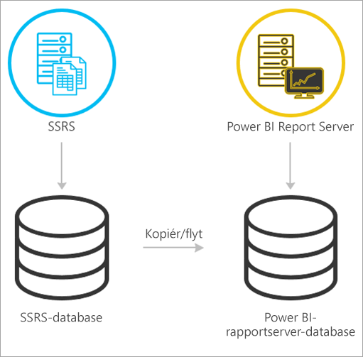
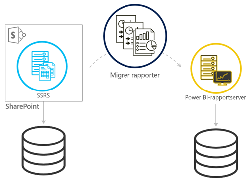
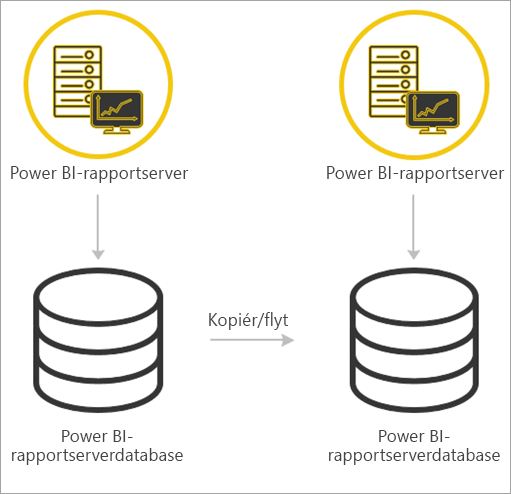

# <a name="migrate-a-report-server-installation"></a>Overfør en rapportserverinstallation

Få mere at vide om, hvordan du overfører din eksisterende SQL Server Reporting Services-forekomst (SSRS) til en forekomst af Power BI-rapportserver.

Overførsel er defineret som at flytte programdatafiler til en ny Power BI Report Server-forekomst. Følgende er almindelige årsager til, at du kan vælge at overføre din installation:

* Du vil flytte fra SQL Server Reporting Services til Power BI-rapportserver
  
  > [!NOTE]
  > Der er ikke en opgradering på stedet fra SQL Server Reporting Services til Power BI Report Server. En overførsel er nødvendig.

* Du har en installation i stor skala eller opdateringskrav
* Du er ved at ændre hardware eller topologi for din installation
* Der opstod et problem, der blokerer for opgraderingen

## <a name="migrating-to-power-bi-report-server-from-ssrs-native-mode"></a>Overførsel til Power BI Report Server fra SSRS (oprindelig tilstand)

Overførsel fra en SSRS-forekomst (oprindelig tilstand) til Power BI Report Server består af nogle få trin.



> [!NOTE]
> SQL Server 2008 Reporting Services og nyere understøttes i forbindelse med overførsel.

* Sikkerhedskopiér database-, program- og konfigurationsfiler
* Sikkerhedskopiér krypteringsnøglen
* Klon din rapportserverdatabase, der er vært for dine rapporter
* Installer Power BI Report Server. Hvis du bruger den samme hardware, kan du installere Power BI-rapportserver på den samme server som SSRS-forekomsten. Yderligere oplysninger om installation af Power BI Report Server finder du i [Installer Power BI Report Server](install-report-server.md).

> [!NOTE]
> Navnet på forekomsten til Power BI Report Server vil være *PBIRS*.

* Konfigurer rapportserveren ved hjælp af Report Server-konfigurationsstyring, og opret forbindelse til den klonede database.
* Foretag eventuel oprydning, der er nødvendig for SSRS-forekomsten (oprindelig tilstand)

## <a name="migration-to-power-bi-report-server-from-ssrs-sharepoint-integrated-mode"></a>Overførsel til Power BI Report Server fra SSRS (SharePoint-integreret tilstand)

Overførsel fra en SSRS (SharePoint-integreret tilstand) til Power BI Report Server er ikke så ligetil som oprindelig tilstand. Selvom disse trin indeholder nogle retningslinjer, kan du have andre filer og aktiver i SharePoint, der skal administreres uden for disse trin.



Du skal overføre det specifikke rapportserverindhold fra SharePoint til din Power BI-rapportserver. Du skal have installeret Power BI-rapportserver et eller andet sted i dit miljø. Yderligere oplysninger om installation af Power BI Report Server finder du i [Installer Power BI Report Server](install-report-server.md).

Hvis du vil kopiere rapportserverindholdet fra SharePoint-miljøet til Power BI-rapportserver, skal du bruge værktøjer, f.eks. **rs.exe**, til at kopiere indholdet. Nedenfor findes et eksempel på, hvordan scriptet skal være for at kopiere rapportserverindholdet fra SharePoint til Power BI Report Server.

> [!NOTE]
> Eksempelscriptet skal fungere i forhold til SharePoint 2010 og nyere og SQL Server 2008 Reporting Services og nyere.

### <a name="sample-script"></a>Eksempelscript

```
Sample Script
rs.exe
-i ssrs_migration.rss -e Mgmt2010
-s http://SourceServer/_vti_bin/reportserver
-v st="sites/bi" -v f="Shared Documents“
-u Domain\User1 -p Password
-v ts=http://TargetServer/reportserver
-v tu="Domain\User" -v tp="Password"
```

## <a name="migrating-from-one-power-bi-report-server-to-another"></a>Overførsel fra én Power BI-rapportserver til en anden

Overførsel fra en Power BI-rapportserver er den samme proces som overførsel fra SSRS (oprindelig tilstand).



* Sikkerhedskopiér database-, program- og konfigurationsfiler
* Sikkerhedskopiér krypteringsnøglen
* Klon din rapportserverdatabase, der er vært for dine rapporter
* Installer Power BI Report Server. Du *kan ikke* installere Power BI-rapportserver på den samme server som den, du overfører fra. Yderligere oplysninger om installation af Power BI Report Server finder du i [Installer Power BI Report Server](install-report-server.md).

> [!NOTE]
> Navnet på forekomsten til Power BI Report Server vil være *PBIRS*.

* Konfigurer rapportserveren ved hjælp af Report Server-konfigurationsstyring, og opret forbindelse til den klonede database.
* Foretag eventuel oprydning, der er nødvendig for den gamle installation af Power BI Report Server.

## <a name="next-steps"></a>Næste trin

[Administratoroversigt](admin-handbook-overview.md)  
[Installer Power BI-rapportserver](install-report-server.md)  
[Scriptet med værktøjet rs.exe og webtjenesten](https://docs.microsoft.com/sql/reporting-services/tools/script-with-the-rs-exe-utility-and-the-web-service)

Har du flere spørgsmål? [Prøv at spørge Power BI-community'et](https://community.powerbi.com/)