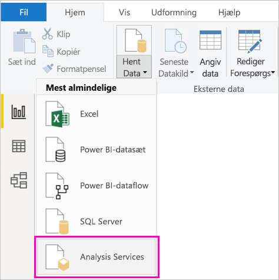

# Opret en Power BI-rapport til Power BI-rapportserveren
Du kan gemme og administrere Power BI-rapporter i det lokale miljø på Microsoft Power BI-rapportservers webportal, på samme måde som du kan gemme Power BI-rapporter i skyen i Power BI-tjenesten (https://powerbi.com). Du kan oprette og redigere rapporter i Power BI Desktop og publicere dem på webportalen. Derefter kan rapportlæsere i din organisation få dem vist i en browser eller i en Power BI-mobilapp på en mobilenhed.

Her er fire hurtige trin til at komme i gang.

## Trin 1: Installér Power BI Desktop optimeret til Power BI-rapportserver

Hvis du allerede har oprettet Power BI-rapporter i Power BI Desktop, er du næsten klar til at oprette Power BI-rapporter til Power BI-rapportserver. Vi anbefaler, at du installerer den version af Power BI Desktop, som er optimeret til Power BI-rapportserver, så du ved, at serveren og appen altid er synkroniseret. Du kan have begge versioner af Power BI Desktop på den samme computer.

1. På webportalen Rapportserver skal du vælge pilen **Download** > **Power BI Desktop**.

    

    Eller gå til hjemmesiden for [Power BI-rapportserver](https://powerbi.microsoft.com/report-server/), og vælg **Avancerede indstillinger for download**.

2. På siden Download Center skal du vælge **Download**.

3. Afhængigt af din computer skal du vælge:

    - **PBIDesktopRS.msi** (32-bit-version) eller

    - **PBIDesktopRS_x64.msi** (64-bit-version).

4. Når du har downloadet installationsprogrammet, skal du køre installationsguiden til Power BI Desktop (september 2019).

2. Til sidst i installationsprocessen skal du markere **Start Power BI Desktop nu**.
   
    Programmet starter automatisk, og du er klar til at gå i gang. Du kan se, at du har den rigtige version, fordi der står **Power BI Desktop (september 2019)** på titellinjen.

    

3. Hvis du ikke kender til Power BI Desktop, bør du overveje at se videoerne på velkomstskærmbilledet.
   
    

## Trin 2: Vælg en datakilde
Du kan oprette forbindelse til en række forskellige datakilder. Læs mere om at [oprette forbindelse til datakilder](connect-data-sources.md).

1. På velkomstskærmen skal du vælge **Hent data**.
   
    Eller du kan vælge **Hent data** på fanen **Hjem**.
2. Vælg din datakilde – i dette eksempel **Analysis Services**.
   
    
3. Udfyld **Server** og eventuelt **Database**. Sørg for, at **Opret liveforbindelse** er valgt > **OK**.
   
    
4. Vælg den rapportserver, hvor du vil gemme dine rapporter.
   
    

## Trin 3: Design rapporten
Det her er den sjove del: Du får lov at oprette visuals, som illustrerer dine data.

Du kan f.eks. oprette et tragtformet diagram over kunder og gruppere værdier efter årsomsætning.

1. I **Visualiseringer** skal du vælge **Tragtformet diagram**.
2. Træk det felt, som skal tælles, til kategorien **Værdier**. Hvis det ikke er et numerisk felt, gør Power BI Desktop det automatisk til en *optælling* af værdien.
3. Træk det felt, der skal grupperes, over på kategorien **Gruppér**.

Læs meget mere om at [designe en Power BI-rapport](../desktop-report-view.md).

## Trin 4: Gem din rapport på rapportserveren
Når rapporten er klar, kan du gemme den på den Power BI-rapportserver, du har valgt i Trin 2.

1. I menuen **Filer** skal du vælge **Gem som** > **Power BI-rapportserver**.
   
    
2. Nu kan du se den i webportalen.
   
    
    
> [!NOTE]
> Hvis du vælger at redigere rapporten på et senere tidspunkt, vil de rapportdata, du ser på skrivebordet, altid være de cachelagrede data fra det tidspunkt, hvor rapporten oprindeligt blev oprettet.  Hvis du vil have vist de nyeste data, når du redigerer rapporten, skal du opdatere dataene i dit Power BI Desktop-program.

## De næste trin
### Power BI Desktop
Der er så mange fantastiske ressourcer til at oprette rapporter i Power BI Desktop. Dette link er et godt udgangspunkt.

* [Kom i gang med Power BI Desktop](../desktop-getting-started.md)
* Kursus med vejledning: [Udforsk Power BI Desktop](/learn/modules/get-data-power-bi/2-getting-started-power-bi-desktop)

### Power BI-rapportserver
* [Installer Power BI Desktop optimeret til Power BI-rapportserver](install-powerbi-desktop.md)  
* [Hvad er Power BI-rapportserveren?](get-started.md)  

Har du flere spørgsmål? [Prøv at spørge Power BI-community'et](https://community.powerbi.com/)
