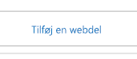
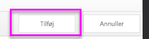

# <a name="quickstart-embed-a-power-bi-report-server-report-using-an-iframe-in-sharepoint-server"></a>Hurtig introduktion: Integrer en rapport på Power BI-rapportserveren ved hjælp af en iFrame på SharePoint Server

I denne hurtige introduktion lærer du, hvordan du integrerer en rapport på Power BI-rapportserveren ved hjælp af en iFrame på en SharePoint-side. Hvis du arbejder med SharePoint Online, skal Power BI-rapportserveren være offentligt tilgængelig. I SharePoint Online fungerer den Power BI-webdel, der fungerer med Power BI-tjenesten, ikke med Power BI-rapportserveren. 


## <a name="prerequisites"></a>Forudsætninger
* [Power BI-rapportserveren](https://powerbi.microsoft.com/en-us/report-server/) skal være installeret og konfigureret.
* [Power BI Desktop, der er optimeret til Power BI-rapportserveren](install-powerbi-desktop.md), skal være installeret.
* Der skal være installeret og konfigureret et [SharePoint](https://docs.microsoft.com/en-us/sharepoint/install/install)-miljø.

## <a name="creating-the-power-bi-report-server-report-url"></a>Opret URL-adressen til Power BI-rapportserveren

1. Download eksemplet fra GitHub – [Blogdemo](https://github.com/Microsoft/powerbi-desktop-samples).

    

2. Åbn PBIX eksempelfilen fra GitHub i **Power BI Desktop optimeret til Power BI-rapportserveren**.

    

3. Gem rapporten på **Power BI-rapportserveren**. 

    

4. Få vist rapporten på **webportalen**.

    

### <a name="capturing-the-url-parameter"></a>Hent URL-parameteren

Når du har din URL-adresse, kan du oprette en iFrame på en SharePoint-side, der er vært for rapporten. I forbindelse med URL-adresser til rapporter på Power BI-rapportserveren kan du tilføje querystring-parameteren `?rs:embed=true` for at integrere din rapport i en iFrame. 

   Eksempel:
    ``` 
    http://myserver/reports/powerbi/Sales?rs:embed=true
    ```
## <a name="embedding-a-power-bi-report-server-report-in-a-sharepoint-iframe"></a>Integrer en rapport på Power BI-rapportserveren i en SharePoint iFrame

1. Naviger til en SharePoint-side med **webstedsindhold**.

    

2. Vælg den side, hvor du vil tilføje din rapport.

    

3. Vælg tandhjulet i øverste højre hjørne, og vælg **Rediger side**.

    

4. Vælg **Tilføj webdel**.

    

5. Under **Kategorier** skal du vælge **Medier og indhold**, under **Dele** skal du vælge **Indholdsredigering**, og vælg derefter **Tilføj**.

     

6. Vælg **Klik her for at tilføje nyt indhold**.

    

7. På båndet skal du vælge fanen **Formatér tekst** og derefter vælge **Rediger kilde**.

     

8. I vinduet Rediger kilde skal du indsætte iFrame-koden og vælge OK.

    

     Eksempel:
     ```
     <iframe width="800" height="600" src="http://myserver/reports/powerbi/Sales?rs:embed=true" frameborder="0" allowFullScreen="true"></iframe>
     ```

9. På båndet skal du vælge fanen **Side** og derefter vælge **Stop redigering**.

    

10. Nu kan du se rapporten på siden.

    

## <a name="next-steps"></a>Næste trin

[Hurtigstart: Opret en Power BI-rapport til Power BI-rapportserver](quickstart-create-powerbi-report.md)  
[Hurtigstart: Opret en sideinddelt rapport for Power BI-rapportserver](quickstart-create-paginated-report.md)  

Har du flere spørgsmål? [Prøv at spørge Power BI-community'et](https://community.powerbi.com/) 