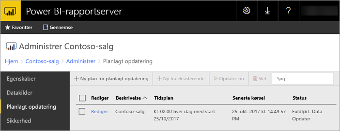

# Planlagt opdatering af Power BI-rapport på Power BI-rapportserver
Planlagt opdatering af Power BI-rapporter gør det muligt at holde dataene til en rapport ajourført.

Planlagt opdatering er en funktion specifikt til Power BI-rapporter med en integreret model. Det vil sige, at du importerer data i rapporten i stedet for ved hjælp af en direkte forbindelse eller DirectQuery. Når du importerer dine data, mister de forbindelsen til den oprindelige datakilde, og de skal derfor opdateres for at være ajourført. Planlagt opdatering er den måde, hvorpå du kan holde dataene ajourført.

Planlagt opdatering konfigureres i rapportens administrationssektion. Du kan finde flere oplysninger om, hvordan du konfigurerer planlagt opdatering under [Sådan konfigurerer du en planlagt opdatering af en Power BI-rapport](configure-scheduled-refresh.md).

## Sådan fungerer det
Der er flere komponenter involveret, når du bruger en planlagt opdatering til dine Power BI-rapporter.

* SQL Server Agent som timer til at oprette planlagte hændelser
* Planlagte jobs, der føjes til en kø af hændelser og beskeder i rapportserverdatabasen. I en scale-out-udrulning deles køen på tværs af alle rapportserverne i udrulningen.
* Al behandling af rapporter, der opstår som følge af en planlagt hændelse, udføres som en baggrundsproces.
* Datamodellen indlæses i en Analysis Services-forekomst.
* For nogle datakilder bruges Power Query-miksprogrammet til at oprette forbindelse til datakilder og ændre dataene. Der kan oprettes forbindelse til andre datakilder direkte fra en Analysis Services-tjeneste, som bruges til at hoste datamodeller for Power BI-rapportserver.
* Nye data indlæses i datamodellen i Analysis Services.
* Datamodellen kan replikeres på tværs af noder i en scale-out-konfiguration.
* Analysis Services behandler dataene og udfører eventuelle nødvendige beregninger.

Power BI-rapportserver opretholder en hændelseskø over alle planlagte handlinger. Den sender forespørgsler til køen med jævne mellemrum for at tjekke, om der er nogen nye hændelser. Som standard scannes køen med ti sekunders interval. Du kan ændre intervallet ved at ændre konfigurationsindstillingerne for **PollingInterval**, **IsNotificationService** og **IsEventService** i RSReportServer.config-filen. **IsDataModelRefreshService** kan også bruges til at indstille, om en rapportserver skal behandle planlagte hændelser.

### Analysis Services
Gengivelse af en Power BI-rapport samt udførelse af en planlagt opdatering kræver, at Power BI-rapportens datamodel indlæses i Analysis Services. Der vil køre en Analysis Services-proces sammen med Power BI-rapportserver.

## Overvejelser og begrænsninger
### Når planlagt opdatering ikke kan bruges
Der kan ikke oprettes en planlagt opdateringsplan for alle Power BI-rapporter. Her er en liste over de Power BI-rapporter, som du ikke kan oprette en planlagt opdateringsplan for.

* Din rapport indeholder en eller flere Analysis Services-datakilder, som bruger en direkte forbindelse.
* Din rapport indeholder en eller flere datakilder, der bruger DirectQuery.
* Din rapport indeholder ikke nogen datakilder. Dataene er for eksempel indtastet manuelt via *Angiv data*, eller rapporten indeholder kun statisk indhold, som f.eks. billeder, tekst osv.

Ud over ovennævnte liste er der specifikke scenarier med datakilder i tilstanden *Import*, som du ikke kan oprette opdateringsplaner for.

* Hvis der bruges en *fil-* eller en *mappe-* datakilde, og stien til filen er en lokal sti (f.eks. C:\Users\user\Documents), kan der ikke oprettes en opdateringsplan. Stien skal være en sti, som rapportserveren kan oprette forbindelse til som en netværksshare. Eksempelvis  *\\myshare\Documents*.
* Hvis der kan oprettes forbindelse til datakilden udelukkende ved hjælp af OAuth (f.eks. Facebook, Google Analytics, Salesforce osv.), kan der ikke oprettes en cacheopdateringsplan. For øjeblikket understøtter RS ikke OAuth-godkendelse for nogen datakilder, om det så er sideinddelte eller mobile rapporter eller Power BI-rapporter.

### Hukommelsesbegrænsninger
Traditionelt set har en rapportservers arbejdsbelastning svaret nogenlunde til et webprogram. Evnen til at indlæse rapporter med importerede data eller DirectQuery og evnen til at udføre planlagte opdateringer afhænger af, at en Analysis Services-forekomst hostes sammen med rapportserveren. Dette kan derfor resultere i et uventet stort hukommelsesforbrug i serveren. Planlæg serverinstallationen på baggrund af denne mulighed for, at Analysis Services bruger hukommelsen samtidig med rapportserveren.

Du kan finde oplysninger om, hvordan du overvåger en Analysis Services-forekomst, under [Overvåg en Analysis Services-forekomst](https://docs.microsoft.com/sql/analysis-services/instances/monitor-an-analysis-services-instance).

Du kan finde oplysninger om hukommelsesindstillinger i Analysis Services under [Egenskaber for hukommelse](https://docs.microsoft.com/sql/analysis-services/server-properties/memory-properties).

## Næste trin
Konfigurer [planlagt opdatering](configure-scheduled-refresh.md) af en Power BI-rapport.

Har du flere spørgsmål? [Prøv at spørge Power BI-community'et](https://community.powerbi.com/)

