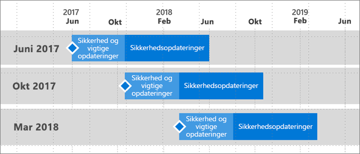

# Supporttidslinje til Power BI Report Server
Power BI Report Server udgives nogle få gange om året. Vigtige opdateringer og sikkerhedsopdateringer er tilgængelige, indtil den næste version bliver offentlig tilgængelig (GA). Efter den næste version vil den forrige version fortsat modtage sikkerhedsopdateringer i den resterende tid af de 12 måneder, hvor supporten løber.

Denne supportpolitik giver os mulighed for hurtigt at levere innovationer til vores kunder, samtidig med at det giver fleksibilitet til kunderne, så de kan tilpasse de nye funktioner i deres eget tempo.

* Servicefase med vigtige opdateringer og sikkerhedsopdateringer – Når du bruger den seneste aktuelle version af Power BI Report Server, modtager du både vigtige opdateringer og sikkerhedsopdateringer.
* Servicefase (kun) for sikkerhedsopdateringer – Når en ny version udgives, reduceres supporten til ældre versioner til kun at omfatte sikkerhedsopdateringer i den resterende tid af de tolv (12) måneder, supporten løber (vist i figur 1).

    

## Versionsoversigt

| **Version** | **Disponeringsdato** | **Dato for ophør af support** |
| --- | --- | --- |
| Juni 2017 |12. juni 2017 |12. juni 2018 |
| Oktober 2017 |31. oktober 2017 |31. oktober 2018 |
| Marts 2018 | 19. marts 2018 | 19. marts 2019 |

Hvis du vil downloade Power BI-rapportserver og Power BI Desktop optimeret til Power BI-rapportserver, skal du gå til [Rapportering i det lokale miljø med Power BI-rapportserver](https://powerbi.microsoft.com/report-server/).

## Næste trin
[Nyheder i Power BI-rapportserver](whats-new.md)  
[Hvad er Power BI-rapportserveren?](get-started.md)
[Administratoroversigt](admin-handbook-overview.md)  
[Installer Power BI-rapportserver](install-report-server.md)  

Har du flere spørgsmål? [Prøv at spørge Power BI-community'et](https://community.powerbi.com/)

