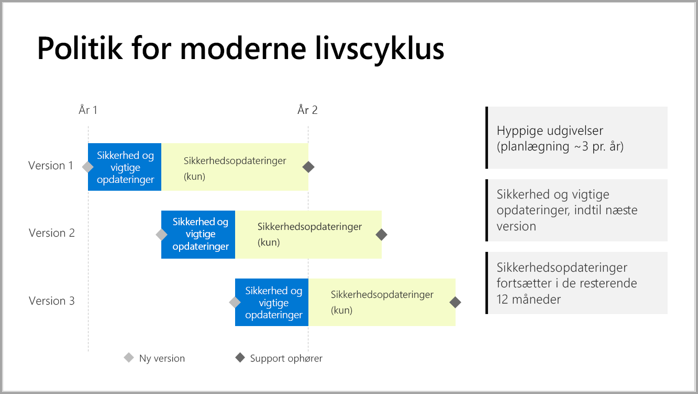

# Supporttidslinje til Power BI Report Server

Power BI-rapportserver udgiver nogle få gange om året. Vigtige opdateringer og sikkerhedsopdateringer er tilgængelige, indtil den næste version bliver offentlig tilgængelig. Efter den næste version modtager den forrige version fortsat sikkerhedsopdateringer i den resterende periode af versionens livscyklus på 12 måneder.

Denne supportpolitik giver os mulighed for hurtigt at levere innovationer til vores kunder, samtidig med at det giver fleksibilitet til kunderne, så de kan tilpasse de nye funktioner i deres eget tempo.

* Servicefase med vigtige opdateringer og sikkerhedsopdateringer – Når du kører den seneste aktuelle version af Power BI-rapportserver, modtager du både vigtige opdateringer og sikkerhedsopdateringer.
* Servicefase (kun) for sikkerhedsopdateringer – Når en ny version udgives, reduceres supporten til ældre versioner til kun at omfatte sikkerhedsopdateringer i den resterende periode af versionens livscyklus på 12 måneder (vist i figur 1).

    

## Versionsoversigt

| **Version** | **Disponeringsdato** | **Dato for ophør af support** |
| --- | --- | --- |
| Juni 2017 |12. juni 2017 |Understøttes ikke længere |
| Oktober 2017 |31. oktober 2017 | Understøttes ikke længere |
| Marts 2018 | 19. marts 2018 | 19. marts 2019 |
| August 2018 | 15. august 2018 | 15. august 2019 |
| Januar 2019 | 23. januar 2019 | 23. januar 2020 |

Hvis du vil downloade Power BI-rapportserver og Power BI Desktop optimeret til Power BI-rapportserver, skal du gå til [Rapportering i det lokale miljø med Power BI-rapportserver](https://powerbi.microsoft.com/report-server/).

## Næste trin
[Nyheder i Power BI-rapportserver](whats-new.md)  
[Hvad er Power BI-rapportserveren?](get-started.md)
[Administratoroversigt](admin-handbook-overview.md)  
[Installer Power BI-rapportserver](install-report-server.md)  

Har du flere spørgsmål? [Prøv at spørge Power BI-community'et](https://community.powerbi.com/)