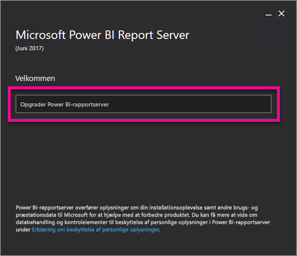
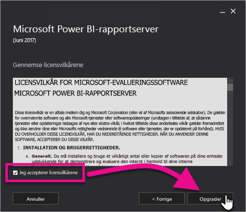
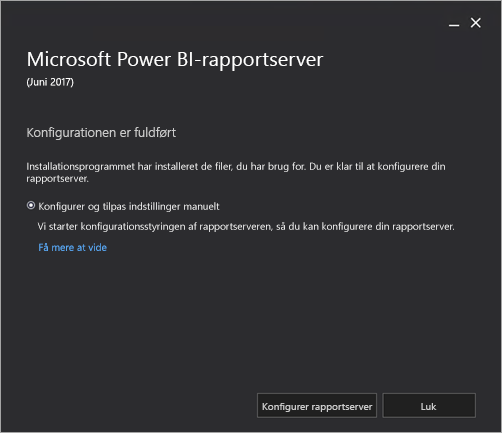

# Opgrader Power BI Report Server

Find ud af, hvordan du opgraderer Power BI Report Server.

 **Download** 

Hvis du vil downloade Power BI-rapportserver og Power BI Desktop optimeret til Power BI-rapportserver, skal du gå til [Rapportering i det lokale miljø med Power BI-rapportserver](https://powerbi.microsoft.com/report-server/).

## Inden du starter

Inden du opgraderer en rapportserver, anbefales det, at du udfører følgende trin for at sikkerhedskopiere rapportserveren.

### Sikkerhedskopiering af krypteringsnøgler

Du skal sikkerhedskopiere krypteringsnøglerne, første gang du konfigurerer en rapportserverinstallation. Du skal også sikkerhedskopiere nøglerne, hver gang du ændrer identiteten for tjenestekontiene eller omdøber computeren. Du kan finde flere oplysninger i [Sikkerhedskopiér og gendan krypteringsnøgler til rapporttjenester](https://docs.microsoft.com/sql/reporting-services/install-windows/ssrs-encryption-keys-back-up-and-restore-encryption-keys).

### Sikkerhedskopiér rapportserverdatabaser

Da en rapportserver er en tilstandsløs server, gemmes alle programdata i databaserne **reportserver** og **reportservertempdb**, der kører på en forekomst af SQL Server Database Engine. Du kan sikkerhedskopiere databaserne **reportserver** og **reportservertempdb** ved hjælp af en af de understøttede metoder til sikkerhedskopiering af SQL Server-databaser. Anbefalinger, der er specifikke for rapportserverdatabaserne, omfatter følgende:

* Brug modellen for fuldstændig genoprettelse til at sikkerhedskopiere databasen **reportserver**.
* Brug den enkle genoprettelsesmodel til at sikkerhedskopiere databasen **reportservertempdb**.
* Du kan bruge forskellige tidsplaner til sikkerhedskopiering af hver database. Den eneste grund til at sikkerhedskopiere **reportservertempdb** er for at undgå at skulle oprette den igen, hvis der opstår en hardwarefejl. I tilfælde af hardwarefejl er det ikke nødvendigt at genoprette dataene i **reportservertempdb**, men du skal dog bruge tabelstrukturen. Hvis du mister **reportservertempdb**, er den eneste måde at få den tilbage på at genoprette rapportserverdatabasen. Hvis du opretter **reportservertempdb** igen, er det vigtigt, at den har samme navn som den primære rapportserverdatabase.

Du kan finde flere oplysninger om sikkerhedskopiering og gendannelse af SQL Server-relationsdatabaser ved at læse [Sikkerhedskopiering og gendannelse af SQL Server-databaser](https://docs.microsoft.com/sql/relational-databases/backup-restore/back-up-and-restore-of-sql-server-databases).

### Sikkerhedskopiér konfigurationsfilerne

Power BI Report Server bruger konfigurationsfilerne til at gemme programindstillinger. Du skal sikkerhedskopiere filerne, første gang du konfigurerer serveren, og efter du udruller brugerdefinerede udvidelser. Filer, der skal sikkerhedskopieres, omfatter:

* config.json
* RSHostingService.exe.config
* Rsreportserver.config
* Rssvrpolicy.config
* Reportingservicesservice.exe.config
* Web.config til Report Server ASP.NET-programmer
* Machine.config til ASP.NET

## Opgrader rapportserveren

Det er nemt at opgradere Power BI Report Server. Der er kun et par trin til installation af filerne.

1. Find placeringen af PowerBIReportServer.exe, og start installationen.

2. Vælg **Opgrader Power BI Report Server**.

    

3. Læs og acceptér licensens vilkår og betingelser, og vælg derefter **Opgrader**.

    

4. Når opgraderingen er udført, kan du vælge **Konfigurer Report Server** for at starte Reporting Services Configuration Manager, eller vælge **Luk** for at afslutte installationen.

    

## Opgrader Power BI Desktop

Når rapportserveren er opgraderet, skal du sikre dig, at Power Bi-rapportforfattere opgraderer til versionen af Power BI Desktop, der er optimeret til Power Bi Report Server, som stemmer overens med serveren.

## De næste trin

* [Administratoroversigt](admin-handbook-overview.md)  
* [Installér Power BI Desktop optimeret til Power BI Report Server](install-powerbi-desktop.md)  
* [Bekræft installationen af Reporting Services](https://docs.microsoft.com/sql/reporting-services/install-windows/verify-a-reporting-services-installation)  
* [Konfigurer kontoen til rapportservertjenesten](https://docs.microsoft.com/sql/reporting-services/install-windows/configure-the-report-server-service-account-ssrs-configuration-manager)  
* [Konfigurer rapportserverens URL-adresser](https://docs.microsoft.com/sql/reporting-services/install-windows/configure-report-server-urls-ssrs-configuration-manager)  
* [Konfigurer en rapportservers databaseforbindelse](https://docs.microsoft.com/sql/reporting-services/install-windows/configure-a-report-server-database-connection-ssrs-configuration-manager)  
* [Initialiser en rapportserver](https://docs.microsoft.com/sql/reporting-services/install-windows/ssrs-encryption-keys-initialize-a-report-server)  
* [Konfigurer SSL-forbindelser på en rapportserver](https://docs.microsoft.com/sql/reporting-services/security/configure-ssl-connections-on-a-native-mode-report-server)  
* [Konfigurer Windows-tjenestekonti og -tilladelser](https://docs.microsoft.com/sql/database-engine/configure-windows/configure-windows-service-accounts-and-permissions)  
* [Browserunderstøttelse af Power BI-rapportserver](browser-support.md)

Har du flere spørgsmål? [Prøv at spørge Power BI-community'et](https://community.powerbi.com/)