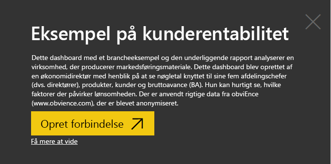
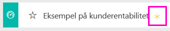
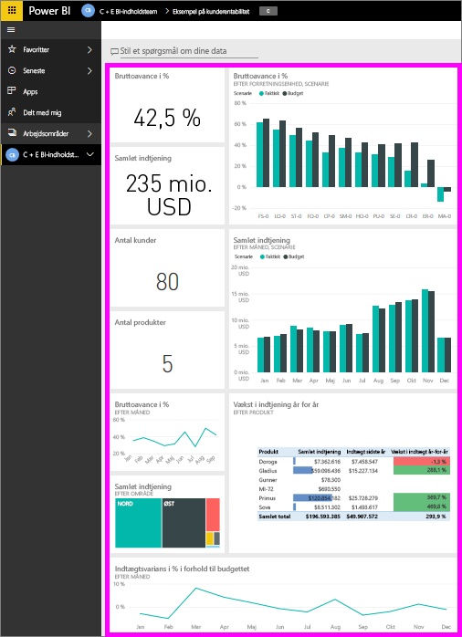
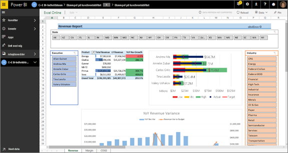
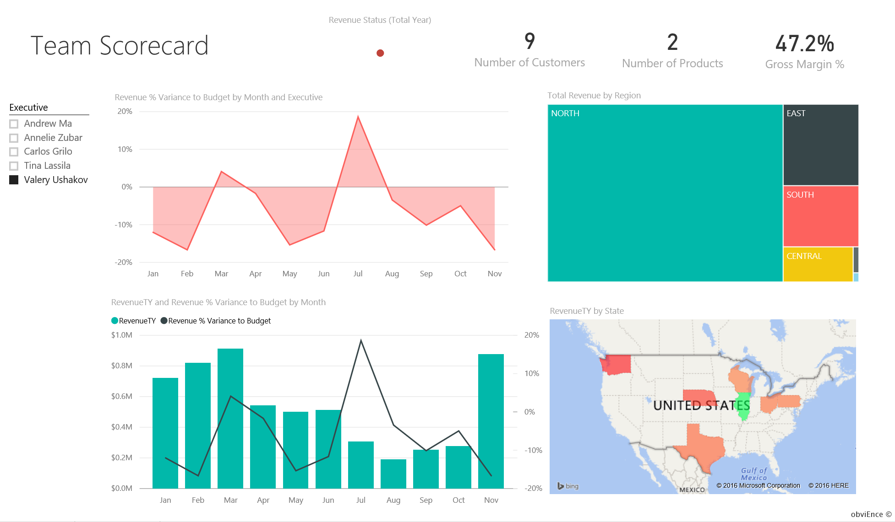
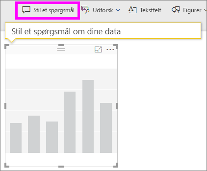
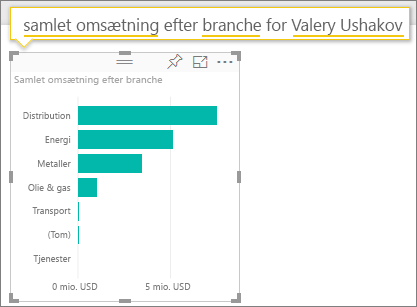
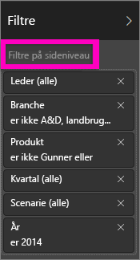
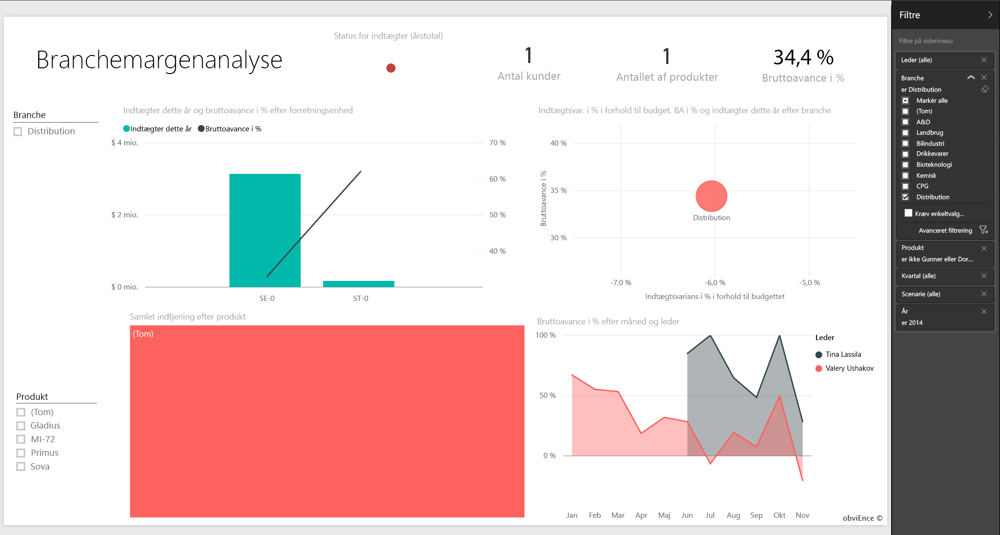
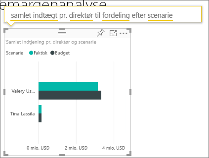

# Eksempel på kunderentabilitet til Power BI: Få en rundvisning

## Oversigt over eksemplet på kunderentabilitet
Indholdspakken "Eksempel på kunderentabilitet" indeholder et dashboard, en rapport og datasæt for en virksomhed, der producerer markedsføringsmateriale. Dette dashboard blev oprettet af en økonomidirektør med henblik på at se nøgletal knyttet til sine fem afdelingschefer (dvs. direktører), produkter, kunder og bruttoavance (BA). Hun kan hurtigt se, hvilke faktorer der påvirker lønsomheden.

<<<<<<< HEAD 

Dette eksempel er en del af en række, der illustrerer, hvordan du kan bruge Power BI med forretningsrelaterede data, rapporter og dashboards. Der er anvendt rigtige data fra obviEnce ([www.obvience.com](http://www.obvience.com/)), der er blevet anonymiseret. Dataene er tilgængelige i flere formater: indholdspakke/app, Excel-projektmappe eller .pbix Power BI Desktop-fil. Se [eksempeldatasæt](sample-datasets.md).

## Forudsætninger
Vil du følge med? I denne vejledning bruges Power BI-tjenesten og eksempelindholdspakken "Kunderentabilitet".   Da rapportoplevelserne ligner hinanden meget, kan du også følge med ved hjælp af Power BI Desktop og PBIX-eksempelfilen. Du finder instruktioner til oprettelse af forbindelse til indholdspakken og PBIX-filen nedenfor.

### Hent indholdspakken for dette eksempel

1. Åbn Power BI-tjenesten (app.powerbi.com), og log på.
2. Vælg **Hent data** i nederste venstre hjørne.
   
    
3. Vælg ikonet **Eksempler** på siden Hent data, der vises.
   
   
4. Vælg **Eksempel på kunderentabilitet**, og vælg derefter **Opret forbindelse**.  
   
   
5. Power BI importerer indholdspakken og føjer et nyt dashboard, en rapport og et datasæt til dit aktuelle arbejdsområde. Det nye indhold er markeret med en gul stjerne. Brug eksemplerne til give Power BI en testkørsel.  
   
   
  
### Hent .pbix-filen knyttet til dette eksempel

Du kan også hente eksemplet som en pbix-fil, som er beregnet til brug med Power BI Desktop. [Customer Profitability Sample](<http://download.microsoft.com/download/6/A/9/6A93FD6E-CBA5-40BD-B42E-4DCAE8CDD059/Customer>> Profitability Sample PBIX.pbix)

### Hent Excel-projektmappen for dette eksempel

Hvis du vil gå dybere ind i datakilden til dette eksempel, er det også tilgængeligt som en [(Excel-projektmappe)](http://go.microsoft.com/fwlink/?LinkId=529781). Projektmappen indeholder Power View-ark, som du kan få vist og redigere. Du kan se de rå data ved at vælge **Power Pivot > Administrer**.
=======

Dette eksempel er en del af en række, der illustrerer, hvordan du kan bruge Power BI med forretningsrelaterede data, rapporter og dashboards. Der er anvendt rigtige data fra obviEnce ([www.obvience.com](http://www.obvience.com/)), der er blevet anonymiseret. Dataene er tilgængelige i flere formater: indholdspakke/app, Excel-projektmappe eller .pbix Power BI Desktop-fil. Se [eksempeldatasæt](sample-datasets.md).

### Forudsætninger
Vil du følge med? I [Power BI-tjenesten](https://powerbi.com) skal du gå til **Hent data > Eksempler > Kunderentabilitet > Opret forbindelse** for at få din egen kopi af eksemplet.
>>>>>>> def2c8e086d65b6a3fb92247175730746226ae3e

## Hvad fortæller vores dashboard os?

Under **Mit arbejdsområde** skal du finde dashboardet for eksempel på Kunderentabilitet:

### Virksomhedsdækkende dashboardfelter
1. Åbn dashboardet i Power BI-tjenesten. Dashboardfelterne giver vores økonomidirektør et overblik over de vigtige virksomhedsdata.  Når hun ser noget interessant, kan hun vælge et felt for at grave ned i dataene.

2. Gennemse felterne i venstre side af dashboardet.

    

- Vores firmas bruttoavance er på 42,5 %.
- Vi har 80 kunder.
- Vi sælger fem forskellige produkter.
- Vi havde vores laveste indtægtsvarians i % i budgettet i februar efterfulgt af vores højeste i marts.
- De fleste af vores indtægter kommer fra de østlige og nordlige områder. Bruttoavancen overskrider aldrig budgettet, mens ER-0 og MA-0 skal granskes nærmere.
- Den samlede omsætning for året ligger tæt på budgettet.

### Chefspecifikke dashboardfelter
Ved hjælp af felterne i højre side af dashboardet får du et teamscorecard. Økonomidirektøren skal holde styr på sine chefer, og disse felter giver hende et godt overblik over fortjenesten – vha. BA%. Hvis BA%-tendensen er uventet for en given chef, så kan hun undersøge det nærmere.

- Alle direktører, med undtagelse af Carlos, har allerede overskredet deres salgsmål. Men Carlos' faktiske salg er det højeste. 
- Annelies BA% er den laveste, men vi kan se en konstant stigning siden marts.
- Men Valery har oplevet et væsentligt fald i sin BA%. 
- Og Andrew har haft et svingende år. 

## Udforsk dashboardets underliggende data
Dette dashboard indeholder felter, der linker til en rapport og til en Excel-projektmappe. 

### Åbn Excel Online-datakilden
To felter på dette dashboard "Mål vs. Faktisk" og "Indtægtsstigning år for år" er fastgjort fra en Excel-projektmappe. Når du vælger et af disse felter, åbnes datakilden i Power BI – i dette tilfælde Excel Online.

1. Vælg et af de felter, der er fastgjort fra Excel. Excel Online åbnes i Power BI-tjenesten.
2. Bemærk, at projektmappen har tre faner med data. Åben "Indtægt".
3. Lad os se, hvorfor Carlos endnu ikke har nået sit mål.  
    a. Vælg **Carlos Grilo** vha. skyderen "Direktør".   
    b. Den første pivottabel fortæller os, at Carlos' indtægter for det bedste produkt, Primus, er faldet med 152 % siden sidste år. Og YoY-diagrammet viser, at han i de fleste måneder er under budget.  

    

    

4. Fortsæt med at udforske, og hvis du finder noget interessant, skal du vælge **Pinkode**  i øverste højre hjørne for at [fastgøre det til et dashboard](service-dashboard-pin-tile-from-excel.md).

5. Brug pil tilbage i browseren for at vende tilbage til dashboardet. 

### Åbn den underliggende Power BI-rapport
De fleste af felterne på dashboardet med Eksempel på kunderentabilitet er fastjort fra den underliggende eksempelrapport Kunderentabilitet. 

1. Vælg et af disse felter for at åbne rappporten i Læsevisning. 

2. Rapporten indeholder tre sider. Hver fane nederst i rapporten repræsenterer en side. 

    

    * "Teamscorecard" fokuserer på de fem chefers præstation og deres "forretningsbøger."
    * "Branchemargenanalyse" beskriver en måde at analysere vores lønsomhed på sammenlignet med tilstanden i hele branchen.
    * "Chefscorecard" giver et overblik over hver af vores chefer formateret til at blive vist i Cortana.

### Siden Teamscorecard

Lad os se nærmere på to af teammedlemmerne, og på hvad det giver os af indsigter. Vælg Andrews navn i udsnitsværktøjet til venstre for at filtrere rapportsiden og kun få vist data om Andrew.

* Et hurtigt blik på KPI viser Andrews **Indtægtsstatus** – han er grøn. Han præsterer godt.
* Områdediagrammet "Indtægtsvariation i % for budget pr. måned" afspejler dette med undtagelse af et fald i februar. Andrew klarer sig generelt godt. Hans stærkeste område er øst, og han håndterer 49 kunder og fem (ud af syv) produkter. Hans BA% er hverken den højeste eller laveste.
* "Indtægter dette år and Indtægtsvariation % for budget pr. måned" viser, at tallene for udbyttet har ligget jævnt. Men hvis du filtrerer ved at klikke på firkanten for **Central** i områdetræstrukturen, så opdager du, at Andrew kun har indtægter i marts og kun i Indiana. Er dette bevidst eller noget, der skal undersøges nærmere?

Nu videre til Valery. Vælg Valerys navn i udsnitsværktøjet for at filtrere rapportsiden og kun få vist data om hende.  

* Bemærk det røde KPI for **Status for Indtægter dette år**. Dette skal helt sikkert undersøges nærmere.
* Hendes svingende indtægtstal tegner også et bekymrende billede – hun opfylder ikke sine indtægtsmargener.
* Valery har kun ni kunder, håndterer kun to produkter og arbejder næsten udelukkende med kunder i nord. Denne specialisering kan være forklaringen på de stærkt svingende tal.
* Hvis du vælger firkanten **Nord** i træstrukturen, så ses det, at Valerys bruttoavance i nord svarer til hendes generelle margen.
* Når du vælger de andre **Område**-firkanter, så ser man et interessant billede: Hendes BA% svinger fra 23 % til 79 %, og hendes indtægtstal i alle områder, undtagen i nord, er ekstremt sæsonafhængige.

Fortsæt med at grave for at finde ud af, hvorfor Valerys område ikke klarer sig godt. Kig på områder, de andre afdelinger og næste side i rapporten – "Branchemargenanalyse."

### Branchemargenanalyse
Denne rapportside indeholder et andet udsnit af dataene. Den ser på bruttoavancen for hele branchen, opdelt efter segment. Økonomidirektøren bruger denne side til at sammenligne virksomheds- og afdelingsdata som en hjælp til at forklare tendenser og lønsomhed. Du undrer dig måske over, hvorfor områdediagrammet "Bruttoavancemargen efter måned og chefnavn" er på denne side, siden den er teamspecifik. Den er placeret her, fordi vi så kan filtrere siden efter afdelingschef.  

Hvor meget varierer lønsomheden efter branche? Hvordan fordeler produkter og kunder sig efter branche? Vælg en eller flere brancher øverst til venstre. (Start fra CPG-branche) Vælg viskelæderikonet for at rydde filteret.

På boblediagrammet kigger økonomidirektøren efter de største bobler, fordi de har den største indvirkning på indtægten. Hvis du filtrerer siden efter cheferne ved at klikke på deres navne i områdediagrammet, så er det let at se hver chefs indvirkning efter branchesegment.

* Andrews indvirkning ses i mange forskellige branchesegmenter med meget varierende BA% (mest positiv) og Var%. 
* Annelies diagram er tilsvarende, bortset fra at hun kun koncentrerer sig om en håndfuld branchesegmenter med fokus på det delstatsmæssige segment og fokus på Gladius-produkt. 
* Carlos har klar fokus på segmentet for serviceydelser med et godt overskud. Han har markant forbedret varians % for højteknologisegmentet, og et nyt segment for ham, industri, præsterede rigtigt godt sammenlignet med budgettet. 
* Tina arbejder inden for en håndfuld segmenter og har den højeste BA%, men hendes bobler er generelt små, hvilket viser, at hendes indvirkning på virksomhedens bundlinje er minimal. 
* Valery, som kun har ansvaret for et enkelt produkt, arbejder i kun fem branchesegmenter. Hendes indvirkning er sæsonafhængig, men leverer altid en stor boble, hvilket viser, at hun har en stor indvirkning på virksomhedens bundlinje. Er branchen forklaringen på hendes negative præstation?

### Chefscorecard
Denne side er formateret som et svarkort for Cortana. Hvis du vil vide mere, kan du se [Opret svarkort for Cortana](service-cortana-answer-cards.md)

## Grav dybere ned i dataene ved at stille spørgsmål med spørgsmål og svar
Med hensyn til vores analyse kunne det være gavnligt at få fastlagt, hvilken branche der genererer den største indtjening for Valery. Lad os bruge spørgsmål og svar.

1. Åbn rapporten i Redigeringsvisning ved at vælge **Rediger rapport**. Redigeringsvisning er kun tilgængelig, hvis du "ejer" rapporten; dette er kaldes også **opretter**tilstand. Hvis rapporten i stedet er delt med dig, kan du ikke åbne den i Redigeringsvisning.

2.  På menulinjen øverst kan du vælge **Stil et spørgsmål** for at åbne dialogboksen Spørgsmål og svar.

    

3. Skriv **samlet omsætning efter branche for Valery**. Se, hvordan visualiseringen opdateres, mens du skriver spørgsmålet.
   
    
   
   Distribution er det største indtægtsområde for Valery.

### Grav dybere ned ved at tilføje filtre
Lad os se på branchen *Distribution*.  

1. Åbn rapportsiden "Branchemargenanalyse".
2. Uden at vælge en visualisering på rapportsiden skal du udvide filterruden til højre (hvis den ikke allerede er udvidet). Ruden Filtre bør kun vise filtre på Sideniveau.  
   
   
3. Find filteret for **Branche**, og vælg pilen for at udvide listen. Lad os tilføje et sidefilter for Distributionsbranchen. Først skal du rydde alle markeringer ved at rydde afkrydsningfeltet **Vælg alle**. Vælg derefter kun **Distribution.**  
   
   
4. Områdediagrammet "Bruttoavance efter måned og chefnavn" fortæller os, at kun Valery og Tina har kunder i denne branche, og at Valery kun arbejdede med denne branche fra juni til november.   
5. Vælg **Tina** og derefter **Valery** i områdediagramforklaringen "Bruttoavance efter måned og chef". Bemærk, at Tinas andel af "Samlet indtægt efter produkt" er meget lille i forhold til Valery. 
6. Hvis du vil se den faktiske indtægt, skal du bruge Spørgsmål og svar til at spørge om **samlet indtægt pr. direktør til distribution efter scenarie**.  
   
     

    Vi kan ligeledes granske andre brancher og endog føje kunder til vores visuals for at få indsigt i årsagerne til Valerys præstation.

Dette er et sikkert miljø at lege i. Du kan altid vælge ikke at gemme dine ændringer. Hvis du gemmer dem, kan du altid gå til **Hent data** for at få en ny kopi af dette eksempel.

Du kan også nøjes med at [downloade datasættet (Excel-projektmappe) til dette eksempel](http://go.microsoft.com/fwlink/?LinkId=529781).

## Næste trin: Opret forbindelse til dine data
Vi håber, at denne rundtur har vist, hvordan Power BI-dashboards, spørgsmål og svar og rapporter kan give indsigt i kundedata. Nu er det din tur – opret forbindelse til dine egne data. Med Power BI kan du oprette forbindelse til en lang række datakilder. Få mere at vide om, hvordan du [kommer i gang med Power BI](service-get-started.md).

[Tilbage til eksempler i Power BI](sample-datasets.md)  

