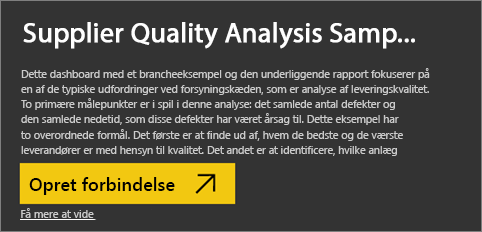
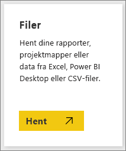
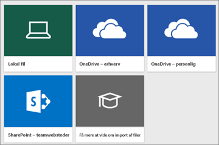
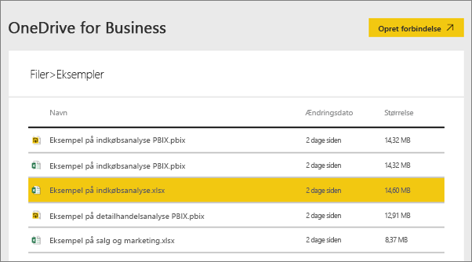
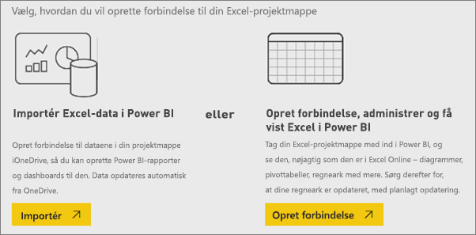
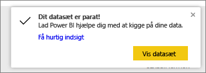
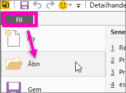

# Hvilke eksempeldata er tilgængelige til brug med Power BI?
Lad os antage, at du ikke kender Power BI og vil afprøve det, men ikke har nogen data.  Eller måske har du et datasæt. Da du ikke (endnu) forstår hvordan Power BI fungerer, er du bekymret for, at du en eller anden måde til at beskadige datasættet?

Bare rolig! obviEnce ([www.obvience.com](http://www.obvience.com/)) og Microsoft har oprettet eksempler, som du kan bruge, indtil du føler dig mere fortrolig med Power BI.  Dataene er anonymiseret og repræsenterer forskellige brancher: finans, HR, salg med mere. Desuden bruger vores onlinedokumentation disse samme eksempler i selvstudier og eksempler, så du vil kunne følge med.      

   

Hvert af disse eksempler findes i flere formater: som en indholdspakke, som en enkelt Excel-projektmappe og som en .pbix-fil. Hvis du ikke ved, hvad disse ting er, eller hvordan du får fat i dem – så bare rolig. Vi forklarer det alt sammen senere i denne artikel. Og til hvert eksempel har vi oprettet en *rundvisning*. Rundvisning er artikler, der fortæller historien bag eksemplet og fører dig gennem forskellige scenarier. Et scenarie kan være at besvare spørgsmål for din leder, et andet at søge efter konkurrencemæssig indsigt eller oprette rapporter og dashboards til deling eller at forklare et forretningsskift.   

Her er de juridiske retningslinjer for brug af eksemplerne, før vi går i gang. Derefter vil vi introducere eksemplerne og viser, hvordan du bruger dem.   

## Retningslinjer for brug af eksempler på Excel-projektmapper i Power BI

©2015 Microsoft Corporation. Alle rettigheder forbeholdes. Dokumenterne og projektmapperne er leveret "som de er og forefindes". Oplysninger og visninger i projektmapperne, herunder URL-adresser og andre referencer til websteder, kan ændres uden varsel. Du påtager dig risikoen ved at bruge dem. Nogle eksempler er kun til illustration og er fiktive. Ingen virkelig forbindelse er tilsigtet eller kan udledes. Microsoft giver ingen garantier, udtrykkeligt eller underforstået, hvad angår de oplysninger, der er angivet her.

Projektmapperne giver dig ikke nogen juridiske immaterielle rettigheder til noget Microsoft-produkt. Du kan kopiere og bruge denne projektmappe til dine interne referenceformål.

Projektmapperne og de relaterede data leveres af obviEnce. [www.obvience.com](http://www.obvience.com)

ObviEnce er en uafhængig softwareleverandør og en inkubator af immaterielle rettigheder med fokus på Microsoft Business Intelligence. ObviEnce arbejder tæt sammen med Microsoft om at udvikle bedste praksis og thought leadership til at kickstarte og udrulle Microsoft Business Intelligence-løsninger.

Projektmapperne og dataene tilhører obviEnce, LLC, og er blevet delt udelukkende med det formål at demonstrere funktioner i Power BI med eksempeldata fra brancher.

Enhver anvendelse af projektmapperne og/eller dataene skal indeholde ovenstående juridiske meddelelse (dvs. også på inforegnearket med hver projektmappe). Projektmappen og visualiseringer skal være ledsaget af følgende copyrightmeddelelse: obviEnce ©.

Ved at klikke på nogen af nedenstående links til download af Excel-projektmappefiler eller .pbix-filer accepterer du ovenstående vilkår.

## Tilgængelige eksempler
Der er otte eksempler, du kan bruge.  Hvert enkelt repræsenterer en anden branche.

### Eksempel på kunderentabilitet  
[Få en introduktion til eksemplet på kunderentabilitet](sample-customer-profitability.md)

Dette brancheeksempel analyserer en Finansdirektørs målepunkter for virksomhedens direktører, produkter og kunder. Du kan undersøge, hvilke faktorer der påvirker virksomhedens rentabilitet.

### Eksempel på HR  
[Få en introduktion til HR-eksemplet](sample-human-resources.md)

Dette brancheeksempel fokuserer på ansættelsesstrategien for en virksomhed ved at analysere nyansættelser, aktive medarbejdere og medarbejdere, der har tilbage.  Ved at undersøge dataene kan du finde tendenser i frivillige separationer og antagelser i ansættelsesstrategien.

### Eksempel på analyse af it-forbrug 
[Få en introduktion til eksemplet på analyse af it-forbrug](sample-it-spend.md)

I dette brancheeksempel analyserer vi de planlagte over for de faktiske omkostninger for IT-afdelingen i en virksomhed. Sammenligningen hjælper os med at forstå, om virksomheden har lagt en god plan for året, og giver os mulighed for at undersøge de områder, som afviger væsentligt fra planen. Virksomheden i eksemplet gennemgår en årlig planlægningscyklus og genererer et nyt 'Seneste estimat' (Latest Estimate, LE) hvert kvartal for at gøre det nemmere at analysere ændringer i it-forbruget i løbet af regnskabsåret.

### Eksempel på analyse af salgsmuligheder  
[Få en introduktion til eksemplet på analyse af salgsmuligheder](sample-opportunity-analysis.md)

Dette brancheeksempel undersøger en softwarevirksomheds salgskanal. Salgschefer overvåger deres direkte og partneres salgskanaler ved at spore muligheder og indtægter efter område, handlens omfang samt kanal.

### Eksempel på indkøbsanalyse  
[Få en introduktion til eksemplet på indkøbsanalyse](sample-procurement.md)

Dette brancheeksempel analyserer en Finansdirektørs målepunkter for virksomhedens direktører, produkter og kunder. Du kan undersøge, hvilke faktorer der påvirker virksomhedens rentabilitet.

### Eksempel på analyse af detailhandel  
[Få en introduktion til eksemplet på detailanalyse](sample-retail-analysis.md)

Dette brancheeksempel analyserer data om detailsalg for varer, der er solgt på tværs af flere butikker og distrikter. De metriske værdier sammenligner dette års resultat med sidste års på følgende områder: salg, enheder, bruttoavance og varians samt analyse af nye butikker.

### Eksempel på salg og marketing  
[Få en introduktion til eksemplet på salg og marketing](sample-sales-and-marketing.md)

Dette brancheeksempel tager udgangspunkt i produktionsvirksomheden VanArsdel Ltd. Det giver marketingchefen mulighed for at se branchen og markedsandelen for VanArsdel.  Ved at udforske eksemplet kan du finde virksomhedens markedsandel, produktvolumen, salg og synspunkt.

### Eksempel på leverandørkvalitet  
[Få en introduktion til eksemplet på leverandørkvalitet](sample-supplier-quality.md)

Dette brancheeksempel fokuserer på en af de typiske udfordringer ved forsyningskæden – analyse af leverandørkvalitet. To primære målepunkter er i spil i denne analyse: Det samlede antal defekter og den samlede nedetid, som disse defekter har været årsag til. Dette eksempel har to overordnede formål: At forstå, hvem de bedste og de værste leverandører er med hensyn til kvalitet, og identificere, hvilke fabrikker der er bedst til at finde og afvise defekter og dermed reducere nedetiden.

Nu ved du, hvad der er tilgængeligt. Nu er det tid til at lære, hvordan du kan få fat i disse eksempler.  

## Sådan får du fat i eksemplerne
Som du kunne læse ovenfor, findes eksemplerne i flere formater: indholdspakker, Excel-projektmapper og .pbix-filer. Vi vil nu beskrive, hvordan du bruger hver af disse formater, starter med indholdspakker.

## Power BI-eksemplerne som indholdspakker
Indholdspakker er det eneste eksempelformat, der er tilgængeligt fra Power BI. Du behøver ikke at forlade Power BI for at finde dem. En indholdspakke er stort set et bundt af et eller flere dashboards, datasæt og rapporter, som en person opretter, og som kan bruges med Power BI-tjenesten. Personer opretter indholdspakker for at dele dem med kollegaer. Hver af indholdspakkerne til Power BI-eksempler indeholder et datasæt, en rapport og et dashboard.  Indholdspakker er ikke tilgængelige for Power BI Desktop. Hvis du vil vide mere om indholdspakker, skal du læse [Introduktion til indholdspakker i Power BI](service-organizational-content-pack-introduction.md).

### Hent og åbn en eksempelindholdspakke i Power BI-tjenesten
1. Åbn Power BI-tjenesten (app.powerbi.com), og log på.
2. I nederste venstre hjørne, skal du vælge **Hent data**.

    
3. Vælg ikonet **Eksempler** på siden Hent data, der vises.

   
4. Vælg et af eksemplerne for at åbne en beskrivelse af det pågældende eksempel. Vælg derefter **Opret forbindelse**.  

   
5. Power BI importerer indholdspakken og føjer et nyt dashboard, en rapport og et datasæt til dit aktuelle arbejdsområde. Det nye indhold er markeret med en gul stjerne. Brug eksemplerne til give Power BI en testkørsel.  

   

Nu hvor du har data, er du i gang.  Afprøv nogle af vores selvstudier ved hjælp af eksempelindholdspakkerne eller ved blot at åbne Power BI-tjenesten og udforske det.

## Power BI-eksemplerne som Excel-filer
Alle eksempelindholdspakkerne er også tilgængelige som en Excel-projektmappe. Excel-projektmapperne er udviklet til brug med Power BI-tjenesten.  

1. Download filerne hver for sig ved hjælp af linkene nedenfor, eller [download en zip-fil med alle eksempelfilerne](http://go.microsoft.com/fwlink/?LinkId=535020). Hvis du er mere erfaren bruger, kan du vælge at downloade Excel-projektmapperne for udforske eller redigere datamodellerne.

   * [Retail Analysis Sample](http://go.microsoft.com/fwlink/?LinkId=529778)
   * [Supplier Quality Analysis Sample](http://go.microsoft.com/fwlink/?LinkId=529779)
   * [Human Resources Sample](http://go.microsoft.com/fwlink/?LinkId=529780)
   * [Customer Profitability Sample](http://go.microsoft.com/fwlink/?LinkId=529781)
   * [Opportunity Tracking Sample](http://go.microsoft.com/fwlink/?LinkId=529782)
   * [IT Spend Analysis Sample](http://go.microsoft.com/fwlink/?LinkId=529783)
   * [Procurement Analysis Sample](http://go.microsoft.com/fwlink/?LinkId=529784)
   * [Sales and Marketing Sample](http://go.microsoft.com/fwlink/?LinkId=529785)
2. Gem den downloadede fil. Det gør en forskel, hvor du gemmer filen.

   *   **Lokal** – Hvis du gemmer din fil på et lokalt drev på computeren eller en anden placering i organisationen, kan du fra Power BI importere filen i Power BI. Filen forbliver på den lokale harddisk, så hele filen ikke er importeret til Power BI. Hvad sker der er et nyt datasæt oprettes i din Power BI-websted og dine data, og i nogle tilfælde datamodellen, indlæses i datasættet. Hvis din fil indeholder rapporter, vises disse rapporter i Power BI-webstedet under rapporter.
   *  **OneDrive – erhverv** – Hvis du har OneDrive for Business, og du logger på med den samme konto, du logger på Power BI med OneDrive for Business er langt det bedste sted at holde dit arbejde i Excel Power BI, eller en. CSV-fil synkroniseret med dit datasæt, rapporter og dashboards i Power BI. Da både Power BI og OneDrive findes i clouden, opretter Power BI forbindelse til din fil på OneDrive ca. hver time. Hvis der findes ændringer, opdateres datasættet, rapporter og dashboards automatisk i Power BI.
   *  **OneDrive – personlig** – Hvis du gemmer dine filer på din egen OneDrive-konto, får du mange af de samme fordele som med OneDrive for Busines. Den største forskel er, at når du første gang opretter forbindelse til din fil (med funktionen Hent data > Filer > OneDrive - personlig), skal du logge på OneDrive med din Microsoft-konto, hvilket normalt er anderledes, end hvad du bruger til at logge på Power BI. Når du logger på med OneDrive med din Microsoft-konto, skal du sørge for at vælge indstillingen Forbliv logget på. På denne måde kan Power BI oprette forbindelse til din fil ca. hver time og sikre, at dit datasæt i Power BI er synkroniseret.
   *  **SharePoint – teamwebsteder**    Lagring af Power BI-filer på SharePoint – teamwebsteder er stort set det samme som at gemme på OneDrive for Business. Den største forskel er, hvordan du opretter forbindelse til filen fra Power BI. Du kan angive en URL-adresse, eller du kan oprette forbindelse til rodmappen.
1. Åbn Power BI-tjenesten (app.powerbi.com), og log på.

   > [!TIP]
   > Du kan på nuværende tidspunkt have behov for oprette et nyt dashboard og navngive det efter den fil, du planlægger at importere.  Når du importerer Excel-datasættet, vil Power BI ellers ikke kunne oprette et nyt dashboard, der er navngivet efter eksemplet, men vil i stedet føje et felt til det dashboard, der i øjeblikket er åbent. Hvis du vælger dette felt, føres du til datasættets rapport. Det gør ikke den store forskel, da du altid kan oprette et nyt dashboard senere, men du sparer et trin eller to ved at starte med et nyt dashboard.
   >
   >
4. I nederste venstre hjørne, skal du vælge **Hent data**.

    
5. Vælg **Filer > Hent** på siden Hent data, der vises.

     
6. Gå til den placering, hvor du har downloadet og gemt eksemplet.

   
7. Vælg fil, i dette tilfælde **Procurement Analysis Sample.xlsx**, som blev gemt på OneDrive for Business, og vælg **Connect**.

   
8. Vælg, om du vil importere dataene eller overføre projektmappen til Power BI, og se dem præcist som i Excel online.

    
9. Hvis du vælger **Importér**, importerer Power BI eksempelprojektmappen og tilføjer den som et nyt datasæt med navnet **Procurement Analysis Sample**.  Hvis projektmappen indeholder Power View-ark, -tabeller eller -områder eller en datamodel, opretter Power BI også en rapport (med det samme navn). Og hvis du ikke allerede har et dashboard åbent, opretter Power BI et nyt dashboard. (Hvis du havde et dashboard åbent, da du klikkede på **Hent data**, får du vist et nyt tomt felt i dette dashboard.  Når du klikker på dette felt, føres du til rapporten for det datasæt, du lige har tilføjet). Det nye indhold er navngivet efter eksemplet og markeret med en gul stjerne.
10. Når skærmbilledet **Dit datasæt er parat!** skærm vises, skal du vælge **Vis datasæt** eller **hurtig indsigt** eller bruge den venstre navigationslinje i Power BI til at finde og åbne den tilknyttede rapport eller dashboard.  

     

### (Valgfrit) Se på Excel-eksemplerne inde fra Excel
Ønsker du at forstå, hvordan data i en Excel-projektmappe bliver konverteret til Power BI-datasæt og -rapporter? Nogle af svarene ligger i åbning af Excel-eksempler ***i Excel*** og udforskning af regnearkene.

* Når du først åbner en eksempelprojektmappe i Excel, kan du få vist to advarsler. Den første advarsel siger, at projektmappen er i beskyttet visning. Vælg **Aktivér redigering**. Den anden advarsel siger muligvis, at projektmappen har forbindelser til eksterne datakilder. Vælg **Aktivér indhold**.
* Hver projektmappe indeholder flere Power View-ark. Hvis du vil se Power View-arkene i Excel, skal du [Aktivér tilføjelsesprogrammet Power View](https://support.office.com/article/flash-silverlight-and-shockwave-controls-blocked-in-microsoft-office-55738f12-a01d-420e-a533-7cef1ff6aeb1) ved at downloade en pakke af nøgler i registreringsdatabasen.
* Så hvor er de faktiske data? De er i Power Pivot-datamodellen. Du behøver ikke at se dataene, Power View-arkene. På den **PowerPivot** under fanen **Administrer**.

    Ikke kan se den **Power Pivot** fanen? [Aktivér tilføjelsesprogrammet Power Pivot](https://support.office.com/article/Start-Power-Pivot-in-Microsoft-Excel-2013-add-in-A891A66D-36E3-43FC-81E8-FC4798F39EA8).

    I Power Pivot, kan du se dataene i alle de underliggende tabeller samt alle DAX-formlerne. 

* Fanen Info indeholder oplysninger om obviEnce, firmaet, der oprettede eksemplet.

## Power BI-eksemplerne som .pbix-filer
Alle eksempelindholdspakkerne er også tilgængelige som en Power BI .pbix-fil. .pbix-filerne er udviklet til brug med Power BI Desktop.  

1. Download filerne enkeltvist ved hjælp af linkene nedenfor. Når disse links markeres, gemmes filen automatisk i mappen Overførsler. 

   * [Eksempel på detailhandelsanalyse PBIX](http://download.microsoft.com/download/9/6/D/96DDC2FF-2568-491D-AAFA-AFDD6F763AE3/Retail%20Analysis%20Sample%20PBIX.pbix)
   * [Eksempel-PBIX på analyse af leverandørkvalitet](http://download.microsoft.com/download/8/C/6/8C661638-C102-4C04-992E-9EA56A5D319B/Supplier-Quality-Analysis-Sample-PBIX.pbix)
   <!-- Previous link doesn't work -->
   * [HR-eksempel PBIX](http://download.microsoft.com/download/6/9/5/69503155-05A5-483E-829A-F7B5F3DD5D27/Human%20Resources%20Sample%20PBIX.pbix)
   * [Eksempel på kunderentabilitet PBIX](http://download.microsoft.com/download/6/A/9/6A93FD6E-CBA5-40BD-B42E-4DCAE8CDD059/Customer%20Profitability%20Sample%20PBIX.pbix)
   * [Eksempel på sporing af mulighed PBIX](http://download.microsoft.com/download/9/1/5/915ABCFA-7125-4D85-A7BD-05645BD95BD8/Opportunity%20Analysis%20Sample%20PBIX.pbix)
   * [Eksempel på analyse af it-forbrug PBIX](http://download.microsoft.com/download/E/9/8/E98CEB6D-CEBB-41CF-BA2B-1A1D61B27D87/IT%20Spend%20Analysis%20Sample%20PBIX.pbix)
   * [Eksempel på indkøbsanalyse PBIX](http://download.microsoft.com/download/D/5/3/D5390069-F723-413B-8D27-5888500516EB/Procurement%20Analysis%20Sample%20PBIX.pbix)
   * [Eksempel på salg og marketing PBIX](http://download.microsoft.com/download/9/7/6/9767913A-29DB-40CF-8944-9AC2BC940C53/Sales%20and%20Marketing%20Sample%20PBIX.pbix)

1. Vælg **Filer > Åbn** i Power BI Desktop, og naviger til det sted, hvor du har gemt .pbix-eksemplet.

   
4. Vælg .pbix-filen for at åbne den i Power BI Desktop.

## Næste trin
[Grundlæggende begreber i Power BI](consumer/end-user-basic-concepts.md)

[Selvstudium: Opret forbindelse til Power BI-eksemplerne](sample-tutorial-connect-to-the-samples.md)

[Datakilder til Power BI](service-get-data.md)

Har du flere spørgsmål? [Prøv at spørge Power BI-community'et](http://community.powerbi.com/)
