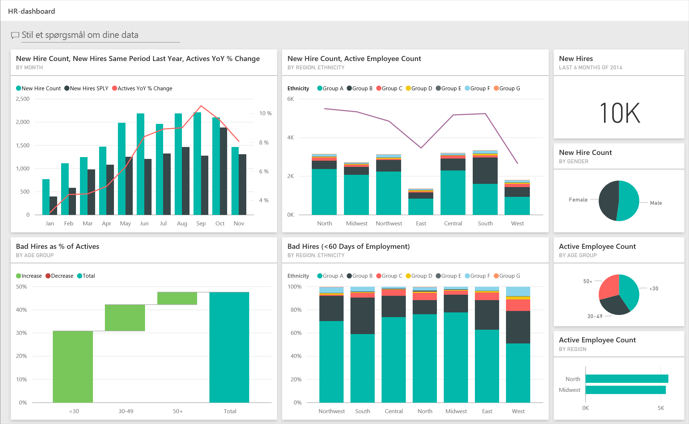
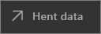
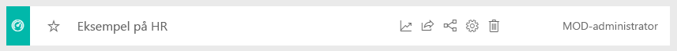
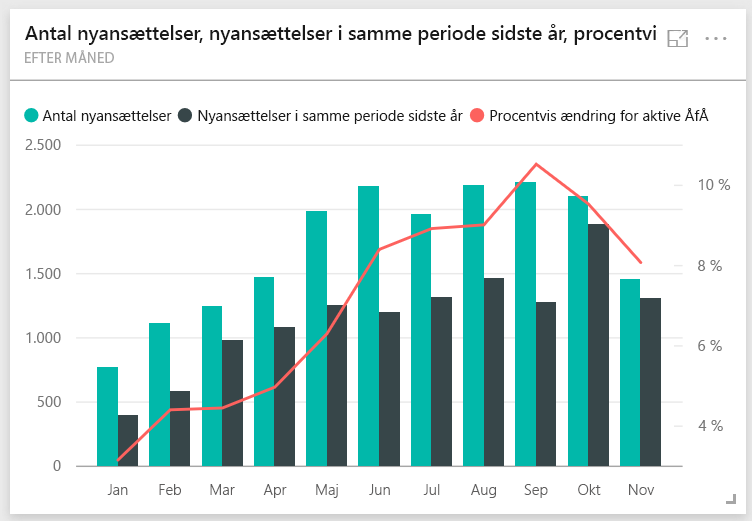
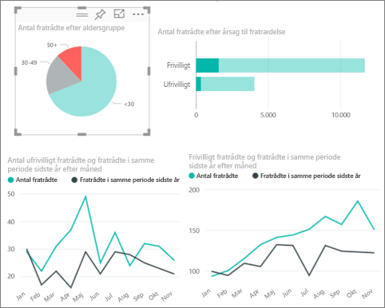
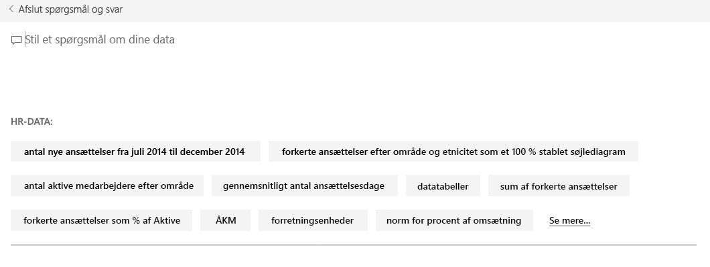
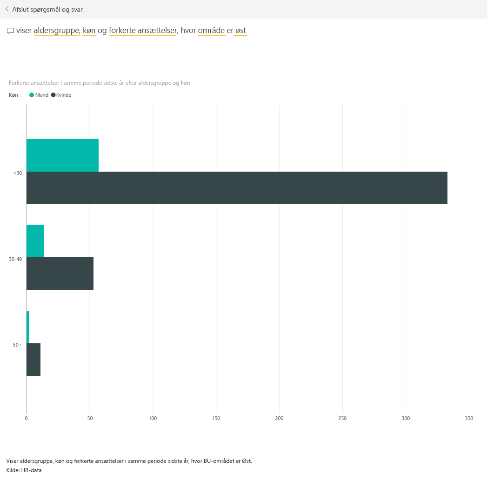

# Eksempel på HR til Power BI: Få en introduktion

Indholdspakken HR-eksempel indeholder et dashboard, en rapport og et datasæt til HR-afdelingen. I dette eksempel anvender HR-afdelingen samme rapporteringsmodel i forskellige virksomheder, også selvom de tilhører forskellige brancher og har forskellige størrelser. I dette eksempel kigger vi på nyansættelser, aktive medarbejdere og medarbejdere, der har forladt virksomheden. Formålet er at afdække tendenser i ansættelsesstrategien. Vores overordnede formål er at forstå:

* Hvem vi ansætter
* Fordomme i vores ansættelsesstrategi
* Tendenser i forbindelse med frivillige fratrædelser

Dette eksempel er en del af en serie, der viser, hvordan du kan bruge Power BI med forretningsrelaterede data, rapporter og dashboards. Det blev oprettet af [obviEnce](http://www.obvience.com/) med rigtige data, som er blevet anonymiseret. Dataene er tilgængelige i flere formater: indholdspakke, .pbix-fil til Power BI Desktop eller Excel-projektmappe. Se [Eksempler til Power BI](sample-datasets.md). 

I dette selvstudium udforskes indholdspakken med eksemplet på personaleforhold i Power BI-tjenesten. Da rapportoplevelsen i Power BI Desktop og i tjenesten minder meget om hinanden, kan du også følge med ved at bruge .pbix-eksempelfilen i Power BI Desktop. 

Du behøver ikke en Power BI-licens for at udforske eksemplerne i Power BI Desktop. Hvis du ikke har en Power BI Pro-licens, kan du gemme eksemplet i Mit arbejdsområde i Power BI-tjenesten. 

## Hent eksemplet

Før du kan bruge eksemplet, skal du først downloade det som en [indholdspakke](#get-the-content-pack-for-this-sample), [.pbix-fil](#get-the-pbix-file-for-this-sample) eller [Excel-projektmappe](#get-the-excel-workbook-for-this-sample).

### Hent indholdspakken for dette eksempel

1. Åbn Power BI-tjenesten (app.powerbi.com), log på, og åbn det arbejdsområde, hvor du vil gemme eksemplet.

   Hvis du ikke har en Power BI Pro-licens, kan du gemme eksemplet i Mit arbejdsområde.

2. Vælg **Hent data** i nederste venstre hjørne.
   
   
3. På siden **Hent data**, der vises, skal du vælge **Eksempler**.
   
4. Vælg **HR-eksempel**, og vælg derefter **Opret forbindelse**.  
   
   

5. Power BI importerer indholdspakken og føjer derefter et nyt dashboard, en ny rapport og et nyt datasæt til dit aktuelle arbejdsområde.
   
   
  
### Hent .pbix-filen knyttet til dette eksempel

Du kan også hente HR-eksemplet som en [.pbix-fil](https://download.microsoft.com/download/6/9/5/69503155-05A5-483E-829A-F7B5F3DD5D27/Human%20Resources%20Sample%20PBIX.pbix), som er beregnet til brug med Power BI Desktop.

### Hent Excel-projektmappen for dette eksempel

Hvis du vil have vist datakilden for dette eksempel, er den også tilgængelig som en [Excel-projektmappe](https://go.microsoft.com/fwlink/?LinkId=529780). Projektmappen indeholder Power View-ark, som du kan få vist og redigere. Hvis du vil se rådataene, skal du aktivere tilføjelsesprogrammerne Dataanalyse og derefter vælge **Power Pivot > Administrer**. Hvis du vil aktivere tilføjelsesprogrammerne Power View og Power Pivot, kan du finde flere oplysninger under [Udforsk Excel-eksemplerne i Excel](sample-datasets.md#explore-excel-samples-inside-excel).

## Nyansættelser
Lad os undersøge nyansættelser først.

1. I dit arbejdsområde skal du vælge fanen **Dashboards** og åbne dashboardet **HR-eksempel**.
2. På dashboard'et skal du vælge feltet **Antal nyansættelser, nyansættelser i samme periode sidste år, aktive ÅfÅ % Ændring Efter måned**.  

     

   HR-eksempelrapporten åbnes på siden **Nyansættelser**.  

   

3. Se disse interessante emner:

    * Kombinationsdiagrammet **Antal nyansættelser, nyansættelser i samme periode sidste år og aktive ÅfÅ % Ændring efter måned** viser, at vi har ansat flere personer hver måned i år sammenlignet med sidste år. Væsentligt flere personer i nogle af månederne.
    * I kombinationsdiagrammet **Antal nyansættelser og antal aktive medarbejdere efter område og etnicitet**, bemærk, at vi ansætter færre personer i området **Øst**.
    * Vandfaldsdiagrammet **Nyansættelser ÅfÅ var efter aldersgruppe** viser, at vi hovedsageligt ansætter yngre personer. Denne tendens kan skyldes, at jobbene hovedsageligt er deltidsjob.
    * Cirkeldiagrammet **Antal nyansættelser efter køn** viser en nogenlunde ligelig fordeling.

    Kan du få større indsigt? Der kan f.eks. være et område, hvor kønsfordelingen ikke er lige. 

4. Vælg forskellige aldersgrupper og forskelligt køn i diagrammerne for at undersøge relationerne mellem alder, køn, område og etnicitet.

5. Vælg **Human Resource Sample** i den øverste navigationsrude for at vende tilbage til dashboardet.

   

## Sammenlign aktuelt aktive og tidligere medarbejdere
Lad os undersøge data for aktuelt aktive medarbejdere og medarbejdere, der ikke længere arbejder for virksomheden.

1. På dashboard'et vælger du feltet **Antal aktive medarbejdere efter aldersgruppe**.

   

   HR-eksempelrapporten åbnes på siden **Aktive medarbejdere vs. fratrådte**.  

   

 2. Se disse interessante emner:

    * De to kombinationsdiagrammer til venstre viser ændringerne år for år for aktive medarbejdere og fratrådte medarbejdere. Vi har flere aktive medarbejdere i år på grund af hurtige ansættelser, men også flere fratrådte end sidste år.
    * I august havde vi flere fratrådte sammenlignet med andre måneder. Vælg forskellige aldersgrupper, køn eller områder for at se, om du kan finde afvigelser.
    * Når vi ser på cirkeldiagrammerne, bemærker vi, at fordelingen på vores aktive medarbejdere fordelt på køn og aldersgrupper er nogenlunde lige. Vælg forskellige aldersgrupper for at se, hvordan fordelingen på køn varierer med alderen. Har vi en ligelig fordeling på køn på baggrund af aldersgruppe?

## Årsager til fratrædelse
Lad os se på rapporten i Redigeringsvisning. Du kan ændre cirkeldiagrammerne, så de viser data om fratrådte medarbejdere i stedet for data om aktive medarbejdere.

1. Vælg **Rediger rapport** i øverste venstre hjørne.

2. Vælg cirkeldiagrammet **Antal aktive medarbejdere efter aldersgruppe**.

3. I **Felter** skal du vælge **Medarbejdere** for at udvide tabellen **Medarbejdere**. Fjern markeringen i **Antal aktive medarbejdere** for at fjerne feltet.

4. Markér **Antal fratrådte** i tabellen **Medarbejdere** for at føje det til feltet **Værdier** i området **Felter**.

5. På rapportlærredet skal du vælge bjælken **Frivilligt** i det liggende søjlediagram **Antal fratrådte efter fratrædelsesårsag**. 

   Denne bjælke fremhæver de medarbejdere, der er fratrådt frivilligt, i de andre visualiseringer i rapporten.

6. Klik på udsnittet 50+ i cirkeldiagrammet **Antal fratrådte efter aldersgruppe**.

7. Se kurvediagrammet i nederste højre hjørne. Dette diagram er filtreret, så du får vist frivilligt fratrådte.  

   

   Læg mærke til tendensen i aldersgruppen 50+. I den sidste del af året fratrådte flere medarbejdere over 50 år frivilligt. Denne tendens er et område, som bør undersøges yderligere med flere data.

8. Du kan også følge de samme trin for cirkeldiagrammet **Antal aktive medarbejdere efter køn** og ændre det til fratrådte i stedet for aktive medarbejdere. Kig på data for frivillig fratrædelse fordelt på køn for at se, om du kan finde andre ting af interesse.

9. Vælg **Human Resource Sample** i den øverste navigationsrude for at vende tilbage til dashboardet. Du kan vælge at gemme de ændringer, du har foretaget i rapporten.

## Forkerte ansættelser
Det sidste undersøgelsesområde er forkerte ansættelser. Forkerte ansættelser er defineret som medarbejdere, der ikke blev over 60 dage i virksomheden. Vi ansætter mange, men ansætter vi velegnede kandidater?

1. Vælg dashboardfeltet **Forkerte ansættelser som % af aktive efter aldersgruppe**. Rapporten åbnes under fane tre, **Forkerte ansættelser**.

     
2. Markér afkrydsningsfeltet **Nordvest** i udsnittet **Område** til venstre, og vælg **Mand** i kransediagrammet **Forkerte ansættelser efter køn**. Kig på de andre diagrammer på siden **Forkerte ansættelser**. Bemærk, at der er flere forkerte ansættelser med mænd end med kvinder og mange forkerte Gruppe A-ansættelser.

     

3. Hvis du kigger på kransediagrammet **Antal forkerte ansættelser efter køn** og vælger forskellige områder i udsnittet **Område**, kan du se, at det østlige område er det eneste område med flere forkerte ansættelser med kvinder end med mand.  

4. Vælg navnet på dashboard'et i den øverste navigationsrude for at vende tilbage til dashboard'et.

## Stil et spørgsmål i dashboardets felt til spørgsmål og svar
I [feltet til spørgsmål og svar](power-bi-tutorial-q-and-a.md) i dashboardet kan du stille et spørgsmål om dine data på et naturligt sprog. Spørgsmål og svar kan genkende de ord, du skriver, og kan regne ud, hvor i dit datasæt svaret findes.

1. Klik på feltet til spørgsmål i Spørgsmål og svar. Bemærk, at selv inden du begynder at skrive, viser spørgsmål og svar forslag, der kan hjælpe dig med at udforme dit spørgsmål.

   

2. Du kan vælge et af disse forslag eller skrive: *Vis aldersgruppe, køn og forkerte ansættelser i samme periode sidste år, hvor området er Øst*.  

   

   Bemærk, at de fleste af de forkerte ansættelser af kvinder er under 30.

## Næste trin: Opret forbindelse til dine data
Det er sikkert at eksperimentere i dette miljø, fordi du kan vælge ikke at gemme dine ændringer. Hvis du gemmer dem, kan du altid vælge **Hent data** for at få en ny kopi af dette eksempel.

Vi håber, at denne rundtur har vist, hvordan Power BI-dashboards, spørgsmål og svar samt rapporter kan give indsigt i eksempeldata. Nu er det din tur: Opret forbindelse til dine egne data. Med Power BI kan du oprette forbindelse til en lang række datakilder. Få mere at vide ved at se [Introduktion til Power BI-tjenesten](service-get-started.md).
