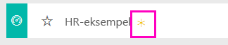

# Eksempel på HR til Power BI: Få en introduktion

## Oversigt over eksempel på HR
HR-afdelingen anvender samme rapporteringsmodel i forskellige virksomheder, også selvom de tilhører forskellige brancher og har forskellige størrelser. Dette eksempel kigger på nyansættelser, aktive medarbejdere og medarbejdere, der er ophørt med at arbejde, med det formål at forsøge at afdække tendenser i ansættelsesstrategien. Vores overordnede formål er at forstå:

* Hvem vi ansætter
* Fordomme i vores ansættelsesstrategi
* Tendenser i forbindelse med frivillige fratrædelser

Dette eksempel er et i en række, som illustrerer, hvordan du kan bruge Power BI i forbindelse med forretningsrelaterede data, rapporter og dashboards. Der er anvendt rigtige data fra obviEnce ([www.obvience.com)](http://www.obvience.com/), som er blevet anonymiseret. Dataene er tilgængelige i flere formater: indholdspakke/app, Excel-projektmappe eller .pbix Power BI Desktop-fil. Du kan få mere at vide under [eksempeldatasæt](sample-datasets.md).

## Forudsætninger

 Før du kan bruge eksemplet, skal du først downloade det som en [indholdspakke](https://docs.microsoft.com/power-bi/sample-human-resources#get-the-content-pack-for-this-sample), [pbix-fil](http://download.microsoft.com/download/6/9/5/69503155-05A5-483E-829A-F7B5F3DD5D27/Human%20Resources%20Sample%20PBIX.pbix) eller [Excel-projektmappe](http://go.microsoft.com/fwlink/?LinkId=529780).

### Hent indholdspakken for dette eksempel

1. Åbn Power BI-tjenesten (app.powerbi.com), og log på.
2. Vælg **Hent data** i nederste venstre hjørne.
   
    
3. Vælg ikonet **Eksempler** på siden Hent data, der vises.
   
   
4. Vælg **Eksempel på HR**, og vælg **Opret forbindelse**.  
   
   
5. Power BI importerer indholdspakken og føjer et nyt dashboard, en rapport og et datasæt til dit aktuelle arbejdsområde. Det nye indhold er markeret med en gul stjerne. 
   
   
  
### Hent .pbix-filen knyttet til dette eksempel

Du kan også hente eksemplet som en pbix-fil, som er beregnet til brug med Power BI Desktop. 

 * [HR-eksempel PBIX](http://download.microsoft.com/download/6/9/5/69503155-05A5-483E-829A-F7B5F3DD5D27/Human%20Resources%20Sample%20PBIX.pbix)

### Hent Excel-projektmappen for dette eksempel
Du kan også [kun downloade datasættet (Excel-projektmappe)](http://go.microsoft.com/fwlink/?LinkId=529780) for dette eksempel. Projektmappen indeholder Power View-ark, som du kan få vist og redigere. Du kan se de rå data ved at vælge **Power Pivot > Administrer**.

## Nyansættelser
Lad os undersøge nyansættelser først.

1. I dit arbejdsområdet skal du vælge fanen **Dashboards** og åbne HR-dashboard'et.
2. På dashboard'et skal du vælge feltet **Antal nyansættelser, nyansættelser i samme periode sidste år, aktive ÅfÅ % Ændring** **Efter måned**.  
     

   HR-eksempelrapporten åbnes på siden **Nyansættelser**.  

   

Bemærk følgende:

* Kombinationsdiagrammet **Antal nyansættelser, nyansættelser i samme periode sidste år og aktive ÅfÅ % Ændring efter måned** viser, at vi har ansat flere personer hver måned i år sammenlignet med sidste år &#151; væsentligt flere personer i nogle måneder.
* I kombinationsdiagrammet **Antal nyansættelser og antal aktive medarbejdere efter område og etnicitet**, bemærk, at vi ansætter færre personer i området **Øst**.
* Vandfaldsdiagrammet **Nyansættelser ÅfÅ var efter aldersgruppe** viser, at vi hovedsageligt ansætter yngre personer. Dette kan skyldes, at jobbene hovedsageligt er deltidsjob.
* Cirkeldiagrammet **Antal nyansættelser efter køn** viser en ret ligelig fordeling.

Kan du finde mere viden; f.eks. et område, hvor kønsfordelingen ikke er ens? Vælg forskellige aldersgrupper og forskelligt køn i diagrammerne for at undersøge relationerne mellem alder, køn, område og etnicitet.

Vælg navnet på dashboard'et i den øverste navigationslinje for at vende tilbage til dashboard'et.

## Sammenlign aktuelle aktive og tidligere medarbejdere
Lad os undersøge data for aktuelle aktive medarbejdere og medarbejdere, der ikke længere arbejder for virksomheden.

På dashboard'et vælger du feltet **Antal aktive medarbejdere efter aldersgruppe**.  

HR-eksempelrapporten åbnes på siden **Aktive medarbejdere vs. fratrådte**.  

**Emner af interesse**:

* Kombinationsdiagrammerne til venstre viser ændringerne år for år for aktive medarbejdere og fratrådte. Vi har flere aktive i år på grund af hurtige ansættelser, men også flere fratrådte end sidste år.
* I august havde vi flere fratrådte sammenlignet med andre måneder. Vælg forskellige aldersgrupper, køn eller områder for at se, om du kan finde afvigelser.
* Når vi ser på cirkeldiagrammerne, bemærker vi, at fordelingen på vores aktive medarbejdere fordelt på køn og aldersgrupper er ret lige. Vælg forskellige aldersgrupper for at se, om fordelingen på køn varierer med alderen. Har vi en ligelig fordeling på køn på baggrund af aldersgruppe?

## Årsager til fratrædelse
Lad os se på rapporten i Redigeringsvisning. Vælg **Rediger rapport** i øverste venstre hjørne.

Rediger cirkeldiagrammerne for at vise data for Fratrådte i stedet for Aktive.

1. Vælg cirkeldiagrammet **Antal aktive medarbejdere efter aldersgruppe**.
2. I **Felter** skal du vælge pilen ud for **Medarbejdere** for at udvide medarbejdertabellen. Fjern markeringen i afkrydsningsfeltet ud for **Antal aktive medarbejdere** for at fjerne dette felt.
3. Markér afkrydsningsfeltet ud for **Antal fratrådte** i medarbejdertabellen for at føje det til feltet **Værdier** i feltboksen.
4. Tilbage på rapportlærredet skal du vælge bjælken **Frivilligt** i det liggende søjlediagram **Antal fratrådte efter fratrædelsesårsag**. Dette fremhæver de personer, der er fratrådt frivilligt, i de andre illustrationer i rapporten.
5. Klik på udsnittet 50+ i cirkeldiagrammet med antal fratrådte efter aldersgruppe.

   Se kurvediagrammet med fratrådte efter årsag i nederste højre hjørne. Dette diagram er filtreret, så du får vist frivilligt fratrådte.  
   

   Har du lagt mærke til tendensen i aldersgruppen 50+? I den sidste del af året fratræder der flere medarbejdere over 50 år. Dette kunne være et område, som bør undersøges yderligere med flere data.
6. Du kan også følge de samme trin for cirkeldiagrammet **Antal aktive medarbejdere efter køn** og ændre det til fratrådte i stedet for aktive medarbejdere. Kig på data for frivillig fratrædelse fordelt på køn for at se, om du kan finde andre ting af interesse.
7. Klik på **Power BI** i den øverste navigationslinje for at vende tilbage til dashboard'et. Du kan gemme de ændringer, du har foretaget i rapporten, eller lade være.

## Forkerte ansættelser
Det sidste undersøgelsesområde er forkerte ansættelser. Forkerte ansættelser er defineret som medarbejdere, der ikke blev over 60 dage i virksomheden. Vi ansætter hurtigt. Ansætter vi velegnede kandidater?

1. Vælg dashboardfeltet **Forkerte ansættelser som % af aktive efter aldersgruppe**. Dette åbner rapporten på side 3, "Forkerte ansættelser".

     
2. Vælg afkrydsningsfeltet **Nordvest** i udsnittet Område til venstre og udsnittet **Mand** i kransediagrammet med antal forkerte ansættelser efter køn.  Du kan se på andre diagrammer på siden "Forkerte ansættelser". Der er flere forkerte ansættelser med mænd end med kvinder og masser af forkerte Gruppe A-ansættelser.
     
3. Når vi ser på kransediagrammet **Forkerte ansættelser efter køn** og klikker igennem udsnittet **Område**, bemærker vi, at Øst er det eneste område, hvor der er flere forkerte ansættelser med kvinder end med mænd.  
4. Vælg navnet på dashboard'et i den øverste navigationslinje for at vende tilbage til dashboard'et.

## Om at stille spørgsmål i feltet Spørgsmål og svar
I feltet [Spørgsmål og svar](power-bi-tutorial-q-and-a.md) kan du angive et spørgsmål ved hjælp af et naturligt sprog. Spørgsmål og svar kan genkende de ord, du skriver, og kan regne ud, hvor i dit datasæt svaret findes.

1. Klik på feltet Spørgsmål og svar. Bemærk, at inden du begynder at skrive, indeholder Spørgsmål og svar-feltet allerede forslag:

   
2. Du kan vælge et af disse forslag eller skrive: **Vis aldersgruppe, køn og forkerte ansættelser i samme periode sidste år, hvor området er Øst**.  

   

   Bemærk, at de fleste af de forkerte ansættelser af kvinder er under 30.

Dette er et sikkert miljø at agere i. Du kan altid vælge ikke at gemme dine ændringer. Hvis du gemme dem, kan du altid gå til **Hent data** for at få en ny kopi af dette eksempel.

## Næste trin: Opret forbindelse til dine data
Vi håber, at denne rundtur har vist, hvordan Power BI-dashboards, spørgsmål og svar samt rapporter kan give indsigt i HR-data. Nu er det din tur – opret forbindelse til dine egne data. Med Power BI kan du oprette forbindelse til en lang række datakilder. Få mere at vide om, hvordan du [kommer i gang med Power BI](service-get-started.md).  
