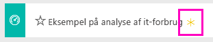
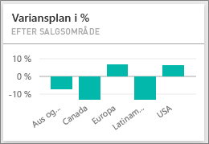
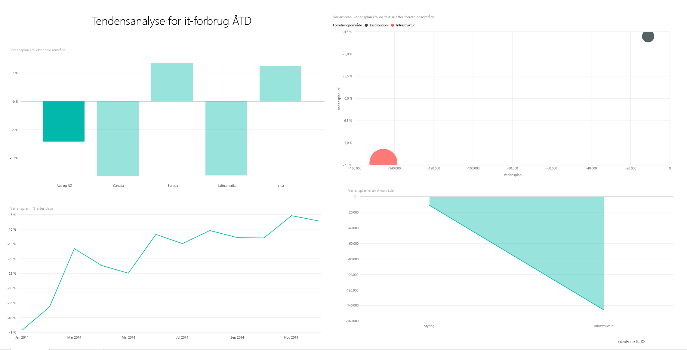
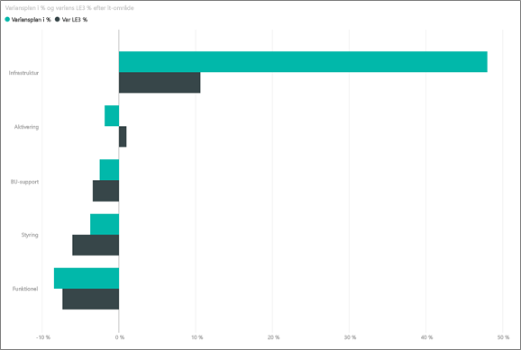
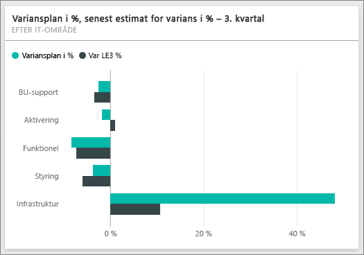
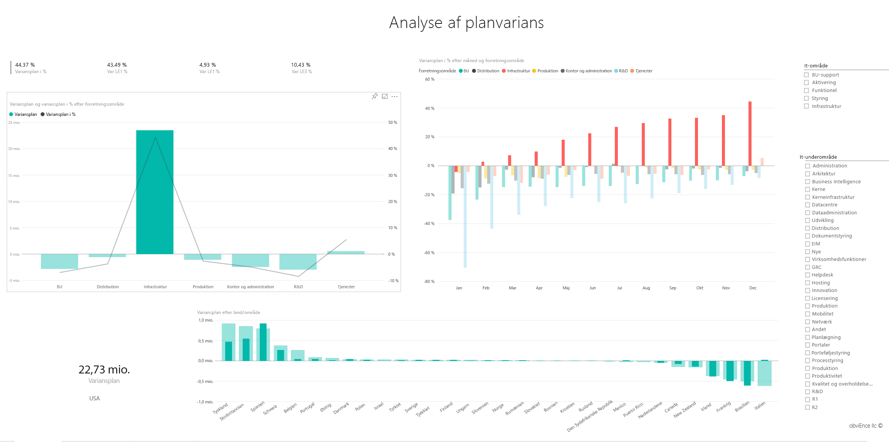

# Eksempel på analyse af it-forbrug til Power BI: Få en introduktion

## Oversigt over eksemplet på analyse af it-forbrug
[Indholdspakken](service-organizational-content-pack-introduction.md) (dashboard, rapport og datasæt) til analysen af it-forbruget analyserer de planlagte omkostninger over for de faktiske omkostninger i en it-afdeling. Sammenligningen hjælper os med at forstå, om virksomheden har lagt en god plan for året, og giver os mulighed for at undersøge de områder, som afviger væsentligt fra planen. Virksomheden i eksemplet gennemgår en årlig planlægningscyklus og genererer et nyt 'Seneste estimat' (Latest Estimate, LE) hvert kvartal for at gøre det nemmere at analysere ændringer i it-forbruget i løbet af regnskabsåret.

Dette eksempel er en del af en række, der illustrerer, hvordan du kan bruge Power BI med forretningsrelaterede data, rapporter og dashboards. Der er anvendt rigtige data fra obviEnce (<http://obvience.com/>), som er blevet anonymiseret.

## Forudsætninger

 Før du kan bruge eksemplet, skal du først downloade det som en [indholdspakke](https://docs.microsoft.com/power-bi/sample-it-spend#get-the-content-pack-for-this-sample), [.pbix-fil](http://download.microsoft.com/download/E/9/8/E98CEB6D-CEBB-41CF-BA2B-1A1D61B27D87/IT%20Spend%20Analysis%20Sample%20PBIX.pbix) eller [Excel-projektmappe](http://go.microsoft.com/fwlink/?LinkId=529783).

### Hent indholdspakken for dette eksempel

1. Åbn Power BI-tjenesten (app.powerbi.com), og log på.
2. Vælg **Hent data** i nederste venstre hjørne.
   
    
3. Vælg ikonet **Eksempler** på siden Hent data, der vises.
   
   
4. Vælg **Eksempel på analyse af it-forbrug**, og vælg **Opret forbindelse**.  
  
   
   
5. Power BI importerer indholdspakken og føjer et nyt dashboard, en rapport og et datasæt til dit aktuelle arbejdsområde. Det nye indhold er markeret med en gul stjerne. 
   
   
  
### Hent .pbix-filen knyttet til dette eksempel

Du kan også hente eksemplet som en pbix-fil, som er beregnet til brug med Power BI Desktop. 

 * [IT Spend Analysis Sample](http://download.microsoft.com/download/E/9/8/E98CEB6D-CEBB-41CF-BA2B-1A1D61B27D87/IT%20Spend%20Analysis%20Sample%20PBIX.pbix)

### Hent Excel-projektmappen for dette eksempel
Du kan også [kun downloade datasættet (Excel-projektmappe)](http://go.microsoft.com/fwlink/?LinkId=529783) for dette eksempel. Projektmappen indeholder Power View-ark, som du kan få vist og redigere. Du kan se de rå data ved at vælge **Power Pivot > Administrer**.

## Dashboardet IT Spend Analysis Sample
De to talfelter på dashboardet, **Var Plan %** og **Variance Latest Estimate % Quarter 3**, giver os et overblik over, hvor godt vi klarer os i forhold til planen og i forhold til estimatet for det seneste kvartal (LE3 = Latest Estimate Quarter 3). Samlet set er vi omtrent 6 % fra planen. Lad os undersøge årsagen til denne varians – hvornår, hvor og hvilken kategori?

## Siden "YTD IT Spend Trend Analysis"
Når du vælger dashboardfeltet **Var Plan % by Sales Region**, føres du til siden "IT Spend Trend Analysis" i rapporten IT Spend Analysis Sample. Vi kan hurtigt se, at vi har positiv varians i USA og Europa og negativ varians i Canada, Latinamerika og Australien. USA havde ca. 6 % +LE-varians, og Australien har ca. 7 % -LE-varians.

Men det kan være vildledende kun at kigge på dette diagram og udlede konklusioner. Vi er nødt til at se på de faktiske dollarbeløb for at få tingene i det rette perspektiv.

1. Vælg **Aus and NZ** i diagrammet Var Plan % by Sales Region, og hold øje med diagrammet Var Plan by IT Area.

   
2. Vælg nu **USA**. Du har fat i det – Australien er en virkelig lille del af vores samlede forbrug sammenlignet med USA.

    Så vi begrænsede det til USA, hvad nu? Lad os undersøge, hvilken kategori i USA der forårsager variansen.

## Stil spørgsmål til dataene
1. Vælg **IT Spend Analysis Sample** på den øverste navigationslinje for at vende tilbage til dashboardene.
2. Skriv "show IT areas, var plan % and var le3 % bar chart" i spørgsmålsfeltet.

   

   I det første it-område **Infrastructure** er procentdelen ændret drastisk mellem den første variansplan og variansplanens seneste estimat.

## Siden "YTD Spend by Cost Elements"
Gå tilbage til dashboardet, og se på dashboardfeltet **Var Plan %, Var LE3%** .

Infrastruktur skiller sig ud med enorm positiv varians i forhold til planen.

1. Klik på dette felt for at gå til siden "YTD Spend by Cost Elements" i rapporten IT Spend Analysis Sample.
2. Klik på bjælken **Infrastructure** i diagrammet "Var Plan % and Var LE3 % by IT Area" nederst til venstre, og hold øje med variansen i forhold til planen i "Var Plan % by Sales Region" til venstre.

    
3. Klik på navnet på hver Cost Element Group i udsnittet for at finde omkostningselementet med en stor varians.
4. Når **Other** er valgt, skal du klikke på **Infrastructure** i IT Area og klikke på underområderne i udsnittet IT Sub Area for at finde underområdet med den største varians.  

   Vi kan se en enorm varians i **Networking**.

   Firmaet valgte tilsyneladende at give sine medarbejdere telefontjenester som et frysegode, men dette træk var ikke planlagt.

## Siden "Plan Variance Analysis"
Klik på fanen "Plan Variance Analysis" nederst i rapporten for at gå til side 3 i rapporten.

Klik i kombinationsdiagrammet "Var Plan, and Var Plan % by Business Area" til venstre på kolonnen Infrastructure for at fremhæve infrastrukturværdier på resten af siden.

Læg mærke til i diagrammet "Var plan% by Month and Business Area", at infrastruktur begyndte at have en positiv varians omkring februar, og at den bliver ved med at stige. Læg også mærke til, hvordan værdien for varians i forhold til plan for infrastruktur varierer afhængigt af land, sammenlignet med værdien for alle forretningsområder. Brug udsnittene "IT Area" og "IT Sub Areas" til højre til at filtrere værdierne på resten af siden i stedet for at fremhæve dem. Klik på de forskellige it-områder til højre for at udforske dataene på en anden måde. Du kan også klikke på IT Sub Areas og se variansen på dette niveau.

## Rediger rapporten
Klik på **Rediger rapport** i det øverste venstre hjørne, og udforsk i Redigeringsvisning.

* Se, hvordan siderne er oprettet – felterne i hvert diagram, filtrene på siderne
* Tilføj sider og diagrammer baseret på de samme data
* Skift til en anden type visualisering for hvert diagram
* Fastgør dem til dit dashboard

Dette er et sikkert miljø at lege i. Du kan altid vælge ikke at gemme dine ændringer. Hvis du gemmer dem, kan du altid gå til Hent data for at få en ny kopi af dette eksempel.

## Næste trin: Opret forbindelse til dine data
Vi håber, at denne rundtur viser, hvordan Power BI-dashboards, spørgsmål og svar og rapporter kan give indsigt i data om it-forbrug. Nu er det din tur – opret forbindelse til dine egne data. Med Power BI kan du oprette forbindelse til en lang række datakilder. Få mere at vide om, hvordan du [kommer i gang med Power BI](service-get-started.md).
