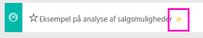
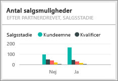

# Eksempel på analyse af salgsmuligheder til Power BI: Tag en rundvisning

## Oversigt over eksemplet på analyse af salgsmuligheder
**Eksempel på analyse af salgsmuligheder** indeholder et dashboard (og en tilknyttet rapport) for en softwarevirksomhed, der har 2 salgskanaler: *direkte* og *partner*. Salgschefen har oprettet dette dashboard for at spore muligheder og omsætning efter område, handlens størrelse samt kanal.

Salgschefen er afhængig af to målinger af indtægter:

* **Indtægter** – dette er en sælgers estimat over, hvad vedkommende mener omsætningen vil blive.
* **Indregnede indtægter** – dette beregnes som indtægter X sandsynligheds-% og anerkendes generelt som værende en mere nøjagtig indikator for de faktiske salgsindtægter. Sandsynligheden afhænger af, hvor i ***salgsfasen*** handlen befinder sig.
  * Lead – 10 %  
  * Qualify – 20 %  
  * Solution – 40 %  
  * Proposal – 60 %  
  * Finalize – 80 %

  

Dette eksempel er en del af en række, der illustrerer, hvordan du kan bruge Power BI med forretningsrelaterede data, rapporter og dashboards. Der er anvendt rigtige data fra obviEnce ([www.obvience.com)](http://www.obvience.com/), som er blevet anonymiseret.

## Forudsætninger

 Før du kan bruge eksemplet, skal du først downloade det som en [indholdspakke](https://docs.microsoft.com/en-us/power-bi/sample-opportunity-analysis#get-the-content-pack-for-this-sample), [.pbix-fil](http://download.microsoft.com/download/9/1/5/915ABCFA-7125-4D85-A7BD-05645BD95BD8/Opportunity-Analysis-Sample-PBIX.pbix) eller [Excel-projektmappe](http://go.microsoft.com/fwlink/?LinkId=529782).

### Hent indholdspakken for dette eksempel

1. Åbn Power BI-tjenesten (app.powerbi.com), og log på.
2. Vælg **Hent data** i nederste venstre hjørne.
   
    
3. Vælg ikonet **Eksempler** på siden Hent data, der vises.
   
   
4. Vælg **Eksempel på analyse af salgsmuligheder**, og vælg **Opret forbindelse**.  
  
   
   
5. Power BI importerer indholdspakken og føjer et nyt dashboard, en rapport og et datasæt til dit aktuelle arbejdsområde. Det nye indhold er markeret med en gul stjerne. 
   
   
  
### Hent .pbix-filen knyttet til dette eksempel

Du kan også hente eksemplet som en pbix-fil, som er beregnet til brug med Power BI Desktop. 

 * [Eksempel på analyse af salgsmuligheder](http://download.microsoft.com/download/9/1/5/915ABCFA-7125-4D85-A7BD-05645BD95BD8/Opportunity%20Analysis%20Sample%20PBIX.pbix)

### Hent Excel-projektmappen for dette eksempel
Du kan også [kun downloade datasættet (Excel-projektmappe)](http://go.microsoft.com/fwlink/?LinkId=529782) for dette eksempel. Projektmappen indeholder Power View-ark, som du kan få vist og redigere. Du kan se de rå data ved at vælge **Power Pivot > Administrer**.

## Hvad fortæller vores dashboard os?
Salgschefen har oprettet et dashboard for at spore de vigtigste målepunkter. Når hun ser noget interessant, kan hun vælge et felt for at grave ned i dataene.

1. Virksomhedens indtægter er $2 milliarder, og indregnede indtægter er $461 millioner.
2. Antal salgsmuligheder og indtægter følger et velkendt tragtformet mønster, hvor totaler formindskes hvert efterfølgende trin.
3. De fleste af vores salgsmuligheder er i det østlige område.
4. Store salgsmuligheder genererer større indtægter end mellemstore eller små muligheder.
5. Store partnerhandler genererer større indtægter: $8 millioner i gennemsnit i forhold til $6 millioner for direkte salg.

Eftersom indsatsen for at få handlen i hus er den samme, uanset om handlen er klassificeret som stor, mellemstor eller lille, bør vores virksomhed grave ned i dataene for at lære mere om store muligheder.

Vælg feltet **Opportunity Count by Partner Driven and Sales Stage** for at åbne side 1 i rapporten.  

## Udforsk siderne i rapporten
### Side 1 i rapporten har titlen "Opportunity Count Overview".

* East er vores største område med hensyn til antallet af salgsmuligheder.  
* Vælg hvert område ét ad gangen på cirkeldiagrammet for at filtrere siden. For hvert område forfølger partnere markant flere store muligheder.   
* Søjlediagrammet Opportunity Count by Partner Driven and Opportunity Size viser tydeligt, at de fleste af de store salgsmuligheder er partnerdrevet, og flere af de små og mellemstore muligheder ikke er partnerdrevet.
* Vælg hver salgsfase i det liggende søjlediagram nederst til venstre for at se forskellen i regionalt antal, og læg mærke til, at selvom East er vores største område med hensyn til antal, har alle tre sammenlignelige antal i faserne Solution, Proposal og Finalize. Det betyder, at vi lukker en højere procentdel af handler i Central og West.

### Side 2 i vores rapport har titlen "Revenue Overview".
Denne side ser på samme måde på dataene, men med et indtægtsperspektiv i stedet for antal.  

* East er ikke blot vores største område, hvad angår antallet af salgsmuligheder, men også hvad angår indtægter.  
* Filtrering efter Partner driven (vælg **Yes** i forklaringen øverst til højre) viser indtægter på $1,5 milliarder og $294 millioner. Sammenlign det med $644 milliarder og $166 millioner for ikke-partnerdrevne indtægter.  
* Gennemsnitlige indtægter for store kunder er større (8 millioner), hvis muligheden er partnerdrevet, sammenlignet med 6 millioner for ikke-partnerdrevet forretning.  
* For partnerdrevet forretning er de gennemsnitlige indtægter for store muligheder næsten dobbelt så store som for mellemstore muligheder (4 millioner).  
* Gennemsnitlige indtægter for små og mellemstore virksomheder er sammenlignelige for både partnerdrevet og ikke-partnerdrevet forretning.   

Det er tydeligt, at vores partnere er bedre til at sælge til kunder.  Det kan give mening at gennemføre flere handler via vores partnere.

### Side 3 i vores rapport har titlen "Region Stage Counts"
Denne side ser på tilsvarende data, men opdeler dem efter område og fase.  

* Filtrering efter East (vælg **East** i cirkeldiagrammet) viser, at salgsmuligheder i det østlige er næsten lige opdelt mellem partnerdrevet og ikke-partnerdrevet.
* Store salgsmuligheder er mest almindelige i det centrale område, små salgsmuligheder er mest almindelige i det østlige område, og mellemstore salgsmuligheder er mest almindelige i det vestlige område.

### Side 4 i vores rapport har titlen "Upcoming Opportunities"
Vi ser igen på lignende faktorer, men denne gang fra et dato-/klokkeslætsperspektiv.  

Vores CFO bruger denne side til at administrere arbejdsbyrde. Ved at se på indtægtsmuligheder efter salgsfase og måned kan hun planlægge hensigtsmæssigt.

* Gennemsnitlig omsætning for fasen Finalize er den højeste. Det har højeste prioritet at lukke disse handler.
* Filtrering efter måned (ved at vælge månedsnavnet i venstre udsnit) viser, at januar har en høj andel af store handler i fasen Finalize med indregnede indtægter på $75 millioner. Februar har på den anden side hovedsageligt mellemstore handler i fasen Solution og Proposal.
* Tallene for indregnede indtægter varierer generelt baseret på salgsfase, antal muligheder og handlens størrelse. Tilføj filtre (ved hjælp af filterruden til højre) for disse faktorer for at få yderligere indsigt.

Dette er et sikkert miljø at lege i. Du kan altid vælge ikke at gemme dine ændringer. Hvis du gemmer dem, kan du altid gå til **Hent data** for at få en ny kopi af dette eksempel.

## Næste trin: Opret forbindelse til dine data
Vi håber, at denne rundtur har vist, hvordan Power BI-dashboards, Spørgsmål og svar samt rapporter kan give indsigt i data til sporing af salgsmuligheder. Nu er det din tur – opret forbindelse til dine egne data. Med Power BI kan du oprette forbindelse til en lang række datakilder. Få mere at vide om, hvordan du [kommer i gang med Power BI](service-get-started.md).

[Download eksempler](sample-datasets.md)  
