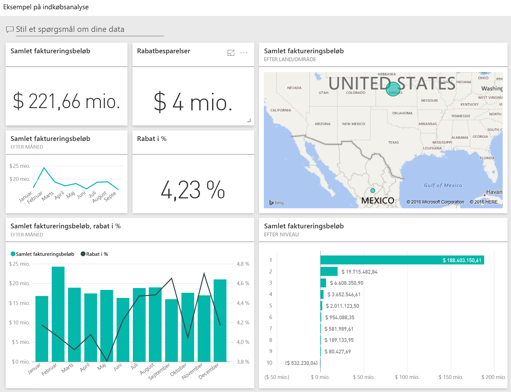
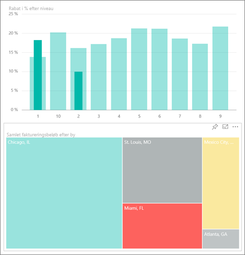
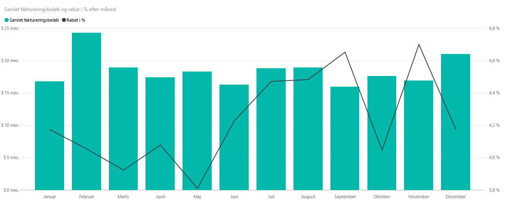
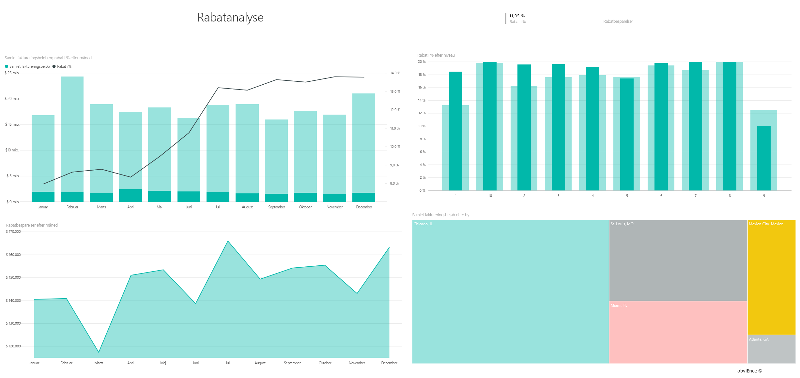

# Eksempel på indkøbsanalyse for Power BI: Få en introduktion
Dette brancheeksempel på et dashboard og den underliggende rapport tager udgangspunkt i en produktionsvirksomheds udgifter til leverandører efter kategori og placering. I eksemplet udforsker vi følgende områder:

* Hvem er topleverandørerne
* Hvilke kategorier vi har flest udgifter til
* Hvilke leverandører giver os de største rabatter og hvornår

Dette eksempel er en del af en række, der illustrerer, hvordan du kan bruge Power BI med forretningsrelaterede data, rapporter og dashboards. Der er anvendt rigtige data fra obviEnce ([www.obvience.com)](http://www.obvience.com/), der er blevet anonymiseret.

Vil du følge med? I [Power BI-tjenesten](https://powerbi.com) skal du gå til **Get Data > Samples > Procurement Analysis Sample > Connect** for at få din egen kopi af eksemplet.

[!Note] Du kan også [kun downloade datasættet (Excel-projektmappe)](http://go.microsoft.com/fwlink/?LinkId=529784) for dette eksempel. Projektmappen indeholder Power View-ark, som du kan få vist og redigere. Du kan se de rå data ved at vælge **Power Pivot > Administrer**.

## Udgiftstendenser
Lad os først se på udgiftstendenser efter kategori og placering.  

1. Åbn fanen **Dashboards** fra arbejdsområdet, og vælg dashboardet Procurement Analysis.
2. Vælg dashboardfeltet **Total Invoice by Country/Region**. Det åbner siden "Spend Overview" i rapporten "Procurement Analysis Sample".
   
    

Vær opmærksom på et par ting:

* I kurvediagrammet **Total Invoice by Month and Category**: kategorien **Direct** har ret konsistente udgifter, **Logistics** er højest i december, og **Other** er højest i februar.
* På kortet **Total Invoice by Country/Region**: De fleste af vores udgifter er i USA.
* I søjlediagrammet **Total Invoice by Sub Category**: **Hardware** og **Indirect Goods & Services** er de største udgiftskategorier.
* I den samlede faktura efter lag i det liggende søjlediagram: De fleste af vores forretninger udføres med vores leverandører på niveau 1 (top 10). Dette hjælper os med at bedre administrere leverandørrelationer.

## Udgifter i Mexico
Lad os udforske udgiftsområder i Mexico.

1. I cirkeldiagrammet skal du vælge boblen **Mexico** på kortet. Læg mærke til, at i søjlediagrammet "Total Invoice by Sub Category"er det meste i underkategorien **Indirect Goods & Services**.
   
   
2. Foretag detaljeudledning i kolonnen **Indirect Goods & Services**:
   
   * Vælg pilen til detaljeudledning  i øverste højre hjørne af diagrammet.
   * Markér kolonnen **Indirect Goods & Services**.
     
      Salg og marketing er langt den største udgift samlet set i denne kategori.
   * Vælg **Mexico** på kortet igen.
     
      Den største udgift i denne kategori i Mexico er Maintenance & Repair.
     
      
3. Vælg pil op i det øverste venstre hjørne af diagrammet for at få vist en detaljeudledning.
4. Vælg pilen igen for at deaktivere detaljeudledning.  
5. Vælg **Power BI** i navigationslinjen øverst for at vende tilbage til dit arbejdsområde.

## Evaluer forskellige byer
Vi kan bruge markering til at evaluere forskellige byer.

1. Vælg dashboardfeltet **Total Invoice, Discount % By Month**. Rapporten åbner på siden "Discount Analysis".
2. Vælg de forskellige byer i træstrukturen **Total Invoice by City** for at se, hvordan de sammenlignes. Næsten alle Miamis fakturaer er fra leverandører på niveau 1.
   
   

## Leverandørrabatter
Lad os også udforske rabatter, der er tilgængelige fra leverandører, og de tidsperioder, hvor vi får flest rabatter. 

Specifikt disse spørgsmål:

* Er rabatter forskellige fra måned til måned, eller er rabatter de samme hver måned?
* Får nogle byer flere rabatter end andre?

### Rabat pr. måned
På kombinationsdiagrammet **Total Invoice and Discount % by Month** kan vi se, at **February** er den travleste måned, og **September** er den mindst travle måned. Se nu på rabatprocenten i løbet af disse måneder.
Bemærk, at når mængden går op, falder rabatten, og når mængden er lav, går rabatten op. Jo større brug vi har for rabatten, desto dårligere handel får vi.

### Rabat efter by
Et andet område at udforske er rabat efter by. Vælg alle byerne i træstrukturen, og se, hvordan de andre diagrammer ændrer sig. 

* St. Louis, MO havde en stor stigning i samlet faktura i februar og et stort fald i rabatbesparelser i april.
* Mexico City, Mexico har den højeste rabatprocent (11,05 %), og Atlanta, GA har den mindste (0,08 %).

### Rediger rapporten
Vælg **Rediger rapport** i det øverste venstre hjørne, og udforsk Redigeringsvisning.

* Se, hvordan siderne laves
* Tilføj sider og diagrammer baseret på de samme data
* Skift visualiseringstypen for et diagram – skift f.eks. træstrukturen til et kransediagram
* Fastgør dem til dit dashboard

Dette er et sikkert miljø at lege i. Du kan altid vælge ikke at gemme dine ændringer. Hvis du gemme dem, kan du altid gå til **Hent data** for at få en ny kopi af dette eksempel.

## Næste trin: Opret forbindelse til dine data
Vi håber, at denne rundtur viser, hvordan Power BI-dashboards og -rapporter kan give indsigt i indkøbsdata. Nu er det din tur &#151; opret forbindelse til dine egne data. Med Power BI kan du oprette forbindelse til en lang række datakilder. Få mere at vide om, hvordan du [kommer i gang med Power BI](service-get-started.md).

