# Eksempel på analyse af detailhandel til Power BI: Få en introduktion

Dette dashboard med et brancheeksempel og underliggende rapport analyserer data om detailsalg for varer, der er solgt på tværs af flere butikker og distrikter. De metriske værdier sammenligner dette års resultat med sidste års på følgende områder: salg, enheder, bruttoavance og varians samt analyse af nye butikker. Der er anvendt rigtige data fra obviEnce ([www.obvience.com](http://www.obvience.com)), der er blevet anonymiseret.

## Forudsætninger

 Før du kan bruge eksemplet, skal du først downloade det som en [indholdspakke](https://docs.microsoft.com/power-bi/sample-datasets#get-and-open-a-sample-content-pack-in-power-bi-service), [.pbix-fil](http://download.microsoft.com/download/9/6/D/96DDC2FF-2568-491D-AAFA-AFDD6F763AE3/Retail-Analysis-Sample-PBIX.pbix) eller [Excel-projektmappe](http://go.microsoft.com/fwlink/?LinkId=529778).

### Hent indholdspakken for dette eksempel

1. Åbn Power BI-tjenesten (app.powerbi.com), og log på.
2. Vælg **Hent data** i nederste venstre hjørne.
   
    
3. Vælg ikonet **Eksempler** på siden Hent data, der vises.
   
   
4. Vælg **Eksempel på detailhandelsanalyse**, og vælg **Opret forbindelse**.  
  
   
   
5. Power BI importerer indholdspakken og føjer et nyt dashboard, en rapport og et datasæt til dit aktuelle arbejdsområde. Det nye indhold er markeret med en gul stjerne. 
   
   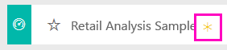
  
### Hent .pbix-filen knyttet til dette eksempel

Du kan også hente eksemplet som en pbix-fil, som er beregnet til brug med Power BI Desktop. 

 * [Retail Analysis Sample](http://download.microsoft.com/download/9/6/D/96DDC2FF-2568-491D-AAFA-AFDD6F763AE3/Retail%20Analysis%20Sample%20PBIX.pbix)

### Hent Excel-projektmappen for dette eksempel
Du kan også [kun downloade datasættet (Excel-projektmappe)](http://go.microsoft.com/fwlink/?LinkId=529778) for dette eksempel. Projektmappen indeholder Power View-ark, som du kan få vist og redigere. Du kan se de rå data ved at vælge **Power Pivot > Administrer**.

## Start på dashboardet, og åbn rapporten
1. Vælg feltet "Total Stores" på dashboardet:

     

   Det fører dig til siden "Store Sales Overview" i rapporten. Du kan se, at vi har 104 butikker i alt, 10 af dem nye. Vi har to kæder: Fashions Direct og Lindseys. Fashions Direct-butikkerne er gennemsnitligt større.
2. Vælg **Fashions Direct** i cirkeldiagrammet.

   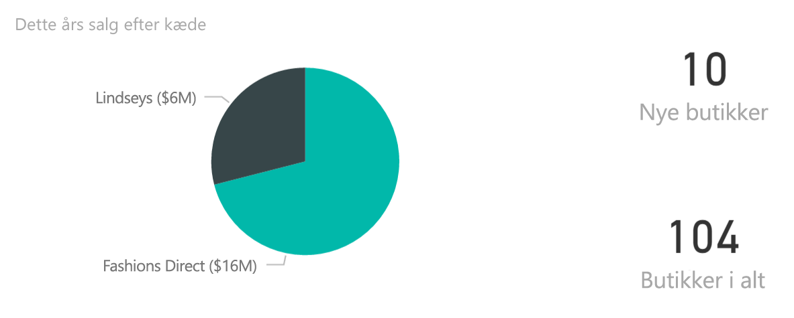  

   Vær opmærksom på resultatet i boblediagrammet:

     

   Distriktet FD-01 har det største gennemsnitlige salg pr. kvadratfod, FD-02 har den laveste varians i salg sammenlignet med sidste år, FD-03 og FD-04 klarer sig dårligst samlet set.
3. Vælg individuelle bobler eller andre diagrammer for at se tværgående fremhævning, som viser effekten af dine valg.
4. Hvis du vil vende tilbage til dashboardet, skal du vælge dets navn på den øverste navigationslinje (brødkrummer).

   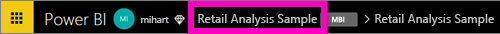
5. Vælg titlen "This Year’s Sales" på dashboardet.

   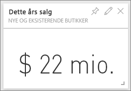

   Det svarer til at skrive "This year sales" i spørgsmålsfeltet.

   Du ser denne skærm:

   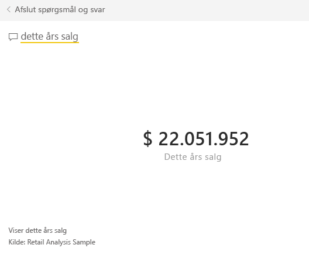

## Gennemgå et felt, der er oprettet med Spørgsmål og svar i Power BI
Lad os gå mere specifikt til værks.

1. Tilføj "this year sales **by district**" i spørgsmålet. Se resultatet: Svaret indsættes automatisk i et liggende søjlediagram, og der foreslås andre sætninger:

   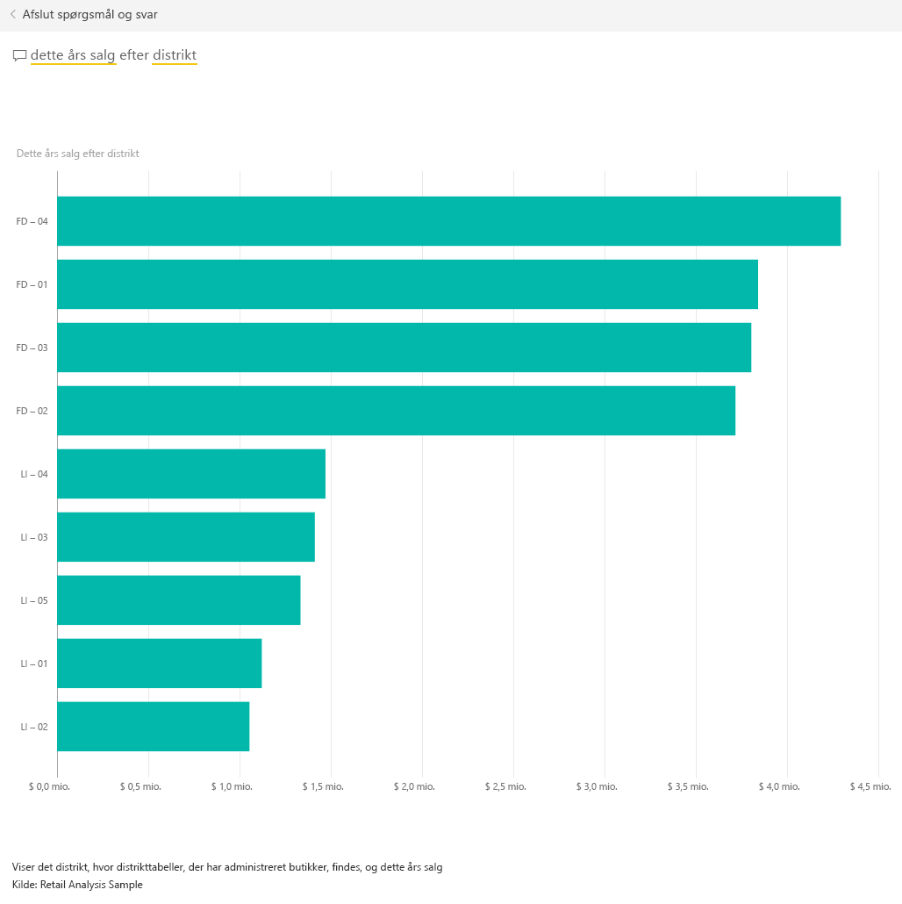
2. Du skal nu ændre spørgsmålet til "this year sales **by zip and chain**".

   Læg mærke til, hvordan det besvarer spørgsmålet, mens du skriver, med de relevante diagrammer.
3. Leg lidt med flere spørgsmål, og se, hvilken type resultater du får.
4. Når du er klar, kan du vende tilbage til dashboardet.

## Grav dybere ned i dataene
Lad os nu udforske på et mere detaljeret niveau, hvor vi ser på distrikternes præstationer.

1. Vælg på dashboardet det felt, der sammenligner dette års salg med sidste års.

   

   Læg mærke til den store variabilitet på varians % i forhold til sidste år, hvor januar, april og juli var særlig dårlige måneder.

   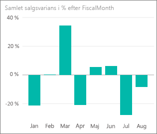

   Lad os se, om vi kan indsnævre, hvor problemerne kan være.
2. Vælg boblediagrammet, og vælg **020-Mens**.

   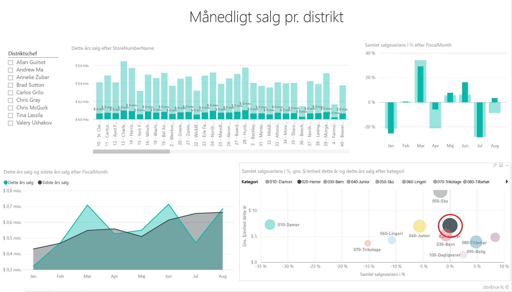  

   Læg mærke til, at mændenes kategori ikke var så alvorligt påvirket i april som forretningsresultatet samlet set, men januar og juli var stadig problemmåneder.
3. Vælg nu **boblen 010-Womens**.

   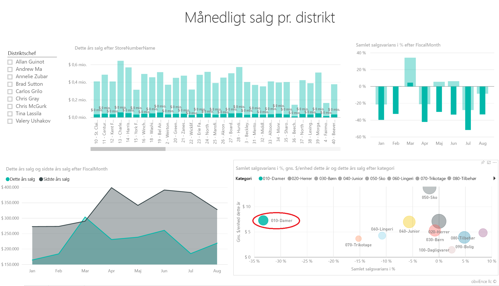

   Læg mærke til, at kvindernes kategori klarede sig meget dårligere end samlet forretningsresultat på tværs af alle måneder og meget værre i næsten hver måned sammenlignet med det forrige år.
4. Vælg boblen igen for at fjerne filteret.

## Afprøv udsnittet
Lad os se på, hvordan bestemte distrikter klarer den.

1. Vælg Allan Guinot i udsnittet øverst til venstre.

   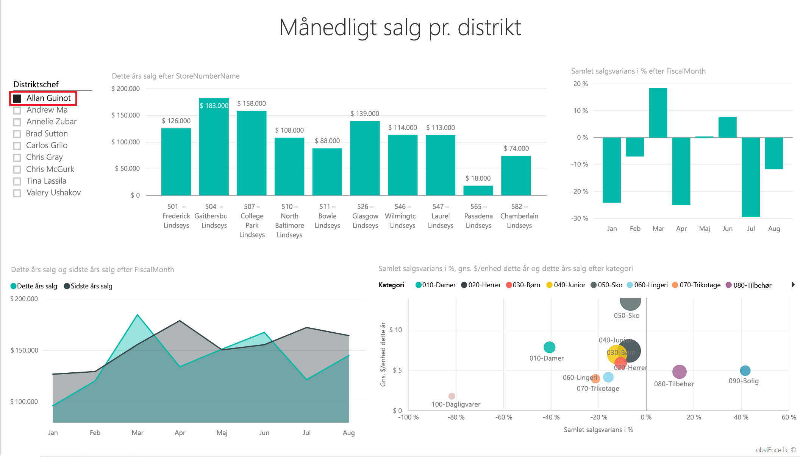

   Bemærk, at Allans distrikt klarede sig bedre i marts og juni end sidste år.
2. Mens Allan stadig er valgt, skal du nu vælge boblen Women.

   

   Bemærk, at for kvindekategorien har hans distrikt aldrig nået sidste års volumen.
3. Undersøg de andre distriktschefer og kategorier – hvad kan du ellers finde af indsigt?
4. Når du er klar, skal du vende tilbage til dashboardet.

## Hvad fortæller vores data os om salgsvækst dette år?
Det sidste område, vi vil undersøge, er vores vækst – nye butikker åbnede dette år.

1. Vælg feltet 'Stores Opened This Year'.

   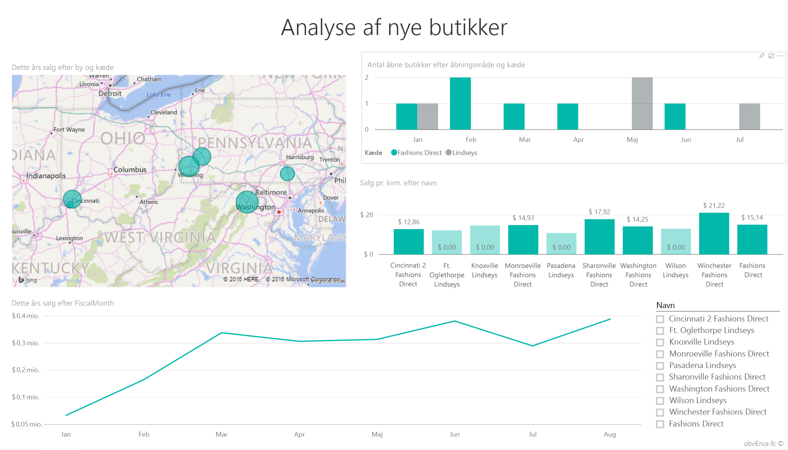

   Som det fremgår af feltet, er der åbnet flere Fashions Direct-butikker end Lindseys-butikker dette år.
2. Hold øje med diagrammet 'Sales Per Sq Ft by Name':

   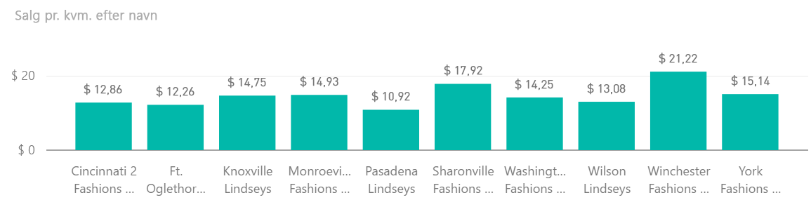

    Der er en temmelig stor forskel på Average Sales per SQF på tværs af nye butikker.
3. Klik på forklaringen Fashions Direct i diagrammet øverst til højre. Læg mærke til, at den bedste butik (Winchester Fashions Direct), selv for den samme kæde, præsterer markant bedre end den værste butik (Cincinnati 2 Fashions Direct) med henholdsvis $21,22 vs. $12,86.

   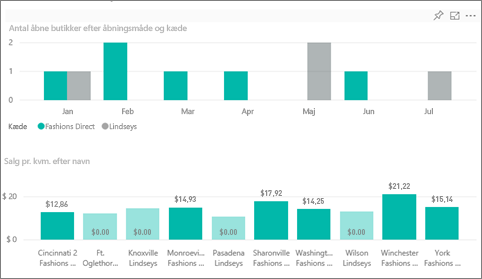
4. Klik på Winchester Fashions Direct i udsnittet, og hold øje med kurvediagrammet. De første salgstal blev rapporteret i februar.
5. Klik på Cincinnati 2 Fashions Direct i udsnittet, og du kan se i kurvediagrammet, at den blev åbnet i juni og ser ud til at være den dårligst præsterende butik.
6. Undersøg som før ved at klikke på andre søjler, linjer og bobler i diagrammerne, og se, hvilken indsigt du kan finde.

Dette er et sikkert miljø at lege i. Du kan altid vælge ikke at gemme dine ændringer. Hvis du gemmer dem, kan du altid gå til Hent data for at få en ny kopi af dette eksempel.

## Opret forbindelse til dine data
Vi håber, at denne rundtur har vist, hvordan Power BI-dashboards, spørgsmål og svar samt rapporter kan give indsigt i detailhandelsdata. Nu er det din tur – opret forbindelse til dine egne data. Med Power BI kan du oprette forbindelse til en lang række datakilder. Få mere at vide om, hvordan du [kommer i gang med Power BI](service-get-started.md).

## Næste trin
* [Download indholdspakken til eksemplet på detailhandelsanalyse](sample-tutorial-connect-to-the-samples.md)
* [Download en zipfil med alle eksempelfilerne](http://go.microsoft.com/fwlink/?LinkId=535020)    
* [Download Excel-projektmappen til dette Power BI-eksempel](http://go.microsoft.com/fwlink/?LinkId=529778)    
* [Hent data (til Power BI)](service-get-data.md)    
* [Power BI – Grundlæggende begreber](service-basic-concepts.md)    
* Har du flere spørgsmål? [Prøv at spørge Power BI-community'et](http://community.powerbi.com/)
