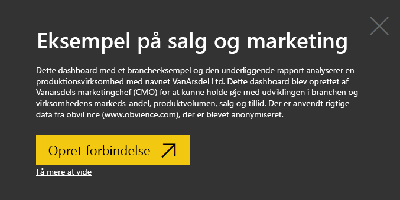
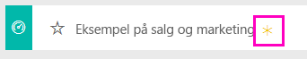
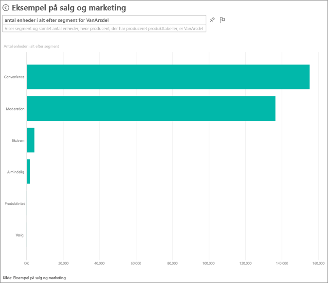
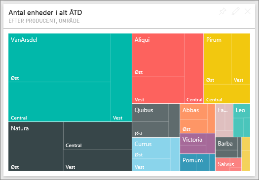
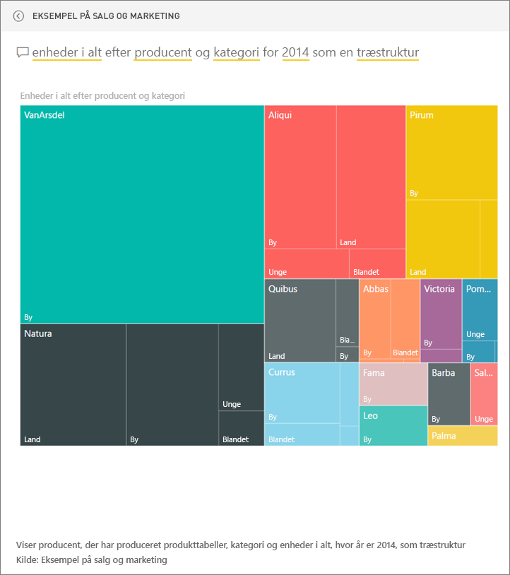

# Eksempel på salg og marketing til Power BI: Få en introduktion

## Oversigt over eksemplet på salg og marketing
**Eksempel på salg og marketing** indeholder et dashboard og en rapport tilhørende et fiktivt produktionsfirma ved navn VanArsdel Ltd. Dette dashboard blev oprettet af Vanarsdels marketingchef (CMO) for at kunne holde øje med udviklingen i branchen og virksomhedens markedsandel, produktvolumen, salg og tillid.

VanArsdel har mange konkurrenter, men er førende inden for branchen. Marketingchefen ønsker at øge markedsandelen og finde nye muligheder for vækst. Men af en eller anden grund er Vanarsdels markedsandel begyndt at falde, med stor nedgang i juni måned.

Dette eksempel er en del af en række, der illustrerer, hvordan du kan bruge Power BI med forretningsrelaterede data, rapporter og dashboards. Der er anvendt rigtige data fra obviEnce (www.obvience.com), der er blevet anonymiseret.

## Forudsætninger

 Før du kan bruge eksemplet, skal du først hente det som en indholdspakke, .pbix-fil eller Excel-projektmappe.

### Hent indholdspakken for dette eksempel

1. Åbn Power BI-tjenesten (app.powerbi.com), og log på.
2. Vælg **Hent data** i nederste venstre hjørne.
   
    
3. Vælg ikonet **Eksempler** på siden Hent data, der vises.
   
   
4. Vælg **Eksempel på salg og marketing**, og vælg derefter **Opret forbindelse**.  
  
   
   
5. Power BI importerer indholdspakken og føjer et nyt dashboard, en rapport og et datasæt til dit aktuelle arbejdsområde. Det nye indhold er markeret med en gul stjerne. 
   
   
  
### Hent .pbix-filen knyttet til dette eksempel

Du kan også hente eksemplet som en pbix-fil, som er beregnet til brug med Power BI Desktop. 

 * [Sales and Marketing Sample](http://download.microsoft.com/download/9/7/6/9767913A-29DB-40CF-8944-9AC2BC940C53/Sales%20and%20Marketing%20Sample%20PBIX.pbix)

### Hent Excel-projektmappen for dette eksempel
Du kan også [kun downloade datasættet (Excel-projektmappe)](http://go.microsoft.com/fwlink/?LinkId=529785) for dette eksempel. Projektmappen indeholder Power View-ark, som du kan få vist og redigere. Du kan se de rå data ved at vælge **Power Pivot > Administrer**.

## Hvad fortæller vores dashboard os?
Lad os starte vores rundvisning på dashboardet og tage et kig på de felter, som marketingchefen har valgt at fastgøre. Vi kan se oplysninger om vores markedsandel, salg og tillid. Og vi kan se, at disse data er opdelt efter region, tid og konkurrence.

* Felterne med tal i venstre kolonne viser branchens omsætning for det seneste år (50.000), markedsandel (32,86 %), omsætning (16.000), tillidstal (68), forskel i tillid (4) og det samlede antal enheder, der er blevet solgt (1 mio.).
* Det øverste kurvediagram viser, hvordan vores markedsandel varierer over tid. Vores markedsandel falder meget i juni. Vores andel på rullende 12 måneder (R12M), som i et stykke tid var stigende, er også begyndt at stagnere.
* Vores største konkurrent er Aliqui (hvilket tydeligt ses i det midterste felt med søjlediagrammet).
* De fleste af vores forretningsaktiviteter finder sted i det østlige og centrale område.
* Kurvediagrammet nederst viser, at vores fald i juni ikke er sæsonbestemt – ingen af vores konkurrenter har den samme tendens.
* De to felter med "Enheder i alt" viser de enheder, der blev solgt, opdelt efter segment og område/producent. Det største markedssegment for vores branche er **Produktivitet** og **Praktisk**.

### Brug Spørgsmål og svar til at komme lidt mere i dybden
#### Hvilke segmenter var det, der drev vores salg? Stemmer det overens med tendensen i branchen?
1. Vælg feltet "Samlede enheder i alt efter segment", så åbnes Spørgsmål og svar.
2. Skriv **for VanArsdel** i slutningen af den eksisterende forespørgsel. Spørgsmål og svar fortolker spørgsmålet og viser et opdateret diagram med svaret. Vores produktvolumen stammer fra Praktisk og Indstilling.

   
3. Vores andel i kategorierne **Indstilling** og **Praktisk** er meget stor. Det er i disse segmenter, vi konkurrerer.
4. Gå tilbage til dashboardet ved at vælge navnet på dashboardet på den øverste navigationslinje (brødkrummer).

#### Hvordan ser den samlede markedsandel per enhed ud baseret på kategori (i forhold til region)?
1. Læg mærke til feltet "Enheder i alt ÅTD efter producent, område". Gad vide, hvordan den samlede markedsandel per enhed ser ud per kategori?

   
2. Skriv spørgsmålet **enheder i alt efter producent og kategori i 2014 som en træstruktur** i spørgsmålsfeltet øverst i dashboardet. Se, hvordan visualiseringen opdateres, mens du skriver spørgsmålet.
   
3. Du kan sammenligne resultaterne ved at fastgøre diagrammet til dit dashboard. Se, det er interessant: I 2014 solgte VanArsdel kun produkter, der tilhører kategorien **Urban**.
4. Gå tilbage til dashboardet.

Dashboards fungerer også som et adgangspunkt til rapporter.  Hvis et felt er oprettet baseret på en underliggende rapport, kan du åbne rapporten ved at klikke på feltet.

På vores dashboard viser de rullende 12 måneder (R12M), at vores markedsandel ikke længere forøges over tid. Den falder endda en smule. Og hvorfor oplever vi et stort fald i markedsandel i juni måned? For at undersøge det nærmere skal du klikke på denne visualisering for at åbne den underliggende rapport.

### Rapporten er på fire sider
#### Side 1 af vores rapport fokuserer på VanArsdels markedsandel.

1. Se søjlediagrammet "Enheder i alt efter måned og isVanArsdel" forneden. Den sorte kolonne repræsenterer VanArsdel (vores produkter), og den grønne er vores konkurrenter. Det fald, som VanArsdel oplevede i juni 2014, oplevede konkurrenterne ikke.
2. Det liggende søjlediagram "Kategoriens omsætning i alt efter segment" i midten til højre filtreres for at få vist VanArsdels bedste og andenbedste segment. Se her, hvordan dette filter blev oprettet:  

   a.  Vis ruden Filtre til højre.  
   b.  Klik for at vælge visualiseringen.  
   c.  Bemærk under Filtre på visualiseringsniveau, at **Segment** er filtreret, så det kun indeholder **Praktisk** og **Indstilling**.  
   d.  Rediger filteret ved at vælge Segment og udvide den sektion, og afkryds derefter **Produktivitet** for også at tilføje dette segment.  
3. Under "Enheder i alt efter måned og isVanArsdel" skal du vælge det sorte "Ja" i forklaringen for at filtrere siden med et tværgående filter efter VanArsdel. Bemærk, at vi ikke konkurrerer i produktivitetssegmentet.
4. Vælg det sorte "Ja" igen for at fjerne filteret.
5. Tag et kig på kurvediagrammet. Det viser vores månedlige markedsandel og markedsandel for de rullende 12 måneder. Data om de rullende 12 måneder hjælper os med at udjævne månedlige udsving og viser de langsigtede tendenser. Vælg Praktisk og derefter Indstilling i det liggende søjlediagram for at se, hvor meget hvert enkelt segment svinger i markedsandel. I segmentet Indstilling ses et meget større udsving i markedsandelen end segmentet Praktisk.

Vi prøver stadig på at finde ud af, hvorfor vores markedsandel faldt sådan i juni. Lad os kigge på Tillid.

#### Side 3 af vores rapport fokuserer på tillid.

Tweets, Facebook, blogs, artikler osv. bidrager til tilliden, som vises i to kurvediagrammer. Tillidsdiagrammet øverst til venstre viser, at tilliden til vores produkter var rimelig neutral indtil februar. I februar begyndte et stort fald, som nåede sit laveste i juni. Hvad var årsagen til dette fald i tillid? Vi bliver nødt til at kigge på eksterne kilder. Flere artikler og blogindlæg vurderede i februar VanArsdels kundeservice som den værste i branchen. Denne dårlige PR havde en direkte indflydelse på kundernes tillid og salget. VanArsdel arbejdede hårdt for at forbedre kundeservicen, og det bemærkede kunderne og branchen. I juli begyndte den positive tillid at stige, og den opnåede det bedste resultat nogensinde, da den kom op i 60'erne. Denne stigning i tillid afspejles i "Enheder i alt efter måned" på side 1 og 3. Det forklarer måske delvist vores fald i markedsandel i juni?

Forskellen i tillid ville være et andet område, vi kunne udforske: I hvilke områder er der den største forskel i tillid, og hvordan kan ledelsen udnytte dette og finde nye måder at reproducere det i andre områder?

#### Side 2 af vores rapport fokuserer på ÅTD-tendensen for kategorier

* VanArsdel er det største af alle firmaerne i denne kategori, og vores største konkurrenter er Natura, Aliqui og Pirium. Dem vil vi holde øje med.
* Aliqui er i vækst, men produktvolumenen er sammenlignet med vores stadig lav.
* I træstrukturen er VanArsdel grøn. I øst foretrækker kunderne vores konkurrent, i midten går det okay for os, og vores andel i øst er vores laveste.
* Geografien har en indvirkning på antallet af solgte enheder. Øst er den dominerende region for de fleste producenter, og VanArsdel har også en stærk tilstedeværelse i den midterste region.
* I diagrammet "Enheder i alt for ÅTD var. i % efter måned og producent" nederst til højre er vores varians positiv, hvilket er et godt tegn. Vi klarer os bedre end sidste år, men det gør vores konkurrent Aliqui også.

#### Side 4 af vores rapport fokuserer på konkurrenceanalyse.

* Diagrammet nederst til venstre viser alle kategorisegmenterne bortset fra VanArsdels to stærkeste segmenter. Hvis du filtrerer efter kategori ved at klikke på linjerne, kan du nemmere identificere VanArsdels mulige udvidelsesområder. Segmenterne **Ekstrem** og **Produktivitet** vokser hurtigere end andre.
* Men vi konkurrerer ikke i disse segmenter. Hvis vi ønsker at bevæge os ind på disse områder, kan vi bruge vores data til at se, hvilke segmenter der er populære i hvilke områder. Vi kan undersøge spørgsmål, såsom hvilket område der vokser hurtigst, og hvem der ville være vores største konkurrent i dette segment, mere dybdegående.
* Kan du huske faldet i vores markedsandel i juni? Juni er en meget stor måned for segmentet Produktivitet, altså et segment vi slet ikke konkurrerer i. Det kunne være en del af forklaringen for faldet i vores markedsandel i juni.

Ved at filtrere visualiseringer efter VanArsdel, segment, måned og region kan vi finde nye muligheder for vækst for VanArsdel.

Dette er et sikkert miljø at lege i. Du kan altid vælge ikke at gemme dine ændringer. Hvis du gemmer dem, kan du altid gå til **Hent data** for at få en ny kopi af dette eksempel.

## Næste trin: Opret forbindelse til dine data
Vi håber, at denne rundtur viser, hvordan Power BI-dashboards, Spørgsmål og svar og rapporter kan give indsigt i omsætnings- og marketingsdata. Nu er det din tur – opret forbindelse til dine egne data. Med Power BI kan du oprette forbindelse til en lang række datakilder. Få mere at vide om, hvordan du [kommer i gang med Power BI](service-get-started.md).  
