# Eksempel på analyse af leveringskvalitet til Power BI: Få en introduktion

## En kort oversigt over eksemplet på analyse af leverandørkvalitet
Dette eksempel på et dashboard og den underliggende rapport for en bestemt branche fokuserer på en af de typiske udfordringer ved forsyningskæden – analyse af leveringskvalitet.
To primære målepunkter er i spil i denne analyse: det samlede antal defekter og den samlede nedetid, som disse defekter har været årsag til. Dette eksempel har to overordnede formål:

* At finde ud af hvem de bedste og de værste leverandører er med hensyn til kvalitet
* At identificer de anlæg, der er bedst til at finde og kassere defekter og dermed reducere nedetiden

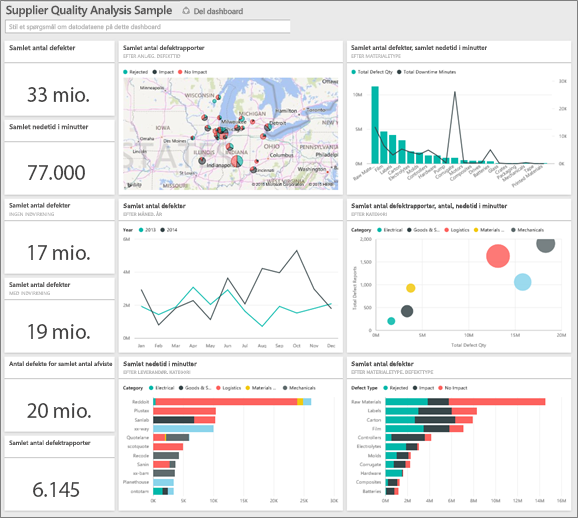

Dette eksempel er en del af en række, der illustrerer, hvordan du kan bruge Power BI med forretningsrelaterede data, rapporter og dashboards.
Der er anvendt rigtige data fra obviEnce ([www.obvience.com](http://www.obvience.com/)), der er blevet anonymiseret.

## Forudsætninger

 Før du kan bruge eksemplet, skal du først hente det som en [indholdspakke](https://docs.microsoft.com/en-us/power-bi/sample-supplier-quality#get-the-content-pack-for-this-sample), [.pbix-fil](http://download.microsoft.com/download/8/C/6/8C661638-C102-4C04-992E-9EA56A5D319B/Supplier-Quality-Analysis-Sample-PBIX.pbix) eller [Excel-projektmappe](http://go.microsoft.com/fwlink/?LinkId=529779).

### Hent indholdspakken for dette eksempel

1. Åbn Power BI-tjenesten (app.powerbi.com), og log på.
2. Vælg **Hent data** i nederste venstre hjørne.
   
    
3. Vælg ikonet **Eksempler** på siden Hent data, der vises.
   
   
4. Vælg **Supplier Quality Analysis Sample**, og vælg **Opret forbindelse**.  
  
   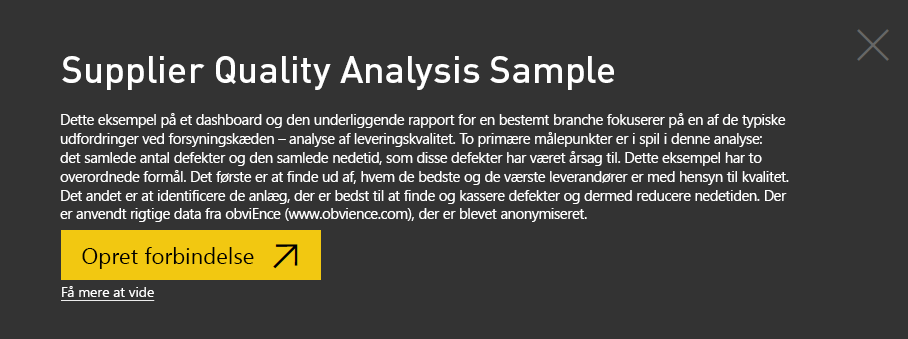
   
5. Power BI importerer indholdspakken og føjer et nyt dashboard, en rapport og et datasæt til dit aktuelle arbejdsområde. Det nye indhold er markeret med en gul stjerne. 
   
   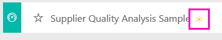
  
### Hent .pbix-filen knyttet til dette eksempel

Du kan også hente eksemplet som en pbix-fil, som er beregnet til brug med Power BI Desktop. 

 * [Supplier Quality Analysis Sample](http://download.microsoft.com/download/8/C/6/8C661638-C102-4C04-992E-9EA56A5D319B/Supplier-Quality-Analysis-Sample-PBIX.pbix)

### Hent Excel-projektmappen for dette eksempel
Du kan også [kun downloade datasættet (Excel-projektmappe)](http://go.microsoft.com/fwlink/?LinkId=529779) for dette eksempel. Projektmappen indeholder Power View-ark, som du kan få vist og redigere. Du kan se de rå data ved at vælge **Power Pivot > Administrer**.

## Nedetid på grund af defekte materialer
Lad os analysere den nedetid, der skyldes defekte materialer, og se, hvilke forhandlere der er ansvarlige.  

1. På dashboardet skal du vælge talfeltet **Defekt antal i alt** eller talfeltet **Nedetid i minutter i alt**.  

   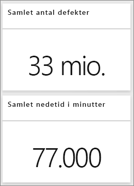  

   "Eksempel på analyse af leveringskvalitet"-rapporten åbner siden "Analyse af nedetid". Bemærk, at vi har 33 millioner defekte enheder i alt, og den samlede nedetid, som disse enheder er skyld i, er på 77.000 minutter. Nogle materialer har færre defekte enheder, men de kan forårsage store forsinkelser, der medfører længere nedetid. Lad os se nærmere på dem på siden med rapporter.  
2. På linjen **Nedetid i minutter i alt** i kombinationsdiagrammet **Defekter og nedetid (min.) efter materialetype** kan vi se, at korrugerede materialer forårsager mest nedetid.  
3. Vælg kolonnen **Korrugeret** i det samme kombinationsdiagram for at se, hvilke anlæg, der påvirkes mest af denne defekt, og hvilken forhandler der er ansvarlig.  

     
4. Vælg individuelle anlæg på kortet for at se, hvilken forhandler eller hvilket materiale der er ansvarligt for nedetid på det pågældende anlæg.

### Hvem er de værste forhandlere?
 Vi ønsker at finde de værste otte forhandlere og at finde ud af, hvilken procentdel af nedetiden, de er ansvarlige for. Det kan vi gøre ved at ændre områdediagrammet **Nedetid (min.) efter forhandler** til en træstruktur.  

1. På side 3 af rapporten "Analyse af nedetid" skal du vælge **Rediger rapport** i det øverste venstre hjørne.  
2. Vælg områdediagrammet **Nedetid (min.) efter leverandør**, og vælg Træstruktur i ruden Visuelle elementer.  

   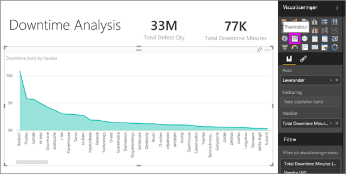  

    Træstrukturen indstiller automatisk feltet **Leverandør** til **Gruppe**.  

      

   I træstrukturen kan vi se de otte største leverandører som otte blokke til venstre. Vi kan også se, at de står for 50 % af alle minutterne i nedetiden.  
3. Vælg **Eksempel på analyse af leveringskvalitet** på den øverste navigationslinje for at vende tilbage til dashboardet.

### Sammenligning af anlæg
Nu vil vi se nærmere på, hvilke anlæg der er bedst til administration af defekte materialer, hvilket resulterer i mindre nedetid.  

1. Vælg kortfeltet **Defektrapporter i alt efter anlæg, defekttype**.  

    Rapporten åbner siden "Leveringskvalitet".  

   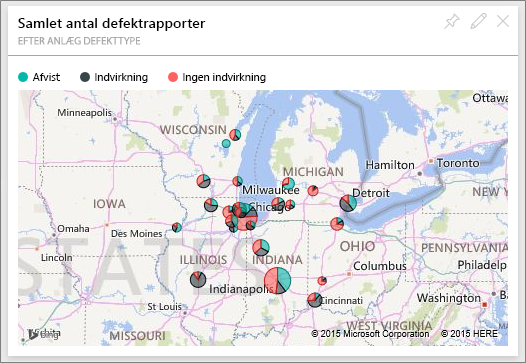  
2. I kortforklaringen skal du vælge cirklen **Indvirkning**.  

    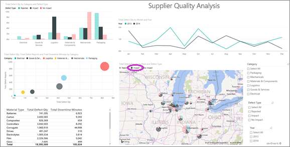  

    Bemærk i boblediagrammet, at **Logistik** er den mest problematiske kategori – den er størst i forhold til antallet af defekter i alt, defektrapporter i alt og nedetid i minutter alt. Lad os se nærmere på denne kategori.  
3. Vælg Logistik-boblen i boblediagrammet, og se på anlæggene i Springfield, IL og Naperville, IL. Naperville ser ud til at klare sig meget bedre inden for administration af defekte leveringer, fordi den har et højt antal kasseringer og få indvirkninger, sammenlignet med Springfield’s høje antal indvirkninger.  

   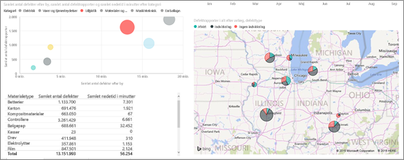  
4. Vælg **Eksempel på analyse af leveringskvalitet** på den øverste navigationslinje for at vende tilbage til dit aktive arbejdsområde.

## Hvilken materialetype er bedst administreret?
Den bedst administrerede materialetype er den med den korteste nedetid eller ingen indvirkning, uanset antallet af defekter.

* Se på feltet **Antal defekter i alt efter materialetype, defekttype** på dashboardet.

  

Bemærk, at **Råmaterialer** har et højt antal defekter i alt, men at de fleste af defekterne enten kasseres eller ingen indvirkning har.

Lad os bekræfte, at råmaterialer ikke medfører en masse nedetid trods det høje antal defekter.

* Se på feltet **Antal defekter i alt , samlet nedetid i minutter efter materialetype** på dashboardet.

  

Tilsyneladende administreres råmaterialer godt: De har flere defekter, men en kortere nedetid i minutter.

### Sammenlign defekter i forhold til nedetid efter år
1. Vælg kortfeltet **Samlet antal defektrapporter efter anlæg, defekttype** for at åbne rapporten til den første rapportside, Leveringskvalitet.
2. Bemærk, at **Antal defekter** er højere i 2014 end i 2013.  

    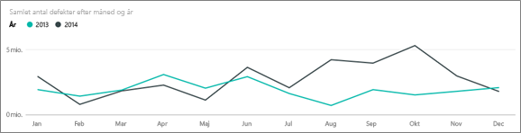  
3. Betyder flere defekter mere nedetid? Vi kan stille spørgsmål i Spørgsmål og svar for at finde ud af.  
4. Vælg **Eksempel på analyse af leveringskvalitet** på den øverste navigationslinje for at vende tilbage til dashboardet.  
5. Da vi ved, at råmaterialer har det højeste antal defekter, kan du skrive "Vis materialetyper, år og samlet antal defekter" i spørgsmålsfeltet.  

    Der var mange flere defekte råmaterialer i 2014 end i 2013.  

    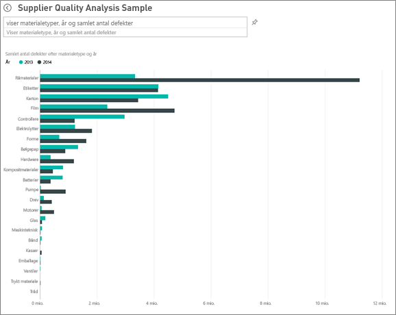  
6. Nu skal du ændre spørgsmålet til "Vis materialetyper, år og samlet nedetid i minutter".  

   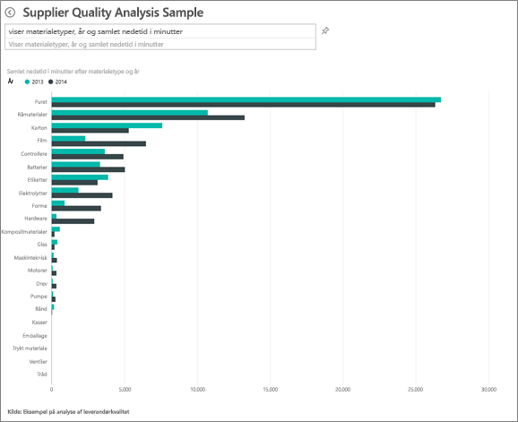

Nedetiden pga. råmaterialer var cirka den samme i 2013 og 2014, selvom der var mange flere defekte råmaterialer i 2014.

Det viser sig, at flere defekte råmaterialer i 2014 ikke førte til meget højere nedetid pga. råmaterialer i 2014.

### Sammenlign defekter i forhold til nedetid måned efter måned
Lad os se på et andet dashboardfelt, der har relation til det samlede antal defekte materialer.  

1. Vælg tilbage-pilen  i det øverste venstre hjørne over feltet til spørgsmål for at komme tilbage til dashboardet.  

    Når vi ser nærmere på feltet **Defekter i alt efter måned, år**, viser det, at det første halvår af 2014 havde et antal defekter, der ligner antallet i 2013, men i andet halvår af 2014 steg antallet af defekter væsentligt.  

      

    Lad os se, om denne forøgelse i antallet af defekter førte til en lignende forøgelse af nedetiden i minutter.  
2. Skriv "samlet nedetid i minutter efter måned og år som et kurvediagram" i feltet til spørgsmål.  

   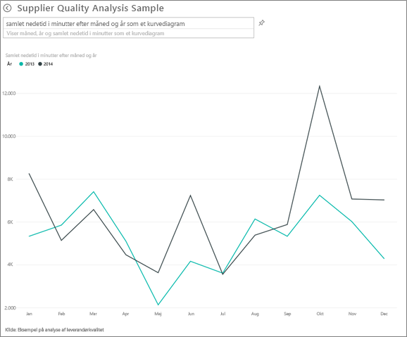

   Vi kan se et spring i nedetiden i minutter i juni og oktober, men derudover resulterede springet i det samlede antal defekter ikke i væsentligt længere nedetid. Det viser, at vi administrerer defekter korrekt.  
3. Du kan fastgøre dette diagram på dit dashboard ved at vælge tegnestiftikonet  til højre for feltet til spørgsmål.  
4. For at se nærmere på de afvigende måneder kan du f.eks. se på nedetiden i minutter i oktober efter materialetype, anlæggets placering, kategori osv. og stille spørgsmål som f.eks. "samlet nedetid i minutter i oktober efter anlæg".    
5. Vælg tilbage-pilen  i det øverste venstre hjørne over feltet til spørgsmål for at komme tilbage til dashboardet.

Dette er et sikkert miljø at lege i. Du kan altid vælge ikke at gemme dine ændringer. Hvis du gemmer dem, kan du altid gå til **Hent data** for at få en ny kopi af dette eksempel.

## Næste trin: Opret forbindelse til dine data
Vi håber, at denne rundtur viser, hvordan Power BI-dashboards, spørgsmål og svar og rapporter kan give indsigt i data om leveringskvalitet. Nu er det din tur – opret forbindelse til dine egne data. Med Power BI kan du oprette forbindelse til en lang række datakilder. Få mere at vide om, hvordan du [kommer i gang med Power BI](service-get-started.md).
