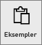
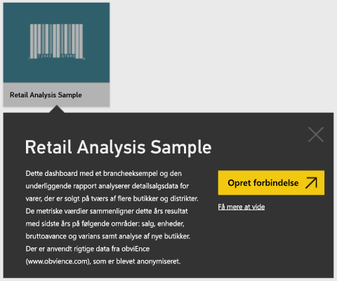
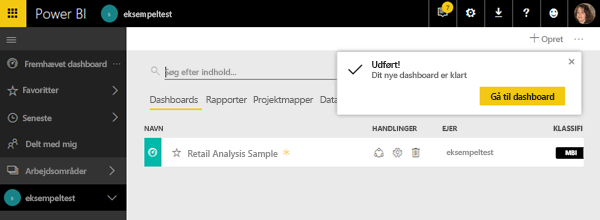
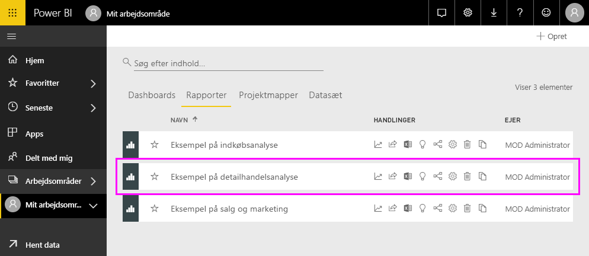
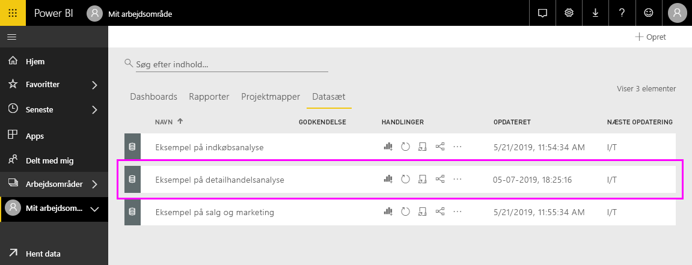
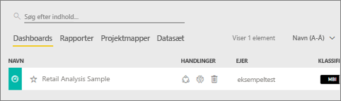
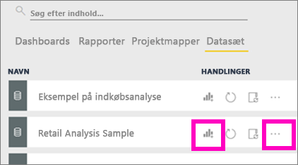
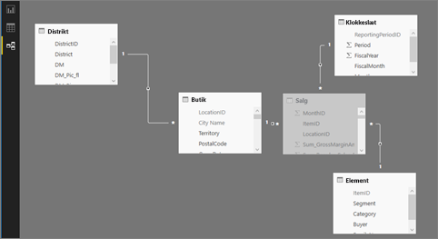

# Power BI-eksemplerne

Vi anbefaler at starte med artiklen [Eksempeldatasæt til Power BI](sample-datasets.md). I den artikel lærer du alt om eksemplerne. Hvordan du får dem, hvor du gemmer dem, hvordan du bruger dem og nogle af historierne, som hvert eksempel fortæller. Når du har fået styr på det grundlæggende, så vend tilbage til dette selvstudium.   

### Forudsætninger
Eksemplerne er tilgængelige for Power BI-tjenesten og Power BI Desktop. Hvis du vil følge med, bruger vi eksemplet på detailhandelsanalyse.

Indholdspakke med eksemplet *Retail Analysis*, der bruges i dette selvstudium, består af et dashboard, en rapport og et datasæt.
Lær denne indholdspakke og dens scenarie at kende ved at [tage en rundvisning af Retail Analysis-eksemplet](sample-retail-analysis.md), før du starter.

## Om dette selvstudium
Med denne vejledning lærer du, hvordan du kan 
- importere et eksempel på en indholdspakke, føje den til Power BI-tjenesten og åbne indholdet. En *indholdspakke* er en eksempeltype, hvor datasættet er pakket sammen med et dashboard og en rapport. 
-  åbne en .pbix-eksempelfil i Power BI Desktop.

## Eksempler og Power BI-tjenesten

1. Åbn Power BI-tjenesten (app.powerbi.com), og log på.
2. Vælg **Hent data** nederst i venstre navigationsrude. Hvis du ikke kan se **Hent data**, så udvid ruden ved at vælge .
   
   
5. Vælg **Eksempler**.  
   
   
6. Vælg *Retail Analysis Sample*, og vælg **Opret forbindelse**.   
   
   

## Hvad blev der helt præcist importeret?
Med indholdspakkerne med eksempel henter Power BI en kopi af indholdet og gemmer det for dig i clouden, når du vælger **Opret forbindelse**. Da den person, der oprettede indholdspakken inkluderede et datasæt, en rapport og et dashboard, er det, det du får, når du klikker på **Opret forbindelse**. 

1. Power BI opretter det nye dashboard og viser det på fanen **Dashboards**. Den gule stjerne viser dig, at det er nyt.
   
   
2. Åbn fanen **Rapporter**.  Her kan du se en ny rapport med navnet *Retail Analysis Sample*.
   
   
   
   Og se fanen **Datasæt**.  Der er også et nyt datasæt.
   
   

## Udforsk dit nye indhold
Udforsk nu dashboardet, datasættet og rapporten på egen hånd. Der er mange forskellige måder til at navigere til dine dashboards, rapporter og datasæt, og kun en af dem er beskrevet herunder.  

> [!TIP]
> Vil du holdes lidt i hånden først?  Prøv [Tour of the Retail Analysis sample](sample-retail-analysis.md), hvor du får en trinvis gennemgang af dette eksempel.
> 
> 

1. Naviger tilbage til fanen **Dashboards**, og vælg dashboardet *Retail Analysis Sample* for at åbne det.    
   
   
2. Dashboardet åbnes.  Det har forskellige visualiseringsfelter.
   
   
3. Vælg et af felterne for at åbne den underliggende rapport.  I dette eksempel vælger vi områdediagrammet (vist med lyserødt på det forrige billede). Rapporten åbnes på siden, der indeholder områdediagrammet.
   
    
   
   > [!NOTE]
   > Hvis feltet var blevet oprettet ved brug af [Power BI Q&A](power-bi-q-and-a.md), ville Q&A-siden være blevet åbent i stedet for. Hvis feltet er [fastgjort fra Excel](service-dashboard-pin-tile-from-excel.md), åbnes Excel Online i Power BI.
   > 
   > 
1. Tilbage på fanen **Datasæt** har du flere muligheder for at udforske dit datasæt.  Du kan ikke åbne det for at se alle rækkerne og kolonnerne (ligesom du kan i Power BI Desktop eller Excel).  Når en person deler en indholdspakke med kollegaer, ønsker de typisk at dele indsigt og ikke give deres kollegaer direkte adgang til dataene. Men det betyder ikke, at du ikke kan udforske datasættet.  
   
   
   
   * En af måderne til at udforske datasættet er ved at oprette dine egne visualiseringer og rapporter fra bunden.  Vælg ikonet Diagram  for at åbne datasættet i rapportredigeringstilstand.
     
       
   * En anden måde til at udforske datasættet er ved at køre [Hurtig indsigt](service-insights.md). Vælg ellipsen (...), og vælg **Få indsigt**. Vælg **Vis indsigt**, når indsigten er klar.
     
       

## Eksempler og Power BI Desktop 
Når du åbner PBIX-eksempelfilen for første gang, vises den i Rapportvisning, hvor du kan udforske, oprette og redigere et vilkårligt antal rapportsider med visualiseringer. Med Rapportvisning får du stort set samme designoplevelse som i Redigeringsvisning af en rapport i Power BI-tjenesten. Du kan flytte visualiseringer rundt, kopiere, indsætte og flette dem med mere.

Forskellen mellem dem er, at når du bruger Power BI Desktop, kan du arbejde med dine forespørgsler og modellere dine data for at sikre, at dataene giver den bedste indsigt i dine rapporter. Du kan derefter gemme din Power BI Desktop-fil et sted efter eget valg, uanset om det er på dit lokale drev eller i cloudmiljøet.

1. Åbn [.pbix-filen med Eksempel på detailhandelsanalyse](http://download.microsoft.com/download/9/6/D/96DDC2FF-2568-491D-AAFA-AFDD6F763AE3/Retail%20Analysis%20Sample%20PBIX.pbix) i Power BI Desktop. 

    

1. Filen åbnes i Rapportvisning. Har du set de fire faner nederst i rapporteditoren? De betyder, at der er fire sider i denne rapport, og at siden "Nye butikker" er valgt i øjeblikket. 

    .

3. Hvis du vil have en detaljeret gennemgang af rapporteditoren, skal du se [Få en præsentation af rapporteditoren](service-the-report-editor-take-a-tour.md)

## Hvad blev der helt præcist importeret?
Når du åbner PBIX-eksempelfilen i Desktop, får du faktisk vist en kopi af dataene, som gemmes i cloudmiljøet af Power BI. Fra Desktop har du adgang til rapporten ***og det underliggende datasæt***. Når dataene er indlæst, forsøger Power BI Desktop at finde og oprette relationer for dig.  

1. Skift til [Datavisning](desktop-data-view.md) ved at vælge .
 
    

    Med Datavisning kan du få hjælp til at undersøge, udforske og forstå data i din Power BI Desktop-model. Det er forskelligt fra den måde, du får vist tabeller, kolonner og data på i Forespørgselseditor. Med Datavisning får du vist dine data, når de er blevet indlæst i modellen.

    Når du udformer dine data, har du nogle gange brug for at se, hvad der rent faktisk findes i en tabel eller kolonne uden at skulle oprette en visualisering på rapportcanvasset, ofte helt ned på rækkeniveau. Dette er særligt tilfældet, når du opretter målinger og beregnede kolonner, eller du har brug for at identificere en datatype eller datakategori.

1. Skift til [Relationsvisning](desktop-relationship-view.md) ved at vælge ikonet,  .
 
    

    I Relationsvisning vises alle tabellerne, kolonnerne og relationerne i din model. Her kan du få vist, redigere og oprette relationer.

## Udforsk dit nye indhold
Udforsk nu datasættet, relationerne og rapporten på egen hånd. Du kan få hjælp til at komme i gang ved at gå til [Introduktion til Desktop](desktop-getting-started.md).    

## Næste trin
[Grundlæggende begreber i Power BI](service-basic-concepts.md)

[Eksempler til Power BI-tjenesten](sample-datasets.md)

[Datakilder til Power BI](service-get-data.md)

Har du flere spørgsmål? [Prøv at spørge Power BI-community'et](http://community.powerbi.com/)

