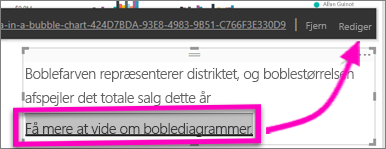

# Føj et link til et tekstfelt i en rapport
Tekstfelter kan føjes til rapporter, fastgøres til dashboards fra rapporter og føjes direkte til dashboards. Links kan føjes til et tekstfelt, uanset hvor det befinder sig.  

> **BEMÆRK**! Du kan finde oplysninger om links i Power BI-tabeller og -matrixer under [Links i tabeller](power-bi-hyperlinks-in-tables.md). Du kan se flere oplysninger om tilføjelse af tekstfelter i dit **dashboard** under [Tilføj et felt direkte fra dashboardet ](service-dashboard-add-widget.md). 
> 
> 

<iframe width="560" height="315" src="https://www.youtube.com/embed/_3q6VEBhGew#t=0m55s" frameborder="0" allowfullscreen></iframe>

## Sådan føjer du et link til et tekstfelt i en rapport
1. [Opret et tekstfelt, og tilføj en tekst](power-bi-reports-add-text-and-shapes.md). 
2. Markér den eksisterende tekst, eller tilføj en ny tekst, der skal bruges som et link.
   
   
3. Vælg linkikonet  .
4. Skriv eller indsæt URL-adressen i linkfeltet, og vælg **Udfør**.
   
   
5. Test linket.  
   
   
   
   * Placer markøren et sted i den markerede tekst for at få vist URL-adressen.  
     
      
   * Vælg URL-adressen for at åbne siden i et nyt browservindue.

## Sådan fjerner du linket, men lader teksten stå
1. Vælg linket i tekstfeltet for at fremhæve det.
   
     
2. Vælg **Fjern**. 

## Næste trin
[Tekstfelter i Power BI-rapporter](power-bi-reports-add-text-and-shapes.md)

Har du flere spørgsmål? [Prøv at spørge Power BI-community'et](http://community.powerbi.com/)

