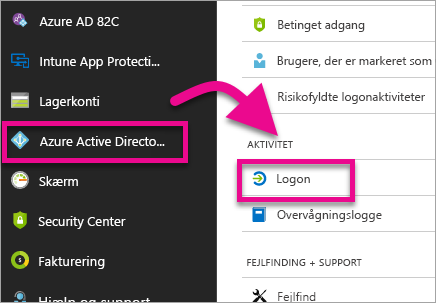
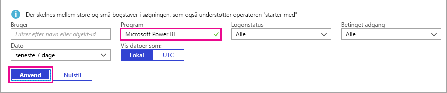
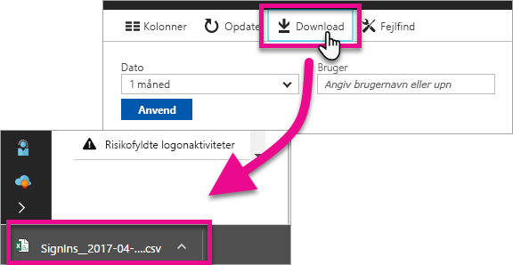

# Find Power BI-brugere, der er logget på

Hvis du er lejeradministrator og gerne vil se, hvem der er logget på Power BI, skal du bruge [adgang til Azure Active Directory og rapporter over forbrug](/azure/active-directory/reports-monitoring/concept-sign-ins) til at få indsigt.

> [!NOTE]
> Rapporter over **logonaktivitet** indeholder nyttige oplysninger, men du kan ikke se, hvilken type licens hver bruger har. Brug Microsoft 365 Administration til at få vist licenser.

## Krav

Alle brugere (herunder personer, der ikke er administratorer) kan se en rapport over deres egne logon, men du skal opfylde følgende krav for at få vist en rapport for alle brugere.

* Din lejer skal have en Azure Active Directory Premium-licens tilknyttet.

* Du skal have en af følgende roller: Global administrator, Sikkerhedsadministrator eller Sikkerhedslæser.

## Brug Azure Portal til at få vist logon

Følg disse trin for at få vist logonaktivitet.

1. På **Azure Portal** skal du vælge **Azure Active Directory**.

1. Under **Overvågning** skal du vælge **Logon**.
   
    

1. Filtrer programmet efter enten **Microsoft Power BI** eller **Power BI Gateway**, og vælg **Anvend**.

    **Microsoft Power BI** filtrerer efter logonaktivitet relateret til tjenesten, hvorimod **Power BI Gateway** filtrerer efter logonaktivitet, der er specifik for datagatewayen i det lokale miljø.
   
    

## Eksportér dataene

Du kan [downloade en rapport over logonaktivitet](/azure/active-directory/reports-monitoring/quickstart-download-sign-in-report) i et af to formater: en CSV-fil eller en JSON-fil.

Øverst i rapporten over **logonaktivitet** skal du vælge **Download** og derefter vælge en af følgende muligheder:

* **CSV** for at downloade en CSV-fil med de data, der er filtreret efter i øjeblikket.

* **JSON** for at downloade en JSON-fil med de data, der er filtreret efter i øjeblikket.

## Dataopbevaring

Relaterede logondata er tilgængelige i op til 30 dage. Du kan finde flere oplysninger i [Politikker om opbevaring af Azure Active Directory-rapport](/azure/active-directory/reports-monitoring/reference-reports-data-retention).

## De næste trin

[Brug af overvågning i din organisation](service-admin-auditing.md)

Har du flere spørgsmål? [Prøv at spørge Power BI-community'et](https://community.powerbi.com/)