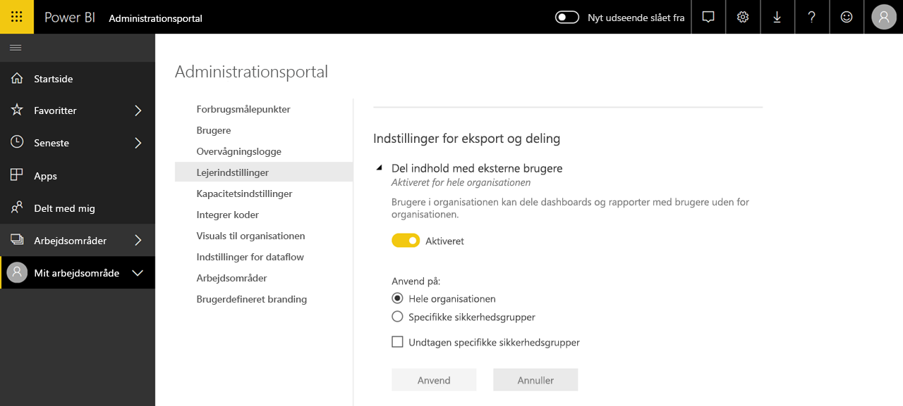

# Hvad er Power BI-administration?

Power BI-administration er administrationen af en Power BI-lejer, herunder konfigurationen af styringspolitikker, overvågning af brug samt klargøring af licenser, kapacitet og organisationens ressourcer. Denne artikel indeholder en oversigt over administrationsroller, -opgaver og -værktøjer samt links til artikler, der beskriver det mere detaljeret.

Power BI er udviklet til selvbetjeningsportalen for business intelligence, og administratoren er vogteren af data, processer og politikker i Power BI-lejeren. En Power BI-administrator er et vigtigt medlem af en gruppe, der omfatter BI-udviklere, analytikere og andre roller. Administratoren kan give support til en organisation for at sikre, at vigtige mål er opfyldt:

- Forstå de KPI'er og målepunkter, som brugerne _rent faktisk_ har brug for
- Reducer leveringstiden for it-baseret rapportering i virksomheden
- Opnå udvidet indførelse af og større afkastningsgrad for en installation af Power BI

Jobbet går ud på at sikre, at brugerne er produktive, og at sørge for sikkerhed og overholdelse af love og bestemmelser. Ansvarsområder kan omfatte hjælp og support og i mange tilfælde at hjælpe brugere i virksomheden med at gøre de rigtige ting.

## Administratorroller, der er relateret til Power BI

Der er flere roller, som er relateret til Power BI-administration, og de vises i følgende tabel.

| **Type af administrator** | **Administrativt omfang** | **Power BI-omfang** |
| --- | --- | --- |
| Office 365 Global Administrator | Office 365 | Kan administrere alle aspekter af en Power BI-lejer og andre tjenester. |
| Office 365-faktureringsadministrator | Office 365 | Kan erhverve licenser til Power BI via Office 365-abonnementer. |
| Power BI Service Administrator | Power BI-lejer | Har fuld kontrol over en Power BI-lejer og de tilhørende administrative funktioner (undtagen licensering). |
| Administrator af Power BI Premium-kapacitet | En enkelt Premium-kapacitet | Har fuld kontrol over en Premium-kapacitet og de tilhørende administrative funktioner. |
| Administrator af Power BI Embedded-kapacitet | En enkelt Embedded-kapacitet | Har fuld kontrol over en Embedded-kapacitet og de tilhørende administrative funktioner. |

Globale administratorer i Office 365 eller Azure Active Directory har administratorrettigheder i Power BI. Office 365 Global Administrator kan tildele andre brugere til rollen Power BI Service Administrator, der giver administrative rettigheder i forhold til Power BI-funktioner.

Power BI Service Administrators har adgang til Power BI-administrationsportalen, som indeholder forskellige indstillinger for lejerniveau, hvad angår funktionalitet, sikkerhed og overvågning. Tjenesteadministratorer har fuld adgang til alle ressourcer i en Power BI-lejer. I de fleste tilfælde identificerer tjenesteadministratorer problemer og følger derefter op på problemerne sammen med ressourceejerne for at foretage det nødvendige.

Rollen Power BI Service Administrator gør det ikke muligt at tildele licenser til brugere eller at se overvågningslogge i Office 365. Opgaven i forbindelse med administration af Power BI kan derfor i øjeblikket ikke udføres af brugere, der kun er medlemmer af rollen Power BI Service Administrator.

## Administrative opgaver

Administratorer udfører mange opgaver for at yde support til Power BI-lejeren i deres organisation, hvilket beskrives i følgende tabel.

| **Opgaveområde** | **Typiske opgaver** |
| --- | --- |
| Administrer Power BI-lejeren |<ul><li>Aktivér og deaktiver vigtige funktioner i Power BI <li>Rapportér om brug og ydeevne <li>Gennemse og administrer overvågning af hændelser</ul>|
| Erhverv og tildel licenser til Power BI |<ul><li>Administrer brugertilmelding <li>Køb og tildel Pro-licenser <li>Bloker brugeres adgang til Power BI</ul>|
| Administrer Premium-kapacitet |<ul><li>Opnå og arbejd med Premium-kapacitet <li>Opnå tjenestekvalitet|
| Administrer Embedded-kapacitet |<ul><li>Få Embedded-kapacitet for at gøre det mere simpelt for softwareproducenter og udviklere at bruge Power BI-funktioner</ul>|
| Sørg for overholdelse af interne politikker, love og bestemmelser | <ul><li>Administrer klassificering af virksomhedsdata <li>Hjælp til at gennemtvinge udgivelse af indhold og dele politikker</ul>|
| Administrer Power BI-ressourcer |<ul><li>Administrer arbejdsområder <li>Publicer Power BI-visuals <li>Kontrollér koder, der bruges til at integrere Power BI i andre programmer|
| Levér hjælp og support til brugere af lejeren |<ul><li>Foretag fejlfinding af dataadgang og andre problemer</ul>|
| Andre opgaver |<ul><li>Udrul Power BI Desktop, f.eks. ved hjælp af Microsoft Endpoint Configuration Manager <li>Administrer installation af Power BI-mobilapp med Intune <li>Administrer beskyttelse af personlige oplysninger og sikkerhed, f.eks. kildens datasikkerhed</ul>|

## Administrative værktøjer

Der er flere værktøjer, der er relateret til Power BI-administration, og de vises i følgende tabel. Administratorer bruger typisk det meste af deres tid på Power BI-administrationsportalen, og de anvender andre værktøjer efter behov.

| **Værktøj** | **Typiske opgaver** |
| --- | --- |
| Power BI-administrationsportal |<ul><li>Opnå og arbejd med Premium-kapacitet</li><li>Opnå tjenestekvalitet</li><li>Administrer klassificering af virksomhedsdata</li><li>Hjælp til at gennemtvinge udgivelse af indhold og dele politikker</li><li>Administrer arbejdsområder <li>Publicer Power BI-visuals</li><li>Kontrollér koder, der bruges til at integrere Power BI i andre programmer</li><li>Foretag fejlfinding af dataadgang og andre problemer</li></ul>|
| Microsoft 365 Administration |<ul><li>Administrer brugertilmelding</li><li>Køb og tildel Pro-licenser</li><li>Bloker brugeres adgang til Power BI</li></ul>|
| Office 365 Security & Compliance Center |<ul><li>Gennemse og administrer overvågning af hændelser</li></ul>|
| Azure Active Directory (AAD) på Azure-portalen |<ul><li>Konfigurer betinget adgang til Power BI-ressourcer via AAD</li><li>Klargør Power BI Embedded-kapacitet</li></ul>|
| PowerShell-cmdlet'er |<ul><li>Administrer arbejdsområder og andre aspekter af Power BI via scripts</li></ul>|
| Administrative API'er og SDK |<ul><li>Opret brugerdefinerede administrative værktøjer for at lette arbejdet for en Power BI-administrator. Power BI Desktop kan f.eks. bruge disse API'er til at oprette rapporter ud fra data, der er relateret til administration</li></ul>|

## Næste trin

Vi håber, at du ved at læse denne artikel har fået hurtig indsigt i jobbet som Power BI-administrator og i de specifikke roller, opgaver og værktøjer, der er involveret. Vi anbefaler følgende artikelemner, så du kan få en større forståelse.

- [Brug Power BI-administrationsportalen](service-admin-portal.md)
- [Vejledning til indstillinger for lejeradministrator](guidance/admin-tenant-settings.md)
- [Brug PowerShell-cmdlet'er](/powershell/power-bi/overview)
- [Ofte stillede spørgsmål om Power BI-administration](service-admin-faq.md)
- Har du spørgsmål? [Prøv at spørge Power BI-community'et](https://community.powerbi.com/)
- Forslag? [Få ideer til at forbedre Power BI](https://ideas.powerbi.com/)
