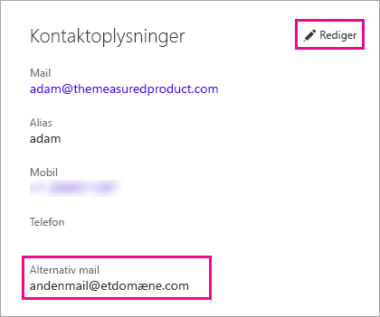

# <a name="use-an-alternate-email-address"></a>Brug af en alternativ mailadresse

Når du tilmelder dig Power BI, angiver du en mailadresse. Power BI bruger som standard denne adresse til at sende dig opdateringer om aktiviteter i tjenesten. Hvis nogen for eksempel sender en invitation til deling til dig, sendes den til denne adresse.

I nogle tilfælde vil du måske have disse mails sendt til en alternativ mailadresse i stedet for den, du har tilmeldt dig med. I denne artikel forklares det, hvordan du angiver en alternativ adresse i Office 365 og PowerShell. I artiklen forklares det også, hvordan en mailadresse løses i Azure Active Directory (Azure AD).

> [!NOTE]
> Angivelse af en alternativ mailadresse påvirker ikke den mailadresse, som Power BI bruger til tjenesteopdateringer, nyhedsbreve og anden kommunikation. Denne kommunikation sendes altid til den mailadresse, du brugte, da du tilmeldte dig Power BI.

## <a name="use-office-365"></a>Brug Office 365

Følg disse trin for at angive en alternativ adresse i Office 365.

1. Åbn [siden med personlige oplysninger i Office 365](https://portal.office.com/account/#personalinfo). Hvis du bliver bedt om at logge på, skal du logge på med den mailadresse og adgangskode, du bruger til Power BI.

1. Vælg **Personlige oplysninger** i menuen til venstre.

1. I afsnittet **Kontaktoplysninger** skal du vælge **Rediger**.

    Hvis du ikke kan redigere dine oplysninger, betyder det, at din mailadresse administreres af Office 365-administratoren. Kontakt administratoren for at opdatere din mailadresse.

    

1. I feltet **Alternativ mailadresse** skal du angive den mailadresse, som Office 365 skal bruge til opdateringer fra Power BI.

## <a name="use-powershell"></a>Brug PowerShell

Hvis du vil angive en alternativ adresse i PowerShell, skal du bruge kommandoen [Set-AzureADUser](/powershell/module/azuread/set-azureaduser/).

```powershell
Set-AzureADUser -ObjectId john@contoso.com -OtherMails "otheremail@somedomain.com"
```

## <a name="email-address-resolution-in-azure-ad"></a>Løsning af mailadresse i Azure AD

Hvis du vil registrere et integreringstoken for Azure AD til Power BI, kan du bruge tre forskellige mailtyper:

* Hovedmailadressen, som er knyttet til en brugers Azure AD-konto

* UPN-mailadressen (UserPrincipalName – brugerens hovednavn)

* Matrixattributten for *anden mailadresse*

Power BI vælger, hvilken mail der bruges, på baggrund af følgende sekvens:

1. Hvis mailattributten i Azure AD-lejerens brugerobjekt er til stede, så bruger Power BI denne mailattribut til mailadressen.

1. Hvis UPN-mailen *ikke* er en mailadresse på domænet **\*.onmicrosoft.com** (oplysningerne efter "\@"-symbolet), bruger Power BI denne mailattribut til mailadressen.

1. Hvis matrixattributten for *anden mailadresse* i Azure AD-brugerobjektet er til stede, så bruger Power BI den første mail på denne liste (da der kan være en liste over mails i denne attribut).

1. Hvis ingen af ovenstående betingelser er til stede, bruger Power BI UPN-adressen.

Har du flere spørgsmål? [Prøv at spørge Power BI-community'et](https://community.powerbi.com/)