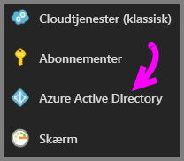
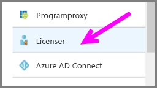
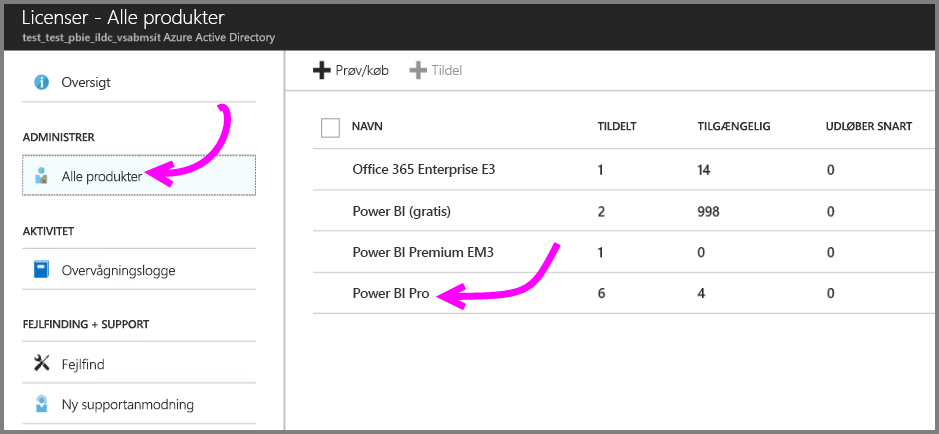
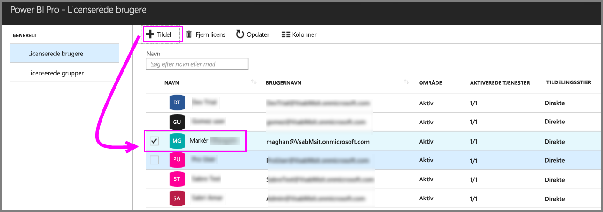

# Hurtig introduktion: Tildel Power BI Pro-licenser i Azure

Power BI Pro er en individuel licens, der giver adgang til alt indhold og alle funktioner i Power BI-tjenesten, herunder muligheden for at dele indhold og samarbejde med andre Pro-brugere. Det er kun Pro-brugere, der kan publicere og forbruge indhold fra apparbejdsområder, dele dashboards og abonnere på dashboards og rapporter. I denne artikel beskrives det, hvordan du kan tildele Power BI Pro-licenser i Azure. Du kan også [tildele licenser i Office 365](service-admin-assigning-power-bi-pro-licenses.md).

## Forudsætninger

Du skal være ejer af det Azure-abonnement, som Power BI bruger til opslag i Active Directory.

Du skal [købe mindst én licens](service-admin-purchasing-power-bi-pro.md), før du går i gang.

## Tildel licenser til individuelle brugerkonti

Benyt følgende fremgangsmåde for at tildele Power BI Pro-licenser til individuelle brugerkonti:

1. Åbn [Azure-portalen](https://ms.portal.azure.com/#@microsoft.onmicrosoft.com/dashboard/private/39bc3cf7-31a4-43f6-954c-f2d69ca2f0). 

2. Vælg **Azure Active Directory** på navigationslinjen til venstre.

    

3. Under **Azure Active Directory** skal du vælge **Licenser**.

    

4. Vælg **Alle produkter** under **Licenser**, og vælg derefter **Power BI Pro** for at få vist en liste over brugere med licens.

    

5. Vælg **Tildel** for at føje en Power BI Pro-licens til en brugerkonto.

    

## Næste trin

Nu, hvor du har tildelt licenser, kan du få mere at vide om Power BI Pro.

[Power BI Pro i din organisation](service-admin-power-bi-pro-in-your-organization.md)

[Find Power BI-brugere, der er logget på](service-admin-access-usage.md)

Har du flere spørgsmål? [Prøv at spørge Power BI-community'et](https://community.powerbi.com/)