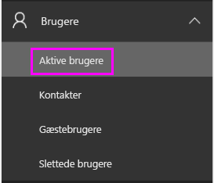
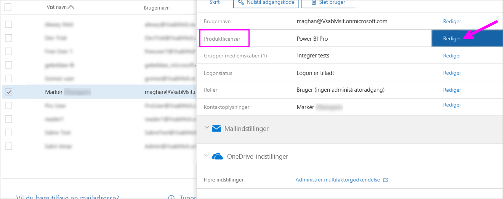
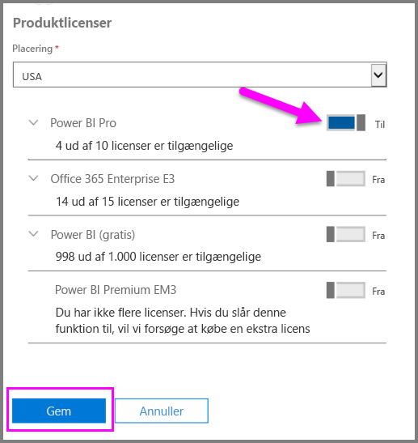
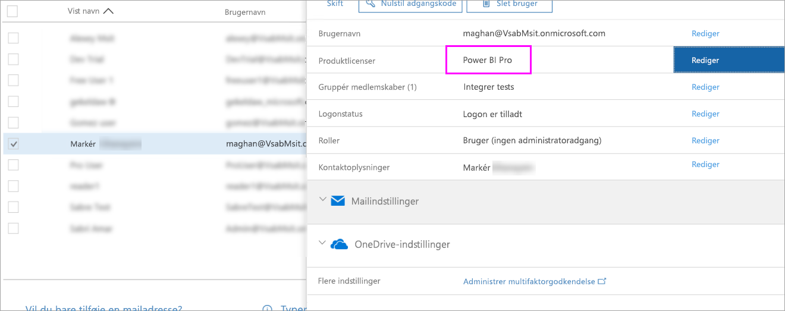

# Hurtig introduktion: Tildel Power BI Pro-licenser i Office 365

Power BI Pro er en individuel licens, der giver adgang til alt indhold og alle funktioner i Power BI-tjenesten, herunder muligheden for at dele indhold og samarbejde med andre Pro-brugere. Det er kun Pro-brugere, der kan publicere og forbruge indhold fra apparbejdsområder, dele dashboards og abonnere på dashboards og rapporter. I denne artikel beskrives det, hvordan du kan tildele Power BI Pro-licenser i Office 365. Du kan også [tildele licenser i Azure](service-admin-assigning-power-bi-pro-licenses-azure.md).

## Forudsætninger

Du skal være medlem af rollen [**Global administrator** eller **Administrator af brugerkonti**](https://support.office.com/article/about-office-365-admin-roles-da585eea-f576-4f55-a1e0-87090b6aaa9d?ui=en-US&rs=en-US&ad=US) i Office 365.

Du skal [købe mindst én licens](service-admin-purchasing-power-bi-pro.md), før du går i gang.

## Tildel licenser til individuelle brugerkonti

Benyt følgende fremgangsmåde for at tildele Power BI Pro-licenser til individuelle brugerkonti:

1. Åbn [Office 365 Administration](https://portal.office.com/adminportal/home#/homepage).

2. Udvid **Brugere** i navigationsruden til venstre, og vælg derefter **Aktive brugere**.

    

3. Vælg en bruger, og vælg derefter **Rediger** under **Produktlicenser**.

    

4. Skift indstillingen til **Til** under **Power BI Pro**, og vælg derefter **Gem**.

    

5. Under **Status** for den valgte konto skal du kontrollere, at Power BI Pro-licensen er blevet tildelt.

    

## Næste trin

Nu, hvor du har tildelt licenser, kan du få mere at vide om Power BI Pro.

[Power BI Pro i din organisation](service-admin-power-bi-pro-in-your-organization.md)

[Find Power BI-brugere, der er logget på](service-admin-access-usage.md)

Har du flere spørgsmål? [Prøv at spørge Power BI-community'et](https://community.powerbi.com/)