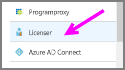
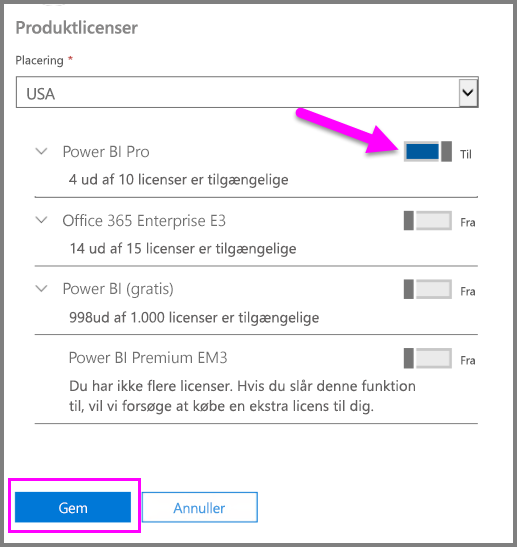
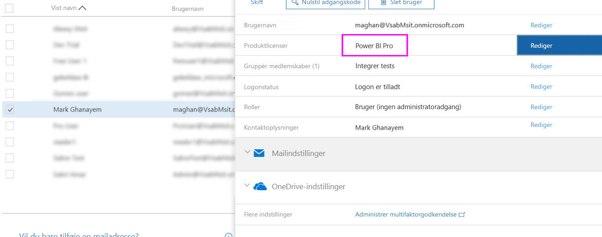

# Tildeling af Power BI Pro-licenser

Administratorer kan tildele Power BI Pro-licenser til brugere fra forskellige administrationsportaler og ved hjælper af PowerShell cmdlets. Administration af Power BI-licenser håndteres ved hjælp af Azure Active Directory (Azure AD).

* Ejere af Azure-abonnementer kan bruge et Azure Active Directory-blad i [Azure Portal](https://ms.portal.azure.com/#@microsoft.onmicrosoft.com/dashboard/private/39bc3cf7-31a4-43f6-954c-f2d69ca2f0). 

* Globale administratorer og administratorer af brugerkonti kan bruge [Office 365 Administration](https://portal.office.com/AdminPortal/Home#/homepage).

## Administration af Power BI Pro-licenser i Azure Portal

Power BI anvender Microsoft Azure Active Directory som en grundlæggende tjeneste. Microsoft Azure Active Directory bruges til at gemme brugerkonti og -grupper samt andre indstillinger, f.eks. oplysninger om købte produkter.

### Tildeling af licenser til individuelle brugerkonti

Benyt følgende fremgangsmåde til at tildele Pro-licenser til individuelle brugerkonti, hvis du har et Azure-abonnement:

1. Gå til [Azure Portal](https://ms.portal.azure.com/#@microsoft.onmicrosoft.com/dashboard/private/39bc3cf7-31a4-43f6-954c-f2d69ca2f0). 

2. Klik på Azure Active Directory på navigationslinjen til venstre.

    

3. Klik på Licenser under bladet Azure Active Directory.

    

4. Klik på Alle produkter under bladet Licenser, og klik derefter på Power BI Pro for at få vist en liste over brugere med licenser.

    

5. Klik på Tildel for at føje en Power BI Pro-licens til en brugerkonto.

    

> [!NOTE]
> Det er muligt at håndtere de fleste licensaspekter via Azure Portal, men det er ikke muligt at købe Power BI Pro-licenser. Brug Office 365 Administration til at købe et Power BI Pro-abonnement. Du kan få mere at vide under [Køb af Power BI Pro](https://docs.microsoft.com/en-us/power-bi/service-admin-purchasing-power-bi-pro).
>

## Administration af Power BI Pro-licenser i Office 365 Administration

Hvis du er global administrator, er Office 365 Administration stedet, hvor du køber Power BI Pro-abonnementer og administrerer de tilknyttede licenser for din organisation.

Benyt følgende fremgangsmåde til at tildele Pro-licenser til individuelle brugerkonti, hvis du er Office 365-administrator:

1. Naviger til Office 365 Administration.

2. Udvid Brugere i navigationsruden til venstre, og klik på Aktive brugere.

    

3. Vælg en eller flere brugere, og klik for at redigere produktlicenser.

    

4. Skift indstillingen til Til under Power BI Pro, og klik på Gem.

    

5. Bekræft under Status for den eller de valgte konti, at Power BI Pro-licensen er blevet tildelt.

    

> [!NOTE]
> Hvis dit abonnement ikke har flere tilgængelige licenser, kan du tilføje flere ved at udvide Fakturering i navigationsruden til venstre og derefter klikke på Abonnementer. Vælg Power BI Pro-abonnementet på siden Abonnementer, og klik på Tilføj/fjern licenser.
>

## Næste trin
[Power BI Pro i din organisation](service-admin-power-bi-pro-in-your-organization.md)
 
[Aktivering af den udvidede Pro-prøveversion](service-extended-pro-trial.md)
 
[Power BI-serviceaftale til individuelle brugere](https://powerbi.microsoft.com/terms-of-service/)
 
[Power BI Premium-meddelelse](https://aka.ms/pbipremium-announcement)
 
[Find Power BI-brugere, der er logget på](service-admin-access-usage.md)

Har du flere spørgsmål? [Prøv at spørge Power BI-community'et](https://community.powerbi.com/)