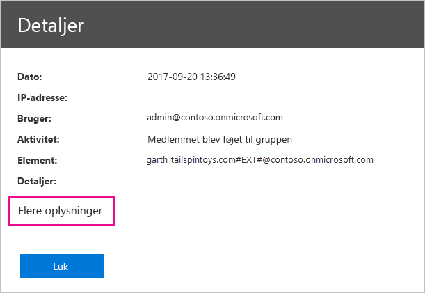

# <a name="using-auditing-within-your-organization"></a>Brug af overvågning i din organisation

Det kan være vigtigt at vide, hvem der udfører en bestemt handling på et element i din Power BI-lejer, for at hjælpe din organisation med at opfylde sine krav, for eksempel efterleve lovmæssig kravoverholdelse og datastyring. Brug overvågning i Power BI, hvis du vil overvåge brugernes handlinger, f.eks. "Vis rapport" og "Vis dashboard". Du kan ikke bruge overvågning til at overvåge tilladelser.

Du arbejder med overvågning i Office 365 Security and Compliance Center eller ved hjælp af PowerShell. Overvågning er afhængig af funktionaliteten i Exchange Online, som er klargjort automatisk til at understøtte Power BI.

Du kan filtrere overvågningsdataene efter datointerval, bruger, dashboard, rapport, datasæt og aktivitetstype. Du kan også downloade aktiviteterne i en CSV-fil (fil med kommaseparerede værdier), der kan analyseres offline.

## <a name="requirements"></a>Krav

Du skal opfylde disse krav for at få adgang til overvågningslogger:

* Du skal enten være global administrator eller være tildelt rollen Audit Logs eller View-Only Audit Logs i Exchange Online for at få adgang til overvågningsloggen. Disse roller tildeles som standard til rollegrupperne Compliance Management og Organization Management på siden **Tilladelser** i Exchange Administration.

    Hvis du vil give konti, der ikke er administratorer, adgang til overvågningsloggene, skal du føje brugeren til en af disse rollegrupper som medlem. Du kan også oprette en brugerdefineret rollegruppe i Exchange Administration, tildele rollen Audit Logs eller View-Only Audit Logs til denne gruppe og derefter føje den konto, der ikke er administrator, til den nye rollegruppe. Du kan finde flere oplysninger under [Administrer rollegrupper i Exchange Online](/Exchange/permissions-exo/role-groups).

    Hvis du ikke kan få adgang til Exchange Administration via Office 365 Administration, skal du gå til https://outlook.office365.com/ecp og logge på ved hjælp af dine legitimationsoplysninger.

* Hvis du har adgang til overvågningsloggen, men du ikke er global administrator eller administrator af Power BI-tjenesten, vil du ikke have adgang til portalen Power BI Administration. I dette tilfælde skal du bruge et direkte link til [Office 365 Security & Compliance Center](https://sip.protection.office.com/#/unifiedauditlog).

## <a name="accessing-your-audit-logs"></a>Adgang til dine overvågningslogge

For at få adgang til logfiler skal du først sørge for, at log er aktiveret i Power BI. Du kan finde flere oplysninger i [Overvågningslogs](service-admin-portal.md#audit-logs) i dokumentationen til administrationsportalen. Der kan være op til 48 timers forsinkelse, fra at du aktiverer overvågning, til at du får vist data i overvågningsloggen. Hvis du ikke får vist data med det samme, skal du tjekke overvågningsloggene senere. Der kan være en lignende forsinkelse mellem at få tilladelse til at få vist overvågningslogge og til at kunne åbne logfilerne.

Power BI-overvågningslogs er tilgængelige direkte via [Office 365 Security & Compliance Center](https://sip.protection.office.com/#/unifiedauditlog). Der er også et link fra Power BI-administrationsportalen:

1. Vælg **tandhjulsikonet** øverst til højre i Power BI, og vælg derefter **Administrationsportal**.

   

1. Vælg **Overvågningslogger**.

1. Vælg **Gå til O365 Administration**.

   

## <a name="search-only-power-bi-activities"></a>Søg kun i Power BI-aktiviteter

Begræns resultaterne til aktiviteter, der kun er for Power BI, ved at følge disse trin. Se [listen over aktiviteter, der overvåges af Power BI](#list-of-activities-audited-by-power-bi) senere i denne artikel for at få et overblik.

1. På siden **Søgning i overvågningslog** under **Søg** skal du vælge rullelisten for **Aktiviteter**.

2. Vælg **Power BI-aktiviteter**.

   

3. Vælg et vilkårligt sted uden for markeringsfeltet for at lukke det.

Dine søgninger filtreres nu kun på aktiviteter i Power BI.

## <a name="search-the-audit-logs-by-date"></a>Søg i overvågningslogfilerne efter dato

Du kan søge i logfilerne efter datointerval ved hjælp af felterne **Startdato** og **Slutdato**. De sidste syv dage er valgt som standard. Datoen og klokkeslættet vises i UTC-format (Coordinated Universal Time). Det maksimale datointerval, du kan angive, er 90 dage. 

Der vises en fejlmeddelelse, hvis det angivne datointerval er større end 90 dage. Hvis du bruger det maksimale datointerval på 90 dage, skal du vælge det aktuelle klokkeslæt som **Startdato**. Ellers får du vist en fejlmeddelelse om, at startdatoen ligger tidligere end slutdatoen. Hvis du har slået overvågning til inden for de sidste 90 dage, kan datointervallet ikke starte før den dato, hvor overvågning blev slået til.


## <a name="search-the-audit-logs-by-users"></a>Søg i overvågningslogfilerne efter brugere

Du kan søge efter overvågningslogposter for aktiviteter, der er udført af bestemte brugere. Det gør du ved at angive et eller flere brugernavne i feltet **Brugere**. Brugernavnet ligner en e-mailadresse. Det er den konto, som brugerne logger på Power BI med. Lad dette felt være tomt for at returnere poster for alle brugere (og tjenestekonti) i din organisation.


## <a name="view-search-results"></a>Få vist søgeresultaterne

Når du har valgt **Søg**, indlæses søgeresultaterne, og efter et øjeblik vises de under **Resultater**. Når du er færdig med søgningen, vises antallet af fundne resultater. Der kan maksimalt vises 1000 hændelser. Hvis mere end 1000 hændelser opfylder søgekriterierne, vises de 1000 seneste hændelser.

### <a name="view-the-main-results"></a>Få vist de vigtigste resultater

Området **Resultater** indeholder følgende oplysninger om hver hændelse, der returneres af søgningen. Vælg en kolonneoverskrift under **Resultater** for at sortere resultaterne.

| **Kolonne** | **Definition** |
| --- | --- |
| Dato |Den dato og det klokkeslæt (i UTC-format), da hændelsen fandt sted. |
| IP-adresse |IP-adressen på den enhed, der blev brugt, da aktiviteten blev logført. IP-adressen vises i enten et IPv4- eller IPv6-adresseformat. |
| Bruger |Brugeren (eller tjenestekontoen), som udførte den handling, der udløste hændelsen. |
| Aktivitet |Den aktivitet, der blev udført af brugeren. Denne værdi svarer til de aktiviteter, som du har valgt på rullelisten **Aktiviteter**. For en hændelse fra Exchange-administratorens overvågningslogfil er værdien i denne kolonne en Exchange-cmdlet . |
| Element |Det objekt, der blev oprettet eller ændret som følge af den tilsvarende aktivitet. For eksempel den fil, der blev vist eller ændret, eller den brugerkonto, som blev opdateret. Ikke alle aktiviteter har en værdi i denne kolonne. |
| Detaljer |Yderligere oplysninger om en aktivitet. Igen er det ikke alle aktiviteter, der har en værdi. |

### <a name="view-the-details-for-an-event"></a>Få vist oplysninger om en hændelse

Du kan få vist flere oplysninger om en hændelse ved at klikke på hændelsesposten på listen over søgeresultater. Siden **Detaljer**, som indeholder de detaljerede egenskaber fra hændelsesposten, vises. De egenskaber, der skal vises, afhænger af den Office 365-tjeneste, hændelsen finder sted i. 

Vælg **Flere oplysninger** for at få vist disse detaljer. Alle poster i Power BI har en værdi på 20 for egenskaben RecordType. Du kan finde oplysninger om andre egenskaber i [Detaljerede egenskaber i overvågningsloggen](/office365/securitycompliance/detailed-properties-in-the-office-365-audit-log/).

   

## <a name="export-search-results"></a>Eksporter søgeresultaterne

Følg disse trin for at eksportere Power BI-overvågningslogfilen til en csv-fil.

1. Vælg **Eksportér resultater**.

1. Vælg enten **Gem indlæste resultater** eller **Download alle resultater**.

    

## <a name="use-powershell-to-search-audit-logs"></a>Brug PowerShell til at søge efter overvågningslogs

Du kan også bruge PowerShell til at få adgang til overvågningslogfilerne baseret på dit logon. I følgende eksempel kan du se, hvordan du opretter forbindelse til Exchange Online PowerShell og derefter bruger kommandoen [Search-UnifiedAuditLog](/powershell/module/exchange/policy-and-compliance-audit/search-unifiedauditlog?view=exchange-ps/) til at trække poster fra Power BI-overvågningsloggen. Hvis du vil køre scriptet, skal du være tildelt de nødvendige tilladelser, som beskrevet i afsnittet [Krav](#requirements).

```powershell
Set-ExecutionPolicy RemoteSigned

$UserCredential = Get-Credential

$Session = New-PSSession -ConfigurationName Microsoft.Exchange -ConnectionUri https://outlook.office365.com/powershell-liveid/ -Credential $UserCredential -Authentication Basic -AllowRedirection

Import-PSSession $Session
Search-UnifiedAuditLog -StartDate 9/11/2018 -EndDate 9/15/2018 -RecordType PowerBI -ResultSize 1000 | Format-Table | More
```

Du kan finde flere oplysninger om at oprette forbindelse til Exchange Online under [Opret forbindelse til Exchange Online PowerShell](/powershell/exchange/exchange-online/connect-to-exchange-online-powershell/connect-to-exchange-online-powershell/). Hvis du vil se et andet eksempel på brug af PowerShell med overvågningslogs, skal du se [Brug af Power BI-overvågningslog og PowerShell til at tildele Power BI Pro-licenser](https://powerbi.microsoft.com/blog/using-power-bi-audit-log-and-powershell-to-assign-power-bi-pro-licenses/).

## <a name="activities-audited-by-power-bi"></a>Aktiviteter, der overvåges af Power BI

Følgende aktiviteter overvåges af Power BI.

| Brugervenligt navn                                     | Handlingsnavn                              | Noter                                  |
|---------------------------------------------------|---------------------------------------------|------------------------------------------|
| Datakilde er føjet til Power BI-gateway             | AddDatasourceToGateway                      |                                          |
| Adgang til Power BI-mapper er tilføjet                      | AddFolderAccess                             | Ikke anvendt i øjeblikket                       |
| Power BI-gruppemedlemmer er tilføjet                      | AddGroupMembers                             |                                          |
| Administratoren har knyttet dataflowlagerkontoen til lejer | AdminAttachedDataflowStorageAccountToTenant | Anvendes ikke i øjeblikket                       |
| Analyseret Power BI-datasæt                         | AnalyzedByExternalApplication               |                                          |
| Power BI-rapport er analyseret                          | AnalyzeInExcel                              |                                          |
| Bundne Power BI-datasæt til gateway                | BindToGateway                               |                                          |
| Kapacitetstilstand er ændret                            | ChangeCapacityState                         |                                          |
| Kapacitet for brugertildeling er ændret                  | UpdateCapacityUsersAssignment               |                                          |
| Power BI-datasætforbindelser er ændret              | SetAllConnections                           |                                          |
| Ændrede administratorer af Power BI-gateway                   | ChangeGatewayAdministrators                 |                                          |
| Ændrede brugere af datakilde fra Power BI-gateway        | ChangeGatewayDatasourceUsers                |                                          |
| Power BI organisationsindholdspakke er oprettet      | CreateOrgApp                                |                                          |
| Power BI-app er oprettet                              | CreateApp                                   |                                          |
| Power BI-dashboard er oprettet                        | CreateDashboard                             |                                          |
| Power BI-dataflow er oprettet                         | CreateDataflow                              |                                          |
| Power BI-datasæt er oprettet                          | CreateDataset                               |                                          |
| Power BI-mailabonnement er oprettet               | CreateEmailSubscription                     |                                          |
| Power BI-mappe er oprettet                           | CreateFolder                                |                                          |
| Oprettet Power BI-gateway                          | CreateGateway                               |                                          |
| Power BI-gruppe er oprettet                            | CreateGroup                                 |                                          |
| Power BI-rapport er oprettet                           | CreateReport                                |                                          |
| Dataflowet er overført til ekstern lagerkonto     | DataflowMigratedToExternalStorageAccount    | Ikke anvendt i øjeblikket                       |
| Dataflowtilladelser er tilføjet                        | DataflowPermissionsAdded                    | Ikke anvendt i øjeblikket                       |
| Dataflowtilladelser er fjernet                      | DataflowPermissionsRemoved                  | Ikke anvendt i øjeblikket                       |
| Power BI-organisationsindholdspakke er slettet      | DeleteOrgApp                                |                                          |
| Power BI-kommentar er slettet                          | DeleteComment                               |                                          |
| Power BI-dashboard er slettet                        | DeleteDashboard                             | Anvendes ikke i øjeblikket                       |
| Power BI-dataflow er slettet                         | DeleteDataflow                              | Anvendes ikke i øjeblikket                       |
| Power BI-datasæt er slettet                          | DeleteDataset                               |                                          |
| Power BI-mailabonnement er slettet               | DeleteEmailSubscription                     |                                          |
| Power BI-mappe er slettet                           | DeleteFolder                                |                                          |
| Adgang til Power BI-mapper er slettet                    | DeleteFolderAccess                          | Anvendes ikke i øjeblikket                       |
| Slettet Power BI-gateway                          | DeleteGateway                               |                                          |
| Power BI-gruppe er slettet                            | DeleteGroup                                 |                                          |
| Power BI-rapport er slettet                           | DeleteReport                                |                                          |
| Datakilder til Power BI-datasæt er fundet          | GetDatasources                              |                                          |
| Downloadet Power BI-rapport                        | DownloadReport                              |                                          |
| Power BI-certificeringstilladelse blev redigeret          | EditCertificationPermission                 | Ikke anvendt i øjeblikket                       |
| Power BI-dashboard er redigeret                         | EditDashboard                               | Anvendes ikke i øjeblikket                       |
| Power BI-datasæt er redigeret                           | EditDataset                                 |                                          |
| Egenskaber for Power BI-datasæt er redigeret                | EditDatasetProperties                       | Ikke anvendt i øjeblikket                       |
| Power BI-rapport er redigeret                            | EditReport                                  |                                          |
| Power BI-dataflow er eksporteret                        | ExportDataflow                              |                                          |
| Visualiseringsdata for Power BI-rapporten er eksporteret              | ExportReport                                |                                          |
| Power BI-feltdata er eksporteret                       | ExportTile                                  |                                          |
| Dataflowtilladelser blev ikke tilføjet                | FailedToAddDataflowPermissions              | Ikke anvendt i øjeblikket                       |
| Dataflowtilladelser blev ikke fjernet             | FailedToRemoveDataflowPermissions           | Anvendes ikke i øjeblikket                       |
| SAS-token til Power BI dataflow er oprettet             | GenerateDataflowSasToken                    |                                          |
| Integrationstoken til Power BI er oprettet                    | GenerateEmbedToken                          |                                          |
| Fil er importeret i Power BI                         | Importér                                      |                                          |
| Power BI-app er installeret                            | InstallApp                                  |                                          |
| Arbejdsområde er overført til en kapacitet                  | MigrateWorkspaceIntoCapacity                |                                          |
| Power BI-kommentar er postet                           | PostComment                                 |                                          |
| Power BI-dashboard er udskrevet                        | PrintDashboard                              |                                          |
| Power BI-rapportside er udskrevet                      | PrintReport                                 |                                          |
| Power BI-rapport er publiceret på internettet                  | PublishToWebReport                          |                                          |
| Power BI-dataflowhemmelighed er modtaget fra Key Vault  | ReceiveDataflowSecretFromKeyVault           | Anvendes ikke i øjeblikket                       |
| Datakilde fjernet fra Power BI-gateway         | RemoveDatasourceFromGateway                 |                                          |
| Power BI-gruppemedlemmer er fjernet                    | DeleteGroupMembers                          |                                          |
| Arbejdsområde er fjernet fra en kapacitet                 | RemoveWorkspacesFromCapacity                |                                          |
| Power BI-dashboard er omdøbt                        | RenameDashboard                             |                                          |
| Der er anmodet om opdatering af Power BI-dataflowet               | RequestDataflowRefresh                      | Anvendes ikke i øjeblikket                       |
| Der er anmodet om opdatering af Power BI-datasættet                | RefreshDataset                              |                                          |
| Power BI-arbejdsområder er hentet                     | GetWorkspaces                               |                                          |
| Angiv planlagt opdatering af Power BI-dataflow        | SetScheduledRefreshOnDataflow               |                                          |
| Angiv planlagt opdatering af Power BI-datasæt         | SetScheduledRefresh                         |                                          |
| Power BI-dashboard er delt                         | ShareDashboard                              |                                          |
| Power BI-rapport er delt                            | ShareReport                                 |                                          |
| Påbegyndt udvidet prøveperiode med Power BI                   | OptInForExtendedProTrial                    | Anvendes ikke i øjeblikket                       |
| Power BI-prøveperiode er startet                            | OptInForProTrial                            |                                          |
| Power BI-datakilde er overtaget                   | TakeOverDatasource                          |                                          |
| Power BI-datasæt er overtaget                        | TakeOverDataset                             |                                          |
| Publicering af Power BI-app er fjernet                          | UnpublishApp                                |                                          |
| Opdater indstillinger for ressourcestyring af kapacitet      | UpdateCapacityResourceGovernanceSettings    | I øjeblikket ikke en del af Office 365-administrationsportalen |
| Kapacitetsadministrator er opdateret                            | UpdateCapacityAdmins                        |                                          |
| Vist navn for kapacitet er opdateret                     | UpdateCapacityDisplayName                   |                                          |
| Power BI-indstillinger for organisation er opdateret          | UpdatedAdminFeatureSwitch                   |                                          |
| Power BI-appen er opdateret                              | UpdateApp                                   |                                          |
| Power BI-dataflowet er opdateret                         | UpdateDataflow                              |                                          |
| Datakilder til Power BI-datasæt er opdateret             | UpdateDatasources                           |                                          |
| Parametre for Power BI-datasæt er opdateret               | UpdateDatasetParameters                     |                                          |
| Power BI-mailabonnement er opdateret               | UpdateEmailSubscription                     |                                          |
| Power BI-mappe er opdateret                           | UpdateFolder                                |                                          |
| Adgang til Power BI-mappe er opdateret                    | UpdateFolderAccess                          |                                          |
| Legitimationsoplysninger for Power BI-gatewaydatakilde er opdateret  | UpdateDatasourceCredentials                 |                                          |
| Power BI-dashboard er vist                         | ViewDashboard                               |                                          |
| Power BI-dataflow er vist                          | ViewDataflow                                |                                          |
| Power BI-rapport er vist                            | ViewReport                                  |                                          |
| Power BI-felt er vist                              | ViewTile                                    |                                          |
| Power BI-forbrugsdata er vist                     | ViewUsageMetrics                            |                                          |
|                                                   |                                             |                                          |

## <a name="next-steps"></a>Næste trin

[Hvad er Power BI-administration?](service-admin-administering-power-bi-in-your-organization.md)  

[Power BI-administrationsportal](service-admin-portal.md)  

Har du flere spørgsmål? [Prøv at spørge Power BI-community'et](http://community.powerbi.com/)
