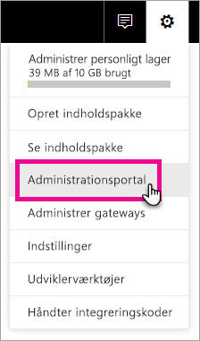
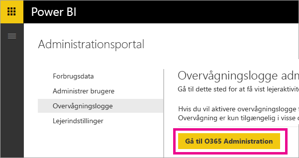
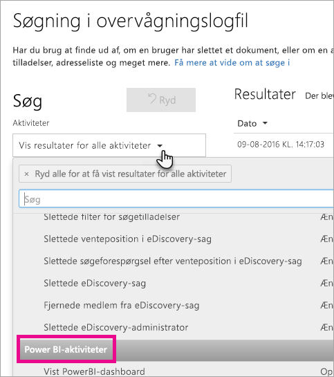
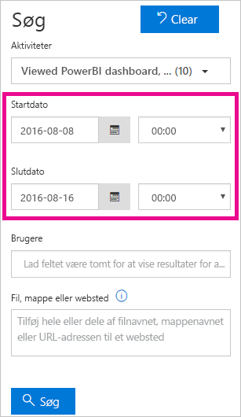
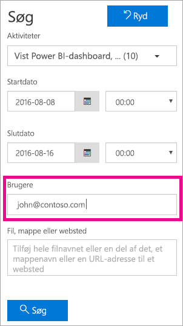
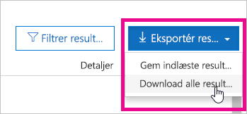

# <a name="using-auditing-within-your-organization"></a>Brug af overvågning i din organisation

<iframe width="560" height="315" src="https://www.youtube.com/embed/zj4kA39jV_4?showinfo=0" frameborder="0" allowfullscreen></iframe>

Få mere at vide om, hvordan du kan bruge overvågning med Power BI til at overvåge og undersøge udførte handlinger. Du kan bruge Security & Compliance Center eller PowerShell.

Det kan være vigtigt at vide, hvem der udfører en bestemt handling på et element i din Power BI-lejer, for at hjælpe din organisation med at opfylde sine krav, for eksempel efterleve lovmæssig kravoverholdelse og datastyring.

Du kan filtrere overvågningsdataene efter datointerval, bruger, dashboard, rapport, datasæt og aktivitetstype. Du kan også downloade aktiviteterne i en CSV-fil (fil med kommaseparerede værdier), der kan analyseres offline.

> [!NOTE]
> Overvågningsfunktionen i Power BI er i eksempelvisning og er tilgængelig i alle dataområder.

## <a name="requirements"></a>Krav
Du skal opfylde disse krav for at få adgang til overvågningslogger:

- Du skal have en Exchange Online-licens (inkluderet i Office 365 Enterprise E3- og E5- abonnementer) for at få adgang til sektionen overvågning i Office 365 Security & Compliance Center.
- Du skal enten være global administrator eller have en Exchange-administratorrolle, der giver adgang til overvågningsloggen. 

  Exchange-administratorroller styres via Exchange Administration. Du kan finde flere oplysninger under [Tilladelser i Exchange Online](https://technet.microsoft.com/library/jj200692(v=exchg.150).aspx).

- Hvis du har adgang til overvågningsloggen, men du ikke er global administrator eller administrator af Power BI-tjenesten, vil du ikke have adgang til portalen Power BI Administration. I dette tilfælde skal du have en direkte forbindelse til Office 365 Security & Compliance Center.

## <a name="enabling-auditing-functionality-in-the-power-bi-admin-portal"></a>Aktivér overvågningsfunktionalitet i Power BI-administrationsportalen

Du skal aktivere overvågning for din organisation, hvis du vil arbejde med rapporter. Du kan gøre dette i lejerindstillingerne på administrationsportalen.

1. Vælg **tandhjulsikonet** øverst til højre.

2. Vælg **Administrationsportal**.
   
   

3. Vælg **Lejerindstillinger**.
   
   

4. Slå **Opret overvågningslogge for intern aktivitetsovervågning og overholdelse** til.

5. Vælg **Anvend**.

Power BI starter med at logføre forskellige aktiviteter, som dine brugere udfører i Power BI. Det tager op til 48 timer, før logfilerne vises i O365 Security & Compliance Center. Du kan finde flere oplysninger om, hvilke aktiviteter der logføres, på [listen over aktiviteter, der overvåges af Power BI](#list-of-activities-audited-by-power-bi).

> [!NOTE]
> Hvis du vil aktivere overvågning for Power BI i din lejer, skal du have mindst én Exchange-postkasselicens i din lejer.

## <a name="accessing-your-audit-logs"></a>Adgang til dine overvågningslogge

Hvis du vil overvåge dine Power BI-logfiler, skal du besøge O365 Security & Compliance Center.

1. Vælg **tandhjulsikonet** øverst til højre.

2. Vælg **Administrationsportal**.
   
   

3. Vælg **Overvågningslogger**.
 
4. Vælg **Gå til O365 Administration**.
   
   

Alternativt kan du navigere til [Office 365 | Security & Compliance](https://protection.office.com/#/unifiedauditlog).

> [!NOTE]
> Hvis du vil give konti, der ikke er administratorkonti, adgang til overvågningslogfilen, skal du tildele tilladelser i Exchange Online-administration. Du kan for eksempel tildele en bruger til en eksisterende rollegruppe, f.eks. administration af organisation, eller du kan oprette en ny rollegruppe med rollen Overvågningslogger. Du kan finde flere oplysninger under [Tilladelser i Exchange Online](https://technet.microsoft.com/library/jj200692\(v=exchg.150\).aspx).

## <a name="search-only-power-bi-activities"></a>Søg kun i Power BI-aktiviteter

Du kan begrænse resultaterne til aktiviteter, der er kun for Power BI, ved at benytte følgende fremgangsmåde.

1. Vælg rullelisten for **Aktiviteter** under **Søg** på siden **Søgning i overvågningslogfil**.

2. Vælg **Power BI-aktiviteter**.
   
   

3. Vælg et vilkårligt sted uden for markeringsfeltet for at lukke det.

Dine søgninger filtreres nu kun på aktiviteter i Power BI.

## <a name="search-the-audit-logs-by-date"></a>Søg i overvågningslogfilerne efter dato

Du kan søge i logfilerne efter datointerval ved hjælp af feltet "Startdato" og "Slutdato". De sidste syv dage er valgt som standard. Datoen og klokkeslættet vises i UTC-format (Coordinated Universal Time). Det maksimale datointerval, du kan angive, er 90 dage. Der vises en fejlmeddelelse, hvis det angivne datointerval er større end 90 dage.

> [!NOTE]
> Hvis du bruger det maksimale datointerval på 90 dage, skal du vælge det aktuelle klokkeslæt for startdatoen. Ellers får du vist en fejlmeddelelse om, at startdatoen ligger tidligere end slutdatoen. Hvis du har slået overvågning til inden for de sidste 90 dage, kan det maksimale datointerval ikke startes før den dato, overvågning blev slået til på.



## <a name="search-the-audit-logs-by-users"></a>Søg i overvågningslogfilerne efter brugere

Du kan søge efter overvågningslogposter for aktiviteter, der er udført af bestemte brugere. Det gør du ved at angive et eller flere brugernavne i feltet "Brugere".  Det er det brugernavn, de benytter til at logge på Power BI med. Det ligner en mailadresse.
Lad dette felt være tomt for at returnere poster for alle brugere (og tjenestekonti) i din organisation.



## <a name="viewing-search-results"></a>Visning af søgeresultater

Når du trykker på søgeknappen, indlæses søgeresultaterne, og efter et øjeblik vises de under Resultater. Når du er færdig med søgningen, vises antallet af fundne resultater. 

> [!NOTE]
> Der vises maksimalt 1000 hændelser. Hvis mere end 1000 hændelser opfylder søgekriterierne, vises de 1000 seneste hændelser.

Resultaterne indeholder følgende oplysninger om hver hændelse, der returneres af søgningen.

| **Kolonne** | **Definition** |
| --- | --- |
| Dato |Den dato og det klokkeslæt (i UTC-format), da hændelsen fandt sted. |
| IP-adresse |IP-adressen på den enhed, der blev brugt, da aktiviteten blev logført. IP-adressen vises i enten et IPv4- eller IPv6-adresseformat. |
| Bruger |Brugeren (eller tjenestekontoen), som udførte den handling, der udløste hændelsen. |
| Aktivitet |Den aktivitet, der blev udført af brugeren. Denne værdi svarer til de aktiviteter, som du har valgt på rullelisten Aktiviteter. For en hændelse fra Exchange-administratorens overvågningslogfil er værdien i denne kolonne en Exchange-cmdlet . |
| Element |Det objekt, der blev oprettet eller ændret som følge af den tilsvarende aktivitet. For eksempel den fil, der blev vist eller ændret, eller den brugerkonto, som blev opdateret. Ikke alle aktiviteter har en værdi i denne kolonne. |
| Detaljer |Yderligere oplysninger om en aktivitet. Igen er det ikke alle aktiviteter, der har en værdi. |

> [!NOTE]
> Vælg en kolonneoverskrift under Resultater for at sortere resultaterne. Du kan sortere resultaterne fra A til Z eller Z til A. Klik på overskriften Dato for at sortere resultaterne fra det ældste til det nyeste eller nyeste til ældste.

## <a name="view-the-details-for-an-event"></a>Få vist oplysninger om en hændelse

Du kan få vist flere oplysninger om en hændelse ved at vælge hændelsesposten på listen over søgeresultater. Der vises en side med oplysninger, som indeholder de detaljerede egenskaber fra hændelsesposten. De egenskaber, der skal vises, afhænger af den Office 365-tjeneste, hændelsen finder sted i. Vælg **Flere oplysninger** for at få vist flere detaljer.

Følgende tabel indeholder oplysninger, som du kan få vist.

| **Parameter eller hændelse** | **Beskrivelse** | **Flere oplysninger** |
| --- | --- | --- |
| Downloadet Power BI-rapport |Denne aktivitet logføres, hver gang en rapport downloades |Rapportnavn, Datasætnavn |
| Opret rapport |Denne aktivitet logføres, hver gang en ny rapport oprettes. |Rapportnavn, Datasætnavn |
| Rediger rapport |Denne aktivitet logføres, hver gang en rapport redigeres. |Rapportnavn, Datasætnavn |
| Opret datasæt |Denne aktivitet logføres, hver gang et datasæt oprettes. |Datasætnavn, DataConnectivityMode |
| Slet datasæt |Denne aktivitet logføres, hver gang et datasæt slettes. |Datasætnavn, DataConnectivityMode |
| Opret Power BI-app |Denne aktivitet logføres, hver gang en Power BI-app oprettes |Appnavn, Tilladelser, Navn på arbejdsområde |
| Installer Power BI-app |Denne aktivitet logføres, hver gang en Power BI-app installeres |Appnavn |
| Opdater Power BI-app |Denne aktivitet logføres, hver gang en Power-app opdateres |Appnavn, Tilladelser, Navn på arbejdsområde |
| Påbegyndt udvidet prøveperiode med Power BI |Denne aktivitet logføres, hver gang en bruger accepterer den udvidede Pro-prøveperiode, der kører til 31. maj 2018 | |
| Analyseret Power BI-datasæt |Denne aktivitet logføres, hver gang et Power BI-datasæt analyseres i Excel. | |
| Oprettet Power BI-gateway |Denne aktivitet logføres, hver gang en ny gateway oprettes. |Gatewaynavn, Gatewaytype |
| Slettet Power BI-gateway |Denne aktivitet logføres, hver gang en gateway slettes. |Gatewaynavn, Gatewaytype |
| Datakilde føjet til Power BI-gateway |Denne aktivitet logføres, hver gang en datakilde føjes til gatewayen |Gatewaynavn, Gatewaytype, Datakildenavn, Datakildetype |
| Datakilde fjernet fra Power BI-gateway |Denne aktivitet logføres, hver gang en datakilde fjernes fra gatewayen |Gatewaynavn, Gatewaytype, Datakildenavn, Datakildetype |
| Ændrede administratorer af Power BI-gateway |Denne aktivitet logføres, hver gang administratorerne af en gateway ændres (tilføjes/fjernes) |Gatewaynavn, Brugere, der er tilføjet, Brugere, der er fjernet |
| Ændrede brugere af datakilde fra Power BI-gateway |Denne aktivitet logføres, hver gang brugerne af en gateway ændres (tilføjes/fjernes) |Gatewaynavn, Brugere, der er tilføjet, Brugere, der er fjernet |
| SetScheduledRefresh |Denne aktivitet logføres, hver gang en ny opdatering planlægges for et datasæt |Datasætnavn, Opdateringshyppighed (i minutter) |

## <a name="using-powershell-to-search"></a>Brug af PowerShell til at søge

Du kan bruge PowerShell til at få adgang til overvågningslogfilerne baseret på dit logon. Det gøres ved at få adgang til Exchange Online. Her er et eksempel på en kommando til at trække Power BI-overvågningslogposter.

> [!NOTE]
> Hvis du vil bruge kommandoen New-PSSession, skal din konto have en Exchange Online-licens tildelt, og du skal have adgang til overvågningslogfilen for din lejer.

```
Set-ExecutionPolicy RemoteSigned

$UserCredential = Get-Credential

$Session = New-PSSession -ConfigurationName Microsoft.Exchange -ConnectionUri https://outlook.office365.com/powershell-liveid/ -Credential $UserCredential -Authentication Basic -AllowRedirection

Import-PSSession $Session
Search-UnifiedAuditLog -StartDate 9/11/2016 -EndDate 9/15/2016 -RecordType PowerBI -ResultSize 1000 | Format-Table | More
```

Du kan finde flere oplysninger om at oprette forbindelse til Exchange Online under [Opret forbindelse til Exchange Online PowerShell](https://technet.microsoft.com/library/jj984289\(v=exchg.160\).aspx).

Du kan finde flere oplysninger om parametre og brug af kommandoen Search-UnifiedAuditLog under [Search-UnifiedAuditLog](https://technet.microsoft.com/library/mt238501\(v=exchg.160\).aspx).

Du kan få vist et eksempel på at bruge PowerShell til at søge i overvågningslogfilen og derefter tildele Power BI Pro-licenser baseret på poster i [Brug Power BI-overvågningslogfilen og PowerShell til at tildele Power BI Pro-licenser](https://powerbi.microsoft.com/blog/using-power-bi-audit-log-and-powershell-to-assign-power-bi-pro-licenses/).

## <a name="export-the-power-bi-audit-log"></a>Eksportér Power BI-overvågningslogfilen

Du kan eksportere Power BI-overvågningslogfilen til en csv-fil.

1. Vælg **Eksportér resultater**.

2. Vælg enten **Gem indlæste resultater** eller **Download alle resultater**.
   
   

## <a name="record-and-user-types"></a>Post- og brugertyper

Overvågningslogposter har en RecordType og UserType som en del af detaljerne for posten. Alle Power BI-poster har en RecordType på 20.

Du kan finde en komplet liste i [Detaljerede egenskaber i Office 365-overvågningslogfilen](https://support.office.com/article/Detailed-properties-in-the-Office-365-audit-log-ce004100-9e7f-443e-942b-9b04098fcfc3)

## <a name="list-of-activities-audited-by-power-bi"></a>Liste over aktiviteter, der overvåges af Power BI

| Aktivitet | Beskrivelse | Flere oplysninger |
| --- | --- | --- |
| CreateDashboard |Denne aktivitet logføres, hver gang et nyt dashboard oprettes. |- Navn på dashboard. |
| EditDashboard |Denne aktivitet logføres, hver gang et dashboard omdøbes. |- Navn på dashboard. |
| DeleteDashboard |Denne aktivitet logføres, hver gang et dashboard slettes. |- Navn på dashboard. |
| PrintDashboard |Denne aktivitet logføres, hver gang et dashboard udskrives. |- Navn på dashboard.<br/>- Datasætnavn |
| ShareDashboard |Denne aktivitet logføres, hver gang et dashboard deles. |- Navn på dashboard.<br/>- Modtagermail.<br/>- Datasætnavn.<br>- Del tilladelser igen. |
| ViewDashboard |Denne aktivitet logføres, hver gang et dashboard vises. |- Navn på dashboard. |
| ExportTile |Denne hændelse logføres, hver gang der eksporteres data fra et dashboardfelt. |- Feltnavn.<br/>- Datasætnavn. |
| DeleteReport |Denne aktivitet logføres, hver gang en rapport slettes. |- Navn på rapport. |
| ExportReport |Denne hændelse logføres, hver gang der eksporteres data fra et rapportfelt. |- Navn på rapport.<br/>- Datasætnavn. |
| PrintReport |Denne aktivitet logføres, hver gang en rapport udskrives. |- Navn på rapport.<br/>- Datasætnavn. |
| PublishToWebReport |Denne aktivitet logføres, hver gang en rapport publiceres på internettet. |- Navn på rapport.<br/>- Datasætnavn. |
| ViewReport |Denne aktivitet logføres, hver gang en rapport vises. |- Navn på rapport. |
| ExploreDataset |Denne hændelse logføres, hver gang du udforsker et datasæt ved at vælge det. |- Datasætnavn |
| DeleteDataset |Denne hændelse logføres, hver gang et datasæt slettes. |- Datasætnavn. |
| CreateOrgApp |Denne aktivitet logføres, hver gang der oprettes en organisationsindholdspakke. |- Navn på organisationsindholdspakke.<br/>- Dashboardnavne.<br/>- Navne på rapporter.<br/>- Datasætnavne. |
| CreateGroup |Denne aktivitet udløses, hver gang der oprettes en gruppe. |- Gruppenavn. |
| AddGroupMembers |Denne aktivitet logføres, hver gang et medlem føjes til et Power BI-gruppearbejdsområde. |- Gruppenavn.<br/>- Mailadresser. |
| UpdatedAdminFeatureSwitch |Denne hændelse logføres, hver gang en administratorfunktionskontakt ændres. |- Kontaktnavn.<br/>- Ny kontakttilstand. |
| OptInForProTrial |Denne hændelse logføres, når en bruger vælger at prøve Power BI Pro i tjenesten. |- mailadresse |

## <a name="next-steps"></a>Næste trin

[Power BI-administrationsportal](service-admin-portal.md)  
[Power BI Premium – hvad er det?](service-premium.md)  
[Køb Power BI Pro](service-admin-purchasing-power-bi-pro.md)  
[Tilladelser i Exchange Online](https://technet.microsoft.com/library/jj200692\(v=exchg.150\).aspx)  
[Opret forbindelse til Exchange Online PowerShell](https://technet.microsoft.com/library/jj984289\(v=exchg.160\).aspx)  
[Search-UnifiedAuditLog](https://technet.microsoft.com/library/mt238501\(v=exchg.160\).aspx)  
[Detaljerede egenskaber i Office 365-overvågningslogfilen](https://support.office.com/article/Detailed-properties-in-the-Office-365-audit-log-ce004100-9e7f-443e-942b-9b04098fcfc3)  

Har du flere spørgsmål? [Prøv at spørge Power BI-community'et](http://community.powerbi.com/)