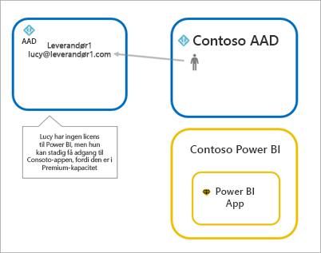
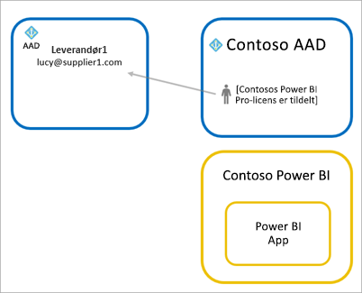
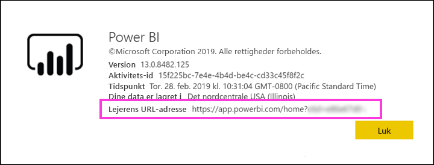

# Distribuer Power BI-indhold til eksterne gæstebrugere med Azure AD B2B

Power BI kan integreres med Azure Active Directory Business-til-business (Azure AD B2B) for at tillade sikker distribution af Power BI-indhold til gæstebrugere uden for din organisation, mens du stadig bevarer kontrollen over de interne data.  

Du kan desuden give gæstebrugere uden for din organisation adgang til at redigere og administrere indhold i din organisation.

## Aktivér adgang

Sørg for at aktivere den [dele indhold med eksterne brugere](service-admin-portal.md#export-and-sharing-settings) funktion i Power BI-administrationsportalen før du inviterer gæstebrugere.

Du kan også bruge den [Tillad eksterne gæstebrugere til at redigere og administrere indhold i organisationen](service-admin-portal.md#allow-external-guest-users-to-edit-and-manage-content-in-the-organization) funktion. Du kan vælge, hvilken Gæstebrugeren kan se og oprette indhold i arbejdsområder, herunder browsing organisationens Power BI.

## Hvem kan du invitere?

Du kan invitere gæstebrugere med en hvilken som helst mailadresse, inklusive personlige konti, f.eks. gmail.com, outlook.com og hotmail.com. Azure AD B2B kalder disse adresser *sociale identiteter*.

## Inviter gæstebrugere

Gæstebrugere kræver kun invitationer, første gang du invitere dem ind i din organisation. Der er to måder at invitere brugere: planlagte invitationer og ad hoc-invitationer.

### Planlagte invitationer

Brug en planlagt invitation, hvis du ved, hvilke brugere du vil invitere. Du kan sende invitationen ved hjælp af Azure Portal eller PowerShell. Du skal være en lejeradministrator for at invitere brugere.

Følg disse trin for at sende en invitation via Azure Portal.

1. På [Azure Portal](https://portal.azure.com) skal du vælge **Azure Active Directory**.

1. Under **Administrer**, skal du vælge **brugere** > **alle brugere** > **ny gæstebruger**.

    

1. Angiv en **mailadresse** og **personlig meddelelse**.

    

1. Vælg **Inviter**.

Hvis du vil invitere mere end én gæstebruger, skal du bruge PowerShell. Du kan finde flere oplysninger i [Azure AD B2B-samarbejdskode og PowerShell-eksempler](/azure/active-directory/b2b/code-samples/).

Gæstebrugeren skal vælge **Introduktion** i den invitation, de får på mail. Gæstebrugeren føjes derefter til lejeren.

### Ad hoc-invitationer

Hvis du vil invitere en ekstern bruger til enhver tid, skal du tilføje dem til dit dashboard eller rapport via delingsbrugergrænsefladen eller din app via adgangssiden. Her er et eksempel på, hvad du skal gøre, når du inviterer en ekstern bruger til at anvende en app.

Gæstebrugeren modtager en mail, der angiver, at du har delt appen med dem.

Gæstebrugeren skal logge på med sin mailadresse for organisationen. De får vist en prompt om at acceptere invitationen efter at logge på. Når du har logget på åbnes appen til Gæstebrugeren. For at vende tilbage til appen kan vedkommende tilføje linket som bogmærke eller gemme mailen.

## Licensering

Gæstebrugeren skal have den korrekte licens for at få vist det indhold, du har delt. Der er tre måder at sikre, at brugeren har en korrekt licens: Brug af Power BI Premium, tildele en Power BI Pro-licens, eller brug den gæst Power BI Pro-licens.

Når du bruger funktionen [Tillad, at eksterne gæstebrugere kan redigere og administrere indhold i organisationen](service-admin-portal.md#allow-external-guest-users-to-edit-and-manage-content-in-the-organization), skal de gæstebrugere, der bidrager med indhold i arbejdsområder eller deler indhold med andre, have en Power BI Pro-licens.

### Brug Power BI Premium

Tildeling af appens arbejdsområde til [Power BI Premium-kapacitet](service-premium-what-is.md) gør det muligt for Gæstebrugeren bruge appen uden at der kræves en Power BI Pro-licens. Power BI Premium giver også mulighed for apps, der drager fordel af andre funktioner som f.eks. øget opdateringshastighed, dedikeret kapacitet og store modelstørrelser.

### Tildel en Power BI Pro-licens til en gæstebruger

Tildeling af en Power BI Pro-licens til Gæstebrugeren i din lejer, kan dette gæst brugeren få vist indhold i lejeren.

### Gæstebrugeren medtager sin egen Power BI Pro-licens

Gæstebrugeren har allerede en Power BI Pro-licens, der er tildelt i deres lejer.

## Gæstebrugere, der kan redigere og administrere indhold 

Når du bruger den [Tillad eksterne gæstebrugere til at redigere og administrere indhold i organisationen](service-admin-portal.md#allow-external-guest-users-to-edit-and-manage-content-in-the-organization) funktion, de angivne gæstebrugere får adgang til din organisations Power BI. De kan se noget indhold, som de har tilladelse. De kan få adgang til Home, gennemse arbejdsområder, installere apps, se, hvor de er på adgangslisten over og bidrage med indhold til arbejdsområder. De kan oprette eller være administrator af arbejdsområder, der bruger den nye oplevelse i arbejdsområdet. Nogle begrænsninger gælder. Afsnittet overvejelser og begrænsninger Vis disse begrænsninger.
 
Hjælp til disse brugere logge på Power BI, kan du give dem med URL-lejer. Du kan finde lejerens URL-adresse ved at følge disse trin.

1. Vælg hjælp ( **?** ) i den øverste menu i Power BI, og vælg derefter **Om Power BI**.

2. Søg efter værdien ud for **Lejerens URL-adresse**. Værdien er den lejer URL-adresse, du kan dele med dine gæstebrugere.

    

## Overvejelser og begrænsninger

* Eksterne Azure AD B2B begrænser gæster til forbrug af indhold kun som standard. Eksterne Azure AD B2B-gæster kan få vist apps, dashboards og rapporter samt eksportere data og oprette mailabonnementer på dashboards og rapporter. De kan ikke få adgang til arbejdsområder eller udgive deres eget indhold. Men disse begrænsninger gælder ikke for gæstebrugere, der kan få adgang til den [Tillad eksterne gæstebrugere til at redigere og administrere indhold i organisationen](service-admin-portal.md#allow-external-guest-users-to-edit-and-manage-content-in-the-organization) funktion.

* For gæstebrugere, der er aktiveret via den [Tillad eksterne gæstebrugere til at redigere og administrere indhold i organisationen](service-admin-portal.md#allow-external-guest-users-to-edit-and-manage-content-in-the-organization) funktion, nogle oplevelser er ikke tilgængelige for dem. Hvis de skal opdatere eller publicere rapporter, skal de bruge Power BI-tjenestens webgrænseflade, herunder Hent Data for at overføre Power BI Desktop-filer.  De følgende oplevelser understøttes ikke:
    * Direkte publicering fra Power BI Desktop til Power BI-tjenesten.
    * Gæstebrugere kan ikke bruge Power BI desktop til at oprette forbindelse til tjenestedatasæt i Power BI-tjenesten
    * Klassiske arbejdsområder, der er knyttet til Office 365-grupper:
        * Gæstebrugeren kan ikke oprettes eller være administratorer af disse arbejdsområder
        * Gæstebrugere kan være medlemmer
    * Afsendelse af ad hoc-invitationer understøttes ikke for arbejdsområde adgang lister
    * Power BI Publisher til Excel understøttes ikke for gæstebrugere
    * Gæstebrugere kan ikke installere en Gateway til Power BI og forbinde den med din organisation
    * Gæstebrugere kan ikke installere publicere apps til hele organisationen
    * Gæstebrugere kan ikke bruge, oprette, opdatere eller installere organisationsindholdspakker
    * Gæstebrugere kan ikke anvende analysér i Excel
    * Gæstebrugere må ikke være @mentioned i kommentarer
    * Gæstebrugere kan ikke bruge abonnementer
    * Gæstebrugere, der bruger denne funktion, skal have en arbejds- eller skolekonto. Gæstebrugere bruger personlige konti vil opleve flere begrænsninger grund til at logge på begrænsninger.

* Denne funktion er ikke tilgængelig i øjeblikket med Power BI SharePoint Online rapportwebdelen.

* Der er Active Directory-indstillinger, der kan begrænse hvad eksterne gæstebrugere kan bruge i din overordnede organisation. Der gælder også for dit Power BI-miljø. I følgende dokumentation beskrives indstillingerne:
    * [Administrer indstillinger for eksternt samarbejde](https://docs.microsoft.com/azure/active-directory/b2b/delegate-invitations#control-who-can-invite)
    * [Tillad eller bloker invitationer til B2B-brugere fra bestemte organisationer](https://docs.microsoft.com/azure/active-directory/b2b/allow-deny-list)  

## Næste trin

For at få mere detaljerede oplysninger, herunder hvordan sikkerhed på rækkeniveau sikkerheden fungerer, kan du se nærmere på hvidbogen: [Distribuer Power BI-indhold til eksterne gæstebrugere med Azure AD B2B](https://aka.ms/powerbi-b2b-whitepaper).

Du kan finde oplysninger om Azure AD B2B i [Hvad er Azure AD B2B-samarbejde?](/azure/active-directory/active-directory-b2b-what-is-azure-ad-b2b/).
