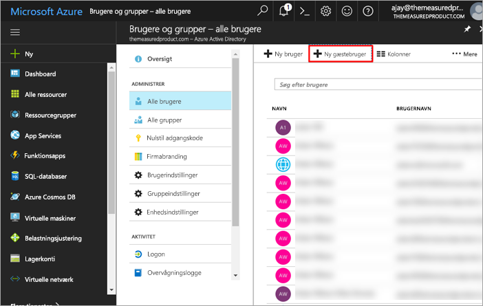
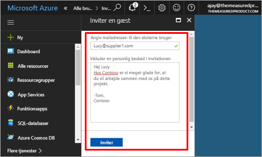
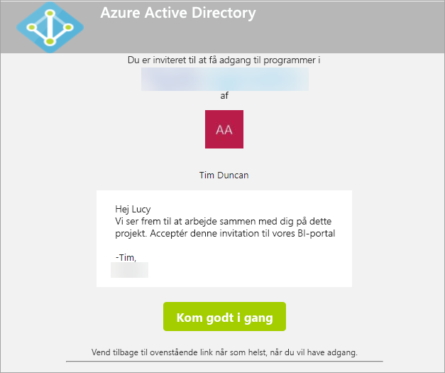
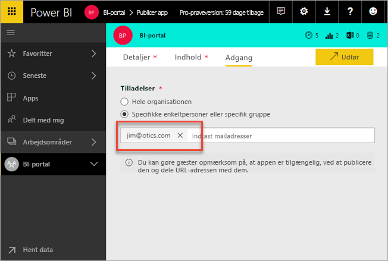

# Distribuer Power BI-indhold til eksterne gæstebrugere med Azure AD B2B

Power BI kan integreres med Azure Active Directory Business-til-business (Azure AD B2B) for at tillade sikker distribution af Power BI-indhold til gæstebrugere uden for organisationen, mens du stadig bevarer kontrollen over de interne data.

> [!VIDEO https://www.youtube.com/embed/xxQWEQ1NnlY]

> [!NOTE]
> Denne funktion er i øjeblikket ikke tilgængelig med Power BI-mobilapps. Du kan få vist Power BI-indhold, der deles med Azure AD B2B i en browser på en mobil enhed. 

## Inviter gæstebrugere

Man kna invitere gæstebrugere til din Power BI-lejer på to måder: planlagte invitationer eller ad hoc-invitationer. Invitationer kræves kun første gang, en ekstern bruger inviteres til din organisation.

### Planlagte invitationer

En planlagt invitation udføres i Microsoft Azure-portalen i Azure AD eller ved hjælp af PowerShell. Dette er den indstilling, du skal bruge, hvis du ved, hvilke brugere der skal inviteres. 

**Oprettelse af gæstebrugere i Azure AD-portalen kræver, at du er en lejeradministrator.**

1. Gå til [Azure-portalen](https://portal.azure.com), og vælg **Azure Active Directory**.

2. Gå til **Brugere og grupper** > **Alle brugere** > **Ny gæstebruger**.

    

3. Angiv **mailadressen** og **den personlige meddelelse**.

    

4. Vælg **Inviter**.

Hvis du vil invitere mere end én gæstebruger, skal du bruge PowerShell. Du kan finde flere oplysninger i [Azure Active Directory B2B-samarbejdskode og PowerShell-eksempler](https://docs.microsoft.com/azure/active-directory/active-directory-b2b-code-samples).

Gæstebrugeren skal vælge **Introduktion** i den invitation, de får på mail. Gæstebrugeren føjes derefter til lejeren.

### Ad hoc-invitationer

Du kan til enhver tid invitere en ekstern bruger ved at føje vedkommende til en apps adgangsliste, når du publicerer den.

Gæstebrugeren modtager en mail, der angiver, at appen er blevet delt med vedkommende.

Gæstebrugeren skal logge på med sin mailadresse for organisationen. Han/hun vil blive bedt om at acceptere invitationen, når han/hun har logget på. Når gæstebrugeren er logget på, omdirigeres denne til appindholdet. Tilføj linket som bogmærke, eller gem mailen for at vende tilbage til appen.

## Licensering

Gæstebrugeren skal have den korrekte licens for at få vist den delte app. Dette kan gøres på tre mulige måder.

### Brug Power BI Premium

Tildeling af appens arbejdsområde til Power BI Premium-kapacitet gør det muligt for gæstebrugeren at bruge appen uden krav om en Power BI Pro-licens. Med Power BI Premium kan apps også drage fordel af andre funktioner, f.eks. øget opdateringshastighed, dedikeret kapacitet og store modelstørrelser.

### Tildel Power BI Pro-licens til en gæstebruger

Tildeling af en Power BI Pro-licens til gæstebrugeren i din lejer gør det muligt for gæstebrugeren at se indholdet.

> [!NOTE]
> En Power BI Pro-licens fra din lejer gælder kun for gæstebrugere, når de får adgang til indhold i din lejer.

### Gæstebrugeren medtager sin egen Power BI Pro-licens

Gæstebrugeren har allerede en Power BI Pro-licens, der er tildelt i deres lejer.

## Begrænsninger

* Eksterne B2B-gæster er udelukkende begrænset til forbrug af indhold. Eksterne B2B-gæster kan få vist apps, dashboards og rapporter samt eksportere data og oprette mailabonnementer på dashboards og rapporter. De kan ikke få adgang til arbejdsområder eller udgive deres eget indhold.
* Denne funktion er i øjeblikket ikke tilgængelig med Power BI-mobilapps. Du kan få vist Power BI-indhold, der deles med Azure AD B2B i en browser på en mobil enhed.
* Brug af gæstebrugere med Power BI understøttes ikke i suveræne clouds (offentlige myndigheder).

## Næste trin

Du kan få mere at vide, herunder hvordan sikkerhed på rækkeniveau fungerer, i [hvidbogen](https://aka.ms/powerbi-b2b-whitepaper).

Du kan finde oplysninger om Azure Active Directory B2B i [Hvad er Azure AD B2B-samarbejde?](https://docs.microsoft.com/azure/active-directory/active-directory-b2b-what-is-azure-ad-b2b)