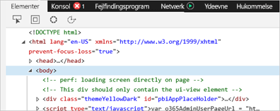
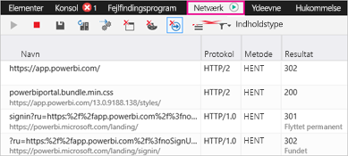
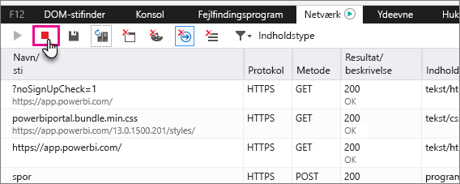
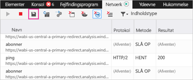

# Hent yderligere diagnosticeringsoplysninger til Power BI

Denne artikel indeholder vejledning i, hvordan du manuelt indsamler flere diagnosticeringsoplysninger fra Power BI-webklienten.

1. Gå til [Power BI](https://app.powerbi.com) med Microsoft Edge eller Internet Explorer.

1. Tryk på **F12** for at åbne udviklerværktøjerne i Microsoft Edge.

   

1. Vælg fanen **Netværk**. Her vises trafik, der allerede er hentet.

   

    Du kan:

    * Navigere i vinduet og gengive et eventuelt problem.

    * Når som helst skjule og få vist vinduet med udviklerværktøjer under sessionen ved at trykke på F12.

1. Hvis du vil stoppe profileringen af sessionen, kan du vælge den røde kvadrat under fanen **Netværk** i området med udviklerværktøjer.

   

1. Vælg disketteikonet for at eksportere dataene som en HTTP Archive-fil (HAR).

   

1. Angiv et filnavn, og gem HAR-filen.

    HAR-filen indeholder alle oplysninger om netværksanmodninger mellem browservinduet og Power BI, inklusive:

    * Aktivitets-id'erne for hver anmodning.

    * Det nøjagtige tidsstempel for hver anmodning.

    * Alle fejloplysninger, der returneres til klienten.

    Denne sporingen vil også indeholde de data, der bruges til at udfylde de visuelle elementer, der vises på skærmen.

1. Du kan levere HAR-filen til supporten til gennemsyn.

Har du flere spørgsmål? [Prøv at spørge Power BI-community'et](http://community.powerbi.com/)
