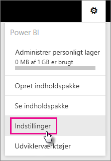
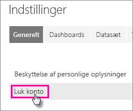
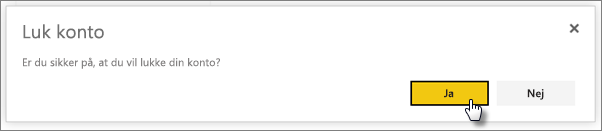

# Lukning af din Power BI-konto

Hvis du ikke vil bruge Power BI længere, kan du lukke din Power BI-konto.  Når din konto er lukket, kan du ikke længere logge på Power BI. Alle kundedata, du har uploadet eller oprettet i Power BI, slettes i overensstemmelse med politikken for dataopbevaring i servicebetingelserne for Power BI.

## Individuelle Power BI-brugere

Hvis du har tilmeldt dig Power BI som enkeltperson, kan du lukke din konto via skærmen **Indstillinger**.

1. Vælg tandhjulet øverst til højre i Power BI, og vælg derefter **Indstillinger**.

    

1. På fanen **Generelt** skal du vælge **Luk konto**.

    

1. Vælg en årsag til at lukke kontoen (1). Du kan også angive yderligere oplysninger (2). Vælg derefter **Luk konto**.

    

1. Bekræft, at du vil lukke din konto.

    

    Du bør se en bekræftelse på, at din konto er lukket. Du kan genåbne din konto herfra, hvis det er nødvendigt.

    

## Brugere i administreret lejer

Hvis din organisation har tilmeldt dig Power BI, skal du kontakte din lejeradministrator. Bed vedkommende om at fjerne tildelingen af licensen fra din konto.

Har du flere spørgsmål? [Prøv at spørge Power BI-community'et](http://community.powerbi.com/)