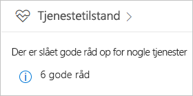
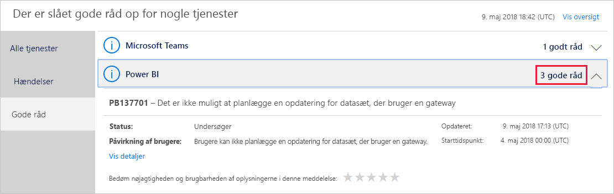
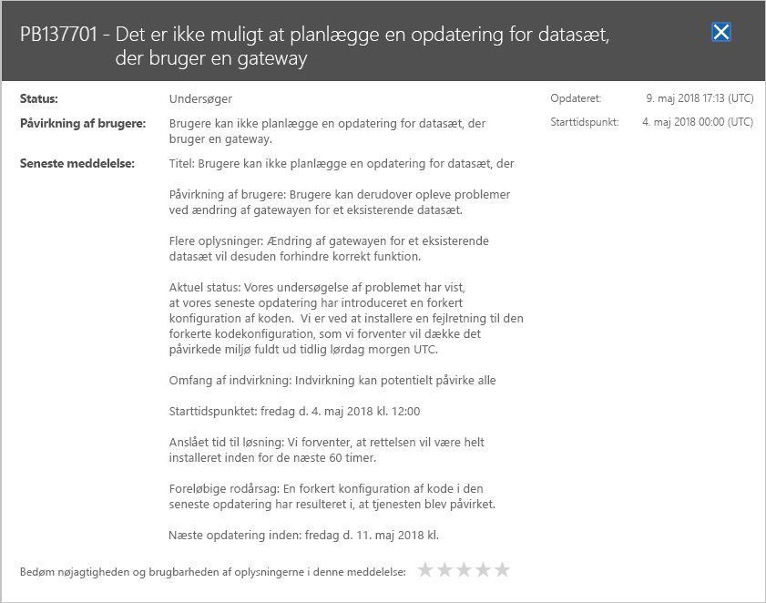

# Registrer Power BI-tjenestetilstand i Office 365

Microsoft 365 Administration indeholder vigtige værktøjer til Power BI-administratorer, herunder aktuelle og tidligere oplysninger om tjenestetilstand. Du skal have en af følgende roller for at få adgang til disse oplysninger: Power BI-tjenesteadministrator eller global Office 365-administrator. Du kan finde flere oplysninger om roller under [Administratorroller, der er relateret til Power BI](service-admin-administering-power-bi-in-your-organization.md#administrator-roles-related-to-power-bi).

1. Log på [Microsoft 365 Administration](https://portal.office.com/adminportal).

1. Vælg feltet **Tjenestetilstand**.

    

1. På den aktuelle liste skal du vælge **N rådgivere** eller **N hændelser** og gennemse resultaterne. I illustrationen nedenfor kan du se en af de tre aktive rådgivere.

    

1. Du kan se flere oplysninger ved at vælge **Vis oplysninger** for et element. I illustrationen nedenfor kan du se yderligere oplysninger, herunder seneste statusopdateringer.

    

    Rul ned for at se flere oplysninger, og luk ruden, når du er færdig.

1. Hvis du vil se oversigtsoplysninger på tværs af alle tjenester, skal du vælge **Vis oversigt** øverst til højre på hovedlisten. Vælg derefter **Seneste 7 dage** eller **Seneste 30 dage**. Vælg **Vis aktuel status** for at vende tilbage til den aktuelle tjenestetilstand.