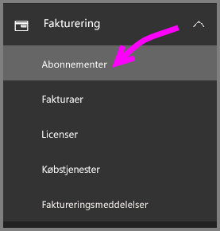
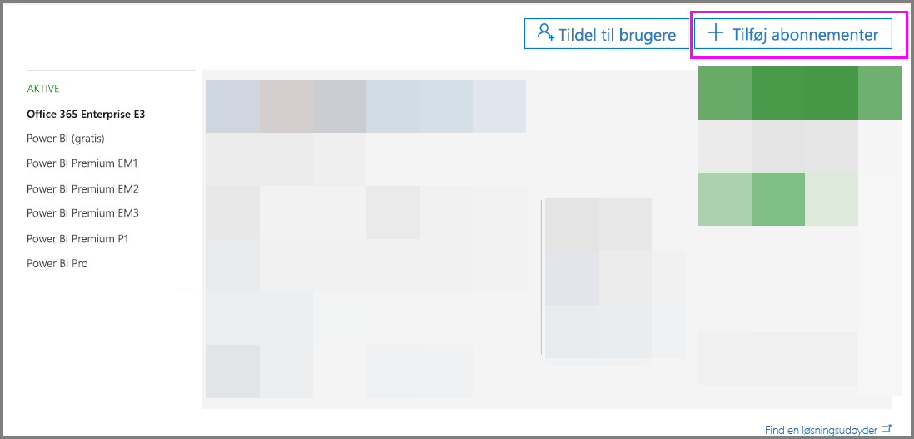
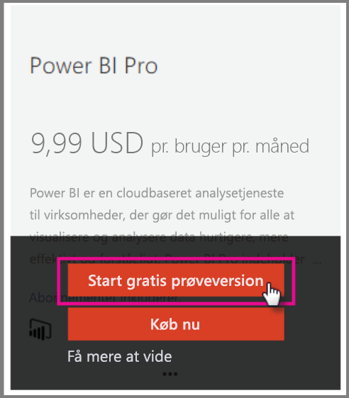
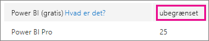
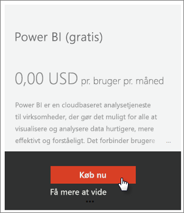
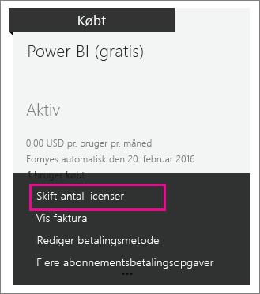

# <a name="power-bi-licensing-in-your-organization"></a>Power BI-licenser i din organisation

[!INCLUDE [license-capabilities](includes/license-capabilities.md)]

I denne artikel fokuseres der på licenser pr. bruger fra et administratorperspektiv.

## <a name="manage-power-bi-pro-licenses"></a>Administrer Power BI Pro-licenser

Som administrator kan du købe og tildele Power BI Pro-licenser, og du kan tilmelde dig en Power BI Pro-prøveversion til din organisation. Enkeltpersoner kan også tilmelde sig en Power BI Pro-prøveversion.

### <a name="purchase-power-bi-pro-licenses"></a>Køb Power BI Pro-licenser

Som administrator kan du købe Power BI Pro-licenser via Microsoft 365 eller via en certificeret Microsoft-partner. Når du køber licenserne, kan du tildele dem til individuelle brugere. Du kan finde flere oplysninger i [Køb og tildel Power BI Pro-licenser](service-admin-purchasing-power-bi-pro.md).

### <a name="power-bi-pro-license-expiration"></a>Udløb af Power BI Pro-licens

Der er en respitperiode, efter en Power BI Pro-licens er udløbet. For licenser, der er en del af et volumenlincenskøb, er respitperioden 90 dage. Hvis du har købt licensen direkte, er respitperioden 30 dage.

Power BI Pro har den samme abonnementslivscyklus som Office 365. Du kan finde flere oplysninger under [Hvad sker der med mine data og adgang, når mit abonnement på Office 365 til virksomheder slutter?](https://support.office.com/article/What-happens-to-my-data-and-access-when-my-Office-365-for-business-subscription-ends-4436582f-211a-45ec-b72e-33647f97d8a3)

### <a name="power-bi-pro-trial-for-individuals"></a>Power BI Pro-prøveversion til enkeltpersoner

Enkeltpersoner i din organisation kan tilmelde sig en Power BI Pro-prøveversion. Du kan flere oplysninger i [Tilmelding til Power BI som enkeltperson](service-self-service-signup-for-power-bi.md).

Brugere, der benytter sig af Power BI Pro (prøveversion) til enkeltpersoner i produktet, vises ikke i Microsoft 365 Administration som brugere af Power BI Pro (prøveversion). De vises som gratis brugere af Power BI. De vises dog som brugere af Power BI Pro (prøveversion) på siden Administrer lager i Power BI.

### <a name="power-bi-pro-trial-for-organizations"></a>Power BI Pro-prøveversion til organisationer

Hvis du vil hente og installere Power BI-prøvelicenser til flere brugere i din organisation, uden at de enkelte brugere skal acceptere vilkårene, kan du tilmelde dig en Power BI Pro-prøveversion til din virksomhed.

Vær opmærksom på følgende, før du følge trinnene for at tilmelde dig:

* For at kunne tilmelde dig skal du være medlem af rollen [**Global administrator** eller **Faktureringsadministrator**](https://support.office.com/article/about-office-365-admin-roles-da585eea-f576-4f55-a1e0-87090b6aaa9d) i Microsoft 365.

* Der er en grænse på én organisationsprøveversion pr. lejer. Det betyder, at hvis en person allerede har anvendt Power BI Pro (prøveversion) på din lejer, kan du ikke gøre det igen. Hvis du har brug for hjælp til dette, kan du kontakte [Office 365-faktureringssupport](https://support.office.microsoft.com/article/contact-support-for-business-products-admin-help-32a17ca7-6fa0-4870-8a8d-e25ba4ccfd4b?CorrelationId=552bbf37-214f-4202-80cb-b94240dcd671).

1. Naviger til [Microsoft 365 Administration](https://portal.office.com/adminportal/home#/homepage).

1. Vælg **Fakturering** og derefter **Abonnementer** i navigationsruden.

   

1. Vælg **Tilføj abonnementer** i højre side.

   

1. Hold musemarkøren over ellipsen ( **…** ) under **Andre planer** for at vælge Power BI Pro, og vælg **Start gratis prøveversion**.

    

1. Vælg **Prøv nu** i skærmbilledet med ordrebekræftelsen.

1. Vælg **Fortsæt** på ordrekvitteringen.

Nu kan du [tildele licenser i Office 365](https://support.office.com/article/assign-licenses-to-users-in-office-365-for-business-997596b5-4173-4627-b915-36abac6786dc).

## <a name="manage-power-bi-free-licenses"></a>Administrer Power BI (gratis)-licenser

Brugerne i organisationen kan få adgang til Power BI (gratis)-licenser på to forskellige måder:

* Du kan tildele dem en licens til Power BI via Microsoft 365 Administration.

* Hvis en bruger [tilmelder sig en Power BI Pro-konto](service-self-service-signup-for-power-bi.md), får vedkommende tildelt en gratis licens.

### <a name="requesting-and-assigning-free-licenses"></a>Anmodning om og tildeling af gratis licenser

Hvis du har planer om at administrere licensanmodninger og -tildelinger centralt, skal du først kontrollere, om du allerede har den ubegrænsede Power BI (gratis)-licensblok i din lejer.

Denne licensblok bliver tilgængelig, når en person første gang har tilmeldt sig Power BI som enkeltperson. Under denne proces knyttes licensblokken til din organisation, og der tildeles en licens til den bruger, der tilmelder sig.

1. I Microsoft 365 Administration under **Fakturering** > **Licenser** skal du kigge efter **ubegrænset**.

    

1. Hvis blokken er tilgængelig, kan du nu [tildele licenser i Office 365](https://support.office.com/article/assign-licenses-to-users-in-office-365-for-business-997596b5-4173-4627-b915-36abac6786dc). Hvis blokken er ikke tilgængelig, har du to valgmuligheder:

    * Få et medlem af din organisation til at tilmelde sig individuelt, hvilket udløser oprettelsen af den ubegrænsede blok.

    * Gå til den næste fremgangsmåde, hvor du kan tilmelde dig et fast antal licenser.

Hvis den ubegrænsede licensblok Power BI (gratis) ikke er tilgængelig, og du ikke vil foretage en individuel tilmelding, kan du følge denne fremgangsmåde.

1. Naviger til [Microsoft 365 Administration](https://portal.office.com/admin/default.aspx).

1. Vælg **Fakturering** > **Abonnementer** i navigationsruden.

1. Vælg **Tilføj abonnementer +** i højre side.

1. Hold musemarkøren over ellipsen ( **…** ) under **Andre planer** for at vælge Power BI (gratis), og vælg **Køb nu**.

    

1. Angiv det antal licenser, du vil tilføje, og vælg derefter **Gå til kassen nu** eller **Føj til indkøbskurv**.

1. Angiv de nødvendige oplysninger, når du går til kassen.

    Der er ikke noget køb, når denne fremgangsmåde benyttes, selvom du enten skal angive kreditkortoplysninger til fakturering eller vælge at blive faktureret.

1. Nu kan du [tildele licenser i Office 365](https://support.office.com/article/assign-licenses-to-users-in-office-365-for-business-997596b5-4173-4627-b915-36abac6786dc).

1. Hvis du beslutter senere, at du vil tilføje flere licenser, kan du gå tilbage til **Tilføj abonnementer** og vælge **Rediger licensantal** til Power BI (gratis).

    

### <a name="enable-or-disable-individual-user-sign-up-in-azure-active-directory"></a>Aktivér eller deaktiver individuel brugertilmelding i Azure Active Directory

Som administrator kan du vælge at aktivere eller deaktivere individuelle brugertilmeldinger gennem Azure Active Directory (AAD). I dette afsnit af artiklen vises det, hvordan du administrerer tilmeldinger med PowerShell-kommandoer. Du kan finde flere oplysninger om Azure PowerShell, under [Oversigt over Azure PowerShell](/powershell/azure/overview).

Indstillingen i Azure Active Directory, som styrer tilmeldingen, er **AllowAdHocSubscriptions**. For de fleste lejere er denne indstilling indstillet til *sand*, hvilket betyder, at den er aktiveret. Hvis du har købt Power BI via en partner, kan denne være indstillet til *falsk*, hvilket betyder, at den er deaktiveret. Hvis du ændrer indstillingen fra *sand* til *falsk*, blokeres individuel tilmelding for nye brugere i din organisation. Brugere, der har tilmeldt sig Power BI før ændringen af indstillingen bevarer deres licens. Bemærk! Selvom indstillingen er *falsk*, kan brugere med en Power BI (gratis)-licens stadig tilmelde sig en individuel Power BI Pro (prøveversion).

1. Log på Azure Active Directory ved hjælp af dine legitimationsoplysninger til Microsoft 365. I den første linje i følgende PowerShell-script bliver du bedt om dine legitimationsoplysninger. Den anden linje opretter forbindelse til Azure Active Directory.

    ```powershell
     $msolcred = get-credential
     connect-msolservice -credential $msolcred
    ```

   

1. Når du er logget på, skal du køre følgende kommando for at se, hvordan din lejer i øjeblikket er konfigureret. (Bemærk, at bogstavet "I" og ikke tallet 1 bruges i "fl" nedenfor.)

    ```powershell
     Get-MsolCompanyInformation | fl AllowAdHocSubscriptions 
    ```
1. Kør følgende kommando for at aktivere ($true) eller deaktivere ($false) **AllowAdHocSubscriptions**.

    ```powershell
     Set-MsolCompanySettings -AllowAdHocSubscriptions $true
    ```

> [!NOTE]
> AllowAdHocSubscriptions-flaget bruges til at kontrollere flere brugeregenskaber i organisationen, herunder muligheden for at brugere kan tilmelde sig Azure Rights Management Service. Alle disse egenskaber påvirkes, hvis flaget ændres.

## <a name="next-steps"></a>Næste trin

[Tilmelding via selvbetjening til Power BI](service-self-service-signup-for-power-bi.md)  

[Køb og tildel Power BI Pro-licenser](service-admin-purchasing-power-bi-pro.md)

Har du flere spørgsmål? [Prøv at spørge Power BI-community'et](https://community.powerbi.com/)
