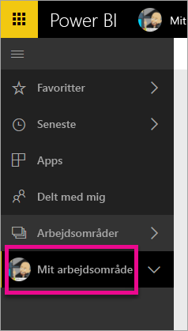
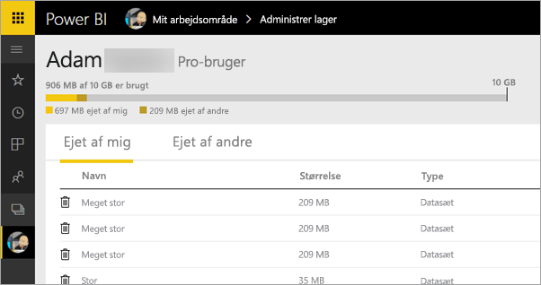
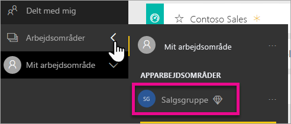
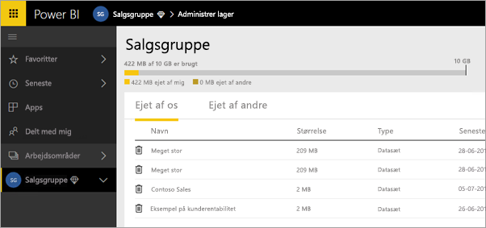
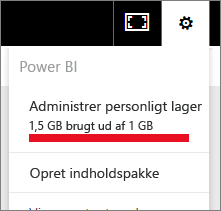

# Administrer dit datalager
Få at vide, hvordan du kan administrere dit individuelle arbejdsområde eller dit apparbejdsområde eller datalager for at sikre, at du kan fortsætte med at publicere rapporter og datasæt.

Brugere og apparbejdsområder har deres egne datakapaciteter

* Brugere af gratis- og Pro-versionen har en maksimumgrænse på 10 GB på deres datalager.
* Pro brugere kan oprette apparbejdsområder med en maksimumgrænse på 10 GB datalager hver.

På lejerniveauet må det samlede forbrug ikke overstige 10 GB pr. Pro-bruger på tværs af alle Pro-brugere og apparbejdsområder i lejeren.

Læs om andre funktioner i [prismodellen for Power BI](https://powerbi.microsoft.com/pricing).

Inkluderet i dit datalager er dine egne datasæt og Excel-rapporter samt dem, som nogen har delt med dig. Datasæt er nogen af de datakilder, du har uploadet eller oprettet forbindelse til, herunder Power BI Desktop-filer og Excel-projektmapper, du bruger. Følgende er også medtaget i din datakapacitet.

* Excel-områder, der er fastgjort til dashboardet.
* Reporting Services-visualiseringer i det lokale miljø, der er fastgjort til et Power BI-dashboard.
* Uploadede billeder.

Størrelsen på et dashboard, som du deler, varierer afhængigt af, hvad der er fastgjort til det. Hvis du f.eks. fastgør elementer fra to rapporter, der er en del af to forskellige datasæt, omfatter størrelsen begge datasæt.

<a name="manage"/>

## Administrer elementer, der ejes af dig
Se, hvor meget datalager, du bruger på din Power BI-konto, og administrer din konto.

1. Hvis du vil administrere dit eget lager, skal du gå til **Mit arbejdsområde** i venstre navigationsrude.
   
    
2. Vælg tandhjulsikonet  i øverste højre hjørne \> **Administrer personligt lager**.
   
    Den øverste bjælke viser, hvor meget af din maksimale lagerkapacitet du har brugt.
   
    
   
    Datasæt og rapporter er opdelt på to faner:
   
    **Ejet af mig:** Disse er rapporter og datasæt, du har uploadet til din Power BI-konto, herunder tjenestedatasæt som f.eks. Salesforce og Dynamics CRM.  
    **Ejet af andre:** Andre har delt disse rapporter og datasæt med dig.
3. Hvis du vil slette et datasæt eller en rapport, skal du vælge ikonet for Papirkurv .

Vær opmærksom på, at du eller en anden muligvis har rapporter og dashboards, der er baseret på et datasæt. Hvis du sletter datasættet, fungerer disse rapporter og dashboards ikke længere.

## Administrer dit apparbejdsområde
1. Vælg på pilen ud for **Arbejdsområder** \> vælg navnet på apparbejdsområdet.
   
    
2. Vælg tandhjulsikonet  i øverste højre hjørne \> **Administrer gruppelager**.
   
    Den øverste bjælke viser, hvor meget af gruppens maksimale lagerkapacitet der er brugt.
   
    
   
    Datasæt og rapporter er opdelt på to faner:
   
    **Ejet af os:** Disse er rapporter og datasæt, som du eller en anden har uploadet til gruppens Power BI-konto, herunder tjenestedatasæt som f.eks. Salesforce og Dynamics CRM.
    **Ejet af andre:** Andre har delt disse rapporter og datasæt med din gruppe.
3. Hvis du vil slette et datasæt eller en rapport, skal du vælge ikonet for Papirkurv .
   
   > [!NOTE]
   > Et medlem af et apparbejdsområde, som har redigeringstilladelse, har tilladelse til at slette datasæt og rapporter fra apparbejdsområdet.
   > 
   > 

Vær opmærksom på, at du eller en anden i gruppen muligvis har rapporter og dashboards, der er baseret på et datasæt. Hvis du sletter datasættet, fungerer disse rapporter og dashboards ikke længere.

## Begrænsninger for datasæt
Der er en grænse på 1 GB, pr. datasæt, der indlæses i Power BI. Hvis du har valgt at beholde Excel-oplevelsen i stedet for at importere dataene, bliver du begrænset til 250 MB for datasættet.

## Det sker der, når du når grænsen
Når du når din grænse for datakapacitet, får du vist meddelelser i tjenesten. 

Når du vælger tandhjulsikonet , får du vist en rød linje, der angiver, at du har overskredet din datakapacitet.

Du kan også se dette angivet i **Administrer personligt lager**.

 

 Når du forsøger at udføre en handling, som gør, at du når en af grænserne, får du vist en meddelelse, der angiver, at du har overskredet grænsen. Du kan [administrere](#manage) dit lager for at reducere mængden af lagret indhold og komme under grænsen.

 

 Har du flere spørgsmål? [Prøv at spørge Power BI-community'et](http://community.powerbi.com/)

