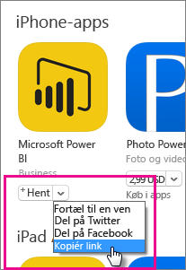
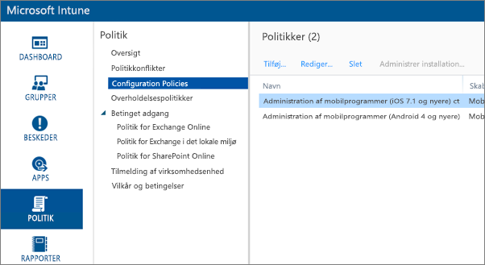
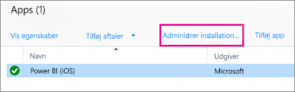
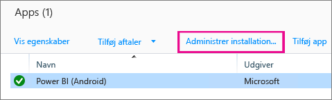
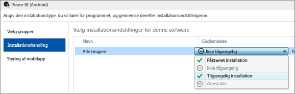
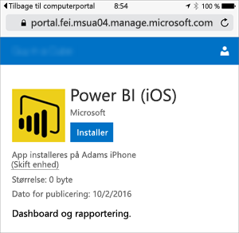
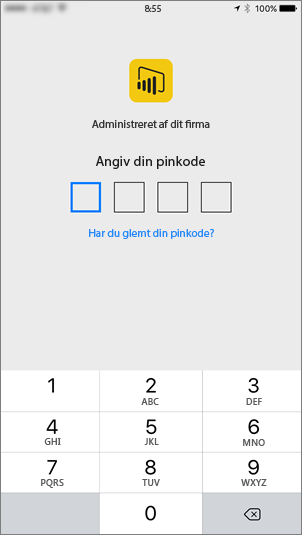

# Konfiguration af mobilapps med Microsoft Intune
Microsoft Intune giver organisationer mulighed for at administrere enheder og programmer. Power BI-mobilprogrammerne til iOS og Android, integrerer med Intune, så du kan administrere programmet på dine enheder og styre sikkerheden. Ved hjælp af konfigurationspolitikker kan du kontrollere ting som at anmode om pinkode for at give adgang, kontrollere, hvordan data håndteres af programmet, og kryptere programdata, selv når appen ikke er i brug.

<iframe width="560" height="315" src="https://www.youtube.com/embed/9HF-qsdQvHw?list=PLv2BtOtLblH1nPVPU2etFzTNmpz49dwXm" frameborder="0" allowfullscreen></iframe>

## Konfiguration af generel administration af mobilenheder
Denne artikel er ikke tænkt som en komplet konfigurationsvejledning til Microsoft Intune. Hvis du lige nu integrerer med Intune, er der et par ting, du skal sikre dig, at du har konfigureret. [Få mere at vide](https://technet.microsoft.com/library/jj676587.aspx)

Microsoft Intune kan fungere sammen med administration af mobilenheder (MDM) i Office 365. [Få mere at vide](https://blogs.technet.microsoft.com/configmgrdogs/2016/01/04/microsoft-intune-co-existence-with-mdm-for-office-365/)

Denne artikel forudsætter, at Intune er konfigureret korrekt, og at du har enheder tilmeldt i Intune. Hvis du bruger MDM på samme enhed, viser enheden, at den er tilmeldt i MDM, men den kan administreres i Intune.

> [!NOTE]
> Når din organisation har konfigureret Microsoft Intune MAM, er opdatering af data i baggrunden slået fra, hvis du bruger Power BI-mobilappen på en iOS- eller Android-enhed. Næste gang du åbner appen, opdaterer Power BI dataene fra Power BI-tjenesten på internettet.
> 
> 

## Trin 1: Hent URL-adressen til programmet
Før vi opretter programmet i Intune, skal vi have fat i URL-adresserne til appsene. Til iOS får vi den fra iTunes. Til Android kan du hente den fra Power BI-mobilsiden.

Gem URL-adressen, da du skal bruge den, når vi opretter programmet.

### iOS
For at få URL-adressen på appen til iOS skal vi hente den fra iTunes.

1. Åbn iTunes.
2. Søg efter *Power BI*.
3. Du bør se **Microsoft Power BI** angivet under **iPhone-apps** og **iPad-apps**. Du kan bruge begge dele, da du får den samme URL-adresse.
4. Vælg rullemenuen **Hent**, og vælg **Kopiér link**.
   
    

Det skal se nogenlunde ud som følgende.

    https://itunes.apple.com/us/app/microsoft-power-bi/id929738808?mt=8

### Android
Du kan få URL-adressen til Google Play fra [Power BI-mobilsiden](https://powerbi.microsoft.com/mobile/). Når du klikker på ikonet **Download fra Google Play**, kommer du til appsiden. Du kan kopiere URL-adressen fra browserens adresselinje. Det skal se nogenlunde ud som følgende.

    https://play.google.com/store/apps/details?id=com.microsoft.powerbim

## Trin 2: Opret en politik for administration af mobilapps
Politikken for administration af mobilapps giver dig mulighed for at gennemtvinge ting som f.eks. pinkode til adgang. Du kan oprette en på Intune-portalen. 

Du kan oprette programmet eller politikken først. Det har ingen betydning, i hvilken rækkefølge de tilføjes. Så længe de begge findes på installationstrinnet.

1. Vælg **Politik** > **Konfigurationspolitikker**.
   
    
2. Vælg **Tilføj...**.
3. Under **Software** kan du vælge administration af mobilapps til enten Android eller iOS. For at komme hurtigt i gang kan du vælge **Opret en politik med de anbefalede indstillinger**, eller du kan oprette en brugerdefineret politik.
4. Rediger politikken for at konfigurere de ønskede begrænsninger på programmet.

## Trin 3: Opret programmet
Programmet er en reference, eller en pakke, som gemmes i Intune til installation. Vi skal oprette et program og henvise til den URL-adresse til appen, vi fik fra enten Google Play eller iTunes.

Du kan oprette programmet eller politikken først. Det har ingen betydning, i hvilken rækkefølge de tilføjes. Så længe de begge findes på installationstrinnet.

1. Gå til Intune-portalen, og vælg **Apps** fra menuen til venstre.
2. Vælg **Tilføj app**. Dette starter programmet **Tilføj software**.

### iOS
1. Vælg **Styret iOS-app fra App Store** på rullelisten.
2. Angiv appens URL-adresse, som vi fik på [Trin 1](#step-1-get-the-url-for-the-application), og vælg **Næste**.
   
    
3. Angiv en **Udgiver**, et **Navn** og en **Beskrivelse**. Du kan vælge at angive et **Ikon**. **Kategori** er til appen Firmaportal. Når du er færdig, skal du vælge **Næste**.
4. Du kan vælge, om du vil publicere apps til **Alle** (standard), **iPad** eller **iPhone**. Som standard vises **Alle**, og det fungerer for begge enhedstyper. Power BI-appen er den samme URL-adresse til både iPhone og iPad. Vælg **Næste**.
5. Vælg **Upload**.

> [!NOTE]
> Du får muligvis ikke vist den på listen over apps, før du opdaterer siden. Du kan klikke på **Oversigt** og gå tilbage til **Apps** for at genindlæse siden.
> 
> 

### Android
1. Vælg **Eksternt link** på rullelisten.
2. Angiv appens URL-adresse, som vi fik på [Trin 1](#step-1-get-the-url-for-the-application), og vælg **Næste**.
   
    
3. Angiv en **Udgiver**, et **Navn** og en **Beskrivelse**. Du kan vælge at angive et **Ikon**. **Kategori** er til appen Firmaportal. Når du er færdig, skal du vælge **Næste**.
4. Vælg **Upload**.

> [!NOTE]
> Du får muligvis ikke vist den på listen over apps, før du opdaterer siden. Du kan klikke på **Oversigt** og gå tilbage til **Apps** for at genindlæse siden.
> 
> 

## Trin 4: Installér programmet
Når du har tilføjet programmet, skal du installere det, så det bliver tilgængeligt for dine slutbrugere. Dette er trinnet, hvor du binder den politik, du har oprettet, til appen.

### iOS
1. Vælg den app, du har oprettet, på skærmbilledet med apps. Vælg derefter linket **Administrer installation...**.
   
    
2. I skærmbilledet **Vælg grupper** kan du vælge, hvilke grupper du vil installere denne app til. Vælg **Næste**.
3. I skærmbilledet **Installationshandling** kan du vælge, hvordan du vil installere denne app. Hvis du vælger **Tilgængelig installation** eller **Påkrævet installation**, bliver appen tilgængelig på Firmaportal, så brugerne kan installere den efter behov. Når du har foretaget dit valg, skal du vælge **Næste**.
   
    
4. I skærmbilledet **Styring af mobilapp** kan du vælge den politik for administration af mobilapps, du oprettede på [Trin 2](#step-2-create-a-mobile-application-management-policy). Den indstilles som standard til den politik, du har oprettet, hvis det er den eneste iOS-politik, der er tilgængelig. Vælg **Næste**.
   
    
5. I skærmbilledet **VPN-profil** kan du vælge en politik, hvis du har en for din organisation. Standardindstillingen er **Ingen**. Vælg **Næste**.
6. I skærmbilledet **Konfiguration af mobilapps** kan du vælge en **Politik om appkonfiguration**, hvis du har oprettet en. Standardindstillingen er **Ingen**. Dette er ikke påkrævet. Vælg **Udfør**.

Når du har installeret appen, skal der stå **Ja** ud for installeret på siden med apps.

### Android
1. Vælg den app, du har oprettet, på skærmbilledet med apps. Vælg derefter linket **Administrer installation...**.
   
    
2. I skærmbilledet **Vælg grupper** kan du vælge, hvilke grupper du vil installere denne app til. Vælg **Næste**.
3. I skærmbilledet **Installationshandling** kan du vælge, hvordan du vil installere denne app. Hvis du vælger **Tilgængelig installation** eller **Påkrævet installation**, bliver appen tilgængelig på Firmaportal, så brugerne kan installere den efter behov. Når du har foretaget dit valg, skal du vælge **Næste**.
   
    
4. I skærmbilledet **Styring af mobilapp** kan du vælge den politik for administration af mobilapps, du oprettede på [Trin 2](#step-2-create-a-mobile-application-management-policy). Den indstilles som standard til den politik, du har oprettet, hvis det er den eneste Android-politik, der er tilgængelig. Vælg **Udfør**.
   
    

Når du har installeret appen, skal der stå **Ja** ud for installeret på siden med apps.

## Trin 5: Installér programmet på en enhed
Du installerer programmet via appen Firmaportal. Hvis du ikke har installeret appen Firmaportal, kan du hente den via App Store på iOS- eller Android-platformen. Du skal logge på Firmaportal med dit organisationslogon.

1. Åbn appen Firmaportal.
2. Hvis du ikke ser Power BI-appen angivet som en udvalgt app, skal du vælge **Firmaapps**.
   
    
3. Vælg den Power BI-app, du har installeret.
   
    
4. Vælg **Installér**.
   
    
5. Hvis du er på iOS, får du en pushmeddelelse om installation af appen. Vælg **Installér** i pushdialogboksen.
   
    

Når den er installeret, kan du se, at den er **Administreret af dit firma**. Hvis du har aktiveret adgang ved hjælp af pinkode i politikken, får du vist følgende.

## Næste trin
[Konfigurer og udrul politikker for administration af mobilapps i Microsoft Intune-konsollen](https://technet.microsoft.com/library/dn878026.aspx)  
[Power BI-apps til mobilenheder](mobile-apps-for-mobile-devices.md)  

Har du flere spørgsmål? [Prøv at spørge Power BI-community'et](http://community.powerbi.com/)

