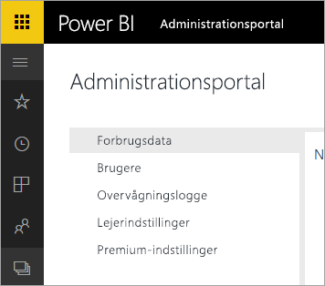

# Power BI til Office 365 er udgået
Power BI til Office 365, der er en tidligere version af Power BI, er overgået til den aktuelle version af [Power BI](https://powerbi.microsoft.com). Brugere, som tidligere har brugt **Power BI til Office 365**, kan bruge den aktuelle version af Power BI. Du kan [få mere at vide om Power BI](service-get-started.md).

## Administrationsportalen
Administrationsportalen til **Power BI til Office 365** er ikke længere tilgængelig. Administratorer kan bruge den nye [administrationsportal](https://app.powerbi.com/admin-portal) til at administrere organisationens Power BI-abonnement.

Se [Power BI-administrationsportalen](service-admin-portal.md), hvis du vil have mere at vide.

## Næste trin
[Introduktion til Power BI](service-get-started.md)

[Introduktion til Power BI Desktop](desktop-getting-started.md)

[Administrering af Power BI i din virksomhed](service-admin-administering-power-bi-in-your-organization.md)