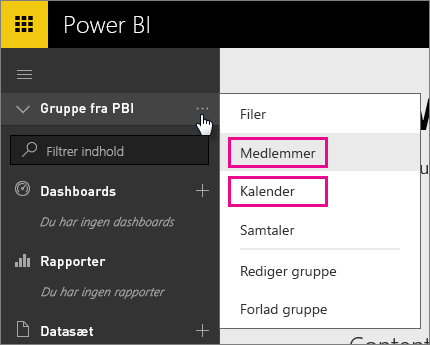
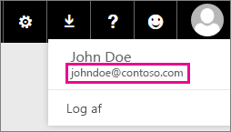

# Office 365 Dedicated-kunder – kendte problemer
Power BI understøttes nu til Office 365 Dedicated-kunder.  Hvis du er O365 Dedicated-kunde, kan du logge på med en konto fra denne lejer og bruge Power BI. Der er to kendte problemer i øjeblikket.

## Grupper
Når du vælger **Medlemmer** eller **Kalender** i genvejsmenuen Gruppe, bliver du omdirigeret til appen Mail i stedet for.  **Filer** og **Samtaler** fungerer som forventet.

## iPhone-app – Der opstår fejl, når der logges på med et brugerdefineret domæne
Når du logger på, kan der opstå en fejl, hvis du bruger et brugerdefineret domæne til at logge på med iPhone-appen.

*Logonfejl*  
*Der opstod en uventet intern fejl. Prøv igen.*

Du kan løse problemet ved at logge på med den mailadresse, der er angivet, når du klikker på brugerikonet i Power BI-tjenesten, i stedet for med det brugerdefinerede domæne.

Har du flere spørgsmål? [Prøv at spørge Power BI-community'et](http://community.powerbi.com/)

