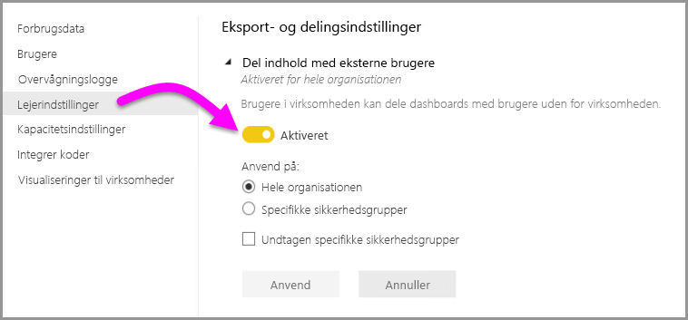
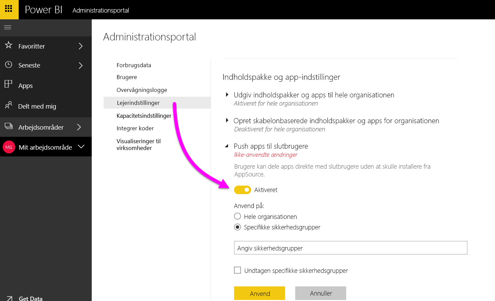
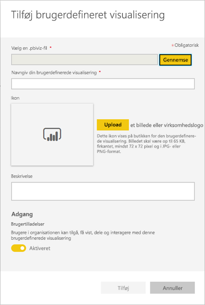

# Power BI-administrationsportal

Administrationsportalen giver adgang til lejeradministration af Power BI i virksomheden. Den indeholder elementer som f.eks. forbrugsdata, adgang til Office 365 Administration og indstillinger.

Lejeradministration af Power BI til din virksomhed foregår gennem Power BI-administrationsportalen. Administrationsportalen kan tilgås af alle brugere, som er globale administratorer i Office 365, eller som er blevet tildelt Power BI-tjenesteadministratorrollen. Du kan finde flere oplysninger om Power BI-tjenesteadministratorrollen under [Beskrivelse af rollen som Power BI-administrator](service-admin-role.md).

Alle brugere får vist **Administrationsportalen** under tandhjulsikonet. Brugere der ikke er administratorer, kan kun se afsnittet **Premium-indstillinger**, og de kan kun se de kapaciteter, som de har rettighederne til at administrere.

## Sådan finder du vej til administrationsportalen

Din konto skal være markeret som en **Global administrator** i Office 365 eller Azure Active Directory, eller skal være tildelt Power BI-tjenesteadministratorrollen for at få adgang til Power BI-administrationsportalen. Du kan finde flere oplysninger om Power BI-tjenesteadministratorrollen under [Beskrivelse af rollen som Power BI-administrator](service-admin-role.md). Benyt følgende fremgangsmåde for at tilgå Power BI-administrationsportalen.

1. Vælg tandhjulet Indstillinger i øverste højre hjørne af Power BI-tjenesten.
2. Vælg **Administrationsportal**.

Der er seks faner på portalen. Disse er beskrevet nedenfor.

* [Forbrugsdata](#usage-metrics)
* [Brugere](#users)
* [Overvågningslogge](#audit-logs)
* [Lejerindstillinger](#tenant-settings)
* [Premium-indstillinger](#premium-settings)
* [Integrer koder](#embed-codes)
* [Visualiseringer til virksomheder](#Organization-visuals)

## Forbrugsdata
Den første fane i administrationsportalen er **Forbrugsdata**. Rapporten over forbrugsdataene giver dig mulighed for at overvåge forbruget i Power BI i virksomheden. Den giver dig også mulighed for at se, hvilke brugere og grupper, der er mest aktive i Power BI i virksomheden.

> [!NOTE]
> Første gang du tilgår dashboard'et, eller når du besøger det igen efter en lang periode uden at åbne dashboard'et, så får du sandsynligvis vist indlæsningsskærmen, mens vi indlæser dashboard'et.

Mens dashboard'et indlæses, så får du vist to afsnit med felter. Det første afsnit indeholder forbrugsdata for individuelle brugere, og det andet afsnit har lignende oplysninger for grupper i din virksomhed.

Nedenfor er en oversigt over indholdet i hvert felt:

* Specifik optælling af alle dashboards, rapporter og datasæt i brugerarbejdsområdet
  
    

* Mest brugte dashboard efter antallet af brugere, der har adgang til det. Hvis du f.eks. har et dashboard, som du har delt med tre brugere, og du også har føjet det til en indholdspakke med to forskellige brugere tilsluttet, så er antallet 6 (1 + 3 + 2)
  
    

* Det mest populære indhold, som brugere har oprettet forbindelse til. Dette vil være alt vilkårligt indhold, som brugere kan tilgå gennem Hent data-processen, dvs. Saas-indholdspakker, organisatoriske indholdspakker, filer eller databaser.
  
    

* En visning af dine vigtigste brugere baseret på, hvor mange dashboards de har, både dashboards de selv har oprettet, og dashboards der er delt med dem.
  
    

* En visning af dine vigtigste brugere baseret på, hvor mange rapporter de har
  
    

Det andet afsnit viser den samme type oplysninger, men baseret på grupper. Her kan du se, hvilke grupper i virksomheden, der er mest aktive og hvilke slags oplysninger, de bruger.

Med disse oplysninger kan du få reelt indsigt i, hvordan personer bruger Power BI på tværs af din virksomhed, og du kan holde styr på, hvilke af de pågældende brugere og grupper, der er meget aktive i din virksomhed.

## Brugere

Den anden fane i administrationsportalen er **Administrer brugere**. Brugeradministrationen i Power BI håndteres i Office 365 Administration, så dette afsnit giver dig hurtig adgang til området for administration af brugere, administratorer og grupper i Office 365.

Når du klikker på **Gå til O365 Administration**, så føres du direkte til Office 365 Administration-landingssiden til administration af brugerne af din lejer.

## Overvågningslogge

Den tredje fane i administrationsportalen er **Overvågningslogge**. Loggene er placeret inden for Office 365 Security & Compliance Center. Dette afsnit giver dig hurtig adgang til dette område inden for Office 365.

Du kan finde flere oplysninger om overvågningslogge under [Overvågning af Power BI i din virksomhed](service-admin-auditing.md)

## Lejerindstillinger

Den tredje fane i administrationsportalen er **Lejerindstillinger**. Lejerindstillingerne giver dig yderligere kontrol over, hvilke funktioner der gøres tilgængelige i din virksomhed. Hvis du har bekymringer omkring følsomme data, kan det være, at nogle af vores funktioner ikke er passende for din virksomhed, eller du vil måske kun have, at en given funktion er tilgængelig for en bestemt gruppe. Hvis det er tilfældet, kan du slå funktionen fra i din lejer.

> [!NOTE]
> Det kan tage op til ti minutter for indstillingen at træde i kraft for alle i din lejer.

Indstillinger kan have tre tilstande, som er baseret på de indstillinger, du har angivet.

### Deaktiveret for hele virksomheden

Du kan deaktivere en funktion, så brugere ikke kan tilgå den.

### Aktiveret for hele virksomheden

Du kan aktivere en funktion for hele virksomheden, hvorved alle brugere har adgang til den pågældende funktion.

### Aktiveret for et udsnit af virksomheden

Du kan også aktivere en funktion delvist for din virksomhed. Dette kan foregå på et par forskellige måder. Du kan aktivere den for hele din virksomhed med undtagelse af en bestemt gruppe brugere.

Du kan også aktivere funktionen udelukkende for en bestemt gruppe af brugere og også deaktivere den for en gruppe af brugere. Dette vil sørge for, at visse brugere ikke har adgang til funktionen, selvom de er medlemmer af den tilladte gruppe.

## Eksport- og delingsindstillinger

### Deling af indhold med eksterne brugere

Brugere i virksomheden kan dele dashboards med brugere uden for virksomheden.

Her er den meddelelse, som vises, når du deler med en ekstern bruger.

### Publicer på internettet

Brugere i virksomheden kan publicere rapporter på internettet. [Få mere at vide](service-publish-to-web.md)

Brugere får vist andre indstillinger i brugergrænsefladen, baseret på hvad indstillingen Publicer på internettet er.

|Udvalgt |Aktiveret for hele organisationen |Deaktiveret for hele organisationen |Specifikke sikkerhedsgrupper   |
|---------|---------|---------|---------|
|**Publicer på internettet** under rapportens menu **Filer**.|Aktiveret for alle|Ikke synligt for alle|Kun synligt for godkendte brugere eller grupper.|
|**Håndter integreringskoder** under **Indstillinger**|Aktiveret for alle|Aktiveret for alle|Aktiveret for alle  Indstillingen * **Slet** er kun synlig for godkendte brugere eller grupper. * **Hent koder** er aktiveret for alle.|
|**Integrer koder** i administrationsportalen|Status afspejler et af følgende: * Aktiv * Ikke understøttet * Blokeret|Status vises som **Deaktiveret**|Status afspejler et af følgende: * Aktiv * Ikke understøttet * Blokeret  Hvis en bruger ikke er godkendt baseret på lejeren indstilling, vises status som **krænket**.|
|Eksisterende publicerede rapporter|Alle aktiveret|Alle deaktiveret|Rapporter fortsætter med at gengive for alle.|

### Eksportér data

Brugere i virksomheden kan eksportere data fra et felt eller visualisering. [Få mere at vide](power-bi-visualization-export-data.md)

> [!NOTE]
> Deaktivering af **Eksport af data** forebygger også mod, at brugere kan bruge funktionen **Analysér i Excel** samt bruge Power BI-tjenestens direkte forbindelse.

### Eksport af rapporter som PowerPoint-præsentationer

Brugere i virksomheden kan eksportere Power BI-rapporter som PowerPoint-filer. [Få mere at vide](service-publish-to-powerpoint.md)

### Udskriv dashboards og rapporter

Brugere i virksomheden kan udskrive dashboards og rapporter. [Få mere at vide](service-print.md)

## Indholdspakkeindstillinger

### Udgiv indholdspakker til hele virksomheden

Brugere i virksomheden kan udgive indholdspakker til hele virksomheden.

### Opret organisationpakker med skabelonindhold

Brugere i virksomheden kan oprette pakker med skabelonindhold, der bruger datasæt bygget på én datakilde i Power BI Desktop.

### Push apps til slutbrugere

Administratoren af din lejer aktiverer muligheden for at pushe apps under **Indstillinger for lejer**.

   

Du kan skifte indstillingen til **Aktiveret** og derefter angive, hvem der har denne egenskab (hele organisationen eller bestemte sikkerhedsgrupper).

> [!NOTE]
> Husk, at det kan tage noget tid, før ændringer af indstillingerne for lejer træder i kraft.

Gå hertil for at få mere at vide om [Push af apps](service-create-distribute-apps.md#how-to-install-an-app-automatically-for-end-users).

## Integrationsindstillinger

### Stil spørgsmål til data ved hjælp af Cortana
Brugere i virksomheden kan stille spørgsmål til deres data ved hjælp af Cortana.

> [!NOTE]
> Denne indstilling gælder for hele organisationen og kan ikke begrænses til bestemte grupper.

### Brug Analysér i Excel med datasæt i det lokale miljø
Brugere i virksomheden kan bruge Excel til at se og interagere med Power BI-datasæt i det lokale miljø. [Få mere at vide](service-analyze-in-excel.md)

> [!NOTE]
> Hvis du deaktiverer **Eksportér data**, så vil det også forhindre brugerne i at bruge funktionen **Analysér i Excel**.

### Brug ArcGIS Maps til Power BI

Brugere i organisationen kan bruge ArcGIS Maps for Power BI-visualiseringen fra Esri. [Få mere at vide](power-bi-visualization-arcgis.md)

### Brug global søgning til Power BI (prøveversion)

Brugere i organisationen kan bruge eksterne søgefunktioner, der bruger Azure Search. Brugere kan f.eks. bruge Cortana til at hente vigtige oplysninger direkte fra Power BI-dashboards og -rapporter. [Få mere at vide](service-cortana-intro.md)

## Indstillinger for brugerdefinerede visualiseringer
### Aktivér brugerdefinerede visualiseringer for hele organisationen
Brugerne i organisationen kan interagere med og dele brugerdefinerede visualiseringer. [Få mere at vide](power-bi-custom-visuals.md)

> [!NOTE]
> Denne indstilling gælder for hele organisationen og kan ikke begrænses til bestemte grupper.

## R visuals – indstillinger

### Interager med en dshare R visuals

Brugere i virksomheden kan interagere med og dele visuelle elementer oprettet med R-scripts. [Få mere at vide](service-r-visuals.md)

> [!NOTE]
> Denne indstilling gælder for hele organisationen og kan ikke begrænses til bestemte grupper.

## Indstillinger for overvågning

### Opret overvågningslogge for intern aktivitetsovervågning og overholdelse

Brugere i virksomheden kan overvåge handlinger, der udføres i Power BI af andre brugere i virksomheden. [Få mere at vide](service-admin-auditing.md)

Denne indstilling skal være aktiveret, for at overvågningslogposter bliver registreret. Der kan være op til 48 timers forsinkelse, fra at du aktiverer overvågning, til at du får vist data i overvågningsloggen. Hvis du ikke får vist data med det samme, skal du tjekke overvågningsloggene senere. Der kan være en lignende forsinkelse mellem at få tilladelse til at få vist overvågningslogge og til at kunne åbne logfilerne.

> [!NOTE]
> Denne indstilling gælder for hele organisationen og kan ikke begrænses til bestemte grupper.

## Indstillinger for dashboard

### Dataklassificering til dashboards

Brugere i virksomheden kan markere dashboards med klassificeringsangivelser, der angiver sikkerhedsniveauer for dashboards. [Få mere at vide](service-data-classification.md)

> [!NOTE]
> Denne indstilling gælder for hele organisationen og kan ikke begrænses til bestemte grupper.

## Indstillinger for udviklere

### Integrer indhold i apps

Brugere i virksomheden kan integrere Power BI-dashboards og rapporter i Software as a Service (SaaS)-programmer. Hvis denne indstilling deaktiveres, kan brugere ikke bruge REST API'er til at integrere Power BI-indhold i deres program.

## Premium-indstillinger

Fanen Premium-indstillinger giver dig mulighed for at administrere en given Power BI Premium-kapacitet, der er blevet købt til din virksomhed. Alle brugere i virksomheden får vist fanen Premium-indstillinger, men kan kun se indholdet i den, hvis de er tildelt rollen som enten **Kapacitetsadministrator** eller er bruger med tildelingstilladelser. Hvis en bruger ikke har nogen tilladelser, vil vedkommende se den følgende meddelelse.

For at få flere oplysninger om, hvordan du administrerer Premium-indstillinger, skal du se [Administrer Power BI Premium](service-admin-premium-manage.md).

## Integrer koder

Som administrator kan du få vist integreringskoder, der er genereret for din lejer. Du har handlingerne til visning af rapporten og sletning af integreringskoden for at tilbagekalde den.

## Visualiseringer til virksomheder

På fanen med visualiseringer til virksomheder kan du udrulle og administrere brugerdefinere visualiseringer i din virksomhed. Det betyder, at du nemt kan udrulle brugerdefinerede visualiseringer, der er beskyttet af ejendomsret, i virksomheden, så forfattere af rapporter nemt kan finde og importere disse visualiseringer direkte fra Power BI Desktop til deres rapporter.
 
På siden vises alle de brugerdefinerede visualiseringer, der i øjeblikket er udrullet i virksomhedens lager.
 

### Tilføj en ny brugerdefineret visualisering

Vælg **Tilføj en brugerdefineret visualisering** for at føje en ny brugerdefineret visualisering til listen

> [!WARNING]
> En brugerdefineret visualisering kan indeholde kode, der udgør en risiko for sikkerheden eller personlige oplysninger. Sørg for at have tillid til forfatteren af og kilden til den brugerdefinerede visualisering, før du udruller den i det oprindelige lager.
> 

Udfyld felterne:
 
* Vælg en .pbiviz-fil (påkrævet): Vælg den brugerdefinerede visualiseringsfil, du vil uploade. Det er kun brugerdefinerede visualiseringer med versioneret API, der understøttes. Læs her, hvad det betyder.
Før du uploader en brugerdefineret visualisering, bør du gennemgå den for at sikre, at sikkerhed og beskyttelse af personlige oplysninger stemmer overens med din virksomheds standarder. Læs mere om brugerdefinerede visualiseringer.
 
* Navngiv din brugerdefinerede visualiseringer (påkrævet): Angiv en kort titel på visualiseringen, så brugerne af Power BI Desktop nemt kan forstå, hvad de kan bruge den til.
 
* Ikon (påkrævet): Den ikonfil, der vises i grænsefladen i Power BI Desktop.
 
* Beskrivelse: En kort beskrivelse af visualiseringen, som giver brugerne mere kontekst og flere oplysninger.
 
Vælg "Anvend" for at starte uploadanmodningen. Hvis uploadet lykkes, kan du se det nye element på listen. Hvis uploadet mislykkes, får du vist en passende fejlmeddelelse.
 
### Slet en brugerdefineret visualisering fra listen

Vælg ikonet Papirkurv for at slette visualiseringen permanent fra lageret.
Vigtigt! Du kan ikke fortryde en sletning. Når visualiseringen er slettet, vil den øjeblikkeligt holde op med at blive gengivet i eksisterende rapporter. Selvom du uploader den samme visualisering igen, erstatter den ikke den tidligere visualisering, som blev slettet. Brugerne skal importere den nye visualisering igen og erstatte den forekomst, de har i deres rapporter.
 
### Sådan opdaterer du en visualisering

Hvis du vil opdatere en visualisering, fordi der er en ny version af visualiseringen (f.eks. fejlrettelser, ny funktionalitet etc.), skal du vælge ikonet **Opdater** og uploade den nye fil. Sørg for, at id'et for visualiseringen ikke ændres. Den nye fil erstatter den forrige fil for alle rapporter i hele organisationen. Hvis der er risiko for, at den nye version af visualiseringen vil bryde brugen eller datastrukturen af den forrige version af visualiseringen, skal du ikke erstatte den forrige version. Du skal i stedet oprette en ny post for den nye version af visualiseringen. Føj f.eks. et nyt versionsnummer (version X.X) til titlen af den nye angivne visualisering. På den måde bliver det tydeligt, at det er den samme visualisering blot med et opdateret versionsnummer, så funktionaliteten i eksisterende rapporter ikke brydes. Sørg igen for, at id'et for visualiseringen ikke ændres. Næste gang brugerne derefter tilgår virksomhedens lager fra Power BI Desktop, kan de importere den nye version, og de bliver spurgt, om de vil erstatte den aktuelle version, de har i rapporten.

## Næste trin

[Beskrivelse af rollen som Power BI-administrator](service-admin-role.md)  
[Overvågning af Power BI i din virksomhed](service-admin-auditing.md)  
[Administrer Power BI Premium](service-admin-premium-manage.md)  
[Administrering af Power BI i din virksomhed](service-admin-administering-power-bi-in-your-organization.md)  

Har du flere spørgsmål? [Prøv at spørge Power BI-community'et](http://community.powerbi.com/)
