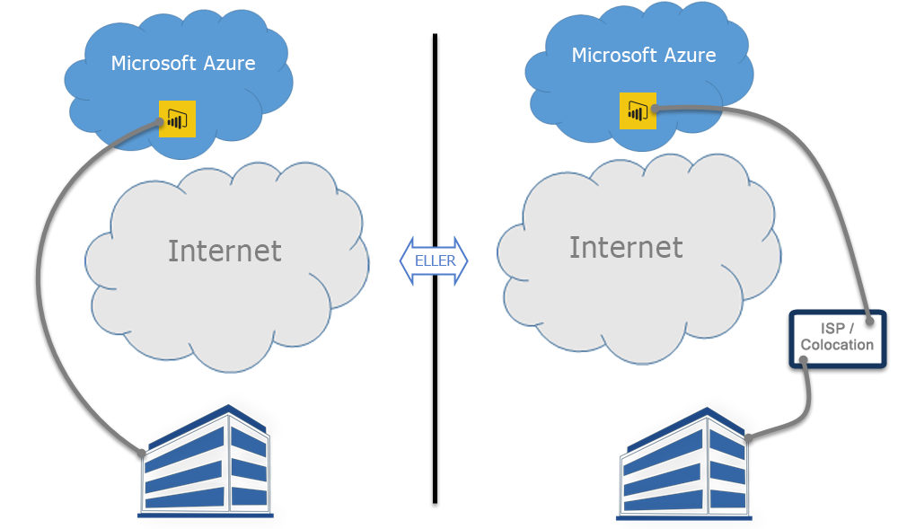

# Power BI og ExpressRoute

**ExpressRoute** er en Azure-tjeneste, der gør det muligt at oprette private forbindelser mellem Azure-datacentre (hvor Power BI findes) og infrastrukturen i det lokale miljø, eller oprette private forbindelser mellem Azure-datacentre og colocation-miljøet.

Du kan bruge **Power BI** og **ExpressRoute** til at oprette en privat netværksforbindelse fra din organisation til Power BI (eller bruge en ISP's colocation-facilitet), der omgår internettet og sørger for en bedre sikkerhed for følsomme Power BI-data og -forbindelser.

Du kan finde flere oplysninger i [Oversigt over ExpressRoute](/azure/expressroute/expressroute-introduction). Power BI er kompatibel med ExpressRoute med nogle få undtagelser, hvor Power BI henter eller sender data over det offentlige internet. Du kan få vist en liste over de URL-adresser, der anvendes i Power BI, under [URL-adresser i Power BI](power-bi-whitelist-urls.md).

