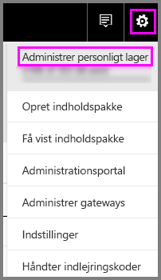
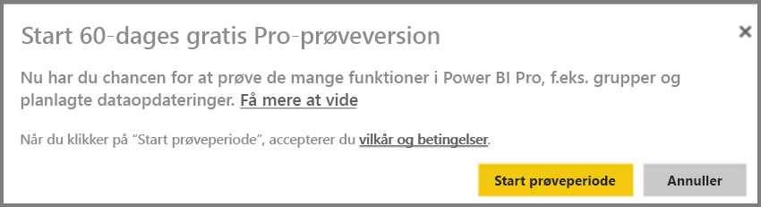
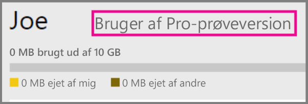
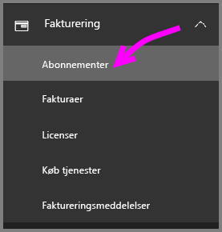
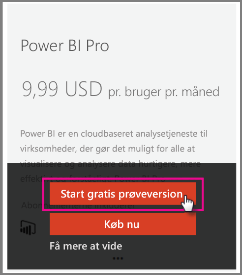

# Power BI Pro i din organisation

Power BI Pro er en betalt licensudgave, som indeholder flere funktioner. Power BI Pro-licenser er til teams, som ønsker at dele og samarbejde med andre og træffe beslutninger baseret på data.  Alle teammedlemmer, som skal have adgang til at oprette eller få vist delt Power BI-indhold, skal have en Pro-licens, medmindre indholdet er knyttet til en dedikeret kapacitet i Power BI Premium.

Følgende funktioner kræver en Power BI Pro-licens:

* **Analysere data i Excel eller Power BI Desktop** – Brug Excel eller Power BI Desktop til at få vist og interagere med et datasæt, som er udgivet i Power BI. Se [Analysér i Excel](service-analyze-in-excel.md) for at få flere oplysninger.

* **Dele dashboards og samarbejde med arbejdsområder** – Power BI-arbejdsområder gør det muligt at samarbejde med kolleger om dashboards, rapporter og datasæt. Se [Samarbejd i dit Power BI-apparbejdsområde](service-collaborate-power-bi-workspace.md) for at få flere oplysninger.

* **Vise delt indhold** – Pro-brugere kan få vist, og interagere med dashboards og rapporter, som er delt med dem, og de kan selv dele dashboards og rapporter, som er delt med dem, med andre (hvis dette er tilladt). Pro-brugere kan dog ikke redigere de nævnte dashboards og rapporter. Se [Del dine Power BI-dashboards og -rapporter med kolleger og andre](service-share-dashboards.md) for at få flere oplysninger.

* **Integrere indhold med Microsoft Teams** – Du kan tilføje en Power BI-fane i en Microsoft (MS) Teams-kanal. Alle rapporterne i arbejdsområdet registreres automatisk i MS Teams. Se [Gør Power BI-teams mere effektive med Microsoft Teams](https://powerbi.microsoft.com/en-us/blog/power-bi-teams-up-with-microsoft-teams/) for at få flere oplysninger. 

## 60-dages prøveversion af Power BI Pro til enkeltpersoner

Når du har tilmeldt dig din gratis konto, kan du også vælge at prøve Pro gratis i 60 dage. Du får adgang til alle Pro-funktionerne i hele prøveperioden. Power BI Pro har alle funktionerne fra den gratis version af Power BI samt yderligere funktioner til deling og samarbejde. Se [Priser på Power BI](https://powerbi.microsoft.com/en-us/pricing/), hvis du vil have flere oplysninger. Log på Power BI for at få en 60-dages gratis prøveversion af Power BI Pro, og prøv én af disse Power BI Pro-funktioner.

* [Opret et arbejdsområde](service-create-distribute-apps.md)
* [Del et dashboard](service-share-dashboards.md)

Når du prøver en af disse funktioner, bliver du bedt om at starte din gratis prøveperiode. Du kan også vælge den ved at gå til tandhjulsikonet og vælge Administrer personligt lager. Vælg derefter Prøv Pro gratis til højre.

   
    
   

Du kan derefter vælge Start prøveversion.

   

> [!NOTE]
> Brugere, der benytter sig af denne Power BI Pro-prøveversion inde i produktet, vises ikke i Office 365-administrationsportalen som Power BI Pro-prøvebrugere (de vises som gratis Power BI-brugere). De vises dog som Power BI Pro-prøveversionsbrugere på siden Administrer lager i Power BI.
>

> [!NOTE]
> Hvis du er it-administrator og ønsker at hente og installere Power BI-prøvelicenser til flere brugere i din organisation, uden at de enkelte brugere skal acceptere vilkårene, kan du tilmelde dig et Power BI Pro-prøveabonnement. Du skal være global administrator eller faktureringsadministrator i Office 365, eller du skal oprette en ny lejer for at tilmelde dig en administratorprøveversion. Du kan få mere at vide under [Køb af Power BI Pro](service-admin-purchasing-power-bi-pro.md).
>

Når du befinder dig i tjenesten, kan du bekræfte, at du har en Pro-prøvekonto, ved at gå til tandhjulsikonet og vælge Administrer personligt lager.

   

## Prøveabonnement i Office 365

Du kan få Power BI Pro som en prøveversion til din organisation. Når du har abonnementet, kan du tildele Power BI Pro-licenser til dine brugere. Du kan finde flere oplysninger om, hvordan du tildeler licenser, under [Tildel licenser til brugere i Office 365](https://support.office.com/en-us/article/assign-licenses-to-users-in-office-365-for-business-997596b5-4173-4627-b915-36abac6786dc?ui=en-US&rs=en-US&ad=US).

> [!NOTE]
> Der er en grænse på én organisationsprøveversion pr. lejer. Det betyder, at hvis en person allerede har anvendt Power BI Pro (prøveversion) på din lejer, kan du ikke gøre det igen. Hvis du har brug for hjælp til dette, kan du kontakte [Office 365-faktureringssupport](https://support.office.microsoft.com/en-us/article/contact-support-for-business-products-admin-help-32a17ca7-6fa0-4870-8a8d-e25ba4ccfd4b?CorrelationId=552bbf37-214f-4202-80cb-b94240dcd671&ui=en-US&rs=en-US&ad=US).
>

Benyt følgende fremgangsmåde til at indhente et prøveabonnement på Office 365:

1. Naviger til [Office 365 Administration](https://portal.office.com/adminportal/home#/homepage).
2. Vælg Fakturering i navigationsruden til venstre, og klik derefter på Abonnementer.

   

3. Vælg Tilføj abonnementer i højre side.

   

4. Under Andre planer skal du holde musemarkøren over ellipsen (…) til Power BI Pro og vælge Start gratis prøveversion.

    

5. Vælg Prøv nu på skærmbilledet med ordrebekræftelsen.
6. Vælg Fortsæt på ordrekvitteringen.

## Køb Power BI Pro

Du kan købe Power BI Pro gennem Microsoft Office 365 eller gennem en certificeret Microsoft-partner. Du kan finde flere oplysninger om, hvordan du køber Power BI Pro, under [Køb Power BI Pro](service-admin-purchasing-power-bi-pro.md).

## Næste trin
[Tilmelding via selvbetjening til Power BI](service-admin-signing-up-for-power-bi-with-a-new-office-365-trial.md)
 
[Power BI (gratis) i din organisation](service-admin-service-free-in-your-organization.md)
 
[Køb Power BI Pro](service-admin-purchasing-power-bi-pro.md)
 
[Aktivering af den udvidede Pro-prøveversion](service-extended-pro-trial.md)
 
[Tildeling af Power BI Pro-licenser](service-admin-assigning-power-bi-pro-licenses.md)
 
[Power BI Premium – hvad er det?](service-admin-premium-manage.md)
 
[Sådan køber du Power BI Premium](service-admin-premium-purchase.md)
 
[Whitepaper om Power BI Premium](https://aka.ms/pbipremiumwhitepaper)

Flere spørgsmål? [Prøv at spørge Power BI-community'et](https://community.powerbi.com/)